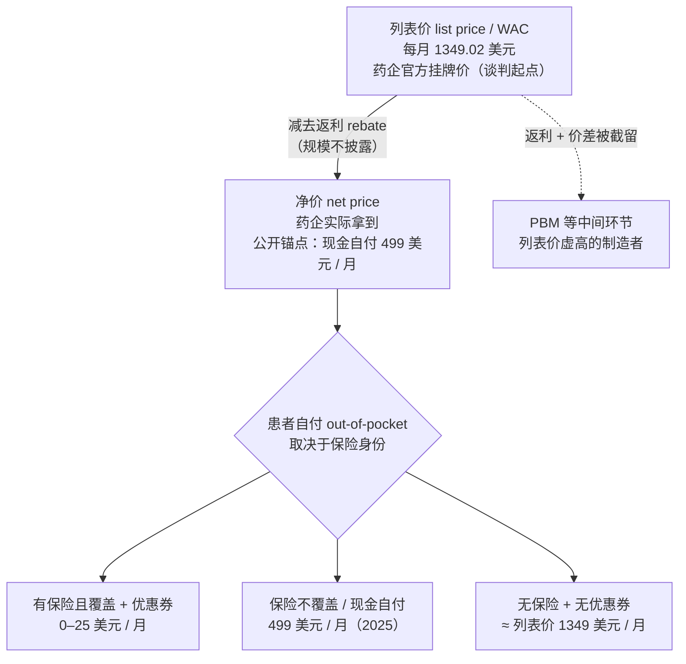
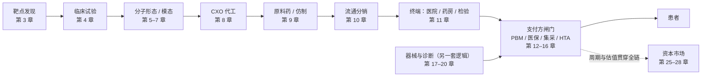

## 同一支针，五个价

2026 年春天，如果你分别站在纽约、柏林、上海、东京和孟买的药房柜台前，掏钱买同一样东西——诺和诺德（Novo Nordisk，丹麦药企，全球糖尿病与减重药的主要供应商之一，美股代码 NVO）出品的减重针 Wegovy（司美格鲁肽 semaglutide，一种 GLP-1 受体激动剂，用于慢性体重管理），你会拿到五张差得离谱的价签。

先把 GLP-1 这个词说清楚。GLP-1 是 glucagon-like peptide-1（胰高血糖素样肽-1）的缩写，人体进食后由肠道分泌的一种激素，能促进胰岛素分泌、延缓胃排空、抑制食欲。司美格鲁肽就是模拟这种激素的人工合成肽，每周皮下注射一次，先用于 2 型糖尿病（商品名 Ozempic / 诺和泰），后来高剂量版本专门拿去做减重，就是这一章的主角 Wegovy（中国商品名诺和盈）。

同一支针、同一种分子、同一家厂商，五国终端价大致如下（图 1-2 给出完整口径，这里先看量级）：美国官方挂牌价每月约 1349 美元；德国约 328 美元；中国电商零售约合 381 美元、走地方集采后约 181 美元；日本全民医保挂牌价约合 277 美元、患者实付（自付三成）约 83 美元；印度上市价折合最高剂量约 306 美元、起始剂量约 204 美元。最贵的美国挂牌价，是日本患者实付价的十六倍。

一个本该全球统一成本的工业品，为什么在五个国家差出一个数量级？回答这个问题，需要先承认一件事：**「药价」从来不是一个数字。** 一支针在抵达患者之前，会先后挂上三层不同的价签，而不同国家的支付制度，决定了患者最终摸到的是哪一层。把这三层拆开，是读懂这本书后面所有内容的起点。

## 一支针的三层价签

以美国市场的 Wegovy 为例，把价格自上而下剥开，能看到三层（如图 1-1 所示）。

**第一层，列表价（list price）。** 这是药企对外公布的官方挂牌价，专业说法叫 WAC（Wholesale Acquisition Cost，批发采购成本）。Wegovy 2.4 毫克维持剂量的列表价是每月 1349.02 美元（来源：诺和诺德 NovoCare 官网定价、Peterson-KFF Health System Tracker 2023-08-17 跨国比价；口径：2.4mg 维持剂量、每月 4 针）。列表价是各方谈判的起点，几乎没有人真按这个数付钱——它更像汽车的「厂商建议零售价」，存在的意义是给后面的折扣留出空间。

**第二层，净价（net price）。** 药企把列表价报高，再通过返利（rebate，药企事后返还给支付方的折扣）让出一部分，实际落进自己口袋的叫净价。返利的规模在美国是商业机密，不对外披露。一个可参照的公开锚点是诺和诺德的官方自费定价 / 患者援助项目 NovoCare（novocare.com，诺和诺德面向自费患者的直购与援助渠道）：2025 年它向无保险或保险不覆盖的患者直接开价每月 499 美元，2025 年 11 月进一步降到 349 美元（来源：诺和诺德 NovoCare 公告 2025-11-17、Mercer 2026-02 分析）。这意味着扣掉中间环节后，这支针的真实价值中枢远在 1349 美元之下。诺和诺德在 2026 年 2 月宣布将列表价下调到每月 675 美元（2027 年 1 月起执行），但多家机构指出厂商很可能同步削减返利对冲，净价不会因此明显变化（来源：Mercer、STAT News 2026-02-24）。这是理解美国药价的第一个反直觉之处：列表价降一半，支付方实际省下的钱可能接近于零。

**列表价和净价之间，站着一个中间人。** 这道差额（返利加价差）不会凭空消失，被一个叫 PBM（Pharmacy Benefit Manager，药品福利管理机构）的角色截留了一部分。PBM 是美国独有的中间人，替保险公司管理处方集（哪些药能报销）、替支付方跟药企谈返利。药企为了把自己的药留在处方集里、不被竞品挤掉，就得报更高的列表价、让出更多返利——列表价虚高和返利膨胀，正是这套机制的产物。PBM 这条暗线贯穿全书第四部，这里只需记住：在美国，药价高低的总开关不在药厂，而在这个不生产任何一粒药的中间人手里。

**第三层，自付价（out-of-pocket price）。** 这才是患者真正掏出的钱，而它取决于患者的保险身份，能在同一支针上裂成几个截然不同的数字：有商业保险且计划覆盖 Wegovy 的患者，用药企优惠券后每月可能只付 0 到 25 美元；保险不覆盖的，走现金自付渠道每月 499 美元（2025 年口径）；完全没有保险、又拿不到优惠券的，则要直面接近列表价的 1349 美元（来源：诺和诺德 NovoCare、Peterson-KFF 2023-08）。同一个国家、同一支针，自付价能差出五十倍。

图 1-1：一支 Wegovy 的美国价格解剖（口径：2.4mg 维持剂量、每月 4 针；列表价来源诺和诺德 NovoCare 官网与 Peterson-KFF 2023-08，自付与返利锚点来源 NovoCare 公告、Mercer/STAT News 2026-02。返利绝对额不对外披露，图中净价为公开渠道锚点，非厂商实得净价）

三层价签里，列表价最高、最显眼、最常被媒体引用，却最不接近任何人实际付的钱；净价最真实、却最不透明；自付价最贴近患者体感、却因保险身份而分裂。讨论「药价」时不先问是哪一层，几乎一定会得出错误结论。这条纪律会在后面每一章反复用到：第 12 章拆 PBM 的返利机制，第 25 章谈专利悬崖时区分列表价敞口和净价损失，都靠它。

## 五国五价，五套权力结构

回到那五张价签。把它们并排放在一起（图 1-2），会发现价差背后不是汇率、不是成本，而是五套完全不同的「谁来定价」的权力结构。

| 国家 | 当地终端价（含口径） | 折合美元/月 | 时点 | 口径 | 定价权落在谁手里 |
|------|--------------------|-----------|------|------|----------------|
| 美国 | 列表价 1349.02 美元/月；现金自付 499 美元/月 | 1349（列表）/ 499（自付） | 2023-08 列表 / 2025 自付 | 列表价 vs 现金自付，2.4mg | 药企报价 + PBM 返利博弈 |
| 德国 | 约 328 美元/月 | 328 | 2023-08 | 自费零售价（减重适应症被 GKV 排除） | 厂商定价；减重药不进法定医保，AMNOG 谈判对其不生效 |
| 中国 | 电商零售约 2706 元/月；地方集采约 1284 元/月 | 381（零售）/ 181（集采） | 2024-11 零售 / 2025 集采 | 院外自费零售 vs 地方集采中选价，2.4mg | 不进医保，市场自费 + 地方集采压价 |
| 日本 | 医保挂牌价约 42960 日元/月；患者自付（三成）约 12888 日元/月 | 277（挂牌）/ 83（自付） | 2024-02 起 | NHI 全民医保统一定价，2.4mg 月度上限 | 政府统一定价 |
| 印度 | 上市价 2.4mg 约 26015 卢比/月；起始剂量 17345 卢比/月 | 306（2.4mg）/ 204（起始） | 2025-06 上市 | 自由市场零售价，按剂量 | 厂商自由定价 + 仿制竞争压制 |

图 1-2：同一支 Wegovy 的五国终端价对比（汇率口径：约 2026 年 5 月，USD/CNY≈7.1、USD/JPY≈155、USD/INR≈85，德国数为来源原币美元值。各国时点、口径不一致，不可简单并排做「同期价差」结论，详见下文说明。来源见 `data/01-five-price-tags/sources.md`）

这张表必须配一句警告：五个数字采自不同时点、不同口径，并不严格同期可比。美国和德国的数取自 Peterson-KFF 2023 年 8 月的列表价快照；中国、日本、印度的数来自 2024–2025 年各自上市后的实际价格。把它们并排，看的是数量级和定价机制的差异，而不是「2026 年 5 月某一天的精确价差」。这种口径混杂正是产业研究最容易翻车的地方——这本书宁可把每个数字的时点和口径标到啰嗦，也不做漂亮但不可靠的并排。

口径警告之后，定价机制的差异才是真正有信息量的部分。

**美国：药企报价、PBM 砍价、患者赌保险。** 全世界只有美国把定价权交给一场药企和私营中间人之间的返利博弈。列表价虚高、净价不透明、自付价因保险而分裂，三层叠加出全球最高也最混乱的药价。Wegovy 在美国的列表价是德国的四倍多、是日本患者实付价的十六倍，根源不在成本，在这套机制（详见第 12、13 章）。

**德国（欧洲样本）：先自由、后算账。** 德国新药上市头一年厂商自由定价，一年后由德国联邦联合委员会（G-BA）按该药相对现有疗法的「附加疗效」（Zusatznutzen）与医保方谈定报销价，谈不拢则被参考定价框住——这是 AMNOG 制度（《药品市场重组法》，Arzneimittelmarktneuordnungsgesetz）的标准路径。欧洲整体是这套逻辑的延伸：互相参考、用「一年健康生命值多少钱」给药定一个性价比门槛（HTA，卫生技术评估），系统性地把全球药价往下拖（HTA 与欧洲准入详见第 23 章）。

但 Wegovy 的减重适应症走不到这一步。G-BA 把减重版司美格鲁肽列为「生活方式药物」（Lifestyle-Arzneimittel），写进药品指令附件二（Anlage II）的处方排除清单，法定医保（GKV）不予报销（来源：G-BA 新闻稿与药品指令 Anlage II，2024–2025；截至 2025-06 仍排除）。德国那约 328 美元/月并非 AMNOG 谈出来的报销价，而是患者自掏腰包的零售价。一个跨国共性由此浮现：在德国和中国，减重药都被公共医保主动挡在门外，所谓「德国价」「中国价」其实都是自费价，而非各自支付体系谈判定出的价——欧洲那套 HTA 压价门槛，对这支针根本没生效。

**中国：不进医保，却躲不开集采。** 减重版司美格鲁肽 2024 年 11 月在中国上市，据媒体报道，减重适应症不纳入医保（来源：钛媒体 2024-11 报道，待核国家医保局官方公告）。这本该意味着纯市场自费定价，电商平台一支（4 针装）2.4mg 规格挂牌约 2706 元（来源：电商平台挂价，非厂商官方价，待核）。但 2025 年云南、四川等地的省级采购平台已经把它纳入地方集采，中选价较原价腰斩到约 1284 元（来源：云南省药品集采平台、四川省药械招采中心公告、经济观察网 2026-01）。集采（VBP，volume-based procurement，带量采购，以确定采购量换取大幅降价的政府主导招标）这把刀，是理解中国所有药价和器械价的总钥匙，第 15 章会专门拆它。2025 年 12 月诺和诺德罕见地把诺和盈价格再砍约 47%，一边应对礼来替尔泊肽的竞争，一边提前防御即将到期的专利和国产仿制（来源：经济观察网 2026-01-19）。

**日本：政府一张价目表，全国一个价。** 日本由厚生劳动省统一定价，把药价编进全民医保（NHI，National Health Insurance）的价目表，全国一个价、没有返利博弈这回事。Wegovy 2024 年 2 月在日本上市，根据 NHI 公开定价框架及私立诊所整理数据（待核厚生劳动省官方薬価収載品目表及月度针数口径），2.4mg 维持剂量月度上限估算约 42960 日元、三成自付估算约 12888 日元。代价是日本对创新药是个 price taker（价格接受者）：上市排序滞后、定价被政府年度改定一路往下压，卖得越好越可能被单独砍价。第 22 章用 Opdivo 在日本被砍价 50% 的案例讲透这套机制。

**印度：自由市场加仿制竞争。** 印度既没有美国的 PBM，也没有日本的统一定价，Wegovy 2025 年 6 月上市时由厂商自由定价，2.4mg 约 26015 卢比/月（来源：诊所/聚合站整理，待核 NPPA 价格数据库与诺和诺德印度公告）。但印度有自己的压价逻辑——强大的本土仿制药工业和随时可能动用的专利强制许可，使原研药不敢定太高。上市仅五个月，迫于礼来 Mounjaro（替尔泊肽 tirzepatide，GIP/GLP-1 双靶点激动剂，机制与竞争详见第 7 章）的竞争，诺和诺德 2025 年 11 月就把 Wegovy 在印度降价最高达约 33%，起始剂量降到 10850 卢比（来源：路透社 2025-11 报道，待核路透原文与 NPPA）。印度靠制度和竞争把药价压到地板的逻辑，第 24 章再展开。

五张价签，五套权力结构：药企与中间人博弈（美国）、疗效谈判（德国）、政府统一定价（日本）、集采压价（中国）、自由市场加仿制竞争（印度）。同一支针在五个国家的命运，由它落进哪套结构决定。这本书后半部专门用四章（第 21–24 章）做五国横切，根子就在这里。

## 从一支针到一张产业链地图

把价签拆到这里，已经能看出医疗这门生意的两个特征：它的价格由制度而非成本决定，它的利润分布极不均匀。但价签只是这支针旅程的最后一站。要理解利润为什么分布不均，得把镜头拉到这支针被造出来之前——它要先后经过靶点发现、临床试验、原料药与制剂生产、外包代工、流通分销，才抵达药房柜台，最后撞上支付方那道闸门（如图 1-3 所示）。

图 1-3：一支药从分子到患者的产业链地图，也是本书的章节地图（虚线表示资本周期与估值贯穿全链，并非单一环节。器械/诊断走另一套商业逻辑，单独成部）

这张地图有个反复出现的规律，后面的章节会一再印证：价值高度集中在产业链两端，中间相对薄。研发端，一款专利期内的创新分子毛利率常在 90% 以上（公司层面因产品结构被摊薄到 60%–86%，引用时要分清是分子级还是公司级）；支付端，美国的 PBM 和保险集团靠返利和承保利润赚取租金（利润池规模见第 12、13 章）。而中间的代工、原料药、流通环节，规模庞大却毛利微薄——美国三大药品分销商控制九成市场，经营利润率却只有 1%–3%（来源：三大分销商 10-K，第 10 章详核）。这里要先纠正一个流行的误读：CXO（合同研发生产外包，把药企的研发或生产工序外包出去的服务商）虽在「中间」，却是高壁垒、中等毛利、强周期的独立物种，并不属于流通那种薄利环节，第 8 章会把它单独拎出来讲。

这是一种横剖式的看法：不追某一家公司的传奇，也不站队批判某个国家的体制，而是顺着一支针流过的每一个环节，问同一组问题——这一环靠什么赚钱、护城河有多深、能赚多久、谁在分钱。一支减重针的五张价签，是这套问法的第一个练习。

## 小结

- 「药价」从来不是一个数字。一支药至少有三层关键价签：列表价（官方挂牌、虚高）、净价（扣返利后药企实得、不透明）、自付价（患者实付、因保险身份分裂）。讨论药价不先问是哪一层，结论几乎一定错。
- 同一支 Wegovy 在五国差出一个数量级，根源不是成本或汇率，而是五套定价权力结构：美国的药企-PBM 返利博弈、德国的疗效谈判、日本的政府统一定价、中国的不进医保但被集采、印度的自由市场加仿制竞争。
- 跨国、跨时点比价的最大陷阱是口径混杂。本章五国数据采自 2023–2025 不同时点、列表价/自付价/集采价不同口径，只能用来看数量级和机制差异，不能当同期精确价差——这条纪律贯穿全书。
- 一支针的旅程串起整张产业链地图（图 1-3），也是本书的结构：价值集中在研发与支付两端，中间的流通、原料药相对薄利，CXO 单列。
- 下一章回答一个更基础的问题：医疗这门生意为什么不服从普通市场规律——一个国家把约六分之一（17.6%）的 GDP 砸进医疗（美国，CMS NHE 2023 口径），另一个只花约 7%（中国，卫健委口径），钱花得多就更健康吗？

## 配套数据

见 `data/01-five-price-tags/`。本章用到的所有数据源、采集时点与口径详见 `data/01-five-price-tags/sources.md`，五国终端价见 `wegovy_price_5country.csv`，美国价格分层见 `price_decomposition.csv`。

---

> 本章来自《医疗经济学》开源版 · 作者「递归客」  
> 在线阅读完整书系：[inferloop.dev](https://inferloop.dev) · 反馈与勘误：[GitHub Issues](https://github.com/diguike/book-healthcare-economics/issues)
