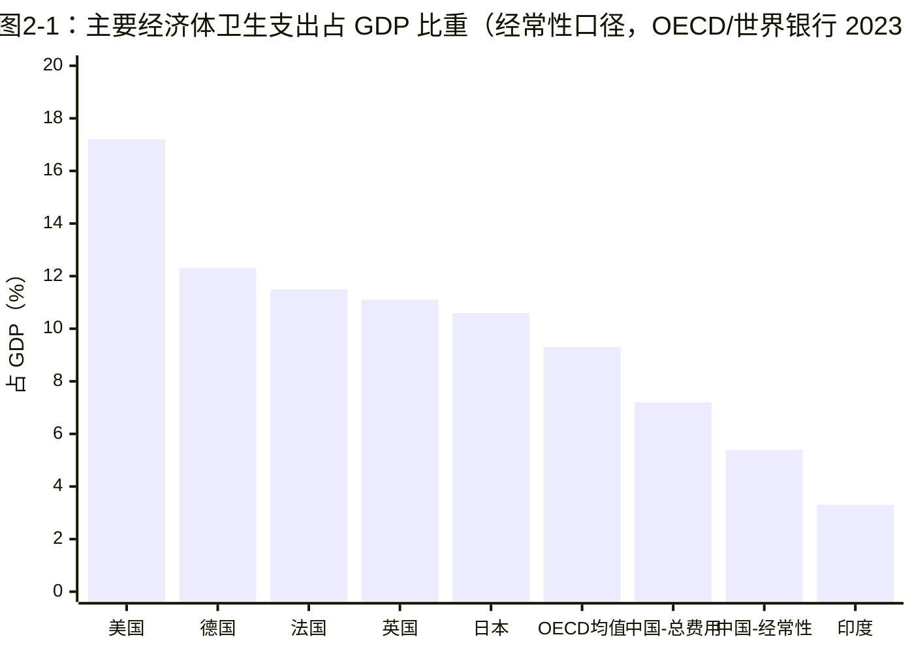
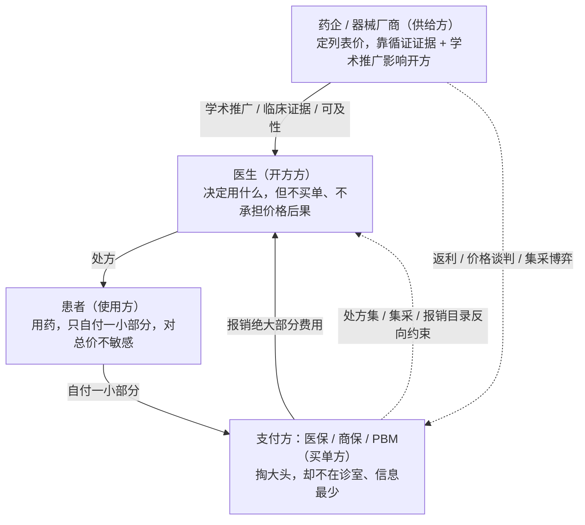

## 本章概览

第 1 章用一支减重针拆开了"药价"，看到的是一个微观切面：同一支针，五国五价。把镜头拉到最远，会看到另一个数字层级——一个国家一年在医疗上花掉的钱，可以占到它全部经济产出的近五分之一。

这一章是全书的宏观地基。它要回答三个问题：各国到底在医疗上花了多少钱、这些数字为什么不能直接并排比较、以及最关键的一点——医疗这门生意为什么不像买菜、买手机那样服从普通市场规律。把这三件事讲清楚，后面所有关于药价、集采、专利悬崖、支付方权力的判断才有立足点。读者读完应当能看清：医疗市场的"失灵"不是道德故事，而是一套可以拆解的结构；正是这套结构，决定了这个行业为什么抗周期、利润又为什么会在产业链上被反复重新分配。

## 一个 17%，一个 7%

2023 年，美国一年的卫生总支出约 4.9 万亿美元，人均约 1.46 万美元，占当年 GDP 的 17.6%（来源：美国医疗保险与医疗补助服务中心 CMS，National Health Expenditure 2023，2024-12 发布）。到 2024 年，这个比重升到约 18.0%，总额接近 5.3 万亿美元（来源：Peterson-KFF Health System Tracker 引 CMS NHE，2025）。换句话说，美国经济每产出 6 美元，就有超过 1 美元流向医疗。

同一时间，中国的卫生总费用占 GDP 约 7.2%（来源：国家卫生健康委员会口径，2023；与 Statista、世界银行序列一致）。两个全球最大的经济体，在"把多少钱花在健康上"这件事上，差出一倍还多。

这组对照很容易被写成一句口号，但它真正有意思的地方在反面：钱花得多，并不等于人更健康。2023 年美国人均预期寿命约 78.4 岁，2024 年回升到约 79 岁，比经合组织（OECD，由 38 个主要发达经济体组成的政府间组织）平均水平低约 2.7 岁，在全部成员国里排约倒数第八，在人均 GDP 相近的高收入成员中更是垫底（来源：OECD Health at a Glance 2025）。英联邦基金（Commonwealth Fund）2026 年的国际比较报告说得更直白：美国是所有 OECD 国家里人均卫生支出最高的，却在高收入对等国中预期寿命垫底、可避免死亡率最高（把墨西哥等纳入更宽口径时，美国可避免死亡率排第二，仅次于墨西哥）（来源：Commonwealth Fund，U.S. Health Care from a Global Perspective 2026，2026-05）。

花最多的钱，买到最差的产出。这一个反常识的事实，是理解整本书的起点——如果医疗是一个正常运转的市场，钱和健康之间应该有更清楚的对应关系。它没有，说明这个市场的某个环节，从根上就和别的市场不一样。

## 同口径才能比：两个"卫生支出"不是一个东西

在把数字摆上桌之前，要先解决一个被反复搞错的问题：上面的 17.6% 和 7.2%，其实不是用同一把尺子量出来的。直接相减得出"美国是中国 2.4 倍"，是产业分析里最常见的张冠李戴。

差异出在统计口径。国际上做跨国比较，用的是**经常性卫生支出**（Current Health Expenditure, CHE）——只算当年用于医疗服务和产品的经常性花费，不含医院盖楼、买大型设备这类资本性投资。OECD、世界卫生组织（WHO）的全球卫生支出数据库（GHED）都按这个口径，好处是各国可比。中国卫健委公布的**卫生总费用**（Total Health Expenditure, THE）口径更宽，包含了固定资产投资等内容，所以数字会系统性偏高。

落到中国身上，两个口径的差距相当可观：按卫生总费用（THE）口径约 7.2%，按世界银行的经常性卫生支出（CHE）口径——也就是和 OECD 那条 9.3% 同一把尺子——只有约 5% 出头（来源：世界银行 World Development Indicators，current health expenditure % of GDP，2022）。换句话说，要和 OECD 平均的 9.3% 做严格对照，应该用 5% 这一档，而不是 7%。

美国这边同样有口径噪声。CMS 的国民卫生支出（NHE）口径覆盖最全，给出 17.6%（2023）；OECD 用其国际可比口径核算，美国是 17.2%（2024，OECD Health at a Glance 2025）。两个数字都对，差在统计边界，引用时必须说清是哪一套。本书的处理原则很简单：跨国并排比较时，一律用 OECD/世界银行的经常性支出口径；只在讲单一国家内部结构时，才用该国本国口径，并标注。

图 2-1 把主要经济体按可比口径排在一起。

图 2-1 数据与口径（精确值见 `data/02-health-as-sector/health_spend_gdp.csv`）：

| 经济体 | 占 GDP | 口径 | 来源/时点 |
|--------|--------|------|-----------|
| 美国 | 17.2% | 经常性（OECD 可比） | OECD HaG 2025（2024） |
| 美国 | 17.6% | 国民卫生支出 NHE | CMS（2023） |
| 德国 | 12.3% | 经常性 | OECD HaG 2025（2024） |
| 法国 | 约 11.5% | 经常性 | OECD HaG 2025（2024） |
| 英国 | 约 11.1% | 经常性 | OECD HaG 2025（2024） |
| 日本 | 约 10.6% | 经常性 | OECD HaG 2025（2024） |
| OECD 均值 | 9.3% | 经常性 | OECD HaG 2025（2024） |
| 中国 | 约 7.2% | 卫生总费用 THE | 卫健委（2023） |
| 中国 | 约 5.4% | 经常性 CHE（OECD 可比） | 世界银行（2022） |
| 印度 | 约 3.3% | 经常性 CHE | 世界银行（2022） |

图 2-1 里要读的不是"美国最高"，那是常识。要读的是三件事。其一，把中国的两根柱子放在一起，能直观看到口径差异有多大——同一个国家，换把尺子就从 7.2% 滑到 5.4%，跨国比较时混用口径，结论可以差出一个量级。其二，发达经济体之间的差距其实不大，德、法、英、日都落在约 10.6%—12.3% 这一带，真正的离群值只有美国一个，这把"美国为什么特殊"这个问题，从"发达国家都贵"收窄到"美国独贵"，后面讲支付方那一部会回到这里。其三，从印度的 3.3% 到美国的 17.2%，五倍多的跨度背后，是收入水平、人口结构和支付制度三股力量叠加的结果——本章接下来处理前两股，支付制度留给第四、七两部。

需要补一句方向性判断（这是预测，不是事实）：CMS 在 2025 年发布的中长期投影认为，美国卫生支出占 GDP 的比重未来十年仍将缓慢上行（来源：CMS NHE Projections 2024–33，Health Affairs 同步发表）。支撑这个判断的，是下一节要讲的需求侧力量。

## 刚性需求：老龄化把需求曲线钉住

医疗支出长期向上，最确定的一股推力是人口老龄化。这部分是行业共识，本书不打算复述"老龄化带来巨大需求"这类正确但空洞的话，而是想说清楚一件更要紧的事：老龄化真正改变的，不是需求的大小，而是需求的**价格弹性**。

先看事实。65 岁及以上人口占总人口的比重，2023 年日本约 29.6%，是全球最老的经济体；德国约 23%、法国约 22%；美国约 17.7%；中国约 14.3%；印度约 7%（来源：世界银行，Population ages 65 and above，2023）。一个常被低估的细节是中国的速度：中国老龄化的绝对水平还不算高，但爬升极快，按现有趋势，未来十几年内 65 岁以上人口占比就会逼近今天的美国（来源：世界银行人口序列；RAND 中国老龄化研究）。详见 `data/02-health-as-sector/aging_demand.csv`。

老年人是医疗资源的高消耗群体，这没有争议。但对产业和投资真正有含义的，是老龄化叠加上一个特殊性质——**医疗需求的刚性**。一个糖尿病患者不会因为药涨价就不打胰岛素，一个心梗病人不会因为支架贵就不放支架。在普通商品市场上，价格涨了需求会掉，这条向下倾斜的需求曲线是市场调节价格的基础。医疗里这条曲线在很大一段上几乎是垂直的：价格变化对需求量的影响很小。老龄化做的事，是把越来越多的人口推进这条"价格涨了也得买"的刚性区间。

这就解释了医疗行业一个被反复观察到、却常被笼统归因的特征：**抗周期**。经济下行时，消费者会推迟买车、换手机、出门旅游，但很少推迟做透析、推迟化疗。需求的刚性让医疗部门的总收入对宏观周期不敏感，这是医疗作为一个板块在资产配置里被当作防御性资产的根本原因，而不是因为某种说不清的"稳健"。

但抗周期这个结论用在板块上成立，用在个股上就危险。行业整体的蛋糕不随周期缩水，不代表蛋糕在产业链上的切分方式是稳定的。恰恰相反，正因为总盘子刚性、对价格不敏感，支付方才有强烈动机去人为压价、重新切分利润——集采、医保谈判、PBM 返利、HTA 性价比门槛，这些后面要展开的机制，本质上都是在一个抗周期的总盘子内部做利润再分配。所以本书的立场是：医疗的低 beta（对市场波动不敏感）来自需求刚性，是真的；但 alpha 不在"买入整个行业躺着抗周期"，而在看懂那把人为压价的刀会落在产业链哪一环。这个判断会贯穿全书，这里先埋下。

## 为什么医疗市场会系统性失灵

需求刚性只是冰山一角。让医疗偏离普通市场更深的原因，是它在两个地方违反了市场有效运转的前提：买卖双方掌握的信息严重不对等，以及做决定、用东西、付钱的根本不是同一拨人。

**第一重扭曲：信息不对称。** 经济学里的**信息不对称**（information asymmetry），指交易一方比另一方掌握多得多的信息，以致另一方无法做出理性判断。买手机你可以比参数、看评测、横向砍价；得了癌症，你既不知道该用哪种方案，也无从判断医生开的药是不是最优解，更没法在两家医院之间"货比三家"地谈价。在诊室里，医生几乎单方面掌握了"你需要什么、值多少"的全部信息。当买方丧失判断力，价格就失去了它在普通市场里的核心功能——传递供需、约束供给方。这是医疗市场失灵的第一块基石。

**第二重扭曲：三方付费。** 普通交易是两方的——你掏钱，你买东西，你自己决定买不买。医疗是**三方付费**（three-party payment）：用药的是患者，开方决定用什么的是医生，最终买单的却是第三方支付方（医保、商业保险，以及美国体系里的药品福利管理公司 PBM）。决策权、使用权、付费义务被拆给了三个不同主体，每一方的激励都不指向"花得值"。

图 2-2 把这个结构画出来。把药企/器械厂商这个供给方一并放进去，就构成一个四角博弈：四方各有诉求，没有任何一方同时既掏自己的钱、又用这个产品、还能完整判断它值不值。

图 2-2 的关键，是看实线和虚线分别代表什么。实线是钱和处方的真实流向：患者只自付一小块，绝大部分费用由支付方报销给提供方；而决定花这笔钱的医生，自己一分钱不出。这条链条天然产生**道德风险**（moral hazard）——当使用者不必为成本充分买单时，会倾向于过度使用。患者觉得"反正医保报销"，医生在信息优势下缺乏控费动力，于是用量和价格都失去了来自需求侧的天然约束。这正是上一节"需求曲线接近垂直"的微观成因：把价格和使用者的钱包切断，价格信号自然就失灵了。

虚线则是这套结构倒逼出来的补救：既然患者和医生都管不住价格，支付方只能亲自下场，用处方集（formulary，支付方规定哪些药可报销、报销多少的清单）、集采、谈判、性价比门槛这些行政手段，从外部把价格重新摁住。中国的集采、美国 PBM 的返利、欧洲的卫生技术评估（HTA），形态各异，干的是同一件事：替这个自己产生不出有效价格信号的市场，人为造一个约束。后面整个支付方部和全球格局部，讲的都是各国怎么造这个约束、谁因此获益、谁因此被砍。

把两重扭曲合起来看，医疗市场的"失灵"就不再是一句道德指控，而是一个结构性结论：信息不对称让买方失去判断力，三方付费让付费者和决策者分离，二者叠加，使得价格无法像在普通市场那样自发地传递供需、约束供给。剩下的事情，无非是各国用不同的制度去填这个洞，而填洞的方式不同，就长出了中、美、日、欧、印五套完全不同的医疗经济体系——这是本书第七部的主题。

## 失灵如何变成投资坐标

把这套机制翻译成投资语言，有三个不该跳过的推论。

其一，价格信号失灵，意味着这个行业里"自由定价"几乎不存在，真正的定价权握在制度手里。一款药、一个器械能卖多少钱、卖给多少人，最终不由供需自发决定，而由支付方的报销规则决定。所以判断一家医药公司的长期现金流，看清楚它面对的是哪一套支付制度，往往比看它的产品本身更要紧——这是后面所有公司分析的方法论起点。

其二，需求刚性给了医疗板块低 beta 的底色，但利润在产业链上的分布是不稳定的。总盘子抗周期，不等于每一环都安全；恰恰因为总盘子大且刚性，它会持续吸引支付方下场重新切分。看懂"压价的刀落在哪一环"，比看好整个赛道重要得多。这一判断会在 CXO、流通、仿制、器械各部反复被验证。

其三，"花得多不等于更健康"这个开篇的反常识，其实是一个长期变量。当一个国家把近五分之一的 GDP 砸进医疗却换不来相应的健康产出，这种低效本身就会催生纠偏的政治和制度压力——美国的 IRA 药价谈判、中国的集采、欧洲的 HTA，都可以读成对"低效"的不同回应。对投资者而言，这意味着医疗行业的政策风险不是偶发噪声，而是这个失灵市场的内生属性，会周期性地重新定价整条产业链。

这三条推论，连同本章建立的口径纪律（同口径才可比）和结构认知（信息不对称 + 三方付费 = 系统性失灵），构成全书的宏观坐标。从下一部开始，镜头将回到微观，从一款新药如何在十年、十亿、九死一生中诞生讲起——但每一个微观判断，都站在这一章搭好的地基上。

## 小结

- 各国卫生支出占 GDP 差异巨大（美国约 17%、OECD 均值 9.3%、中国约 5%—7%、印度约 3%），但必须同口径比较：经常性卫生支出（CHE）用于跨国对照，卫生总费用（THE）只用于单国内部，混用会让结论差出量级。这是 E1 红线。
- 美国是所有发达经济体里唯一的离群值（独贵），且花最多的钱换来最低的预期寿命——医疗的低效不是道德问题，是结构问题。
- 医疗市场系统性失灵的两块基石：信息不对称（买方失去判断力）+ 三方付费（用药、开方、买单分离，产生道德风险），二者叠加让价格信号无法自发传递供需。各国的集采 / PBM / HTA，都是对这个失灵的人为补救。
- 独立判断：老龄化推动需求是共识，但它真正改变的是需求的价格弹性——刚性需求给医疗低 beta 的抗周期底色；而正因总盘子刚性，支付方有强动机不断重新切分利润，所以 alpha 不在"买入整个行业"，而在看懂压价的刀落在产业链哪一环。
- 下一章进入微观：一款新药如何在十年、十亿美元、九死一生的漏斗里诞生，以及为什么九成成本和风险在它进入临床之前就已注定。

## 配套数据

见 `data/02-health-as-sector/`。本章用到的所有数据源详见 `data/02-health-as-sector/sources.md`。

---

> 本章来自《医疗经济学》开源版 · 作者「递归客」  
> 在线阅读完整书系：[inferloop.dev](https://inferloop.dev) · 反馈与勘误：[GitHub Issues](https://github.com/diguike/book-healthcare-economics/issues)
