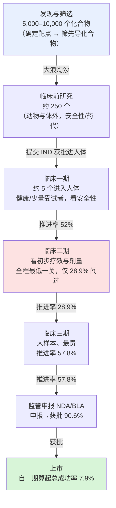
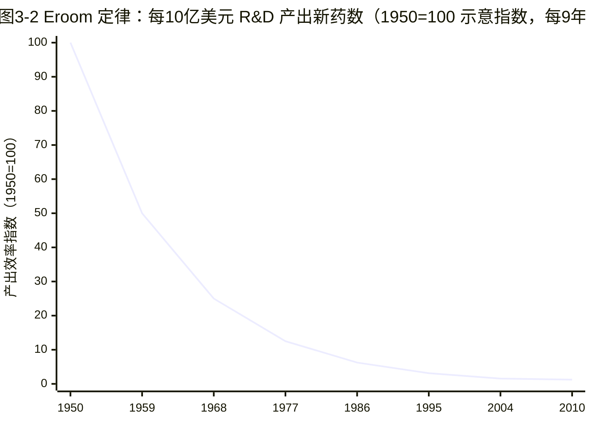

## 本章概览

上一章把医疗当成一个会失灵的经济部门来看，这一章把镜头推到产业链最上游：一款新药从实验室分子走到药店货架，要花多长时间、烧掉多少钱、路上死掉多少。这是全书的成本起点——后面几章会反复回到这里，因为药价高、专利期内毛利高、biotech 估值波动剧烈，根子都在研发端这道又长又险的漏斗里。读完本章，你会拿到一组关于「时间—成本—失败率」的硬数字直觉：为什么是十年、为什么是十几亿美元、为什么九成多的候选药会死在半途；以及一个比这三个数字更反直觉的事实——过去半个多世纪，行业在研发上投入越多，单位投入产出的新药反而越少。最后看 AI 制药到底压缩了这条漏斗的哪一段，又没动哪一段。

本章只讲产业与经济逻辑，不涉及个股估值与多空判断，因此不挂免责声明。

## 一款药的九死一生：先看三个数字

先把结论摆出来，后面再拆。一款全新机制的处方药，从最初的分子筛选到拿到监管批准，**平均要花 10 到 15 年**；**研发成本按主流学术口径约 26 亿美元**（Tufts 大学 DiMasi 等 2016 年估算，资本化后 25.58 亿美元，2013 年美元口径，含失败项目的分摊与资金的时间成本）；而**进入人体试验的候选药里，最终能上市的不到 12%**（PhRMA / IFPMA 口径）。

这三个数字单独看都很大，放在一起才看出问题的形状：钱不是花在某一个成功的药上，而是花在一大堆失败的药上，由少数幸存者替它们买单。这正是「药为什么那么贵」最上游的那层原因——不是某一盒药的生产成本高（小分子药片的边际生产成本往往只有几分钱），而是它要替成千上万个死在半路的兄弟分摊研发账单，并且这笔账单要在专利期那十来年里收回来。后面讲专利悬崖、讲创新药定价、讲 biotech 估值，都会回到这条逻辑。

需要先说清楚口径。「约 26 亿美元」是含失败分摊和资金时间成本的全成本，不是某一个药真实掏出去的现金；只算自付现金，Tufts 的估计是约 14 亿美元。咨询机构 Deloitte 用另一套方法（跟踪头部 20 家药企的在研管线）算出的单药平均研发成本是 2024 年约 22.3 亿美元、2025 年约 26.7 亿美元——口径不同、量级相近。本书引用研发成本时一律标年份与口径，因为这个数字被媒体反复粗暴化，差一倍很常见。

## 漏斗：从几千个化合物到一款药

把研发过程画成一个漏斗最直观（图 3-1）。漏斗最宽的入口是**发现端**：研究者先确定一个**靶点（target，指与疾病相关、药物可以去结合并干预的蛋白质或基因等生物分子）**，再从几千上万个化合物里筛出少数几个能有效作用于这个靶点的**先导化合物（lead compound，初步验证有活性、值得继续优化的候选分子）**。按 PhRMA 的经典口径，每 5,000 到 10,000 个被筛化合物，最终只有约 1 个能上市。

<em>图 3-1　新药研发漏斗：发现端的"几千→几个"靠 PhRMA/DiMasi 经典口径，临床端各关推进率与总成功率（LOA 7.9%）取自 BIO/Informa/QLS 对 2011–2020 年 9,704 个项目、12,728 次相位转换的统计。临床二期是淘汰率最高的一关。</em>

漏斗中段是**临床前（preclinical）**：在动物和细胞上验证安全性、毒性和药物在体内的吸收代谢。约 250 个化合物进入这一段，能闯过去、向 FDA 提交**IND（Investigational New Drug，新药临床研究申请，即"获准把这个化合物用到人身上"的许可）**并进入人体试验的，大概只剩 5 个。临床全部跑完、研发通过后，还要再向 FDA 提交 **NDA（New Drug Application，小分子新药申请）或 BLA（Biologics License Application，生物制品许可申请），获批方可上市**——图 3-1 漏斗末端"监管申报 NDA/BLA"指的就是这一步。

真正决定生死、也最烧钱的是漏斗下半段的三期临床。按 BIO（美国生物技术创新组织）联合 Informa 与 QLS 对 2011—2020 年近万个项目的统计：

- **临床一期 → 二期推进率 52%**（少量受试者，主看安全性）；
- **临床二期 → 三期推进率仅 28.9%**——这是整条漏斗淘汰率最高的一关，因为二期第一次在病人身上看"到底有没有疗效"，大量看起来很美的机制死在这里；
- **临床三期 → 申报推进率 57.8%**（大样本、随机对照，最贵）；
- **申报 → 获批率 90.6%**（能走到申报，多数能过监管）。

四关连乘，**从一期算起，一个候选药最终上市的总概率（业内叫 LOA，likelihood of approval）只有 7.9%**。九成多死在半途，这就是"九死一生"的数据来源。

这里要交代一处口径差异：本章开头引 PhRMA 说"进入一期者最终不到 12% 获批"，这里 BIO 给的是 7.9%，差约 4 个百分点。两者量级一致、方向相同，差异来自统计样本、年代窗口与是否把疫苗等纳入。本章漏斗一律以 **BIO 的 7.9%（2011—2020 年、9,704 个项目）为主口径**，PhRMA 的"<12%"只作背景参照，下文不再把两个数字并排使用。

7.9% 是全行业、全适应症的混合值，不能拿去套任何单个项目。这是本书的一条纪律（后面讲临床试验和估值时会反复用）：成功率必须按适应症和药物类型分层。同一份 BIO 报告里，**肿瘤药从一期算起的 LOA 只有 5.3%**，是所有大类里最低的；而**生物药整体 9.1%、明显高于小分子新分子实体的 5.7%**，疫苗更高（9.7%）。所以后面给某个肿瘤管线估值，用 7.9% 会系统性高估，得用 5% 上下的分层值。一个数字用错层级，估值能差出一截。

## 钱花在哪、为什么贵在研发端

把成本叠回这个漏斗，就看清了药价的上游成因。三期临床是吞金兽：动辄上千名病人、跨多国多中心、持续好几年，单个三期试验花掉几亿美元很常见。而能走到三期的项目，本身已经是从几千个化合物里活下来的极少数。于是真实的账是这样算的：一家药企同时推进几十个项目，绝大多数会在某一关死掉、血本无归，只有个位数能上市；那笔约 26 亿美元的"单药成本"，本质是**把所有失败项目的开销摊到少数成功者头上**之后的结果。

这解释了一个外行常有的困惑：一盒药的原料和生产可能只值几块钱，凭什么卖几百上千?答案不在那盒药本身，而在它身后那条 92% 都在赔钱的漏斗，以及"必须在专利保护的十来年里把整条漏斗的钱连本带利赚回来"的时间压力。**这是一种典型的"赢家通吃、赢家补贴输家"的成本结构**【分析】——它决定了创新药的高定价冲动、决定了专利期的极端重要性、也决定了为什么 biotech 是一门"要么归零、要么十倍"的生意。本书后面讲管线估值（第 27 章会用一套专门按"各期成功率折现"的方法给在研药定价）、讲专利悬崖、讲 License-out，都是在给这条漏斗的不同环节定价。

## Eroom 定律：投入越多，新药越少

漏斗讲的是"一款药有多难"，下面这条规律讲的是"整个行业在变好还是变坏"——而答案，长期看是变坏。

2012 年，Jack Scannell 等人在《Nature Reviews Drug Discovery》提出了一个后来广为引用的观察，并起了个略带自嘲的名字：**Eroom 定律**。Eroom 是 Moore（摩尔）倒过来拼——摩尔定律说芯片的单位成本算力每隔约两年翻倍、越来越便宜；制药业的规律恰好反着来。它的**精确定义是：每 10 亿美元研发投入（经通胀调整后）能获批的新药数量，大约每 9 年减半**（图 3-2）。换句话说，是**产出效率每 9 年腰斩**，而不是"成本每 9 年翻倍"——这两种说法常被混用，但前者才是原文口径。等价地表现出来，就是单个新药的研发成本被持续推高。从 1950 到 2010 年这 60 年里，每 10 亿美元研发投入产出的新药数下降了约 80 倍。

<em>图 3-2　Eroom 定律示意曲线。纵轴为"每 10 亿美元研发投入产出的新药数"，以 1950 年为 100 归一化。曲线按 Scannell 等（2012）"约每 9 年减半"规则复原，终点与"1950→2010 约下降 80 倍"的硬锚点一致（详见 data/03-how-drugs-made/eroom_curve.csv）。注意这是示意复原曲线，非逐年精确散点。</em>

Eroom 定律的反直觉之处在于：同一时期，制药业的工具箱发生了堪比摩尔定律的进步——基因测序、高通量筛选、计算机辅助药物设计、X 射线晶体学一个接一个成熟，有些进步的幅度甚至超过芯片。投入的钱、用上的技术都在指数级变好，**产出却在指数级变差**。Scannell 给出的主因不在某一项技术不行，而在几个结构性原因：好打的靶点先被打完了（"低垂的果实"被摘光，剩下的疾病更难）；监管和安全门槛随时间抬高；以及"用更贵的方法验证更难的假设"本身在变贵。这条曲线是理解后面所有内容的底色——它告诉你，创新药的回报承压不是哪家公司管理不善，而是行业级的地心引力。

值得补一句**【预测/未定论】**：2010 年之后 Eroom 曲线是否触底、甚至小幅反转，学界尚无共识。2020 年有研究（Ringel 等）提出生产率出现改善迹象，但样本与方法都还在争论中。本书的态度是：把 Eroom 当成长期成立的结构性约束，但不把"它已经被打破"当成既成事实。

## AI 制药：压缩了哪一段，没动哪一段

近几年最热的叙事，是"**AI 制药（用人工智能做靶点发现、分子设计与优化）会打破 Eroom 定律"。这个判断需要拆开看，关键是问一句：AI 动的是漏斗的哪一段?

有据可查的成绩，几乎全部集中在漏斗最上游的**发现端**。Insilico Medicine 的 rentosertib（ISM001-055，**TNIK（TRAF2 and NCK-interacting kinase，一种参与 Wnt 信号与纤维化的激酶）**抑制剂，靶点和化合物全由 AI 设计），从立项到提名临床候选化合物只用了约 18 个月，而传统流程在同一里程碑上通常要 2.5 到 4 年；Exscientia 也有资产约 12 个月推进到一期、对比常规的 4 到 5 年【事实】。发现端的时间和成本确实被压缩了，这一点不必怀疑。

问题在于，**决定整条漏斗经济学的不是发现端，而是临床中后段的失败率**——尤其是二期那 28.9% 的推进率和三期那道最贵的关。AI 公司目前所有亮眼的里程碑，无一例外集中在"临床前到一/二期"这段；**截至 2026 年年中，还没有任何一款 AI 设计的药物通过注册性三期临床并获批**。以 rentosertib 为例，它的二期 a 读出（特发性肺纤维化，60mg 组肺功能 **FVC（forced vital capacity，用力肺活量，肺纤维化试验常用的替代终点）**较基线 +98.4mL、安慰剂组 −20.3mL）**（95%CI 10.9–185.9，下限接近 0，统计不确定性大）**方向是正的，但**样本仅 71 人、为期 12 周、全部在中国、属 2 期 a 而非注册性三期**【事实，口径见 sources.md】——这是一个值得关注的早期信号，远不是"AI 攻克了临床失败率"的证据。

所以本书对 AI 制药的立场是**审慎肯定、明确划界**【分析】：它压缩的是发现端的成本和时间，这部分是真的；但它尚未触及决定 ROI 的三期失败率，而后者才是 Eroom 定律的主要成因。AI 目前撼动的是这条漏斗的"小头"。这不是否定 AI，而是提醒：当有人用"某分子 18 个月进临床"来论证"制药业要被重写"时，要追问一句——它过三期了吗。这个问号本书会带到讲临床试验、讲估值的章节继续追。

## 一个反共识切口：剔除 GLP-1 之后，回报还剩多少

把研发的难度量化成钱，最直接的指标是研发的内部回报率（IRR）。咨询机构 Deloitte 连续十多年跟踪头部 20 家药企的在研管线，得到一条很能说明问题的曲线：这个预测 IRR 从 2010 年首期的约 10%，在 2010—2019 年间几乎线性下滑到 1.5%；其间 2021 年因 COVID 相关疫苗与药物入组短暂反弹到约 6.8%，但这些资产商业化后移出样本，2022 年又跌到约 1.2%，创下 Deloitte 跟踪以来的真正谷底；此后才转入可持续回升——2023 年约 4.1%、2024 年约 5.9%、**2025 年约 7.0%**，连续三年向上【事实，Deloitte】。

如果只看这条回升曲线，很容易得出"拐点已现、Eroom 被逆转"的结论。但 Deloitte 自己做了一个关键拆解：**把 GLP-1 这一类药（即第 7 章要专门讲的减重/降糖药）从样本里剔除，IRR 立刻塌下来——2024 年从 5.9% 掉到 3.8%，2025 年从 7.0% 掉到 2.9%**【事实，Deloitte】。预测单药峰值销售也一样：2024 年全样本约 5.1 亿美元，剔除 GLP-1 后只剩 3.7 亿。Deloitte 称这是其十六年报告史上"单一药类影响最大"的一次。换句话说，**行业回报的回升，高度依赖一两个超级爆款，而不是系统性的效率改善**。这与 Eroom 定律并不矛盾，反而是同一枚硬币的两面：结构性衰减仍在，回升是脆弱的、被爆款撑起来的【分析】。

对投资者，这一拆解有直接含义【分析】：如果行业整体回报很大程度由一两个爆款支撑，那么"押注创新药"在很大程度上就是"押注能不能押中下一个爆款"，单一管线读出对组合回报的方差贡献极大——这正是 biotech"要么归零、要么十倍"的统计来源。怎么在不赌单股的前提下分散这种方差、怎么给单一在研资产定价，是第 27、28 章要系统回答的问题，本章只先埋下这个路标。

这个切口是本书相对主流"创新拐点论"的反共识判断，但必须连同它的局限一起给读者，否则就成了另一种过度解读：

- 这是 **Deloitte 单一咨询机构**的口径，用的是**头部 20 家药企的特定样本**，且 IRR 是**预测值**而非已实现回报，逐年、逐 cohort 都会修订（如 2023 年 IRR 就同时见过约 4% 的不同口径）；
- "GLP-1 是统计异常值、该剥离来看"本身是一个**判断而非事实**。反方完全可以说：GLP-1 正是肠促胰素（incretin）这条研发路线几十年长期投入应得的回报，凭什么把赢家单独剔出去算账?如果允许剔除最大的赢家，几乎任何行业的回报都会变难看。

本书的处理是把两边都摆上桌：**承认"剔除 GLP-1 后回报很薄"是一个有力的提醒——别把一两个爆款的光环当成行业整体效率的改善；但也提醒读者，这个结论建立在"GLP-1 可被剥离"这个有争议的前提上**。哪种看法更对，第 7 章讲完 GLP-1 的机制升级链之后会更清楚。

## 小结

- 一款全新机制的药，平均 10—15 年、约 26 亿美元全成本（含失败分摊，Tufts 口径），进入人体试验后最终上市的不到 12%。药贵的上游成因，是少数幸存者替整条漏斗的失败买单，并要在专利期内连本带利收回。
- 临床二期（推进率 28.9%）是淘汰率最高的一关；全行业从一期算起的总成功率 7.9% 是混合值，必须按适应症/模态分层使用——肿瘤仅 5.3%、生物药 9.1% 高于小分子 5.7%。这条分层纪律贯穿后面的临床与估值章节。
- Eroom 定律：每 10 亿美元研发投入产出的新药数约每 9 年减半（是产出效率腰斩，不是成本翻倍），1950—2010 下降约 80 倍。投入越多、产出越少是行业级的结构性约束，2010 年后是否触底尚无共识。
- AI 制药压缩的是发现端的成本与时间（已有可查案例），但截至 2026 年中尚无 AI 药物通过注册性三期；决定回报的三期失败率还没被撼动。
- 行业研发回报连续三年回升（IRR 2025 约 7.0%），但剔除 GLP-1 后只剩约 2.9%——回升脆弱且爆款驱动。这是反共识切口，但"GLP-1 该不该剥离"本身有争议，本书两面并陈。
- 下一章把镜头对准这条漏斗里最贵、最致命的一段——临床试验。一条三期数据公布的当天，一家药企市值可以蒸发一半，也可以一夜翻倍；下一章就来看这场"药企最贵的豪赌"到底押的是什么。

## 配套数据

见 `data/03-how-drugs-made/`。本章用到的所有数据源详见 `data/03-how-drugs-made/sources.md`，核心数据表：`rd_funnel.csv`（研发漏斗各阶段淘汰率与成功率）、`eroom_curve.csv`（Eroom 曲线，Scannell 2012 原始口径 + 后续更新点）。

---

> 本章来自《医疗经济学》开源版 · 作者「递归客」  
> 在线阅读完整书系：[inferloop.dev](https://inferloop.dev) · 反馈与勘误：[GitHub Issues](https://github.com/diguike/book-healthcare-economics/issues)
