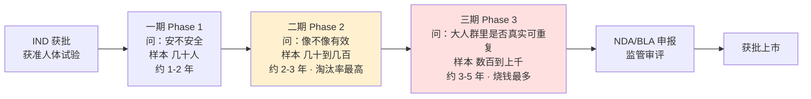
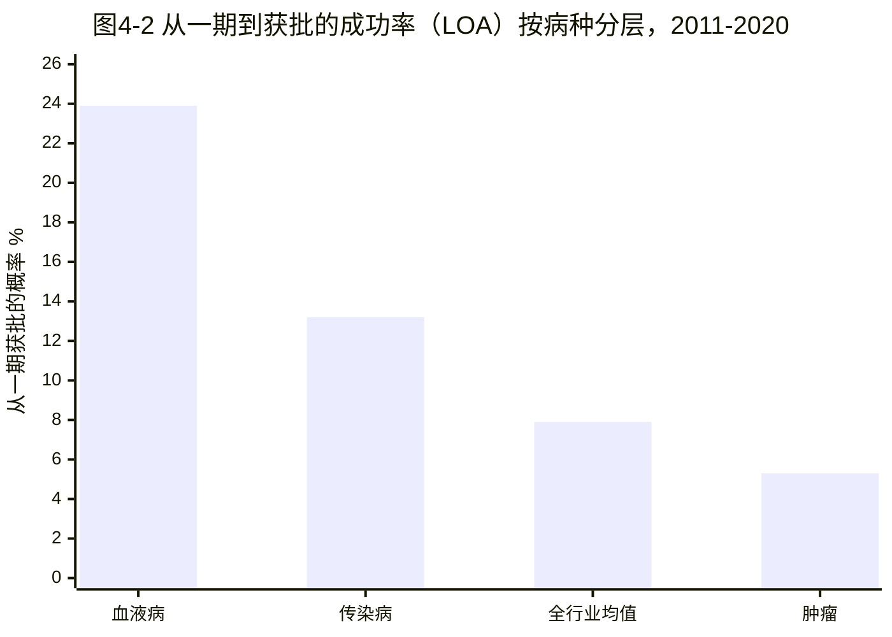

## 一条读数，半个公司

2024 年 12 月 20 日，丹麦诺和诺德（Novo Nordisk，NVO，全球 GLP-1 与糖尿病/减重药龙头）公布了减重新药 CagriSema 的三期临床 REDEFINE 1 结果（ClinicalTrials.gov NCT05567796，约 3,417 名受试者）：在 68 周治疗后，减重达 22.7%（trial product estimand，即假设全程依从的口径；按 treatment policy estimand 为 20.4%，更接近 FDA 的主判口径），显著优于安慰剂的 2.3%，主要终点达成。按任何常规标准，这都是一条成功的数据。可当天诺和诺德股价下跌约 20%（2024-12-20 ADR 收盘口径，盘中一度跌约 22%），一天之内抹去的市值以百亿美元计。原因只有一个：诺和诺德管理层此前曾把目标暗示在约 25% 减重，卖方机构（如 Jefferies 分析师 Peter Welford 的投资者调查）的预期一度高至约 27%——22.7% 这个「成功」低于了被提前定价的那条线。此后一年多，伴随更多读出与指引下调，诺和诺德 ADR 自 2024 年 6 月高点至 2025 年 11 月低点回撤约 65%（Yahoo Finance 日线，ADR 口径；截至 data_cutoff 2026-05 仍处低位，精确高低点待 fact-check 回填）。

同一年的另一端，美国 Summit Therapeutics（SMMT，专注肿瘤双抗的 biotech，即未盈利的生物科技公司）几乎只靠一条临床数据完成估值重估。它从中国康方生物（Akeso，9926.HK）license-in（授权引进）的双特异性抗体 ivonescimab（依沃西单抗，同时靶向 PD-1 与 VEGF），在中国开展的三期头对头试验 HARMONi-2 中，无进展生存期击败了默克（Merck，MRK）的 Keytruda（帕博利珠单抗 pembrolizumab，PD-1 抑制剂，多癌种重磅药）。约 2024 年 9 月 HARMONi-2 数据公布后，SMMT 市值一度超 230 亿美元（Yahoo Finance 日线，2024-09-09 收盘口径，精确值待 fact-check），2024 全年股价涨约 577%（2024 年初至年末，Yahoo Finance 口径）——这家公司当时还没有一款已上市产品。

一条临床读数能让一家成熟药企单日蒸发百亿美元，也能让一家没有营收的 biotech 一年涨几倍。这是本章要拆解的张力：**临床试验既是一道科学关卡，也是一场资本下注，而下注的筹码——几千名患者、好几年时间、几亿到几十亿美元——全部押在少数几个数字上。** 看懂这些数字怎么读、读错的代价有多大，是把临床新闻翻译成估值判断的基本功。

## 三期接力：钱是怎么烧没的

一款候选药拿到临床试验申请（IND，Investigational New Drug，新药临床研究审批）批件、获准在人体试验后，要依次闯过三期，每一期问的问题不同（如图 4-1）。

- **一期（Phase 1）**：主要问「安不安全」。受试者通常几十人（肿瘤药多为患者，其他领域常为健康志愿者），观察安全性、耐受剂量和药物在体内的代谢（药代动力学），找出后续该用多大剂量。时间约一到两年。
- **二期（Phase 2）**：主要问「像不像有效」。受试者通常几十到几百人，初步看疗效信号、进一步摸剂量。这是淘汰率最高的一关——大量在动物和一期看着不错的药，在这里第一次面对「对真实患者到底有没有用」的拷问。
- **三期（Phase 3）**：主要问「在足够大的人群里，效果是否真实、可重复、且利大于弊」。这是注册性试验（pivotal trial，监管据以批准上市的关键试验），动辄数百到上千例、设对照组随机双盲、跟踪好几年，单项成本常达数亿美元。一款新药的研发开销绝大部分烧在三期；行业层面，据 Deloitte 2024 年报告，一款获批新药的平均研发投入约 22 亿美元（含失败项目分摊与资金成本，为预测性 cohort 测算、非单一会计科目，原报告口径待回溯）。

图 4-1：新药临床三期接力与资本敏感点（样本量、时长为行业典型区间，非某一具体试验；NDA = New Drug Application 新药上市申请，用于小分子；BLA = Biologics License Application 生物制品上市申请，用于生物药）。越往右，单期投入越大、失败的沉没成本越高，因此三期读出是股价最敏感的节点。

从投资视角看，这条接力线有一个反直觉的特点：**越接近终点，单次失败越贵。** 二期失败烧掉的是几千万到上亿美元，三期失败烧掉的是几亿美元加上前面所有阶段的沉没成本，外加错失的专利保护时间。这也是为什么三期顶线（top-line，试验主要结果的首批披露）数据公布日，是医药股波动率最高的日子之一。

## 读懂一条临床读数：三件套

一条临床新闻里真正决定估值的，往往不是「成功」或「失败」这两个词，而是三组信息。每看到一条读出，先把这三件套填齐，再判断它值多少钱。

**第一件：样本量与试验阶段。** 多少人、第几期、是不是注册性试验。同样是「阳性」，70 人的二期 a 和 800 人的三期，证据权重差一个量级。前者是「值得继续投钱往下做」的信号，后者才是「可以拿去申请上市」的证据。

**第二件：终点是什么性质。** 临床终点分两类，区别极大：

- **硬终点（hard endpoint）**：直接衡量患者活得更久或更好的指标，最典型的是总生存期（OS，Overall Survival，从随机分组到因任何原因死亡的时间）。
- **替代终点（surrogate endpoint）**：用一个更早、更易测量的指标去「代理」临床获益，赌它能预测硬终点。肿瘤里常用的有无进展生存期（PFS，Progression-Free Survival，从分组到肿瘤进展或死亡的时间）、客观缓解率（ORR，Objective Response Rate，肿瘤明显缩小的患者比例）。替代终点能让试验更快、更小、更便宜，但它和硬终点之间永远隔着一层「赌它能转化为真实获益」的不确定性。

衡量疗效差异时，肿瘤试验常用风险比（HR，Hazard Ratio）：HR=0.5 意味着治疗组在任一时点发生进展或死亡的瞬时风险只有对照组的一半，HR 越小、获益越大；HR=1 表示两组没差别。前面 HARMONi-2 里 ivonescimab 把无进展生存的风险相对 Keytruda 降低约 49%（HR 约 0.51，中位 PFS 11.14 个月 vs 5.82 个月），就是 HR 语言的一次典型表达。但要记住三个限定：这是 PFS（替代终点），OS 这个硬终点当时尚未成熟；这是中期分析（interim，事件数未攒满时的提前分析）；数据来自中国单一区域。最后一点尤其关键——中国单一区域数据通常不足以单独支持 FDA 注册，往往需要补充全球多中心试验。三件套填齐，才能看清这条「击败 Keytruda」到底成色几何——它足够强，但还不是终局。

**第三件：统计显著，还是临床意义。** 这两件事经常被混为一谈，是读临床数据最大的陷阱。

- **统计显著（statistical significance）**：差异不太可能是随机噪声造成的，通常看 p 值（小于 0.05 算显著）或 95% 置信区间（95%CI，指真实效应有 95% 概率落入的区间）是否「跨过无效线」。
- **临床意义（clinical significance）**：这点差异对患者是否真的重要。一条数据可以统计显著但临床意义有限（多活两周、肿瘤多缩小一点点），也可以看着漂亮但因样本太小而统计上站不住。

判断一条读出，要同时问「这个差异是真的吗（统计）」和「这个差异够大吗（临床）」。两者都过关，才是一条经得起推敲的数据。

**还有第四件：安全信号。** 疗效达标不等于商业成功——即使主要终点漂亮，若三四级（重度）不良反应率明显高于对照，监管可能收窄适应症、在标签上加警示，医生与支付方的真实采用率也会打折，最终压低销售峰值。安全性是一个对称的下行变量：好数据让市场上修，差的安全信号同样能让一条「有效」的读出失去价值。仍以 HARMONi-2 为例，ivonescimab 组三级及以上治疗相关不良事件（Grade≥3 TRAE）发生率 29.4%，几乎是 Keytruda 组 15.6% 的两倍——这条数据在评估其商业前景时，与那条漂亮的 PFS 同等重要，不能只读疗效、不读安全。

## 闯关成功率不是一个数字

很多估值模型会用「临床成功率」去给管线打折。问题在于：**根本不存在一个适用于所有药的成功率。** 按 BIO、Informa Pharma Intelligence 与 QLS Advisors 对 2011–2020 年间 9,704 个临床开发项目的统计，从一期算起、最终走到获批的整体概率（业内称 PoS，Probability of Success 成功概率；或 LOA，Likelihood of Approval 获批可能性）只有 7.9%。但这个 7.9% 是全行业混合值，拆开看分化极大（如图 4-2）。

图 4-2：不同病种「闯关成功率」差距悬殊（数据：BIO/Informa/QLS《Clinical Development Success Rates 2011–2020》，2021-02 发布；传染病一栏含疫苗等项目；纵轴为从一期算起的累计获批概率 LOA）。血液病约 23.9%，是肿瘤实体瘤约 5.3% 的四倍多。模态层面同样分化：生物药整体 LOA 约 9.1%，高于新分子实体（小分子）的约 5.7%。

逐关看，最难的不是最后一关。一期到二期的推进率约 52%，三期到申报约 57.8%，申报到获批约 90.6%——唯独二期到三期只有约 28.9%。**「有效性证伪」集中发生在二期**，这也是为什么二期向三期推进的决定，是药企最纠结、也最烧投资人神经的节点。

对投资者的含义很直接：任何把「整体 7%」或「三期约 58%」一刀切套到具体管线上的估值，都会系统性犯错。一个遗传学机制清楚、靶点验证充分的血液病项目，和一个机制新颖的实体瘤项目，闯关概率可能差四五倍。给管线估值（后续第 27 章会展开 rNPV，risk-adjusted Net Present Value 风险调整净现值）时，PoS 必须按「适应症 + 模态 + 该靶点既往验证程度」分层取值，而不是套一个行业平均数。

## 一条阳性读数，为什么不能背书

把上面的工具用到一个具体案例上，能看清「单一阳性读出」的边界。

2025 年 6 月，Insilico Medicine（英矽智能，AI 制药公司，其化合物由生成式 AI 设计）在《自然·医学》（Nature Medicine）发表了 rentosertib（原代号 ISM001-055，一种 TNIK 抑制剂）治疗特发性肺纤维化（IPF，一种进行性、预后差的肺部纤维化疾病）的二期 a 临床结果。亮点在于：现有抗纤维化药（如吡非尼酮、尼达尼布）只能延缓肺功能下降，而这条数据里，60mg 每日一次组在 12 周后用力肺活量（FVC，Forced Vital Capacity，衡量肺功能的核心指标）相比基线**正增长** 98.4mL，安慰剂组则是 −20.3mL。一款 AI 设计的分子让纤维化的肺功能不降反升，叙事足够吸引人。

但把三件套填齐，热度就要降温：

- **样本量与阶段**：全试验仅 71 人，分布在中国 22 个中心，疗程仅 12 周，是二期 a，不是注册性三期。
- **终点性质**：FVC 是替代终点，且 12 周太短，看不到对硬终点（疾病恶化、死亡、是否真的延长生命）的影响。
- **统计与临床**：60mg 组 FVC 改善的 95% 置信区间是 10.9–185.9mL，下限 10.9 几乎贴着无效线 0。这意味着在统计上，真实效应有可能只是「几乎为零的微小改善」，区间之宽本身就反映了 71 人小样本的不确定性。

这条数据足以支持「值得做更大、更长的三期去验证」，但远不足以为「AI 制药已兑现疗效」或这家公司的估值背书。它是一张「值得继续下注」的入场券，不是「赌局已赢」的兑奖单。混淆这两者，正是被一条读数带节奏的典型方式。这也呼应一个更大的判断（第 6、25 章会再触及）：AI 目前压缩的是发现端的时间和成本，尚未撼动决定研发回报的三期失败率——而临床失败，才是药价高昂的根子之一。

## 加速审批：先上市，再补证明

替代终点还衍生出一条特殊通道：加速审批（Accelerated Approval，FDA 1992 年设立，允许药物基于「合理预测临床获益」的替代终点先获批上市，但要求上市后继续做确证性试验）。它的逻辑是：对严重、缺乏有效疗法的疾病，让患者早点用上药，代价是把「证明真实获益」的举证责任推迟到上市之后。

2024 年 3 月，Madrigal Pharmaceuticals（MDGL，专注代谢性肝病的 biotech）的 resmetirom（商品名 Rezdiffra）正是循此路径获批，成为首个治疗代谢功能障碍相关脂肪性肝炎（MASH）的药物——基于三期 MAESTRO-NASH 试验（n≈966，主要终点在约 52 周读取）中肝纤维化改善和 MASH 消退这两个替代终点，而非「患者活得更久」的硬终点。批文里明确写着：能否维持批准，取决于确证性试验验证临床获益。

这条「先上市、再证明」的路，意味着一类特殊的投资风险：**已上市、已产生销售的药，仍可能因确证性试验失败而被撤市。** 一个典型案例是 Avastin（贝伐珠单抗 bevacizumab）：2008 年基于 PFS 替代终点加速批准用于转移性乳腺癌，但后续确证试验未能复现 PFS 获益、也未显示总生存改善，FDA 于 2011 年 11 月撤回了这一乳腺癌适应症（其结直肠癌、肺癌等其他适应症不受影响）。监管也越来越多地要求企业用真实世界证据（RWE，Real-World Evidence，来自日常诊疗、保险理赔等非试验环境的数据）来补充确证。对持有这类公司的投资者，加速审批是一把双刃剑：它把现金流提前了，也把一个「确证试验读出」的尾部风险埋在了上市之后。

## 临床读数 = 资本下注

回到开篇的两个场景，现在可以给出一套不被读数带节奏的读法。

诺和诺德 CagriSema 的「成功却暴跌」，本质是终点达成与市场预期的错位——主要终点（优于安慰剂）达成是事实，22.7% 低于市场提前定价的 25% 也是事实，股价反应的是后者。读这类新闻，要把「试验是否达到预设终点」和「结果是否超过市场已经定价的预期」分开看，二者经常背离。Summit 的「一条数据涨几倍」，强在 HARMONi-2 是注册性三期、头对头、HR 足够低；弱在终点是 PFS（替代）、为中期分析、且为中国单一区域数据，OS 与跨区域可重复性仍待验证——成色足够支撑重估，但留着明确的证伪条件。

把这些拼起来，是一条贯穿全书的判断：**临床读出是 biotech 估值波动的最大单一来源，因为它把一个本质上二元（成功/失败）、且按概率分布的事件，压缩到某一天某几个数字上。** 谁能在读数公布前把三件套（样本/阶段、终点性质、统计与临床意义）想清楚、把 PoS 按病种分层估准、并分清「达成终点」与「超出预期」，谁就更少被一条新闻牵着走。这套读法，是后面所有涉及管线估值章节（第 5、7、25、27 章）的共同地基。

## 小结

- 临床三期是新药研发最贵的一关，钱主要烧在三期，且越接近终点单次失败越贵；三期顶线读出是医药股波动率最高的节点之一。
- 读任何一条临床读数，先填「三件套」：样本量与阶段（是否注册性）、终点性质（替代 vs 硬终点）、统计显著与临床意义是否都过关；安全信号（重度不良反应率）作为第四维度同等重要——它能限制适应症、标签与销售峰值，是对称的下行变量。
- 不存在统一的「临床成功率」：从一期获批的整体概率约 7.9%，但血液病约 23.9%、实体瘤约 5.3%，差四倍多；最难的一关是二期到三期（约 28.9%）。给管线估值必须按适应症 + 模态分层取 PoS。
- 单一阳性读出（如 rentosertib 71 人、12 周、二期 a、95%CI 下限贴零）只是「值得继续下注」的入场券，不能为疗效或估值背书。
- 加速审批把现金流提前，也把「确证试验失败被撤市」的尾部风险埋在上市之后（Avastin 乳腺癌适应症 2011 年被撤是范例）。
- 下一章转向「药本身」：同样治一种病，化学小分子、抗体和「生物导弹」ADC 的科学与商业逻辑为何天差地别——而这决定了一条临床读数该怎么解读。

## 配套数据

见 `data/04-clinical-trials/`。本章用到的所有数据源与时点详见 `data/04-clinical-trials/sources.md`；术语、分层成功率、读出案例分别见 `endpoints_glossary.csv`、`pos_by_indication_modality.csv`、`readout_cases.csv`。

---

> **免责声明**
>
> 本章涉及具体公司的财务分析、估值测算与产业判断，仅为作者基于公开信息的研究结果，**不构成任何投资建议**。市场有风险，投资决策应基于读者自身的独立判断和专业咨询。
>
> 本章使用的财务数据截至 2026-05，公司基本面与市场环境可能在阅读时已发生变化。本章中提到的公司股票、估值倍数、目标价等信息均为分析素材，作者不对其准确性、完整性或时效性作任何承诺。
>
> **作者持仓披露**：截至本章数据时点，作者未持有本章重点分析公司（诺和诺德、Summit Therapeutics、Insilico Medicine、Madrigal、默克等）的股票或衍生品。本书为评论性质，不披露持仓、不构成投资建议。

---

> 本章来自《医疗经济学》开源版 · 作者「递归客」  
> 在线阅读完整书系：[inferloop.dev](https://inferloop.dev) · 反馈与勘误：[GitHub Issues](https://github.com/diguike/book-healthcare-economics/issues)
