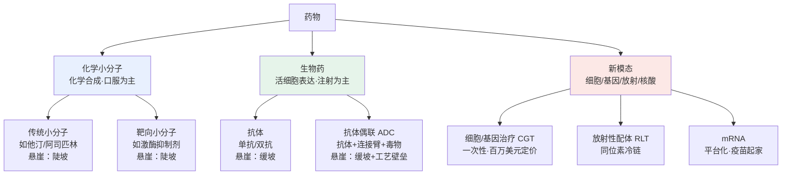
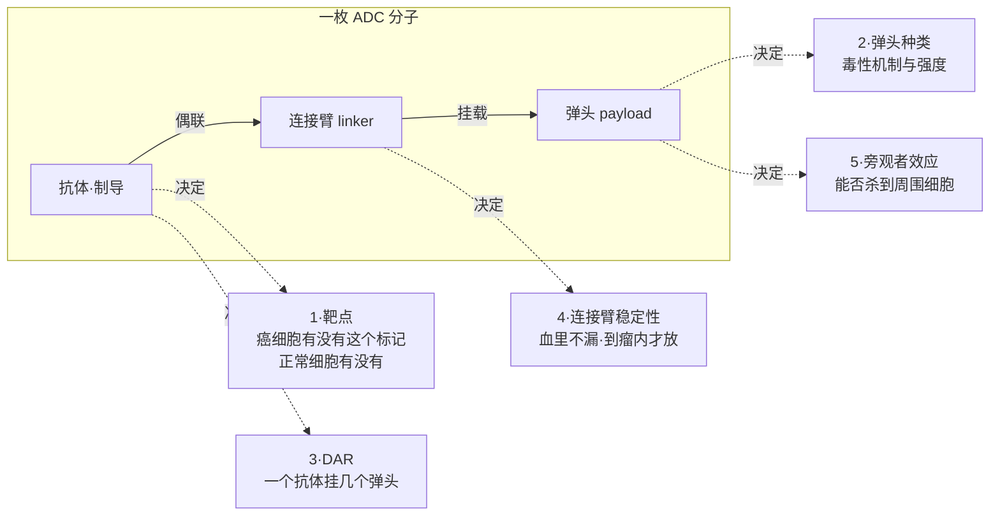

## 本章概览

前两章讲了药为什么贵、临床为什么是豪赌，但没有回答一个更基础的问题：药本身长什么样？一片阿司匹林和一袋几百万美元的细胞治疗，凭什么都叫"药"？

这一章把市面上的药拆成几大类——化学小分子、抗体、抗体偶联药物（ADC）、细胞基因治疗（CGT）、放射性配体疗法（RLT）、mRNA。它们的差别不只在分子量，而在三件影响估值的事：**怎么治病**（决定疗效天花板）、**怎么生产**（决定毛利和谁能仿制）、**专利悬崖是陡坡还是缓坡**（决定失去独占后营收掉多快）。把这三件事和模态对上号，后面讲 CXO、仿制药、专利悬崖、中国出海时，读者就有了一张底图。

本章的落点是 ADC。这是当下中国创新药出海最密集的赛道，也是最容易被"是不是 ADC"这种标签糊弄过去的地方。读完这一章，你应该能拿起一款 ADC，问出五个对的问题，判断它是跟风的 me-too 还是真有差异化——这是看懂"中国创新药出海成色"的科学钥匙。

本章涉及第一三共、阿斯利康、诺华、强生、Vertex 等公司的产品与销售数据，仅作产业分析，章末有免责声明。

## 同治乳腺癌，一个像渔网，一个像导弹

传统化疗的逻辑是"广撒网"。化疗药是细胞毒物，对所有分裂快的细胞下手——癌细胞分裂快，会被杀；但骨髓、毛囊、肠道黏膜也分裂快，于是脱发、白细胞下降、恶心呕吐都来了。它分不清敌我，靠的是癌细胞比正常细胞"死得快一点"这点微弱的剂量窗口。

ADC（Antibody-Drug Conjugate，抗体偶联药物）想解决的就是这个分不清敌我的问题。它的思路是：把化疗的"炸药"绑在一个能认路的抗体上，让抗体先飞到癌细胞表面的特定标记物上，再把炸药卸进癌细胞里。抗体负责制导，毒物负责爆破——这就是"生物导弹"这个比喻的来历。

第一三共（Daiichi Sankyo, 4568.T，日本老牌药企，近年靠 ADC 平台重估）和阿斯利康（AstraZeneca, AZN）合作的 Enhertu（通用名 trastuzumab deruxtecan，靶点 HER2，机制为 HER2 抗体偶联拓扑异构酶 I 抑制剂，适应症乳腺癌等）把这件事做出了一个标志性的结果。

乳腺癌过去按 HER2（human epidermal growth factor receptor 2，人表皮生长因子受体 2，部分乳腺癌等肿瘤过表达的受体酪氨酸激酶，会驱动细胞增殖信号）这个蛋白分两类：HER2 阳性（表达高，能用 HER2 靶向药）和 HER2 阴性（表达低或没有，传统上认为 HER2 靶向药无效）。Enhertu 的 DESTINY-Breast04 三期试验专门挑了一类"中间地带"——HER2 低表达（HER2-low）的转移性乳腺癌患者。这群人过去被归进"HER2 靶向无效"的阴性阵营，只能上化疗。

试验结果【事实】：对比医生选择的标准化疗，Enhertu 把中位无进展生存期（PFS，肿瘤未恶化的时间）延长了约 4.8 个月（约 9.9 个月对 5.1 个月）；客观缓解率（肿瘤明显缩小的比例）约 50%，化疗组只有约 16%。总生存期（OS，活着的时间）的两次读数口径不同，要分开看：初次主分析时中位 OS 约 23.4 个月对化疗组 16.8 个月（延长约 6.6 个月）；延长随访到 32 个月时，中位 OS 收窄为 22.9 个月对 16.8 个月（风险比（Hazard Ratio, HR；HR<1 表示治疗组死亡或进展风险更低）0.69，随访越久越接近真实长期获益）。这是第一个证明"HER2 低表达也能从 HER2 靶向治疗获益"的三期试验（来源：DESTINY-Breast04，NEJM 2022 / Nature Medicine 2025 长期随访）。

它的意义不在多活几个月这个数字本身，而在于**把一批此前被判"无药可用 HER2 路线"的患者，重新拉回了有效区间**。商业上的回报同样直接：第一三共 FY2025（截至 2026-03）财报口径，Enhertu 全球销售约 8195 亿日元（按约 155 日元兑 1 美元折合约 53 亿美元），同比 +25.8%（来源：第一三共 FY2025 业绩，2026-05-11）。

为什么是它能做到，而不是随便哪款 ADC？答案藏在这枚"导弹"的结构里。但在拆它之前，先把药的全家谱铺开。

## 一张谱系图：药按什么分类

把药按"分子怎么做出来、怎么递送、专利悬崖什么形状"排开，大致是从简单到复杂的一条线（如图 5-1）。

**图 5-1：药物种类谱系树（按生产难度与专利悬崖形状排列）**

这张图的关键不是名词，而是右侧标注的"悬崖形状"。专利悬崖（专利到期后原研药营收的下跌）对不同模态根本不是一回事，下面逐类讲。

## 化学小分子：便宜、好仿、悬崖最陡

化学小分子是用化学反应一步步合成出来的小分子量化合物——他汀（降脂）、阿司匹林、二甲双胍，以及大量靶向抗癌药（如各种激酶抑制剂）都属于这一类。它的优点是结构明确、能做成口服片剂、生产成本低、单位毛利在专利期内极高（单个专利期小分子产品毛利常在 90% 以上，这是分子级毛利，不是公司整体毛利）。

代价是它最好仿制。小分子结构清楚，仿制药厂只要证明自己做出的分子和原研"生物等效"，走美国 ANDA（简化新药申请）或中国仿制药一致性评价就能上市。于是小分子的专利悬崖是**陡坡**：核心专利一到期，多家仿制药同时杀入，原研营收常在一两年内掉七八成。典型如辉瑞的立普妥（Lipitor，通用名 atorvastatin，HMG-CoA 还原酶抑制剂，降脂）：它曾是全球销冠之一，2011 年 11 月底美国仿制药上市后销售迅速下滑，原研营收在随后两三年内被仿制药吞掉大半（具体年度降幅见第 25 章）。

对投资者，这意味着小分子原研药的估值高度依赖"还剩几年专利独占期"。这条线在第 25 章讲专利悬崖墙时会反复出现，记住它的形状：**断崖式**。

## 抗体：贵、难仿、悬崖是缓坡

抗体是用活细胞（通常是工程化的哺乳动物细胞）表达出来的大分子蛋白，属于生物药。**单抗**（单克隆抗体，monoclonal antibody）只认一个靶点，是过去二十年的销售主力——默沙东的 Keytruda（pembrolizumab，PD-1 抑制剂，多种癌症）、艾伯维的 Humira（adalimumab，TNF-α 抑制剂，自身免疫病）都是单抗。**双抗**（双特异性抗体，bispecific antibody）能同时抓两个靶点，比如一头拉住癌细胞、一头拉住免疫 T 细胞，把两者强行拉到一起。

抗体的生产门槛远高于小分子：要养细胞、控制发酵、做复杂的纯化，整条产线投资大、批次间一致性难保证。这道工艺壁垒带来一个直接后果——它的仿制版不叫仿制药，叫**生物类似药**（biosimilar，与原研生物药高度相似但无法做到分子级完全相同的版本）。因为活细胞产物没法做到一模一样，监管要求生物类似药另做临床证明相似性，开发成本和门槛都高得多。

所以抗体的专利悬崖是**缓坡**而非断崖。生物类似药上市后，原研药营收下滑的速度，更多由支付方（尤其美国 PBM（Pharmacy Benefit Manager，药品福利管理机构，美国医保链上掌管处方集与返利的中间方，详见第 12 章）的处方集和返利合约）决定，而不是专利到期那一刻（这一点修正了"专利一到期就崩"的直觉，详见第 25 章）。Humira 在美国就是典型：2023 年多个生物类似药上市后，它的下滑是被 PBM 处方集一步步替换出来的，而非一夜崩塌。

## ADC：把导弹拆成五个零件

ADC 站在小分子和抗体的交叉口：一个抗体（制导）+ 一段连接臂（linker）+ 一个小分子毒物（payload，弹头），三段拼成一枚分子。正因为它是拼装件，**"是不是 ADC"几乎不含信息量，真正决定好坏的是这五个零件怎么配**（如图 5-2）。判断中国 ADC 出海成色，靠的是拆零件，不是看标签。

**图 5-2：一枚 ADC 的五处拆解点**

五个拆解点逐一说明：

**1. 靶点（抗体认哪个标记）**：抗体飞向癌细胞表面的某个蛋白。这个靶点要在癌细胞上多、在正常组织上少，否则导弹会误炸正常器官。Enhertu 认的是 HER2，Dato-DXd 认的是 TROP2（Trophoblast Cell-Surface Antigen 2，滋养层细胞表面抗原 2，多种上皮肿瘤高表达，与 HER2 属不同蛋白家族），靶点不同，能打的癌种和安全窗口就不同。

**2. 弹头（payload，挂载的毒物）**：决定爆破威力。Enhertu 和 Dato-DXd 用的都是第一三共的 DXd（一种拓扑异构酶 I 抑制剂，依沙替康衍生物，通过干扰 DNA 复制杀死细胞）。DXd 的特点是足够强、又能在释放后扩散，这是第一三共 ADC 平台的核心资产。

**3. DAR（Drug-to-Antibody Ratio，药物抗体比，一个抗体平均挂几个弹头）**：太少威力不够，太多分子不稳定、易在血里散架。Enhertu 的 DAR 约为 7–8，在高 DAR 下还能保持稳定，是它工程化的难点；Dato-DXd 的 DAR 约为 4（来源：NEJM 2022、第一三共/阿斯利康产品资料）。

**4. 连接臂稳定性（linker，把弹头绑在抗体上的那段）**：要在血液里稳得住（不能半路漏毒，否则等于全身化疗），到了癌细胞内部又要能被切开释放弹头。Enhertu 用的是可被癌细胞内溶酶体酶（如组织蛋白酶 B/L）切割的四肽连接臂，血中稳定、瘤内释放。连接臂泄漏是早期 ADC 失败的主因之一。

**5. 旁观者效应（bystander effect）**：弹头在一个癌细胞里释放后，如果能穿过细胞膜扩散到周围的细胞继续杀伤，就叫旁观者效应。这正是 Enhertu 能打 HER2 低表达肿瘤的机制——哪怕只有部分细胞表达 HER2，释放的 DXd 也能波及邻近不表达的细胞。没有旁观者效应的 ADC，对靶点表达不均匀的肿瘤就力不从心。

把这五点连起来，就能回答"me-too 还是真差异化"。同样是第一三共 DXd 平台、同样的弹头，Enhertu（HER2）和 Dato-DXd（TROP2）的临床命运却不同：

- Enhertu 在 HER2 低表达乳腺癌上拿到 PFS 和 OS 双阳性，是开辟新患者群的差异化资产。
- Dato-DXd 的 TROPION-Lung01 三期（既往治疗过的晚期非小细胞肺癌）【事实】达到了 PFS 主终点（HR 0.75），但全人群 OS 未达统计学显著：中位 OS 12.9 个月对多西他赛 11.8 个月（HR 0.94，p=0.530），只在非鳞状亚组显出获益（来源：阿斯利康/第一三共 2024 公告、IASLC）。

【分析】同一平台、同样优秀的弹头和连接臂，换一个靶点和适应症，结果就从"改写标准治疗"滑到"全人群没达终点、靠亚组讲故事"。这说明**ADC 的价值不能从平台外推**——靶点选择、适应症设计、试验人群，每一项都能让一枚结构相似的导弹打偏。读者下次看到"某中国 biotech 的 ADC 出海"，该问的不是"是不是 ADC"，而是这五个零件分别是什么、有没有头对头（head-to-head）数据、靶点是新靶点还是挤在 HER2/TROP2 红海里。

回到悬崖形状：ADC 是生物药，专利悬崖同样是缓坡，且叠加了极高的工艺壁垒（偶联、纯化、DAR 控制都难复制），生物类似版门槛比普通抗体还高。这让优质 ADC 平台的独占性更强——但也别忘了，平台强不代表每个资产都强。

## 三种新模态：定位，而非深挖

最后三类是当下估值最贵、商业模式最特殊的新模态。它们的共同点是疗效可能极强，但都各自卡在生产、定价或供应链上。

**细胞基因治疗（CGT，Cell and Gene Therapy）**：用经过改造的细胞或基因直接修复病因，理论上一次给药、长期甚至终身有效。它内部分两条技术路线，经济学的痛点不同。

一条是**改造细胞**。代表是 Carvykti（cilta-cel，BCMA（B-Cell Maturation Antigen，B 细胞成熟抗原，多发性骨髓瘤靶点）靶向 CAR-T（Chimeric Antigen Receptor T-cell，嵌合抗原受体 T 细胞，把患者自身 T 细胞基因改造成能识别并攻击肿瘤）细胞疗法，多发性骨髓瘤，强生与传奇生物合作）。它的难点在制备：要抽出每个病人自己的 T 细胞、单独改造再回输，本质是给一个人定制一批药，没法像化药那样批量生产，产能、冷链和周转都是规模化的硬约束。Carvykti 2025 年单季净销售已从一季度约 3.69 亿美元升到二季度约 4.39 亿美元（来源：传奇生物 2025 财报），放量在走，但仍受单人制备产能掣肘。

另一条是**直接改写基因**，把治病的基因或编辑工具递进体内细胞。代表是 Casgevy（exa-cel，CRISPR 基因编辑，镰刀型贫血/输血依赖型地中海贫血，Vertex 与 CRISPR Therapeutics）和 Zolgensma（onasemnogene abeparvovec，AAV（Adeno-Associated Virus，腺相关病毒，最常用的基因治疗递送载体之一）基因疗法，脊髓性肌萎缩症，诺华）。这条路的痛点在付费：一次给药就追求长期治愈、几乎没有复购，定价被推到极致——Casgevy 约 220 万美元（Vertex/CRISPR 2023-12 上市挂牌价 list price）、Zolgensma 约 210 万美元（诺华 2019 获批时初始挂牌价）。难题不是疗效，而是支付方愿不愿意一次掏几百万，以及怎么分期、按疗效付费、不达标退款。

**放射性配体疗法（RLT，Radioligand Therapy）**：把放射性同位素绑在一个能找到癌细胞的配体上，靠局部辐射杀伤。代表是诺华（Novartis, NVS）的 Pluvicto（lutetium Lu-177 vipivotide tetraxetan，PSMA（Prostate-Specific Membrane Antigen，前列腺特异性膜抗原，转移性前列腺癌靶点）靶向，转移性去势抵抗性前列腺癌）和 Lutathera（Lu-177 dotatate，生长抑素受体靶向，神经内分泌瘤）。它的独特壁垒在供应链而非分子：放射性同位素半衰期短、只能就近生产、按时配送，冷链与核药房网络是真护城河。Pluvicto 2025 年三季度销售约 5.64 亿美元（同比 +45%），同年 3 月获 FDA 批准前移到化疗前使用、可及患者数大幅扩大；Lutathera 同期约 2.13 亿美元（来源：诺华 2025 季报、FDA/诺华公告）。

**mRNA**：用信使 RNA 指导人体细胞自己造出目标蛋白，靠新冠疫苗一战成名。新冠退潮后，mRNA 平台的看点转向非新冠管线，尤其是个体化肿瘤疫苗——根据每个患者肿瘤的突变定制新抗原疫苗。这条线目前更多是【预测】而非已兑现的营收，本书只给定位、不为单个管线背书。mRNA 的平台属性（同一套生产平台换序列就能做新产品）是它估值溢价的来源，也是风险所在：平台价值要靠一个个适应症去验证。

这三类的专利与商业逻辑都还在形成中。对投资者，现阶段更稳妥的做法是把它们当"高赔率、高不确定"的期权，而不是用成熟药的 rNPV 框架硬套（估值方法见第 27 章）。

## 小结

- 药按"怎么生产"分两大阵营：化学小分子（化学合成、好仿、悬崖是陡坡）和生物药（活细胞表达、难仿、悬崖是缓坡），生物类似药的冲击节奏由支付方而非专利到期决定。
- ADC 是抗体与小分子毒物的拼装件，"是不是 ADC"不含信息量；判断价值要拆五个零件——靶点、弹头（payload）、DAR、连接臂稳定性、旁观者效应。这是看中国创新药出海成色的科学钥匙。
- 【独立观察】同一个 DXd 平台，Enhertu（HER2）改写了 HER2 低表达乳腺癌的标准治疗，Dato-DXd（TROP2）却在肺癌全人群 OS 上没达终点。平台强不等于资产强，价值不能从平台外推。
- CGT/RLT/mRNA 三种新模态疗效潜力大，但分别卡在一次性定价与产能、同位素冷链、平台验证上，商业模式仍在成形，宜当期权看待。
- 下一章接着问一个被本章埋下的问题：Enhertu 凭"HER2 低表达"这条线扩大了患者群——可患者到底是不是 HER2 低表达，要靠一张检测试纸来分。一张试纸如何决定一款药能卖给谁、进而卖多少钱，是连接"造药"和"做诊断"两门生意的关键，也是第 6 章的主题。

## 配套数据

见 `data/05-drug-types/`。本章用到的所有数据源详见 `data/05-drug-types/sources.md`。

---

> **免责声明**
>
> 本章涉及具体公司的财务分析、估值测算与产业判断，仅为作者基于公开信息的研究结果，**不构成任何投资建议**。市场有风险，投资决策应基于读者自身的独立判断和专业咨询。
>
> 本章使用的财务数据截至 2026-05，公司基本面与市场环境可能在阅读时已发生变化。本章中提到的公司股票、估值倍数、目标价等信息均为分析素材，作者不对其准确性、完整性或时效性作任何承诺。
>
> **作者持仓披露**：截至本章数据时点，作者未持有第一三共、阿斯利康、诺华、强生、Vertex 及本章重点分析的其他公司股票或衍生品。本书为 commentary-only，不披露持仓、不构成投资建议。

---

> 本章来自《医疗经济学》开源版 · 作者「递归客」  
> 在线阅读完整书系：[inferloop.dev](https://inferloop.dev) · 反馈与勘误：[GitHub Issues](https://github.com/diguike/book-healthcare-economics/issues)
