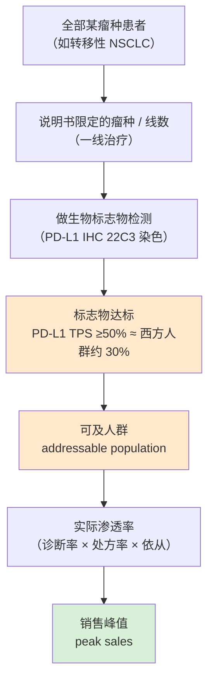

## 本章概览

前面五章都在讲"药"这一侧：怎么造、怎么试、有哪些种类。但药卖给谁，往往不在药企的财务模型里，而在医院病理科那台染色机和那台测序仪里。一款抗癌药的销售峰值，常常在病人吃第一片药之前，就已经被一张检测试纸划定了上限。

这一章讲生物标志物和伴随诊断（CDx）——用药前的那道检测，如何圈定一款药能卖给多少人，进而决定它能卖多少钱。这是连接"造药"和"做诊断"两门生意的环节：往前看，它解释了为什么同一个靶点的两款药，销售额能差出三倍；往后看，它把读者引向后面要讲的体外诊断（IVD）产业——那张试纸本身就是一门高毛利的生意，而且越来越多地掌握在罗氏、安捷伦这样的诊断巨头手里。

本章涉及默沙东、百时美施贵宝、安进、阿斯利康、罗氏、安捷伦等公司的产品与销售数据，仅作产业分析，章末有免责声明。

## 两个肺癌病人，一张试纸

两个晚期非小细胞肺癌（NSCLC，肺癌中最常见的一大类，约占八成）病人，年龄相仿、分期相同，用的是同一款药——Keytruda（帕博利珠单抗 pembrolizumab，PD-1 抑制剂，一种解除免疫系统"刹车"、让 T 细胞重新攻击肿瘤的抗体，适用于多种癌症）。三个月后复查：一个的肿瘤明显缩小，另一个纹丝不动，还在长。

药是同一款，剂量是一样的，差别在用药之前那张检测报告上的一个数字。第一个病人的肿瘤组织在染色后大面积着色，第二个几乎不着色。这张报告测的是 PD-L1（programmed death-ligand 1，程序性死亡配体 1，肿瘤细胞表面一种"举白旗"分子，它和 T 细胞上的 PD-1 结合，等于按住免疫系统的刹车）。Keytruda 的作用机制，正是松开这个刹车。肿瘤表面 PD-L1 越多，松开刹车后免疫系统反扑的余地越大，药越可能有效；几乎不表达 PD-L1 的肿瘤，这款药大概率使不上劲。

于是出现了一个对药企生死攸关的环节：在开药之前，先做一张试纸，看这个病人的肿瘤值不值得用这款药。这张和药"绑定"销售、用来筛选适用患者的检测，就是**伴随诊断**（companion diagnostic，CDx）——它不是给医生多一个参考，而是写进药品说明书、决定能不能开这款药的准入条件。

PD-L1 这样能被客观测量、用来指示疾病状态或预测药物反应的分子特征，统称**生物标志物**（biomarker，简称标志物）。它可以是一个蛋白的表达量、一个基因的突变、一段基因组的特征。标志物把笼统的"肺癌"拆成了一个个可定位的分子亚型，而每一个亚型，对应着一款药能不能用、用了有没有效。

这件事不是新鲜事。1998 年 FDA 同时批准了乳腺癌药 Herceptin（曲妥珠单抗 trastuzumab，HER2 抗体，HER2 阳性乳腺癌/胃癌）和一款叫 HercepTest 的检测——后者是历史上第一个 FDA 批准的伴随诊断【事实，来源：FDA 1998 批准记录；Nature Reviews Clinical Oncology 2025 HER2 testing 综述】。从那天起，"先验药、再开药"成了肿瘤治疗的默认动作，也成了制药和诊断两门生意被焊在一起的起点。

## 一张试纸如何切出"可用药人群"

要理解标志物对一款药意味着什么，得先看清它在销售模型里的位置。一款药的销售峰值，本质上是一道层层收窄的漏斗（如图 6-1）。

**图 6-1：一张试纸如何切出"可用药人群"和销售峰值（以 PD-L1 检测筛选肺癌一线用药为例）**

漏斗从瘤种开始：一款药先被说明书限定在某些癌症、某些治疗线数（一线、二线）。再往下是关键的一道闸——生物标志物检测。Keytruda 在肺癌一线单药的核心人群，是 PD-L1 高表达（按 22C3 检测，肿瘤细胞阳性比例 TPS ≥50%）的病人；这类高表达者在西方 NSCLC 人群里约占三成【事实，来源：EXPRESS 全球多中心研究，J Thorac Oncol 2019；多项真实世界研究区间 22%–30%】。检测达标的这部分人，才构成这款药在这一适应症上的**可及人群**（addressable population）——理论上能用药的患者总数。

可及人群乘上实际渗透率（有多少人真去做了检测、检测达标后有多少真开了药、开了药能坚持多久），才是销售额。标志物决定的是漏斗中段最陡的那一收：它直接砍掉了一大块"瘤种对、但标志物不达标"的患者。换句话说，标志物阳性率越低，可及人群越小，这款药的销售天花板就越矮——除非它能靠后面要讲的两条路把漏斗重新撑开：拿下更多瘤种，或者把标志物的门槛放宽。

## 同样是 PD-1，为什么 Keytruda 是 Opdivo 的三倍

把标志物讲透的最好案例，是两款机制几乎相同的药。Keytruda 和 Opdivo（纳武利尤单抗 nivolumab，PD-1 抑制剂，多种癌症）都是 PD-1 抑制剂，几乎同期上市，作用机制是同一套"松刹车"。但 2025 年，Keytruda 全球销售约 317 亿美元（+7%），是默沙东（Merck & Co., MRK，全球肿瘤免疫龙头）单品销冠、占其药品销售约五成半【事实，来源：默沙东 2025 Q4/全年财报，2026-02】；Opdivo 2025 年销售约 100 亿美元级（上半年约 48 亿美元，+8%）【事实，来源：百时美施贵宝 2025 半年报】。同一个靶点，峰值差出三倍以上。

差距不在分子本身，在用药前那张试纸怎么用。把时钟拨回 2016 年，两家在最大的肿瘤市场——肺癌一线——做了两个赌注相反的临床试验。

默沙东的 KEYNOTE-024 只招 PD-L1 高表达（TPS ≥50%）的病人。这是一个窄赌注：先用标志物把人群收窄到最可能有效的那三成，再去和化疗比。结果主终点和次终点全部达成，五年总生存率从化疗组的 16.3% 提到 31.9%【事实，来源：KEYNOTE-024 五年随访，J Clin Oncol 2021】。

百时美施贵宝的 CheckMate-026 反过来，招的是 PD-L1 ≥5% 的较宽人群，想一口气拿下更大的市场。这是一个宽赌注。结果试验失败，主终点没达到【事实，来源：BMS CheckMate-026 公告，2016；BioPharma Dive 报道】。消息公布当天，百时美施贵宝股价大跌约 16%（盘中一度逾 17%，8 月全月累计跌约 23%），默沙东涨了约一成【事实，来源：CNBC / Fierce Biotech 2016-08 报道】。

这一战基本决定了肺癌一线免疫治疗市场的归属，而胜负手是标志物策略，不是药。窄赌注用 CDx 把人群提纯到最可能获益的那一档，换来一个干净的阳性结果和一张一线单药的"通行证"；宽赌注想一次吃下更大的盘子，结果因为人群里掺进了太多不获益的病人，统计上被稀释到不显著。Keytruda 凭这张通行证站稳肺癌一线，再一个瘤种一个瘤种地扩适应症，把漏斗的入口越撑越大；Opdivo 在肺癌一线落了后手，此后多年都在追赶。

这里有一个反直觉的洞察：**在标志物驱动的赛道里，把人群划小，反而能把药做大。** 划小，是为了拿到一个能过监管、能进指南的干净证据；拿到通行证之后，再去横向扩瘤种、纵向扩线数，把可及人群一块块拼回来。Keytruda 今天能卖到三百多亿美元，靠的不是一个大适应症，而是几十个用 PD-L1（以及后面要讲的 MSI-H）一块块切出来、再拼起来的小适应症。同靶点的药峰值差几倍，差的往往不是分子的好坏，而是谁更早、更准地用标志物拿到了那张关键的通行证。

## 硬门和软门：标志物的两种圈人方式

不是所有标志物都像 PD-L1。按"圈人"的方式，标志物大致分两类，对应着两种完全不同的可及人群形态（对照见图 6-2）。

一类是**软门**：标志物是连续的、用来"富集"而非"卡死"的。PD-L1 表达是从 0 到 100% 的连续值，TPS ≥1%、≥50% 是人为划的线，线两边都不是非黑即白——低表达的人也可能获益，只是概率低。软门标志物给药企留了腾挪空间：可以靠不同的截断值（cutoff）在不同适应症里圈不同大小的人群，可以联合化疗把门槛进一步放宽（联合用药时 PD-L1 阴性也能进）。软门对应的可及人群有弹性，能随适应症扩张不断撑大，这正是 Keytruda 能滚到三百亿美元的结构性原因。

另一类是**硬门**：标志物是一个二元的"有或没有"，卡死了人群上限。KRAS G12C（KRAS 基因第 12 位密码子由甘氨酸突变为半胱氨酸的一个点突变，会让 KRAS 蛋白持续激活、驱动肿瘤增殖）就是典型。一个病人要么带这个突变、要么不带，没有中间地带。这个突变只占 NSCLC 的约 13%【事实，来源：Lumakras 处方信息及 KRAS G12C 流行病学，FDA 2021】。针对它的 Lumakras（索托拉西布 sotorasib，KRAS G12C 抑制剂，NSCLC，安进 Amgen 研发）2024 年全球销售约 3.5 亿美元（+25%）【事实，来源：安进 2024 全年财报，2025-02】——同样是肺癌靶向药，可及人群被硬门卡在十几个百分点，加上目前主要用于二线，峰值就只能停在亿美元量级，和软门的 PD-1 不在一个数量级上。

EGFR（epidermal growth factor receptor，表皮生长因子受体，一种驱动细胞增殖的受体，突变后持续激活）是硬门，但它揭示了另一个变量：**同一个标志物，阳性率还随地理和人种变化。** EGFR 激活突变在西方 NSCLC 人群里约占 10%–15%，在东亚人群里高达 40%–60%【事实，来源：多项 NSCLC 基因组流行病学研究综述】。这意味着针对 EGFR 的 Tagrisso（奥希替尼 osimertinib，第三代 EGFR-TKI，EGFR 突变 NSCLC，阿斯利康研发）在亚洲市场天然有一个大得多的可及人群——同一款药、同一个硬门，在不同市场里漏斗的开口宽窄不同。这是后面讲全球格局时一个容易被忽略的供给侧差异：可及人群本身就带着地域属性。

还有一类标志物把漏斗的逻辑彻底改写了——它不按瘤种圈人，而是按分子特征跨瘤种圈人。MSI-H（microsatellite instability-high，微卫星高度不稳定，DNA 错配修复缺陷留下的一种基因组"疤痕"，提示肿瘤突变多、更容易被免疫系统识别）就是这样。2017 年 5 月，FDA 批准 Keytruda 用于所有 MSI-H/dMMR 的实体瘤，不限发病部位——这是史上第一个"不看长在哪、只看带什么标志物"的抗癌药批准【事实，来源：FDA 2017-05-23 批准；ASCO Post 报道】。这种"泛瘤种"（tissue-agnostic）批准等于在漏斗顶端横向并联了几十个瘤种里的一小撮病人，再次说明软门叠加新的圈人逻辑，可以把可及人群从一个瘤种的切片扩成跨瘤种的拼盘。

**图 6-2：常见生物标志物—对应药—检测方对照表（数据时点见各列脚注）**

| 生物标志物 | 圈人方式 | 大致阳性率 | 代表药（商品名/通用名/靶点） | 主要检测方与检测 | 检测技术 |
|---|---|---|---|---|---|
| PD-L1 | 软门（连续富集） | 约 30% 高表达（TPS≥50%，西方 NSCLC） | Keytruda（帕博利珠单抗，PD-1） | 安捷伦 Dako · PD-L1 IHC 22C3 pharmDx | 免疫组化 IHC |
| MSI-H / dMMR | 软门（泛瘤种） | 跨瘤种少数（如转移性结直肠癌约 4%–5%） | Keytruda（泛瘤种，2017 首个组织不可知批准） | 罗氏 Foundation Medicine · FoundationOne CDx 等 | NGS / IHC / PCR |
| HER2 | 半硬门（分级判读） | 乳腺癌约 15%–20% 阳性 | Herceptin（曲妥珠单抗）/ Enhertu | 安捷伦 HercepTest（首个 CDx，1998）；罗氏 | IHC + FISH |
| EGFR 突变 | 硬门（二元，随人种变） | 西方约 10%–15%，东亚约 40%–60% | Tagrisso（奥希替尼，EGFR-TKI） | 罗氏 cobas EGFR Mutation Test v2 | PCR / 液体活检 |
| KRAS G12C | 硬门（二元点突变） | NSCLC 约 13% | Lumakras（索托拉西布，KRAS G12C） | NGS / PCR 基因检测 | NGS / PCR |

> 注：阳性率为大致流行病学区间，随检测方法、人群、瘤种与判读标准变化，非精确值；详见 `data/06-companion-diagnostics/sources.md`。

HER2 在表里被标成"半硬门"，因为它的判读不是简单的有无，而是分级：免疫组化（IHC）打 0 到 3+ 分，2+ 的模糊地带还要再用荧光原位杂交（FISH，一种数基因拷贝数的染色技术）复核。乳腺癌里 HER2 阳性约占 15%–20%【事实，来源：HER2 testing 综述，Nat Rev Clin Oncol 2025】。判读标准本身就在动：上一章讲的 Enhertu 之所以能把"HER2 低表达"乃至"HER2 超低"也纳入有效区间，背后正是一次伴随诊断判读标准的下移——把过去判为阴性的一批病人，用新的检测口径重新划进可及人群。**标志物的门槛不是物理常数，它会随药的进步被重新定义，而每一次重定义，都在改写某款药的可及人群和销售上限。**

## 谁来做这张试纸：被诊断巨头握住的闸门

这道决定药卖给谁的闸门，握在诊断公司手里。这就是本章作为桥梁的另一头：伴随诊断本身是一门生意，而且是高壁垒、和药深度绑定的生意。

伴随诊断按技术分三条线，恰好对应图 6-2 的几类标志物。第一条是免疫组化（IHC），染色看蛋白表达，PD-L1 和 HER2 都靠它。这条线的霸主是安捷伦（Agilent, A，分析仪器与诊断巨头）旗下的 Dako：PD-L1 IHC 22C3 pharmDx 是和默沙东联合开发、专门给 Keytruda 配的伴随诊断，截至 2026 年已拿到八个以上癌种的 FDA 伴随诊断适应症【事实，来源：安捷伦新闻稿，2026】；前面提到的 HercepTest 也出自 Dako。一款重磅免疫药卖到哪，它配套的染色试剂就跟到哪——这是典型的"卖铲人"位置。

第二条是 PCR / 液体活检，查特定基因突变，EGFR 的 cobas EGFR Mutation Test v2 出自罗氏（Roche，全球体外诊断第一大厂，2024 年诊断业务约 143 亿瑞士法郎），它既能查组织、也能查血浆里的循环肿瘤 DNA【事实，来源：罗氏 cobas EGFR CDx 批准记录；罗氏 2024 年报】。第三条、也是趋势所在的，是二代测序（NGS，next-generation sequencing，一次并行读取大量基因序列的技术）。一次测序能同时读出几百个基因的状态，把"一个标志物配一款检测"升级成"一次检测覆盖多个药的入组条件"。

罗氏在这条线上的布局值得专门看。它在 2018 年以约 24 亿美元收购了 Foundation Medicine 剩余股份，把这家做综合基因组检测的公司全资纳入（此前已持股约 57%）【事实，来源：罗氏收购公告，2018-06；FMI SEC 文件】。Foundation Medicine 的 FoundationOne CDx 是首个 FDA 批准、覆盖全部实体瘤的广谱 NGS 伴随诊断，一次检测 324 个基因，已被批准作为 28 款药的伴随诊断，并同时报告 MSI、肿瘤突变负荷等免疫治疗相关指标【事实，来源：FDA F1CDx 批准页；Foundation Medicine 官网】。

收购的逻辑，正是本章的主线反过来用：既然标志物决定药的可及人群，那么握住"判定标志物的那张试纸"，就等于在每一款靶向药和免疫药的入口处都设了一个收费站。药企每推一款需要伴随诊断的新药，都要找诊断方共同开发、共同报批；而广谱 NGS 检测把这个收费站从"一药一检"做成了"一检多药"的平台。诊断巨头由此从制药的配角，变成了精准肿瘤治疗里一个不可绕过的环节——这也是为什么罗氏、安捷伦这些公司的诊断业务，能享受比单纯仪器制造更高的毛利和黏性。后面讲体外诊断产业时会看到，这套"装机—试剂"的封闭生态，和器械的"剃须刀—刀片"是同一种现金流逻辑，只是这里的"刀片"恰好卡在每一款重磅药的咽喉上。

## 小结

- 一款药的销售峰值，常常在病人吃药之前就被一张检测试纸划定了上限。生物标志物把"癌症"拆成可定位的分子亚型，伴随诊断（CDx）则是写进说明书、决定能不能开药的准入闸门。可及人群 = 瘤种 × 标志物阳性率 × 适应症数，它乘上渗透率才是销售额。
- 标志物分软门和硬门。软门（PD-L1）连续可调、能随适应症扩张撑大可及人群，是 Keytruda 滚到三百多亿美元的结构性原因；硬门（KRAS G12C、EGFR）是二元卡死的上限，可及人群只占瘤种的十几个百分点，峰值天然受限。同靶点的药峰值差几倍，差的往往不是分子，而是谁更早、更准地用标志物拿到了一线的通行证——Keytruda 与 Opdivo 在 2016 年那两个赌注相反的临床试验，就是这条因果链最干净的实证。
- 本章独立观察：在标志物驱动的赛道里，把人群划小反而能把药做大——先用 CDx 提纯出一个能过监管的干净人群拿通行证，再横向扩瘤种把可及人群一块块拼回来。而标志物的门槛不是物理常数，它会随药的进步（如 Enhertu 重定义 HER2 低表达）被重写，每一次重写都在改写某款药的销售上限。
- 决定药卖给谁的那张试纸，握在罗氏、安捷伦这样的诊断巨头手里。从 IHC 染色到广谱 NGS，伴随诊断正从"一药一检"升级成"一检多药"的平台，在每一款靶向药和免疫药的入口处设了收费站。这把读者引向下一部分要讲的体外诊断产业——那门"装机—试剂"的高毛利生意，以及它在中国遇到的集采。

## 配套数据

见 `data/06-companion-diagnostics/`：

- `biomarker_drug_cdx_map.csv`：生物标志物—靶向药—伴随诊断—检测方对应表。
- `addressable_population.csv`：同/近靶点药的可及人群与销售对照（软门 vs 硬门）。
- `sources.md`：本章所有数据源清单与口径说明。

---

> **免责声明**
>
> 本章涉及具体公司的财务分析、估值测算与产业判断，仅为作者基于公开信息的研究结果，**不构成任何投资建议**。市场有风险，投资决策应基于读者自身的独立判断和专业咨询。
>
> 本章使用的财务数据截至 2026-05，公司基本面与市场环境可能在阅读时已发生变化。本章中提到的公司股票、估值倍数、目标价等信息均为分析素材，作者不对其准确性、完整性或时效性作任何承诺。
>
> **作者持仓披露**：截至本章数据时点，作者未持有本章重点分析公司（默沙东、百时美施贵宝、安进、阿斯利康、罗氏、安捷伦等）的股票或衍生品；本书为 commentary-only，不披露持仓、不构成投资建议。

---

> 本章来自《医疗经济学》开源版 · 作者「递归客」  
> 在线阅读完整书系：[inferloop.dev](https://inferloop.dev) · 反馈与勘误：[GitHub Issues](https://github.com/diguike/book-healthcare-economics/issues)
