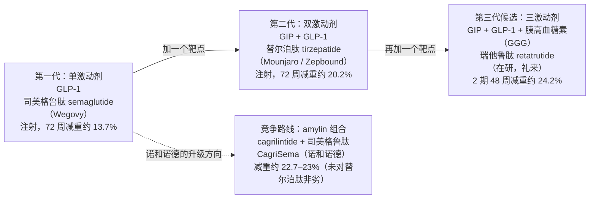
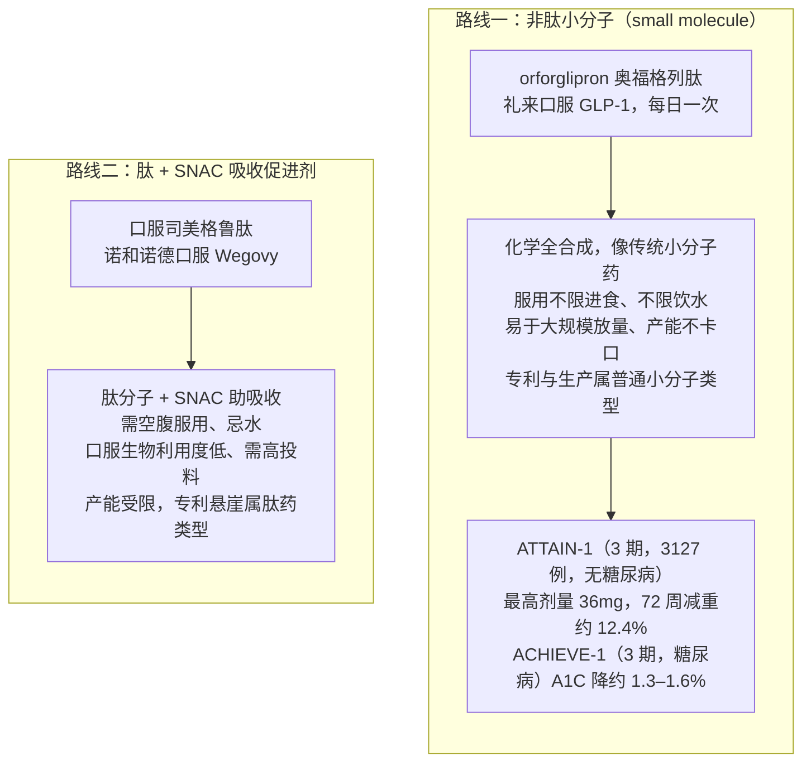

## 本章概览

本章属「第一部　分子的诞生：一款新药如何赚钱、又如何九死一生」，是全书的核心案例章。第 5 章讲了创新药有哪些分子形态，本章把镜头对准其中最赚钱的一类——GLP-1 减重药，回答一个具体问题：同一个赛道、两家起跑时几乎并列的龙头，为什么短短几年里一家市值冲破万亿美元、另一家从欧洲市值之巅大幅回撤？

答案不在「谁更会讲故事」，而在一条可以画出来的科学线索——减重药「一代更比一代强」的机制升级链。读完本章，你能用这条升级链解释「赢家为什么集中在礼来」，更重要的是，拿到一份「这个判断在什么情况下会被推翻」的清单。把已经发生的行情当成永远的定论，是产业研究最危险的习惯，本章用一个证伪框架来对冲它。

## 一年之内，第一名换了人

先看一段已经发生的事实。2024 年 6 月，诺和诺德（Novo Nordisk，丹麦药企，全球糖尿病与减重药主要供应商之一，美股代码 NVO）的市值冲到约 6400 亿美元的峰值（按含所有股类的市值口径），成为整个欧洲市值最高的上市公司——一家来自人口不到 600 万的丹麦的药厂，靠一支减重针把欧洲所有银行、能源、奢侈品巨头甩在身后（来源：companiesmarketcap.com、philippdubach.com 整理，2024-06 峰值口径）。九个月后，2025 年 3 月，软件公司 SAP 把它从欧洲头名的位置上挤了下来（来源：Euronews 2025-03-24）。又过了一年，到 2026 年 6 月，诺和诺德的市值一度跌破 2000 亿美元（2026-06-12 触及约 1971 亿），较 2024 年中的峰值跌去逾三分之二（不同取数日与币种口径下，回撤幅度约在 50%–75% 之间；来源：companiesmarketcap.com、The Motley Fool 2026-04、CNBC 2026-02）。

同一段时间里，大洋彼岸的礼来（Eli Lilly，美国药企，美股代码 LLY，全球减重与糖尿病药龙头）走了一条相反的曲线。2026 年，它成为有史以来第一家市值突破 1 万亿美元的制药公司，截至 2026 年 6 月约 1.07 万亿美元（来源：companiesmarketcap.com 2026-06、eMarketer、The Motley Fool 2026-04）。三年前，礼来和诺和诺德的市值还大体相当，是市场公认最有希望率先触及万亿美元的两家医疗公司；三年后，一家到了万亿，另一家不到它的五分之一。

把诺和诺德从高点拽下来的，有一连串原因——增长见顶、毛利下滑、2026 年指引转负——但市场记得最清楚的是一次临床数据。2026 年 2 月，诺和诺德的下一代减重药 CagriSema 在头对头试验 REDEFINE 4 中没能证明优于礼来的替尔泊肽，消息公布当天股价再跌约 16%（来源：CNBC 2026-02-25、DDW 2026-02）。一支药的一次读出，抹掉一家欧洲昔日市值冠军几百亿美元，这本身就是这本书反复要讲的命题：在创新药行业，单一管线的一次数据，就能改写整个公司的估值。

这一章不满足于复述这段行情。行情是结果，本章要拆的是机制：为什么是礼来赢，而且赢得如此彻底。

## 肠促胰素：从一个激素到一类药

要理解升级链，得先认识这条线的科学起点——肠促胰素（incretin，人体进食后由肠道分泌、能促进胰岛素分泌的一类激素）。其中研究得最透的一个叫 GLP-1（glucagon-like peptide-1，胰高血糖素样肽-1），它进食后由肠道释放，做三件事：促进胰岛素分泌、延缓胃排空、抑制食欲。把这种天然激素改造成耐降解、每周打一次的人工合成肽，就是第一代 GLP-1 减重药，代表分子是诺和诺德的司美格鲁肽（semaglutide，糖尿病版商品名 Ozempic / 诺和泰，减重版 Wegovy / 诺和盈）。

肠促胰素不止 GLP-1 一个。另一个关键角色是 GIP（glucose-dependent insulinotropic polypeptide，葡萄糖依赖性促胰岛素多肽），同样是进食后分泌的肠促胰素。再加上调节血糖与能量消耗的胰高血糖素（glucagon），以及另一类抑制食欲、由胰腺分泌的激素 amylin（胰淀素），人体里能用来「调体重」的激素靶点就有了好几个。

机制升级链的逻辑很朴素：单独激动一个受体，不如同时激动两个、三个——前提是协同增效而不是副作用叠加。减重药这几年的代际进步，本质就是「一个分子同时按下几个开关」的工程竞赛。这条竞赛里，礼来始终领先半代到一代。

## 一代更比一代强：机制升级链

把过去几年减重药按「同时激动几个靶点」排队，能排出一条清晰的升级链（如图 7-1 所示）。

图 7-1：GLP-1 减重药的机制升级链谱系（数据为各自关键试验在「疗效估计目标」口径下的最高剂量减重幅度，时点、样本量与来源见下表及本章数据来源。各试验人群、设计不同，幅度不可直接横比，须结合 SURMOUNT-5 头对头数据看代际差）

把图里的数字落到可核对的临床读出上，必须带上样本量、试验阶段和终点性质（这是本书对待临床数据的纪律，避免为单一漂亮数字背书）：

| 代际 | 分子（靶点） | 关键试验 | 样本量 / 阶段 | 减重幅度（口径） | 给药方式 | 时点 |
|------|------------|---------|--------------|----------------|---------|------|
| 第一代 | 司美格鲁肽（GLP-1） | SURMOUNT-5（头对头臂） | 751 / 3 期，注册性头对头 | 13.7%（72 周，疗效估计目标） | 每周皮下注射 | 2025 读出 |
| 第二代 | 替尔泊肽（GIP/GLP-1 双激动） | SURMOUNT-5（头对头臂） | 751 / 3 期，注册性头对头 | 20.2%（72 周，疗效估计目标） | 每周皮下注射 | 2025 读出 |
| 第三代候选 | 瑞他鲁肽（GIP/GLP-1/胰高血糖素 三激动） | 2 期肥胖试验（NEJM） | 338 / 2 期，非注册性 | 24.2%（12mg，48 周） | 每周皮下注射 | 2023 读出，3 期进行中 |
| 竞争路线 | CagriSema（amylin + GLP-1） | REDEFINE 1 / REDEFINE 4 | 809（R4）/ 3 期 | 22.7%（R1）；23.0% vs 替尔泊肽 25.5%（R4，84 周，未达非劣） | 每周皮下注射 | 2025–2026 读出 |

这张表里最关键的不是任何单个数字，而是那一行头对头——SURMOUNT-5。它是注册性 3 期试验里替尔泊肽与司美格鲁肽的直接较量，72 周减重 20.2% 对 13.7%，差出 6.5 个百分点（来源：SURMOUNT-5，NEJM / HCPLive 2025）。在减重这件事上，多按下一个 GIP 开关，确实换来了肉眼可见的额外效果。这是「机制升级=更强减重」最硬的一块证据，因为它排除了人群和设计差异。

诺和诺德不是没想升级。它选的路线不是再加一个肠促胰素靶点，而是给司美格鲁肽配上一个 amylin 类似物 cagrilintide，组成复方 CagriSema。逻辑上这是合理的第二条路。问题出在兑现：REDEFINE 1 减重 22.7%，低于市场此前期待的约 25%；2026 年初的 REDEFINE 4 头对头里，CagriSema 在疗效估计目标口径下减重 23.0%，对手替尔泊肽 25.5%，没能证明非劣（来源：REDEFINE 1/4，Endocrinology Advisor、Drug Topics 2026-02）。也就是说，诺和诺德的「下一代」打不过礼来的「这一代」。

把第一代到第三代连起来看，礼来的位置一目了然：第二代的替尔泊肽已是市场最强的获批减重药，第三代候选瑞他鲁肽的 2 期数据又把幅度推到约 24%；而诺和诺德手里，第一代见顶、第二代（CagriSema）打不过对手的第二代。这不是「谁更努力」的差距，是升级链上的身位差：注射端礼来系统性领先半代到一代；口服端押中了更易放量的非肽小分子路线，但减重幅度尚不及其自身注射版——这两件事不该混为一谈。

## 数字落到财报上

机制上的身位差，最终会变成财报上的数字差（如表所示，分产品销售来源见本章数据来源）。

| 公司 | 产品（适应症） | FY2025 销售额 | 口径与时点 |
|------|--------------|--------------|-----------|
| 礼来 | Mounjaro（替尔泊肽，2 型糖尿病） | 229.65 亿美元（+99%） | 10-K 分产品净销售额，FY2025 |
| 礼来 | Zepbound（替尔泊肽，减重） | 135.42 亿美元（+175%） | 10-K 分产品净销售额，FY2025 |
| 诺和诺德 | Ozempic（司美格鲁肽，糖尿病） | DKK 1270.89 亿（约 190 亿美元，+6% DKK） | 年报分产品，FY2025，DKK≈6.7/USD |
| 诺和诺德 | Wegovy（司美格鲁肽，减重） | DKK 791.06 亿（约 118 亿美元） | 年报分产品，FY2025 |

礼来替尔泊肽（Mounjaro + Zepbound）FY2025 合计约 365 亿美元，占公司全年总收入 651.79 亿美元的 56%；这一条产品线推动礼来 FY2025 营收增长 45%，并以约 1.69 亿美元的微弱差距超过默克，登顶全球药企营收第一（来源：礼来 FY2025 10-K、Q4 财报，2026-02；drugdiscoverytrends 2026-02）。诺和诺德这边，Ozempic 仍是单品销冠，但增速已显著放缓；FY2025 总营收 DKK 3090.64 亿（约 459 亿美元，CER 口径 +10%），净利润 DKK 1024.34 亿仅增长 1%，毛利率从 2024 年的 84.7% 降到 81.0%（来源：诺和诺德 FY2025 年报，2026-02）。

关于市占率，这里要立一条纪律：销售额口径和处方量口径差异很大，市场上找不到统一权威的精确拆分。可以确定的是方向——按美国新增处方计，礼来替尔泊肽在 2025 年已占减重 GLP-1 的多数份额（部分券商与公司口径约六成），而替尔泊肽的销售额合计已超过诺和诺德 Ozempic + Wegovy（来源：礼来 IR、券商口径，2025；精确百分比无统一来源，不在正文给具体数字）。增量份额上，替尔泊肽明显领先。

最戏剧的是估值落差。一年多以前两家还都顶着「减重双雄」的叙事，如今礼来约 1.07 万亿、诺和诺德不足 2000 亿，差出五倍以上（市值时点 2026-06，companiesmarketcap.com 口径）。诺和诺德 2026 年指引营收与营业利润按 CER 口径下滑 5%–13%——这是它近年来罕见的营收下滑指引（在公司数十年的指引中极为罕见；其中部分由一笔约 42 亿美元、与美国 340B 折扣项目相关的返利拨备冲回所抵消，属一次性因素；来源：诺和诺德 FY2025 业绩与 2026 指引，PharmExec 2026-02）。

## 下一战场：口服，而且是两条不同的路

注射版的代际差已经拉开，接下来真正决定格局的是口服减重药。但「口服 GLP-1」不是一个同质赛道——它分成技术路线完全不同的两条，对供给、毛利和专利悬崖的判断也完全不同（如图 7-2 所示）。

图 7-2：口服减重药的两条技术路线对比（SNAC 即 salcaprozate sodium，水杨酰胺-N-乙酰氨基酸钠，一种帮助肽类分子穿过胃肠道吸收的促渗剂。两条路线的工程难度、放量速度、专利与产能特征都不同，来源见本章数据来源）

把两条路线讲清楚，是因为它们直接决定了竞争的下半场。orforglipron（奥福格列肽，礼来口服 GLP-1 受体激动剂）是一个非肽小分子（small molecule，化学合成的小分子药，区别于需要发酵或多肽合成、分子量大得多的肽药）。它像传统口服药一样化学合成，服用不挑进食、不限饮水，理论上更容易铺到全球零售药房、更容易大规模扩产，专利与生产逻辑也跟普通小分子一致。2025 年它三项 3 期试验读出：ATTAIN-1（肥胖，3127 例无糖尿病人群）最高剂量 72 周减重约 12.4%、约六成受试者减重达 10% 以上，ACHIEVE-1（糖尿病）A1C 降约 1.2%–1.5%（三剂量实测约 -1.24%/-1.47%/-1.48%；来源：礼来 IR、NEJM、HCPLive 2025）。注意这个 12.4% 低于注射版替尔泊肽，口服小分子的减重幅度目前还赶不上最强的注射剂——但它换来的是「能不能让更多人方便地用上」这个供给侧优势。

诺和诺德的口服司美格鲁肽走的是另一条路：肽分子 + SNAC（一种帮助肽穿过胃肠道的吸收促进剂）。这条路的代价是必须空腹服用、口服生物利用度低、要消耗更多原料药，产能更容易卡口，专利与悬崖类型也属于肽药那一类。同样是「口服 GLP-1」，一边像普通小分子那样好放量，一边像肽药那样受产能与剂型约束——把这两件事混为一谈，对供给和毛利的判断就会错。

这一层分化，是「赢家集中礼来」论点在口服战场上的延伸：礼来不仅在注射端领先一代，在口服端还押中了更易放量的那条技术路线。

## 把「赢家集中礼来」从结论变成推论

到这里，可以把本章的核心判断说清楚了，并且要严格区分哪部分是事实、哪部分是分析。

**事实层**（已发生、可核）：截至 2026 年中，礼来市值约万亿、诺和诺德不足 2000 亿；替尔泊肽在 SURMOUNT-5 头对头中显著优于司美格鲁肽；CagriSema 未能在 REDEFINE 4 中对替尔泊肽非劣；礼来的三激动剂瑞他鲁肽 2 期减重约 24%；orforglipron 三项 3 期成功。这些不依赖任何观点。

**分析层**（本书的推论）：礼来当下的领先，不是营销或运气的结果，而是它在机制升级链上系统性地领先半代到一代——第二代注射剂最强、第三代候选数据最好、口服端又押中更易放量的非肽小分子路线。诺和诺德的困境也不是「一次失误」，而是它的升级方向（amylin 组合）兑现得不及对手的现有产品。一句话：赢家集中在礼来，是机制分化的结果，不是叙事的结果。

这个区分很重要。市场到 2026 年中其实已经把「一超一弱」price 进了两家的相对估值里——礼来的万亿和诺和诺德的回撤，都是这个共识的定价。本书要做的不是再喊一遍这个已被定价的结论，而是给它配一个证伪框架：这个判断在什么情况下会被推翻，推翻的信号会在什么时点出现。把当下的相对估值当成永远的定论，是 hindsight bias（后见之明偏误）最容易害人的地方。

## 这个判断什么情况下会被推翻

下面这张表是本章最该被读者带走的东西——不是「礼来赢了」，而是「在什么条件下这个判断失效，以及该盯哪个时点的什么信号」（证伪条件与失效时点的完整版见本章数据来源）。

> **证伪框架：「赢家集中礼来」在以下任一条件成立时被显著削弱**
>
> | 证伪条件 | 失效信号（盯什么） | 关键时点 |
> |---------|------------------|---------|
> | **口服三期兑现不及预期 / 安全性出问题** | orforglipron 全球申报后的标签限制、真实世界放量与依从性、肝酶等安全性信号 | 2026–2027 监管决定与上市后数据 |
> | **诺和诺德下一代翻盘** | amycretin（amylin+GLP-1 单分子）或 CagriSema 在新适应症 / 新剂量的注册性读出转正；任一对替尔泊肽证明优效或非劣 | 后续 3 期读出，逐次跟踪 |
> | **价格端同压礼来** | 最惠国定价（MFN，Most Favored Nation，要求美国药价不高于其他发达国家最低价的行政施压）落地、Medicaid 减重覆盖收缩——这些压的是整个 GLP-1 净价，礼来 2026 指引本身已含价格压力，不只压诺和诺德 | MFN 行政与立法进展、各州 Medicaid 政策，2026 起 |
> | **第三方梯队切入** | 安进 MariTide、罗氏 / Zealand 的 petrelintide、信达玛仕度肽等口服或新机制资产在 3 期拿出可比数据 | 各自 3 期读出时点 |
> | **专利悬崖改写供给** | 司美格鲁肽核心专利美国凭相关专利保护到约 2031 年，但在印度 / 加拿大 / 中国 / 巴西 / 土耳其等地约 2026 年起到期，仿制冲击先在这些市场显现 | 约 2026 起非美市场，约 2031 美国 |
>
> 任一条件兑现，本章「赢家集中礼来」的强度都要相应下调。这不是给结论留后门，而是把它放回它该有的不确定性里。

这里要特别点出第三条价格端的对称性：很多分析默认监管和价格压力只砸向落后者，但 MFN 与 Medicaid 覆盖收缩压的是整个 GLP-1 品类的净价，礼来的 2026 营收指引（约 800 亿–830 亿美元）本身就含价格假设。领先者的高估值，恰恰让它对价格利空更敏感——这是「一超」位置自带的脆弱性。

## 安全性是对称的下行变量

讲完竞争与估值，必须补一块容易被忽略、但属于对称下行风险的内容：安全性。GLP-1 类药并非没有代价，这些风险对礼来和诺和诺德同样成立。

替尔泊肽和司美格鲁肽都带有甲状腺 C 细胞肿瘤的黑框警示（boxed warning，美国 FDA 要求印在说明书最显著位置的最高级别安全警告），依据是啮齿类动物实验中观察到的甲状腺髓样癌（MTC）信号，对人类是否成立尚无定论，但被列为相关禁忌人群的警示。临床最常见的是胃肠道反应（恶心、呕吐、腹泻，少数严重者出现胃轻瘫即胃排空显著延迟）。还有两个曾引发市场担忧、现已有监管结论的安全性议题，值得分开说清楚。其一是自杀意念：欧洲药监机构（EMA）的药物警戒风险评估委员会（PRAC）在 2024 年 4 月结束审查，结论是现有证据不支持 GLP-1 受体激动剂与自杀及自伤意念之间存在因果关联，无需更新说明书（来源：EMA PRAC 2024-04 会议纪要、STAT News 2024-04）。其二是一种叫 NAION（非动脉炎性前部缺血性视神经病变）的眼部风险：EMA PRAC 在 2025 年 6 月结束审查，正式确认 NAION 为司美格鲁肽类药物（Ozempic、Rybelsus、Wegovy）的「非常罕见」不良反应（频率约 1/10,000），并要求更新产品说明书（来源：EMA PRAC 2025-06 公告）。两个结论方向相反——一个排除因果、一个确认为罕见标签事件——但都说明同一件事：减重药的安全性边界正被大规模真实世界数据持续重新划定。

把安全性放进来不是为了渲染风险，而是提醒：减重药这条线的下行变量是对称的——一次大规模上市后安全性事件，无论砸在哪一家，都可能改写销售峰值与估值。本章的判断（机制升级链支撑礼来当下领先）和这些下行风险并不矛盾，它们是同一枚硬币的两面。

## 小结

- 2021–2026 这段行情的本质，不是「谁会讲故事」，而是一条可画出来的机制升级链：单激动剂（司美格鲁肽）→ GIP/GLP-1 双激动剂（替尔泊肽）→ GIP/GLP-1/胰高血糖素三激动剂（瑞他鲁肽），以及诺和诺德另走的 amylin 组合（CagriSema）。礼来在这条链上系统性领先半代到一代。
- SURMOUNT-5 头对头（替尔泊肽 20.2% vs 司美格鲁肽 13.7%，72 周）是「机制升级=更强减重」最硬的证据；CagriSema 未能对替尔泊肽非劣，说明诺和诺德的下一代打不过礼来的这一代。
- 财报印证机制差：礼来替尔泊肽 FY2025 合计约 365 亿美元、占营收 56%，推动公司登顶全球药企营收第一、市值破万亿；诺和诺德营收增速放缓、净利几乎零增长、2026 指引转负、市值较 2024 峰值跌去逾三分之二。
- 口服是下半场，而且分两条路：非肽小分子（orforglipron，易放量、像传统小分子）vs 肽+SNAC（口服司美格鲁肽，需空腹、产能受限）。两者对供给、毛利、专利悬崖的判断完全不同，不能混为一谈。
- 「赢家集中礼来」是有机制支撑的分析推论，不是永恒定论。市场已把这个共识 price 进估值，本章给出证伪条件与失效时点：口服三期兑现、诺和诺德下一代翻盘、MFN 与 Medicaid 同压价格、第三方梯队切入、专利悬崖改写供给——任一兑现，判断强度都要下调。
- 下一章转向产业链的另一端：把这些分子真正造出来的，往往不是药企自己，而是隐形在背后的 CXO 代工厂——它们是高壁垒、中等毛利、强周期的独立物种。

## 配套数据

本章原始数据与来源（数据源清单、采集时点与口径、在研管线按机制代际与给药途径整理、四款药销售的销售额 vs 处方量口径、「赢家集中礼来」的证伪条件与失效时点表）见本书配套数据仓库。

---

> **免责声明**
>
> 本章涉及具体公司的财务分析、估值判断与产业推论，仅为作者基于公开信息的研究结果，**不构成任何投资建议**。市场有风险，投资决策应基于读者自身的独立判断和专业咨询。
>
> 本章使用的财务与临床数据截至 2026-05（市值点位另标 2026-06），公司基本面、临床进度与市场环境可能在阅读时已发生变化。本章中提到的公司股票、销售额、市值、临床读出等信息均为分析素材，作者不对其准确性、完整性或时效性作任何承诺；「赢家集中礼来」是有证伪条件的当下推论，不是对未来股价的判断。
>
> **作者持仓披露**：截至本章定稿，作者本人不持有礼来（LLY）、诺和诺德（NVO）及本章提及的其他个股的多空仓位，与上述公司无任何经济利益关系。

---

> 本章来自《医疗经济学》开源版 · 作者「递归客」  
> 在线阅读完整书系：[inferloop.dev](https://inferloop.dev) · 反馈与勘误：[GitHub Issues](https://github.com/diguike/book-healthcare-economics/issues)
