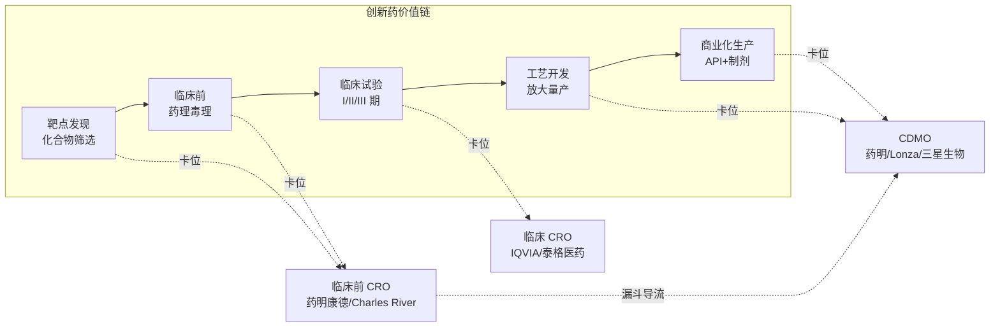

# 第 8 章　隐形的咽喉：CXO 与医药代工

一款抗体偶联药物（ADC）从设计图纸走到患者手里，要先合成毒素小分子、再造抗体、把两者偶联、做制剂灌装、跑稳定性试验。这条链上有相当一部分工序，今天落在中国长三角的几座园区里——无锡、常州、苏州、上海外高桥。做这些工序的公司，自己不持有任何一款药的专利，不卖药给患者，财报上看不到"重磅炸弹"（blockbuster，指年销售额超 10 亿美元的药品）的名字。但全世界一大半在研的新药分子，某个关键环节都要经过它们的车间。

这是一门奇特的生意。它卡在每条创新药管线的咽喉上，却又随时可能被一纸美国法案掐住自己的脖子。

## 本章概览

本章属第二部「从分子到药片：生产、外包与仿制」，讲产业链上最容易被误读的一环——CXO（医药研发生产外包，CRO + CDMO 的统称）。读者读完应当能回答三个问题：CXO 为什么是"高壁垒、中等毛利、强周期"的独立物种，而不是流通分销那种薄利搬运工，也不是创新药那种分子级暴利；它的周期由哪两个 beta 驱动；以及 BIOSECURE 这枚地缘炸弹，到底炸到了哪一步、还没炸到哪一步。守住一条红线：把"业绩高增长"和"政策尾部风险"并排放，不只讲增长，也不替未来下结论。

## 一个不造药的物种

先把名词拆清楚。CXO 是个总称，里面有几个不同的角色：

- **CRO**（Contract Research Organization，合同研究组织）：替药企做研发，又分临床前 CRO（化合物合成、药理毒理、动物实验）和临床 CRO（设计并执行人体临床试验）。
- **CDMO**（Contract Development and Manufacturing Organization，合同研发生产组织）：替药企做工艺开发 + 商业化生产，既能帮你把实验室里几克的工艺放大到几吨，也能长期代工生产上市后的药。
- **CMO**（Contract Manufacturing Organization，合同生产组织）：只做代工生产，是 CDMO 去掉"开发"那一半，附加值更低，正在被 CDMO 这个一体化概念取代。

把它们串起来看，CXO 是一条贯穿新药全生命周期的服务链。一个分子从"发现"走到"商业化生产"，每一段都可以外包出去，如图 8-1 所示。CXO 公司真正的护城河，不在某一段单点，而在能不能把这条链的多段拼起来——客户在你这里做了靶点筛选，顺手就把临床前、把工艺开发、把商业化代工都交给你，转换成本越垒越高。药明康德把这套打法叫"一体化、端到端"，本质是把研发漏斗变成自己的客户漏斗：今天的临床前小客户，可能就是五年后带着商业化大订单回来的人。

**图 8-1：CXO 在创新药价值链上的卡位**



> 图 8-1 说明：CXO 不拥有分子，但在价值链的每一段都设了收费站；一体化龙头靠"临床前导流到商业化"的漏斗结构把客户锁死。对应一手证据见 `data/08-cxo/sources.md` 中药明康德 2024/2025 业绩公告对"端到端"客户漏斗的披露。

## 不是薄利搬运，也不是分子暴利

外行容易把 CXO 归进"中间环节"，想当然认为它和流通分销一样赚个搬运辛苦钱。这是本章要纠正的第一个误判。

看一组数字。药明康德（WuXi AppTec，603259.SS / 2359.HK，全球规模最大的一体化 CXO 之一）FY2024 营收 392.41 亿元，剔除 2023 年新冠商业化大单后同口径增长 5.2%；**调整后 non-IFRS 毛利率 41.6%、调整后 non-IFRS 净利率 27.0%**（创历史新高）。这里要解释"non-IFRS"这个口径：IFRS 是国际财务报告准则下的报表数，non-IFRS（调整后）是公司把股权激励费用、并购无形资产摊销、可转债公允价值变动等非经营性项目剔除后的口径，更接近主营业务的真实盈利能力。同一家公司两套数差几个百分点很常见，引用时必须标明用的是哪一套——这是产业研究的基本纪律。

41.6% 的毛利、27% 的净利，是什么概念？流通分销的批发毛利通常低于 8%（详见第 10 章），是靠周转赚钱的薄利生意；而专利期内的创新药单品毛利能到 90% 以上，那是定价权毛利。CXO 夹在中间，但它既不是搬运工的薄利，也不是分子级的暴利——它赚的是"产能 + 工艺 know-how + 监管历史"的钱。一座通过 FDA（美国食品药品监督管理局）、EMA（欧洲药品管理局）、NMPA（中国国家药品监督管理局）多地 cGMP（现行药品生产质量管理规范）认证的产线，背后是十几年的审计记录和批次数据，新进入者要复制，得先熬过监管时间。这就是它的中等毛利能稳住的原因：壁垒不在某条产线本身，在产线背后的合规资产。

把 CXO 简单塞进"两端肥、中间瘦"的叙事里是错的。准确的说法是：研发端肥（分子级毛利 90%+，公司级因业务结构被摊到 60–86%）、支付端有肥有瘦、流通和原料药瘦，而 **CXO 单独是一类——高壁垒、中等毛利、强周期**。它的盈利结构既不像上游也不像下游，得单列。

## 三类玩家与强周期

全球 CXO 不是铁板一块，按业务侧重可以分出几类，盈利能力和周期暴露各不相同（详细口径见 `data/08-cxo/cxo_margins.csv`）。

小分子与一体化这一端，药明康德是代表。它的 FY2025 数据更能说明 CXO 的周期弹性：营收 454.6 亿元（+15.8%），持续经营业务收入 434.2 亿元（+21.4%），归母净利 191.5 亿元（**+102.6%**），调整后 non-IFRS 净利 149.6 亿元（+41.3%）、净利率升到 32.9%。一年净利翻倍，主引擎是化学业务（WuXi Chemistry，营收 364.7 亿、+25.5%）里的 TIDES 板块——多肽和寡核苷酸，2025 年收入 113.7 亿元、同比近翻倍（+96.0%）。TIDES 放量直接踩在 GLP-1 减重药这条多肽产业链上（见第 7 章），CXO 的业绩弹性，本质是它服务的下游赛道的弹性。

生物药 CDMO 这一端，看药明生物（2269.HK）和瑞士的 Lonza。药明生物 FY2025 营收 218 亿元（+16.7%），IFRS 毛利率 46.0%（同比扩张约 5 个百分点）、IFRS 净利 57 亿元（+45.3%）。Lonza（Lonza Group，全球生物药 CDMO 龙头）FY2024 销售 CHF 66 亿（按固定汇率口径基本持平，剔除已终止的新冠 mRNA 业务后底层增长约 7%），**CORE EBITDA 利润率 29.0%**——注意这是 EBITDA 口径，和药明的 non-IFRS 净利率不可直接比大小，但能看出成熟生物药 CDMO 的盈利量级。韩国的三星生物（Samsung Biologics）FY2024 营收 4.55 万亿韩元（+23%）、营业利润 1.32 万亿韩元（+19%），首次跨过 4 万亿韩元，靠的是给全球前 20 大药企里 17 家代工的超大产能。

这三类玩家的共同点，是都暴露在**两个 beta 之下，这就是 CXO "强周期"的来源**：

第一个是**融资周期 beta**。CXO 的客户大头是 biotech，biotech 烧的是一级市场和二级市场的钱。融资寒冬一来，biotech 砍管线、推迟临床，CXO 的新签订单（backlog，在手未交付订单，是收入的前瞻指标，又称订单能见度）立刻承压。反过来，融资回暖，订单能见度跟着抬升——药明康德 2024 年末持续经营 backlog 493.1 亿元（+47.0%），到 2025 年末升到 580 亿元（+28.8%），这条曲线几乎就是全球 biotech 融资景气度的镜像。

第二个是**地缘 beta**，也是本章下半场的主角。

## BIOSECURE：三个时点，别混

地缘风险的具体形态，叫 BIOSECURE Act（生物安全法案）。这是一部美国立法，核心是限制联邦机构及其承包商采购"受关注生物技术公司"（Biotechnology Companies of Concern, BCC）的设备和服务。对药明系这类高度依赖美国客户的中国 CXO 来说，它是悬在头上的剑。

这把剑现在到了哪一步？必须把三个时点切开看，混任何一个都是硬伤（如图 8-2）。

**图 8-2：BIOSECURE 三时点时间轴（区分已发生 vs 未发生）**

```mermaid
flowchart TB
    subgraph 已发生
    T1["① 2025-12-18　法案随 FY26 NDAA 签署成法<br/>【事实】不点名公司，改用 1260H 机制<br/>既有合同有 grandfather 条款"]
    T2["② 2026-06-08　DoD 更新 1260H 清单（188 家）<br/>药明康德被新增<br/>【事实】触发可能后果，非即时禁用"]
    end
    subgraph 尚未发生（高度不确定）
    T3["③ 真正商业禁用<br/>OMB 须 2026-12-18 前发 BCC 全名单<br/>→ 再 180 天指引 → FAR 修订约一年<br/>全程或近三年后才真正生效"]
    end
    T1 --> T2 --> T3
```

> 图 8-2 说明：横轴是时间，前两个节点（成法、入清单）是已发生的事实，第三个节点（真正禁用）尚未发生且时点高度不确定。三者必须分开陈述。立法时点与订单数据对照见 `data/08-cxo/biosecure_timeline.csv`。

**时点一：法律成法（2025-12-18，事实）。** 这一天，特朗普签署 FY26 国防授权法案（NDAA），BIOSECURE 作为其中条款（Section 851）正式成法。但关键变化是：**成法版不再像早期草案那样点名药明系、BGI**，而是改成一套机制——任何被美国国防部（DoD）年度 Section 1260H 清单（"中国军工企业"清单）收录、且涉及生物技术的公司，自动被视为 BCC。同时，法律为既有合同保留了 **grandfather 条款（祖父条款，即对存量合同给予过渡豁免，不溯及既往）**——但这层豁免是分档的：通过 OMB 未来流程被认定为 BCC 的公司，存量合同享有 FAR 修订后约 5 年的过渡期；而成法当日（2025-12-18）已在 1260H 清单上的公司（如 BGI、MGI）不享受这 5 年保护，禁令在 FAR 修订后 60 天即生效。药明当天不在 1260H 清单上，所以成法这一天它既不在受限名单上，也暂未落入"已列入者不豁免"这一档。

**时点二：药明康德入 1260H（2026-06-08，事实）。** DoD 更新 1260H 清单，列入 188 家企业，**药明康德（WuXi AppTec）被新增**，同批还有 BGI、MGI 等。这一步把药明从"潜在风险"推到了"机制触发点"——一旦进了 1260H，按 BIOSECURE 的逻辑就可能被认定为 BCC。药明康德回应称这一认定"错误且毫无依据"，否认与中国政府或军方有任何所有权或关联。从投资视角看，这是一个重大负面信号：风险从"点名"变成"清单机制"，反而更难预判下一步；而且按上文的分档逻辑，进了 1260H 就意味着药明走的是"FAR 修订后 60 天"这条快档，而非 OMB-BCC 的 5 年缓冲档——若 FAR 用满流程，对 1260H 企业的禁令最早也要到 2028 年中后期才生效。

**时点三：真正的商业禁用（未发生，时点高度不确定）。** 这是最容易被市场情绪带偏的一环。进了 1260H 不等于第二天就断单。后面还隔着多道行政程序：美国管理预算办公室（OMB）须在 2026-12-18 前发布 BCC 正式名单，之后还有约 180 天的实施指引期，再加上联邦采购条例（FAR）的修订，整个流程走完可能要近三年。叠加 grandfather 条款对存量合同的过渡保护，以及短期内全球替代产能根本补不上的现实，"真正断单"这件事，截至 2026-06 仍未发生，且时点高度不确定。

把三个时点摆清楚，本章的立场就出来了：**立法风险已经从"尾部"挪到了"近端"，但商业禁用仍隔着多道行政程序。** 法律已成（事实）、药明入 1260H（事实，2026-06）、何时真断单（预测，不确定）——这是三件不同的事。合理的处理方式，是把它当成地缘政治对 CXO 估值的一个长期折价因子，而不是一句"药明完蛋"的终局判决。

这个判断也有它的**证伪条件和失效时点**：如果 OMB 在 2026-12 如期发布 BCC 名单、FAR 快速修订、grandfather 豁免被收窄，那么"断单仍远"的判断就该提前作废，风险实质化的速度会快于本章预期；反过来，若药明后续被移出 1260H、或 grandfather 条款被广泛适用于存量合同，折价因子就该往后挪。所有这些都绑定"截至 2026-06"这个时点，读者在阅读时应以最新的 OMB / DoD 公告为准。

## 把增长和风险并排放

CXO 这门生意最难写的地方，就在于它的两面性同时成立、且方向相反。基本面这一侧，药明康德 FY2025 净利翻倍、backlog 创新高，增长引擎清晰（美国订单回暖 + TIDES 放量）；政策这一侧，恰恰是它越依赖美国，地缘尾部风险就越大——基本面的强项和政策的软肋指向同一个变量。这不是可以二选一的叙事，得两边都端上桌。

对投资者，可操作的框架是：把 CXO 的估值拆成"业绩 beta"和"地缘折价"两层。业绩 beta 跟着全球 biotech 融资周期和下游赛道（GLP-1、ADC）的景气度走，可以用 backlog 增速、产能利用率（产线实际开工占总产能的比例，决定 CDMO 的边际利润）、TIDES 这类高弹性板块的占比去跟踪；地缘折价跟着 BIOSECURE 的三时点走，用 OMB 名单、FAR 修订进度、grandfather 适用范围去校准。两层分开看，才不会在政策新闻一出就把基本面也一笔抹掉，或者在业绩超预期时忘了头上还悬着剑。

## 小结

CXO 是医药产业链上最容易被误读的一环。它不造自己的药，却卡在每条创新药管线的咽喉上；它不是流通那种薄利搬运，也不是分子级暴利，而是"高壁垒、中等毛利、强周期"的独立物种——药明 non-IFRS 毛利率 FY2024 41.6%、FY2025 随 TIDES 放量升至 48.2%，net 口径净利率从 FY2024 的 27.0% 升到 FY2025 的 32.9%，靠的是产能和合规资产堆出来的壁垒。它的周期由两个 beta 叠加：融资周期决定订单的厚薄，地缘政治决定估值的折价。BIOSECURE 的三个时点必须切开看——法律已成、药明入 1260H、真正断单——前两件是事实，第三件是高度不确定的预测，把它当长期折价因子，而不是终局判决。

本章独立观察：CXO 的业绩弹性，本质是它所服务的下游赛道弹性的"放大镜"。GLP-1 多肽放量，TIDES 板块就翻倍；biotech 寒冬，backlog 就掉头。它自己不下注任何一款药，却押注了整个行业的景气度——这既是它穿越单品风险的方式，也是它无法摆脱周期的根源。下一章转向更上游、毛利更薄、却同样卡着全球供应链的一环：原料药、仿制药与生物类似药。

## 配套数据

见 `data/08-cxo/`。本章用到的所有数据源详见 `data/08-cxo/sources.md`；CXO 公司毛利净利口径对齐见 `cxo_margins.csv`，BIOSECURE 立法节点与订单数据见 `biosecure_timeline.csv`。

---

> **免责声明**
>
> 本章涉及具体公司的财务分析、估值测算与产业判断，仅为作者基于公开信息的研究结果，**不构成任何投资建议**。市场有风险，投资决策应基于读者自身的独立判断和专业咨询。
>
> 本章使用的财务数据截至 2026-06，公司基本面与市场环境可能在阅读时已发生变化。BIOSECURE 立法进程、DoD 1260H 清单、OMB 名单均为快变量，本章中提到的公司股票、市值、政策时点等信息均为分析素材，作者不对其准确性、完整性或时效性作任何承诺。"断单仍隔多道程序"的判断绑定 2026-06 时点，其证伪条件（OMB 名单如期落地 + FAR 快速修订 + grandfather 收窄）一旦触发即告失效，请读者以最新 OMB / DoD 公告为准。
>
> **作者持仓披露**：截至本章数据时点（2026-06），作者未持有药明康德、药明生物、Lonza、三星生物及本章提及的其他 CXO 公司的股票或衍生品，亦无通过主题基金主动配置上述标的的意图。

---

> 本章来自《医疗经济学》开源版 · 作者「递归客」  
> 在线阅读完整书系：[inferloop.dev](https://inferloop.dev) · 反馈与勘误：[GitHub Issues](https://github.com/diguike/book-healthcare-economics/issues)
