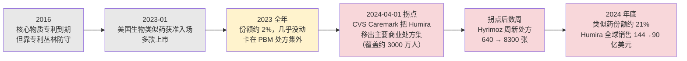

## 两个数字之间的鸿沟

印度是全世界的药房。按用量算，全球大约 20% 的仿制药出自印度，美国市场上 40% 以上的仿制药、英国约四分之一的处方药依赖印度供应；印度能生产 500 多种原料药，握着世界卫生组织（WHO）预认证原料药清单约 57% 的份额（来源：InvestIndia、IBEF、DrugPatentWatch 行业资料，2024；均为印度产业推广口径，量级可信但需视为推广性陈述）。

但把镜头从「量」切到「钱」，画面立刻反转：印度只是全球第三大原料药生产国，拿到的全球原料药价值份额大约只有 8%（来源同上）。供了全世界五分之一的药，却只分到原料药这块蛋糕的 8%。

先把原料药这个词说清楚。原料药，英文 API（Active Pharmaceutical Ingredient，活性药物成分），是药片里真正起药效的那个化合物分子本身；把它压成片、装进胶囊、灌进针剂、加上辅料和包装，才变成你在药房拿到的成品药（制剂）。一盒药的旅程里，API 是最上游的化工环节——它决定了药效，却决定不了利润。

这道「20% 的量、8% 的价值」的鸿沟，是本章要拆的第一个问题：在医疗产业链利润池里最「瘦」的几个环节——原料药、仿制药——量大价低，到底靠什么活下来。第二个问题接在它后面：当专利悬崖的另一头不再是小分子药、而是生物药时，仿冒它的「生物类似药」为什么侵蚀得更慢，这条更软的曲线，节奏由谁说了算。

第 8 章讲的 CXO 是「高壁垒、中等毛利、强周期」的独立物种，它替别人造药、靠技术和产能议价。这一章的主角不一样：它们造的是已经过了专利期、人人都能造的药，红海里拼的不是技术独占，而是成本、合规文号和规模。同样在产业链「中间」，CXO 是胖生意，原料药和仿制药是真正的薄利环节。

## 原料药：成本与合规文号的生意

原料药的商业模式可以一句话概括：这是一门把化工产能、环保合规和监管文号攒在一起、按吨卖分子的生意。它没有品牌、没有专利溢价，客户（仿制药厂）只问三件事——纯度达不达标、价格够不够低、文号全不全。

文号是这门生意真正的门槛。一家原料药厂要把产品卖进美国市场，得先向 FDA 提交 DMF（Drug Master File，药品主文件），把生产工艺、质控、杂质谱等机密资料备案；仿制药厂在申报时引用这份 DMF，FDA 才会去核查这家原料药厂的工厂。叠加 cGMP（current Good Manufacturing Practice，现行药品生产质量管理规范）的现场检查，一张能供美国市场的原料药「准入证」可能要熬上几年。文号和合规记录是原料药厂的护城河——但这条护城河护住的不是高毛利，而是「能不能进场」的资格。进场之后，价格战照打不误。

印度的 8% 之谜，根子在这里。印度仿制药工业极其发达，却在更上游的原料药和关键中间体上高度依赖中国进口——某些品类的中间体对华依赖度被业界估到六七成（来源：Praxis、印度产业研究，2024，口径分歧大）。印度赚的是「把便宜的中间体加工成 API、再做成制剂卖向全球」的中段加工费，而附加值更低、更脏更耗能、被环保和成本压到中国手里的那段，恰恰是价值占比的大头。这不是「卡脖子」一个词能解释的产业分工，而是利润沿着化工链条逐级分配的结果：越往上游越脏、越同质、越没有定价权。印度政府 2020 年起用 PLI（生产挂钩激励）补贴往上游补这一课，但短期改写不了价值分配（来源：印度商工部 PLI 计划公告，2020 起）。

原料药厂能不能赚钱，几乎不取决于毛利率高低，而取决于三件事：开工率（固定资产摊薄）、环保合规成本、以及有没有卡住几个高壁垒品种（发酵类、手性合成、专利刚到期的「新仿」原料药能短暂享受溢价）。中国这个全球最大原料药供应国的供给格局，正是被环保收紧一轮轮筛过的：2017 年起的「蓝天保卫战」和环保督察关停了一批小、散、污的原料药厂（仅河北等化工集群就关停约 145 家），合规成本抬升把产能往大厂集中，头部集中度随之上升（来源：C&EN 2018-02、APIFDF 行业分析）。这种产能洗牌直接传导到价格：2023 年中国原料药出口量同比涨 5.4%、出口额却跌 20.6% 到约 409 亿美元（来源：中国医保商会口径，ECHEMI/APIFDF 转述）——量增价跌，是这门生意「靠周转和成本曲线赚钱、而不是靠毛利」的典型周期成长股写照。

## 仿制药：专利悬崖另一头的红海

往下游走一步是仿制药。仿制药（generic）是原研药专利到期后，别家药厂仿制的同成分、同剂量、同疗效的药。它和原研的关系，在第 25 章会从专利悬崖的角度细讲，这里只需记住一个因果：原研药的专利一到期，仿制药蜂拥而入，原研的价格和销量在很短时间里塌掉——这就是小分子药的「专利悬崖」。仿制药厂是站在悬崖另一头接盘的人。

接盘的入场券叫 ANDA（Abbreviated New Drug Application，简略新药申请）。和原研要做完整临床试验不同，仿制药厂只需向 FDA 证明自己的产品与原研「生物等效」（体内吸收曲线一致），不必重做疗效和安全性试验——这是 1984 年美国《Hatch-Waxman 法案》立下的制度，用「省掉重复临床」换「专利到期后快速放量」，是现代仿制药工业的地基。

但 ANDA 门槛低，恰恰意味着没有壁垒。FDA 自己的数据把这门生意的残酷画得很清楚：一个仿制药品种只有 1 家仿制厂时，价格平均只比原研低约 39%；出现第 2 家，价格就掉到原研的一半左右；当竞争者达到 6 家以上，平均价格相对原研的降幅超过 95%，也就是只剩原研价的不到一成甚至更低（来源：FDA《Generic Competition and Drug Prices》分析）。这条曲线就是仿制药的命运——谁都能造，于是大家把价格一路砸到接近边际成本。美国仿制药占了约 90% 的处方量，却只占处方药总支出的约 12%（来源：AAM《2024 U.S. Generic & Biosimilar Medicines Savings Report》，2025-01）。量极大，价极薄。

在这条红海里，仿制药厂只有三条路把毛利从地板上抠起来：

**第一条，抢首仿，吃 180 天独占。** 美国给第一个成功挑战原研专利的仿制药厂 180 天的市场独占期（first-to-file exclusivity，即首仿 180 天独占），这半年里只有它和原研两家在卖，价格还没被砸穿，是仿制药厂少有的「高毛利窗口」。但这是一锤子买卖，独占期一过，后来者涌入，价格立刻跌进上面那条曲线。

**第二条，做复杂仿制药。** 不是所有药都好仿。缓控释制剂、吸入剂、长效针剂、复杂注射剂，生物等效性难做、工艺壁垒高、申报常被 FDA 反复要求补数据，能仿出来的厂家就那么几家，价格战不至于打到见底。复杂仿制药是仿制药里为数不多还能讲「壁垒」的细分。

**第三条，干脆自己做创新药。** 这是头部仿制药厂的集体选择，最典型的样本是 Teva（梯瓦，Teva Pharmaceutical，TEVA：全球最大的仿制药企业，总部在以色列，近年向创新药转型）。

Teva 的 2024 财报把仿制药的盈利结构摊得很清楚。全年总收入 165.44 亿美元，美国区收入 80.34 亿，其中纯仿制药业务 35.99 亿（来源：Teva FY2024 业绩公告，2025-01-29）。公司层面的毛利率，GAAP 口径 48.7%、Non-GAAP 口径 53.3%（同一家公司两套口径差 4.6 个百分点，本章以下一律 GAAP 与 Non-GAAP 并列给出，便于读者自行比较）。这个「将近五成」的毛利率乍看不低，但它是被两样东西拉上去的：一是 Revlimid（来那度胺 lenalidomide）这类靠和原研和解、限量供应的复杂仿制药；二是 Teva 自己的创新药——治疗迟发性运动障碍的 AUSTEDO（氘代丁苯那嗪），2024 年单品卖了 16.42 亿美元，比整个美国纯仿制药板块还能打。把这些高毛利品种剥掉，纯仿制药的毛利会落到比公司均值低得多的水平。

更要命的是从毛利到净利的塌陷。Teva 2024 年 GAAP 口径其实是经营亏损 3.03 亿美元（经营利润率 −1.8%），原因是当年计提了约 25.5 亿美元的商誉和资产减值；Non-GAAP 口径才显出 26.2% 的经营利润率（43.29 亿美元）（来源同上）。这种「Non-GAAP 体面、GAAP 难看」的财报，在仿制药行业是常态——大额减值、专利诉讼和解、债务利息，常年啃食薄毛利攒下的那点利润。

把原料药和仿制药放在一起看（如表 9-1 所示），它们共享同一套生存逻辑：毛利不是靠产品独占撑起来的，而是靠规模、文号/独占、复杂工艺这几样壁垒，把价格战的底线托高一点点，再靠周转和成本控制把薄毛利变成正现金流。这和研发端「一个专利分子毛利 90%+」是两门完全不同的生意。

| 环节 | 代表玩家 | 毛利/盈利（口径 + 时点） | 壁垒类型 | 主要风险 |
|------|---------|----------------------|---------|---------|
| 原料药 API | Sun Pharma、Aurobindo、Divi's（印度）；华海、普洛（中国） | 无单一口径；印度仅占全球 API 价值约 8%（量约 20%），价值集中在更上游 | DMF/cGMP 文号、成本曲线、环保合规 | 价格战、环保限产、对华中间体依赖 |
| 仿制药 generic | Teva、Viatris（迈兰 Mylan 与辉瑞 Upjohn 业务 2020 年合并而成）、印度龙头 | Teva 公司毛利 GAAP 48.7% / Non-GAAP 53.3%（2024）；GAAP 经营亏损、Non-GAAP 经营利润率 26.2% | 首仿 180 天独占、复杂仿制工艺、规模 | 6 家竞争即降价 >95%、价格通缩、集采 |
| 生物类似药 biosimilar | Sandoz、Amgen、Samsung Bioepis（三星生物与渤健合资的生物类似药公司）、Organon | 开发成本远高于小分子仿制（单品开发常 1–3 亿美元级），毛利介于创新与仿制之间 | 生产工艺壁垒、PBM 处方集准入、处方惯性 | 渗透慢、返利博弈、定价侵蚀 |

表 9-1：原料药、仿制药、生物类似药的毛利与壁垒对照（口径见各行；Teva 数据来源 Teva FY2024 业绩公告 2025-01-29，印度 API 份额来源 InvestIndia/IBEF 行业资料 2024，生物类似药开发成本为行业区间估计。三环共性：靠规模与壁垒而非毛利独占赚钱）

## 生物类似药：为什么是缓坡，不是悬崖

把仿制药的逻辑搬到生物药身上，会立刻撞墙。

小分子药是确定结构的化合物，仿制者能造出分子量、纯度完全一致的复制品，所以叫「generic」（等同）。生物药是活细胞培养出来的大分子蛋白（抗体、融合蛋白等），结构复杂、对生产工艺极度敏感，不同厂家造出来的「仿制品」无法做到分子级别完全一致，只能做到「高度相似、临床上无有意义差异」——所以它叫 biosimilar（生物类似药），而不是 generic。一个字的差别，背后是两套完全不同的经济学。

这套不同的经济学，最直观的表现就是侵蚀速度。小分子专利一到期，6 家仿制厂涌入、价格半年内塌掉 95%，是一道悬崖；生物类似药则是一道缓坡——它来得慢、降价也慢，原研往往还能在专利「到期」后多收割好几年。

读者很容易在这里被一个似是而非的解释带偏：把「可互换性认证」当成生物类似药迟迟铺不开的壁垒。这个理解在 2024 年之前还说得通，现在已经过时，必须更正。

先解释什么是可互换性。可互换性（interchangeability）是 FDA 给生物类似药的一个额外认定：拿到这个认定，药剂师可以在不通知开方医生的情况下，直接把原研换成生物类似药（就像小分子仿制药那样在药房柜台自动替换）。早年要拿这个认定，厂家得额外做「反复切换」（switching）临床研究，证明在原研和类似药之间来回换不会出问题——这确实曾是一道额外成本和时间门槛。

但 FDA 在 2024 年 6 月 20 日发布的指南草案里，取消了可互换性所需的切换研究要求：厂家不必再做切换试验，只要论证已有的分析和临床数据足以支撑即可（来源：FDA 互换性指南草案，2024-06-20；FTC 2024-08 提交支持意见）。到 2025 年底，FDA 进一步释放信号，准备把「生物相似性」和「可互换性」两个标准合并，让所有获批的生物类似药事实上都具备可互换地位（来源：Jones Day 分析，2025-12）。换句话说，可互换性这道门槛正在被监管主动拆掉——它已经不是生物类似药的结构性壁垒，再拿它解释「侵蚀慢」就站不住了。

那真正让生物类似药变成缓坡的，是另外三样东西：

**一是生产工艺壁垒。** 造一个生物类似药要从头建细胞株、跑工艺、做可比性研究，单品开发动辄烧掉一到三亿美元、花上五到八年，远不是小分子 ANDA 那种「证明生物等效就行」的轻资产打法。高开发成本天然限制了入场玩家数量——一个生物药专利到期，对应的不是 6 家仿制厂涌入，常常只有两三家生物类似药能跟上。竞争者少，价格自然塌得慢。

**二、也是真正的总开关——PBM 处方集。** 在美国，一个生物类似药能不能放量，不取决于它获批了没有，而取决于 PBM（药品福利管理机构，替保险公司决定哪些药能报销的中间人，详见第 12 章）愿不愿意把它放进处方集、把原研踢出去。原研厂深谙此道：它用高列表价换来的高返利，反过来「贿赂」PBM 把自己留在处方集里——生物类似药就算定价更低，只要进不了处方集，医生开不出、患者报不了，份额就起不来。

**三是处方惯性。** 生物药多是慢性病、肿瘤、自免领域的长期用药，医生和患者对用惯了的原研有路径依赖，换药顾虑比吞一片仿制片高得多。

把这三样叠起来，专利「丛林」还要再添一道延缓。专利丛林（patent thicket）指原研厂围着一个产品申请几十上百项外围专利（剂型、用法、生产工艺、适应症），织成一张密不透风的网，把生物类似药的入场时间一拖再拖。这套打法的教科书案例，就是 Humira。

## Humira：一条被 PBM 一脚踹下的曲线

Humira（修美乐，阿达木单抗 adalimumab，TNF-α（肿瘤坏死因子 alpha）抑制剂，用于类风湿关节炎等多种自身免疫病）是 AbbVie（艾伯维，ABBV：从雅培分拆出的生物制药公司，长期靠 Humira 单品撑营收）的当家药，长年是全球药王，2022 年全球销售见顶时约 212 亿美元（来源：AbbVie FY2022 全年业绩公告，2023-02）。它的核心物质专利其实 2016 年就到期了，但 AbbVie 围着 Humira 申请了约 247 项专利申请（其中约九成在产品上市后才递交），织成的专利丛林硬是把美国生物类似药的入场时间拖到 2023 年 1 月（来源：I-MAK 2020/2021 Humira 专利报告）。这本身就是「专利到期≠失去独占」的活教材。

更说明问题的是 2023 年生物类似药终于获准入场后的曲线形状。第一年（2023）几乎没动——多款生物类似药上市了，却卡在 PBM 处方集外面，份额纹丝不动。Humira 2023 年全球销售 144.04 亿美元，靠的就是处方惯性和原研留在处方集里的惯性。

真正的拐点不是专利到期，而是一份处方集决定。2024 年 4 月 1 日，PBM 巨头 CVS Caremark 把 Humira 从它覆盖约 3000 万人的主要全国商业处方集里剔除，换上生物类似药 Hyrimoz（来源：Crain's Chicago Business、BioSpace，2024-04）。开关一拨，水流瞬间改向：Hyrimoz 的新处方量在一周内从 3 月底的约 640 张跳到 4 月初的约 8300 张（来源：BioSpace 援引处方数据，2024）。到 2024 年底，Humira 生物类似药的市场份额从 2023 年的约 2% 冲到约 21%（来源：AAM 2024 报告，2025-01）。

反映到 AbbVie 的财报上：Humira 全球销售从 2023 年的 144.04 亿美元砍到 2024 年的 89.93 亿美元；2024 年第四季度，美国区 Humira 收入同比骤降 54.5%（来源：AbbVie FY2024 业绩公告，2025-01-31）。从 2022 年的 212 亿到 2024 年的 90 亿，两年蒸发约六成——但请注意这道曲线的形状：专利 2016 年到期，类似药 2023 年才入场，2023 年几乎没掉，真正的陡降发生在 2024 年 PBM 出手之后（如图 9-2 所示）。

图 9-2：Humira 生物类似药侵蚀曲线（数据来源：AbbVie FY2022–FY2024 业绩公告、AAM 2024 报告、Crain's/BioSpace 2024）。关键读法：侵蚀的节奏由 PBM 处方集而非专利到期决定——专利 2016 年就到期，份额却一直按兵不动，直到 2024-04 CVS 处方集一脚踹下去才陡降。这是生物药专利悬崖比小分子「更软、更可被运营延缓」的根因

这条曲线给生物药专利悬崖定了一个完全不同于小分子的节奏。小分子专利一到期，价格半年塌九成，原研无力回天；生物药专利到期后，原研还能靠专利丛林、PBM 返利、处方惯性多守几年——侵蚀什么时候从温水变陡崖，主动权握在 PBM 手里，不在日历上的专利到期日。这个判断在第 25 章谈 2026–2030 专利悬崖墙时会反复用到：那一波到期主力正从小分子转向生物药（Stelara、Eylea、Keytruda/Opdivo 等），意味着「悬崖」更可能是一道道被运营节奏拉长的「缓坡」，而每道缓坡的转折点，都藏在某家 PBM 某一年的处方集调整里。

放大到整个市场，生物类似药省下的钱正在快速累积但远未饱和：2024 年单年为美国医疗体系省下约 202 亿美元，2015 年首个生物类似药上市以来累计约 562 亿美元（来源：AAM 2024 报告，2025-01）。但渗透极不均衡——生物类似药的平均市场份额只有约 40%，单品差异巨大，从胰岛素赖脯（lispro）的约 8% 到贝伐珠单抗的约 82% 不等（来源同上）。未来十年约有 118 个生物药将失去独占、对应约 2340 亿美元的生物类似药机会，但目前只有 12 个分子有在研的生物类似药跟进（来源同上）。118 对 12 这个缺口不是疏忽，而是经济账算出来的结果：单品开发要烧一到三亿美元、耗五到八年，回报又被 PBM 处方集和返利博弈压着，只有原研销售体量足够大的少数「明星分子」才让投入产出算得过来，剩下的中小生物药即便专利到期，也未必有人愿意去仿。供给端这个巨大的缺口，本身就说明生物类似药的开发壁垒之高——它远不是小分子仿制药那种「专利一到、应者云集」的红海，更像一门玩家稀少、节奏被支付方掐着的慢生意。

## 小结

- 原料药和仿制药是医疗产业链里最「瘦」的两环：印度供了全球 20% 的仿制药用量却只拿到 8% 的原料药价值，根子在价值沿化工链逐级分配、越上游越没有定价权。这两环靠规模、文号/独占、复杂工艺这些壁垒把价格战的底线托高，再靠周转和成本控制把薄毛利变成正现金流，而不是靠毛利独占赚钱。
- Teva 的 2024 财报是仿制药盈利结构的样本：公司毛利将近五成（GAAP 48.7% / Non-GAAP 53.3%，两套口径必须分清），却被复杂仿制药和自有创新药 AUSTEDO 拉高；纯仿制板块毛利远低于此，且 GAAP 口径因大额减值录得经营亏损。仿制药的命运由 FDA 那条「6 家竞争降价超 95%」的曲线决定。
- 生物类似药对生物药专利悬崖的侵蚀是缓坡而非悬崖。要更正一个流行误读：可互换性认证已不再是壁垒——FDA 2024 年 6 月起取消了切换研究要求，2025 年底进一步拟合并标准。真正让侵蚀变慢的是生产工艺壁垒、PBM 处方集准入和处方惯性这三样，其中 PBM 处方集是总开关。
- Humira 是这套机制的活教材：核心专利 2016 年就到期、类似药 2023 年入场却几乎没动，直到 2024 年 4 月 CVS Caremark 把它移出处方集，份额才从约 2% 一年冲到约 21%、全球销售两年从 212 亿砍到 90 亿。侵蚀的节奏由处方集而非日历决定。
- 这条「软悬崖」的判断会在第 25 章谈专利悬崖墙时承重：2026–2030 到期主力正从小分子转向生物药，意味着那一波「悬崖」更可能被运营节奏拉成一道道缓坡。下一章往下游再走一步，去看比仿制药还薄的流通环节——美国三大药品分销商控着九成市场，经营利润率却只有 1%–3%，「寡头集中」为什么不等于「利润肥」。

---

> **免责声明**
>
> 本章涉及具体公司的财务分析、估值测算与产业判断，仅为作者基于公开信息的研究结果，**不构成任何投资建议**。市场有风险，投资决策应基于读者自身的独立判断和专业咨询。
>
> 本章使用的财务数据截至 2026-05，公司基本面与市场环境可能在阅读时已发生变化。本章中提到的公司股票、估值倍数、销售数据等信息均为分析素材，作者不对其准确性、完整性或时效性作任何承诺。
>
> **作者持仓披露**：截至本章数据时点（2026-05），作者未持有 Teva（TEVA）、AbbVie（ABBV）及本章提及的任何印度仿制药龙头、生物类似药企业的股票或衍生品。

## 配套数据

见 `data/09-api-generics/`。本章用到的所有数据源、采集时点与口径详见 `data/09-api-generics/sources.md`；三环毛利对照见 `api_generics_margins.csv`，Humira 生物类似药侵蚀节奏见 `biosimilar_erosion.csv`。

---

> 本章来自《医疗经济学》开源版 · 作者「递归客」  
> 在线阅读完整书系：[inferloop.dev](https://inferloop.dev) · 反馈与勘误：[GitHub Issues](https://github.com/diguike/book-healthcare-economics/issues)
