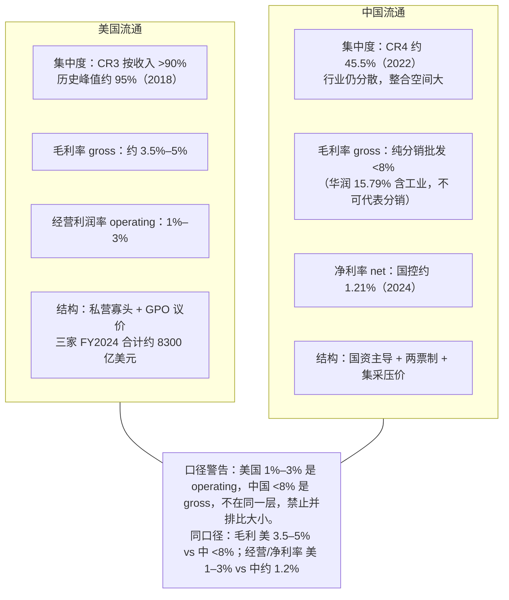
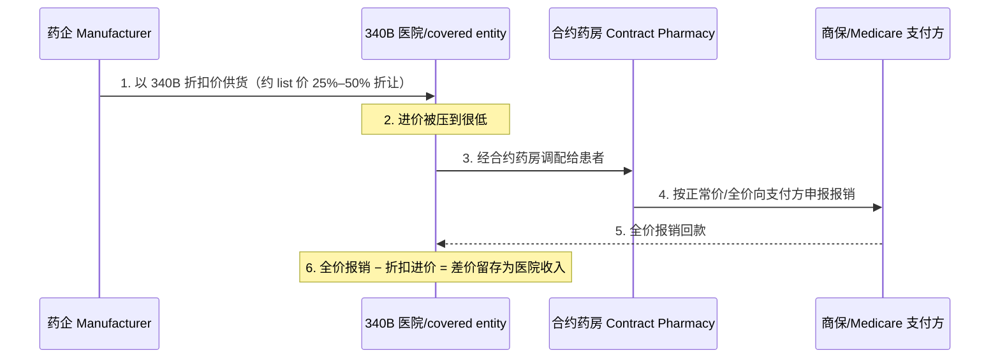

## 本章概览

前面几章讲了药怎么造出来：靶点、临床、CXO、原料药与仿制药。一盒药做好了、获批了，下一个问题是怎么从工厂搬到患者手里。这一段路由分销商（distributor，从药厂进货、再卖给医院和药房的中间批发环节，自己不生产药）跑完。

这一章只解决一个认知误区，但它足够重要：**寡头集中不等于利润肥**。美国药品分销是教科书级的寡头——三家公司控着九成市场，但它们的经营利润率只有 1% 到 3%，薄得像物流公司。很多人看产业链时下意识地把"集中度高"读成"赚钱多"，在分销这一环上，这个直觉是错的。

本章拆三件事：美国三大分销商为什么集中却不肥；中国流通为什么集中度低得多、薄利的口径又和美国不一样（这里有一个最容易被并排比错的数据陷阱）；以及一个把美国医院和肿瘤科渠道彻底搅乱的折扣项目——340B。读完这一章，你会对"中间商"这个词多一层警惕：有的中间商（下一部要讲的 PBM）确实在收租，有的中间商（本章的分销商）只是在搬箱子。把这两种生意分开，是看懂整条产业链利润分布的前提。

本章讲的是行业结构与利润率，不涉及具体公司的估值判断与多空，不含投资建议。

## 钩子：控着九成市场，利润率却只有个位数的零头

先看一组对不上直觉的数字。

美国药品分销由三家公司主导：McKesson（MCK，美国最大药品分销商，FY2024 营收约 3090 亿美元）、Cencora（COR，原 AmerisourceBergen，FY2024 营收约 2940 亿美元）、Cardinal Health（CAH，FY2024 营收约 2268 亿美元）。三家财年口径不完全对齐（McKesson 截至 3 月、Cardinal 截至 6 月、Cencora 截至 9 月），合计营收约 8300 亿美元【事实，来源：三家 FY2024 8-K】。按收入口径，它们合计控制美国药品分销 **90% 以上**，历史峰值（2018 年口径）约 **95%**【事实，来源：IntuitionLabs 引用三家年报】。

这是任何反垄断教科书都会标红的集中度——CR3（行业前三名的市场份额合计，concentration ratio of top 3）超过 90%。常识会接着推断：三家分掉九成市场，定价权应该很强，利润应该很厚。

数字给的是相反的答案。McKesson FY2024 的 GAAP 经营利润率（operating margin，经营利润 ÷ 营收，反映主营业务赚钱效率）约 **1.26%**；Cardinal FY2024 的 non-GAAP 经营利润率约 **1.06%**（经营利润 24 亿美元 ÷ 营收 2268 亿美元）；Cencora FY2024 调整后经营利润率约 **1.22%**（调整后经营利润 36 亿美元 ÷ 营收 2940 亿美元）【事实，来源：三家 FY2024 8-K】。三家都在 1% 出头到 3% 之间，行业里管这叫 razor-thin（薄如剃刀）。

一家控着九成市场的寡头，每搬运 100 美元的药，最后落到经营利润里的只有 1 到 3 美元。这就是本章要讲透的那件事。

## 寡头集中，为什么没换来肥利润

把"集中"和"肥"画等号，是产业链分析里最常见的一类误判。要拆开它，得先分清两个常被混用的利润率口径。

- **毛利率（gross margin）**：(营收 − 销货成本) ÷ 营收。对分销商，销货成本就是从药厂进货的价钱，毛利约等于"卖价比进价高出多少"。
- **经营利润率（operating margin）**：毛利再扣掉仓储、运输、IT、人力等所有运营开支之后，剩下的占营收比例。

分销是个典型的"毛利已经很薄、经营利润更薄"的生意。McKesson FY2024 的毛利率约 4.15%，扣掉庞大的物流和管理费用，经营利润率降到 1.26%【事实，来源：McKesson FY2024 10-K】。这两个数字之间的差距，就是把一盒药从药厂仓库搬到几万家药房所烧掉的钱。

集中度高为什么没能把这条线撑起来，有三个结构性原因。

**第一，分销商卖的是别人的药，自己几乎不创造价值。** 药的定价权在上游药厂（专利期内的创新药），分销商只是中间的物流和资金通道。它议价的对象——药厂——手里攥着患者非买不可的产品，分销商没法在采购端压价太狠。它能赚的，是流通环节那一层薄薄的服务费和价差。

**第二，下游的买方一样集中、一样强势。** 美国药品的真正买方不是零散的小药店，而是连锁药房（CVS、Walgreens）、大型 GPO（Group Purchasing Organization，集团采购组织，把众多医院、药房的采购需求聚合起来集中向上游压价的中介）和医院系统。这些买方体量巨大、自己就是寡头，分销商面对它们没有定价优势。上游是攥着专利的药厂，下游是抱团采购的 GPO 和连锁药房，分销商被夹在两个寡头之间，利润空间被两头挤薄。集中度高反而招来更激烈的三家互相杀价——客户就那么几个大的，丢一个伤筋动骨。

**第三，品类结构在持续通缩。** 分销商的"价差"在仿制药上更依赖采购规模返点，而仿制药价格长期下行（第 9 章讲过的价格通缩）。Drug Channels Institute 的数据显示，2015 至 2019 年间美国三大分销商收入增长超过 1000 亿美元，但分销环节的毛利美元总额因仿制药通缩与阿片用量下降反而下降约 12%——美国药品分销的核心毛利率在 2015 年见顶后已连续五年下滑【事实，来源：Drug Channels Institute《2019-20 Economic Report on Pharmaceutical Wholesalers》】。规模在涨，单位利润在缩，这是薄利生意的常态。

把这三条合起来：分销商的护城河（寡头规模 + 全国物流网络 + 与药厂的长期合约）是真的，能挡住新进入者；但护城河挡得住竞争，挡不住"上下游都比你强、你只是个搬运工"这个根本约束。**它的壁垒保的是"市场份额不丢"，不是"利润率很高"。** 这是分销和下一部要讲的 PBM（Pharmacy Benefit Manager，药品福利管理机构，美国医保链上掌管处方集与药企返利的中间方，第 12 章详展）最本质的区别——PBM 同样集中，但它卡在处方集（formulary，医保/PBM 规定的可报销药品清单）这个咽喉上，能向药厂收返利、向支付方收价差，那是收租的生意；分销商卡在物流上，物流是可计价、可比价、可外包的，收不上租。

【独立观察】判断一个"中间商"环节肥不肥，不能看它的集中度，要看它**有没有定价权、上下游谁更强、它创造的价值能不能被替代**。分销商三项都输：没有产品定价权、上下游都是寡头、物流可替代。集中度只是它在一个薄利赛道里活下来的结果，不是它能收厚利的原因。下次看到"某环节 CR3 高达 XX%"就联想到"高利润"，先停一下，问一句这环节到底卡在谁的咽喉上。

## 中美对照：同是薄利，口径完全不同

中国的药品流通也薄，但薄的方式和数字口径都和美国不一样，放在一起比之前必须先把口径对齐，否则会比出完全错误的结论。

中国三大流通龙头 2024 年营收：国药控股（1099.HK，央企背景、全国分销网络最广）约 5845 亿元、上海医药（601607.SS）约 2752.51 亿元、华润医药（3320.HK）约 2576.73 亿元【事实，来源：各家 2024 年报，2025-04】。但集中度远低于美国：2022 年口径，国控 + 上药 + 华润 + 九州通四家合计 CR4（前四名份额合计）仅约 **45.5%**，对比美国 CR3 超过 90%【事实，来源：前瞻产业研究院】。中国流通是"大公司很大、但行业很散"，整合空间还很长。

这种分散有历史原因，也有政策推手。**两票制**（药品从生产企业到流通企业开一次发票、从流通企业到医院再开一次发票，合计两票）是 2017 年前后全面推行的政策，目的是砍掉过去多级代理层层加价、层层开票的灰色空间。它压缩了流通环节的加价层级，把过去靠"过票"赚差价的小代理商挤出局，客观上加速了向大流通商集中——但起点太散，到今天 CR4 也才四成多。

关键的口径陷阱在毛利率。华润医药 2024 年整体毛利率约 15.79%，看起来比美国分销商高出一大截【事实，来源：华润医药 2024 年报】。但这个数字**不能拿来和美国分销商并排比**，原因有二。

其一，华润这 15.79% 是**含医药工业**的——华润医药有自己的制药板块（自产药品），工业毛利远高于分销，把整体毛利率拉高了。剥掉工业、只看纯分销批发，中国流通龙头的毛利率不足 8%，在集采压价下已逼近 6% 的"生死线"【事实，来源：医药经济报、前瞻产业研究院，2025-04】。

其二，也是更要命的一点：**美国那个 1%–3% 是经营利润率（operating margin），中国这个 <8% 是毛利率（gross margin），两者根本不是同一层的数**。毛利率在经营利润率之上好几层，拿中国的毛利率去比美国的经营利润率，等于拿"扣费用前"比"扣费用后"，必然得出"中国流通毛利更厚"的错误印象。

要比就得同口径比（如图 10-1 所示）：

- **都看毛利率（gross）**：美国分销商约 3.5%–5%，中国纯分销批发不足 8%。中国略高，但都很薄。
- **都看经营/净利率（operating/net）**：美国分销商经营利润率 1%–3%；中国看净利率，国药控股 2024 年归母净利约 70.50 亿元、营收 5845 亿元，净利率约 **1.21%**【事实，来源：国控 2024 年报】，和美国分销商的经营利润率落在同一个量级。

**图 10-1：中美药品流通结构与利润率口径对照（gross 与 operating 必须分层看，不可并排）**
（数据来源：美国侧 McKesson/Cencora/Cardinal FY2024 8-K + IntuitionLabs；中国侧国控/上药/华润 2024 年报 + 前瞻产业研究院）

把口径对齐之后，结论才站得住：**中美流通都是薄利生意，差别不在"谁更肥"，而在结构**——美国已经整合到位、靠寡头规模守住份额，中国还在分散、靠国资牌照和两票制慢慢集中。对投资者，这两个市场的看点完全不同：美国分销商看的是周转效率、阿片诉讼赔付（三大分销商 2022 年与各州达成的阿片类药物全国和解协议，约定最多约 210 亿美元、分 18 年支付，是悬在利润表上的长期负担）和亚马逊会不会入场，中国流通商看的是整合速度、集采对批发毛利的进一步挤压，以及应收账款账期（医院回款慢，流通商垫资）带来的现金流压力。

值得单独提一句的是**两票制的副产品**：流通商被压缩了传统过票价差后，往利润更高的服务环节走，催生了 DTP（Direct-to-Patient，直接面向患者的院外特药药房，专卖医院开了处方但院内不备货的高价创新药、肿瘤药）这类新业态。这是流通商在薄利环境里找新毛利的动作，第 11 章讲终端业态时会展开。

## 340B：一个把折扣变成利润的项目

讲完"分销商不肥"，要补一个反向的例子：在美国，有一个折扣项目让某一类机构在药品渠道上拿到了真金白银的好处——不是分销商，而是医院。这就是 **340B**。

340B 是美国 1992 年立法设立的药品折扣项目（得名于公共卫生服务法第 340B 节）。规则很简单：药企要想让自己的药进入医保（Medicaid，美国联邦与各州共同出资、面向低收入人群的公共医保）和 Medicare Part B（联邦面向老年人的医保中覆盖门诊注射类药物的部分）报销，就必须以**大幅折扣价**（ceiling price，约等于平均制造商价格扣减法定返利，折扣常达列表价的 25%–50%、有时更深）卖给特定的 "covered entities"（符合资格的医疗机构，主要是服务低收入人群的安全网医院、社区卫生中心等）。立法的初衷是让服务穷人的医院能用更便宜的药。

机制的扭曲点在于：**医院用 340B 折扣价买进药，但给商业保险或 Medicare 病人用这些药时，是按正常价（甚至全价）报销的，中间的差价归医院留存。** 政策没有要求这笔差价必须返还给患者或用于救助穷人——医院可以把它当作收入。于是一个本意是"让穷人用得起药"的折扣项目，变成了医院的一块利润池（如图 10-2 所示）。

**图 10-2：340B 资金流向——折扣进价、全价报销、差价留存**
（机制依据：公共卫生服务法第 340B 节、HRSA 项目规则；金额口径见 Drug Channels 2024-10）

这个项目的规模已经大到显著改变了美国药品渠道的利润分配格局。2023 年，340B 机构按折扣价采购的药品总额达到 **663 亿美元**，同比增长 23.4%（2022 年为 537 亿美元）【事实，来源：Drug Channels 引用 HRSA/Apexus 数据，2024-10】。如果同一批药按列表价（WAC，wholesale acquisition cost，批发采购成本/挂牌价）计价，价值约为 **1241 亿美元**——两者相减，列表价与折扣价之间约 **578 亿美元**的差额，是 340B 机构折扣留存的理论上限（按 WAC 口径测算，真实留存还取决于各机构的实际报销价，通常低于此上限）【推算，基于 Drug Channels 的 WAC 与折扣采购额，2024-10】。其中医院类机构占了 2023 年采购的约 **87%**【事实，来源：Drug Channels，2024-10】。这个折扣总额比第 12 章要讲的 PBM 返利体量小，但增速更快，已经和 PBM 并列成为扭曲美国药品渠道的两大力量之一。

340B 对产业链的实际影响有三层。

**渠道层面**，它把肿瘤科彻底改写。肿瘤药单价极高，340B 折扣的绝对金额也最大，医院因此有强烈动机把肿瘤治疗收进自己的 340B 体系——这推动了过去十几年美国独立肿瘤诊所被医院系统大量收购的浪潮。同一支化疗药，在医院门诊（享受 340B 折扣 + 较高的门诊报销）和在独立诊所（无 340B）的经济账完全不同，渠道因此向医院倾斜。

**机构层面**，它催生了庞大的"合约药房"（contract pharmacy，医院把 340B 药品的实际调配外包给的零售药房）网络。医院本身的院内药房有限，靠合约药房把 340B 折扣的覆盖面铺到全国零售端，是过去十年 340B 规模暴涨的主要推手。

**博弈层面**，药企在反扑。截至 2026 年，已有约 **40 家**药企对合约药房安排施加 340B 供货限制，理由是项目偏离初衷、被滥用【事实，来源：Jones Day / Quarles 法律综述】。HRSA（Health Resources and Services Administration，美国卫生资源与服务局，负责管理和监管 340B 项目）起诉过这些药企，但 2024 年华盛顿特区联邦巡回上诉法院裁定药企有权对合约药房渠道施加部分限制【事实，来源：Foley Hoag 法律分析，2024】。作为回应，2024 年又有六个州（堪萨斯、马里兰、明尼苏达、密西西比、密苏里、西弗吉尼亚）立法保护合约药房【事实，来源：Quarles 法律综述】。这是一场仍在打的拉锯战，没有定论。

【分析】340B 是理解美国药品渠道的一把钥匙：它说明在美国，**药价从来不是一个价，而是一串价**——同一支药，340B 机构进价是一个数、商保报销又是另一个数，差价被谁留住决定了渠道往哪个方向流。分销商在这条链上依旧只赚搬运费，真正吃到折扣红利的是医院。这也再次印证本章的主题：在医药流通里，谁卡在咽喉上、谁能把折扣或返利留下来，才决定肥瘦；体量大、集中度高，都不是答案。

## 小结

- 美国药品分销是寡头中的寡头：McKesson、Cencora、Cardinal 三家按收入控制 90% 以上（峰值约 95%），但经营利润率只有 1%–3%。**寡头集中不等于利润肥**，这是产业链分析最常见的误判之一。
- 分销薄利的根因是结构：上游是攥着专利定价权的药厂，下游是抱团压价的 GPO 和连锁药房，分销商夹在两个寡头之间只赚搬运费；它的护城河保的是"份额不丢"，不是"利润率高"。判断中间商肥瘦，要看定价权和咽喉位置，不是看集中度。
- 中美流通都薄，但口径不能并排比：美国的 1%–3% 是**经营利润率**，中国的 <8% 是**毛利率**（华润 15.79% 还含工业，不能代表分销）。同口径看，毛利 美国 3.5%–5% vs 中国 <8%，经营/净利率 美国 1%–3% vs 中国国控约 1.2%，都很薄。结构差异在于美国已整合到位、中国 CR4 仅约 45.5% 仍在两票制下慢慢集中。
- 【独立观察】340B 是个反例：折扣项目让医院（不是分销商）在药品渠道上留下了真金白银。2023 年 663 亿美元折扣采购、约 578 亿美元折扣留存的理论上限、医院占 87%，它深刻改变了肿瘤科渠道的成本结构与机构分布、催生合约药房网络，并和药企打成拉锯战。在医药流通里，谁能把折扣/返利留下来，谁才肥——分销商留不下，所以薄。
- 下一章把镜头推到链条的最末端——终端。同样守在患者最近的位置，为什么一家民营眼科连锁能跑出消费品般的估值，一家第三方检验巨头新冠后却业绩腰斩？终端业态的命运为什么如此分化，是第 11 章的主题。

## 配套数据

本章用到的分销商利润率、中国流通商口径与 340B 规模数据，以及完整数据源清单，见本书配套数据仓库对应章节。

---

> 本章来自《医疗经济学》开源版 · 作者「递归客」  
> 在线阅读完整书系：[inferloop.dev](https://inferloop.dev) · 反馈与勘误：[GitHub Issues](https://github.com/diguike/book-healthcare-economics/issues)
