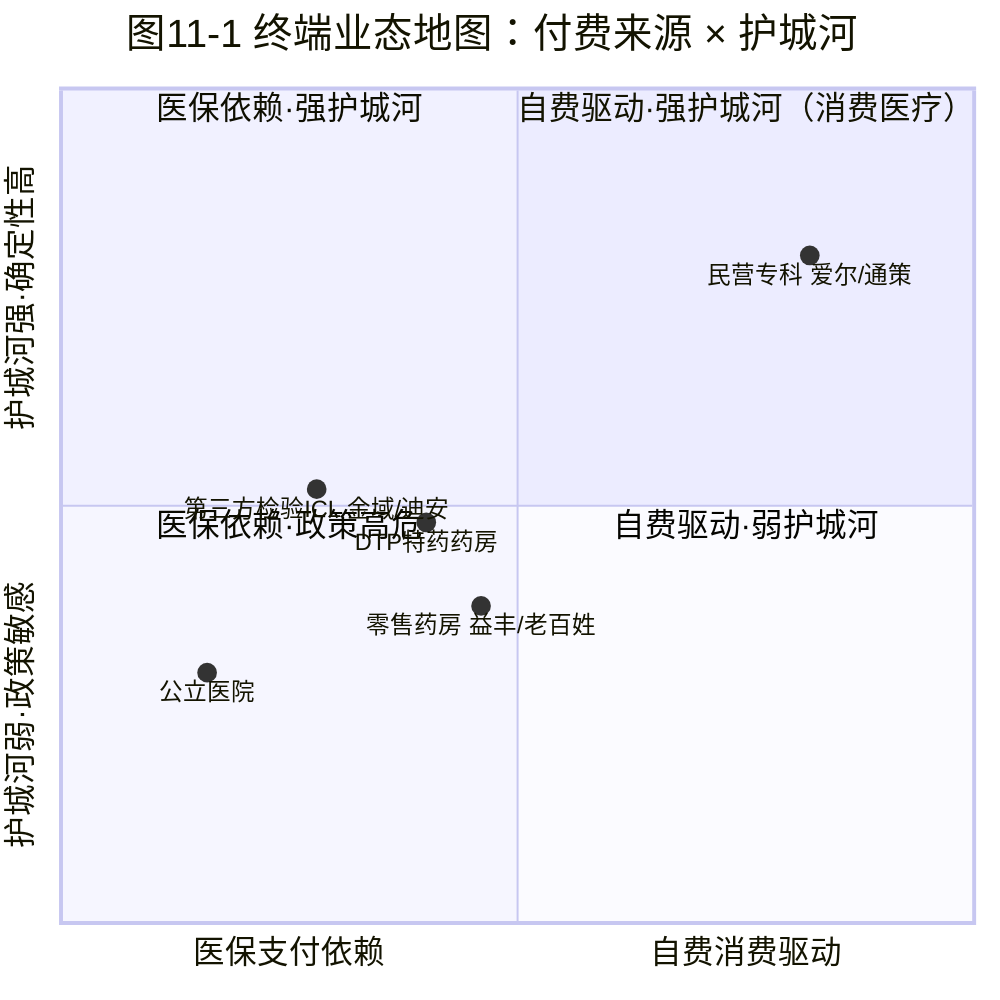
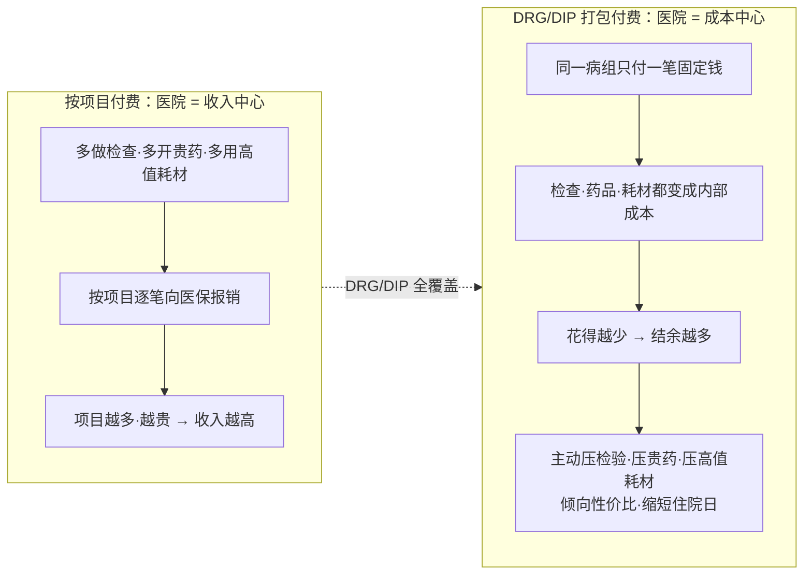

## 本章概览

流通分销是药到患者手中的最后一段，终点是医院的收货台；但对上游采购决策来说，医院才是真正的买家——而它的采购方式，正被两道制度闸门系统性改写。前面三章把一盒药从工厂送到了流通环节：分销商搬运、两票制压层级、340B 扭曲渠道。再往下走一步，药和检验服务就抵达了患者真正接触的地方——医院的诊室、药房的柜台、化验科送出去的那管血。这一层叫"终端"。

产业链分析里，终端是最被冷落的一环。讲研发的爱讲分子，讲支付的爱讲 PBM 和医保局，中间这层"谁在直接服务患者、靠什么赚钱"反而很少有人系统拆。可对投资者来说，A 股和港股里一大批医疗标的恰恰长在这一层：民营眼科、民营口腔、第三方检验、连锁药房、院外特药药房。它们既不造药也不造器械，赚服务和流通的钱，命运却天差地别。

本章拆五种终端业态——公立医院、第三方医学检验（ICL）、民营专科连锁、零售药房、DTP 药房——各自靠什么赚钱、护城河多深、可投资性如何。贯穿全章的主线是：**决定一种终端业态命运的，不是它服务得好不好，而是谁替患者买单**。自费驱动的生意按消费品逻辑运转，医保驱动的生意被控费机器支配。这条线能解释开头那个反差——同样在终端，为什么一个跑出消费股估值，一个新冠后业绩腰斩。

本章还会第一次引入 DRG/DIP 这套中国医保按病种付费的机制，它把公立医院从收入中心变成成本中心，是理解中国终端采购行为的总开关；这里只讲它如何改变采购激励，完整机制和对器械、药品需求侧的冲击留到第 15 章。本章涉及具体公司的基本面与可投资性讨论，不含任何投资建议，章末有完整免责声明。

## 钩子：同在终端，一个跑出消费股估值，一个新冠后腰斩

先看两家公司，都在终端这一层，命运却走向两个极端。

爱尔眼科（300015.SZ，国内最大的民营眼科连锁医疗集团）在 2021 年 7 月股价见顶时，总市值约 3853 亿元，按第三方平台 TTM 滚动口径，市盈率最高摸到约 234 倍，过去十年平均也长期在 90 倍以上（平台算法口径，不同平台结果可能有差异）【数据，来源：益盟/理杏仁历史估值，eniu.com】。作为参照，爱尔 2021 全年归母净利润约 23.23 亿元、同比增长 34.78%【事实，来源：爱尔眼科 2021 年报】——一家年利润二十多亿的连锁眼科，被市场给到近四千亿市值，享受的是白酒和高端消费品才有的估值倍数。它的逻辑也确实像消费品：做白内障、近视手术、医学验光，大部分是患者自费、与医保控费基本绝缘的需求，量价都能涨。

金域医学（603882.SS，国内第三方医学检验龙头，2023 年 ICL 市场份额约 26%、行业第一）走的是另一条曲线【事实，来源：前瞻产业研究院《2024 中国第三方医学诊断行业竞争格局》】。新冠三年，核酸检测把它的营收推到 2022 年约 154.76 亿元、归母净利润约 27.53 亿元的高峰【事实，来源：金域医学 2022 年报】。疫情结束后断崖式回落：2023 年营收 85.40 亿元、同比下降 44.82%，2024 年再降到 71.90 亿元，归母净利润由盈转亏至约 -3.81 亿元，上市以来首次年度亏损【事实，来源：金域医学 2023、2024 年报】。从 155 亿到亏掉近 4 亿，两年时间。

同样不造药、不造器械，一个被当消费股供着，一个新冠后业绩腰斩还计提了大额坏账。表面看是新冠透支了一次性需求，更深的原因藏在"谁替它的客户买单"这件事里。要讲清楚，得先把终端拆成五种不同的生意。

## 终端不是一门生意，是五门生意

把患者接触到的终端按"谁付钱"和"护城河来自哪里"两个维度铺开，会看到五种性质完全不同的业态（图 11-1）。

横轴是付费来源：越靠左越依赖医保支付，越靠右越靠患者自费。纵轴是护城河强度与经营确定性。先把五种业态的概念和位置点清楚，后面逐一展开：

- **公立医院**（最左下）：中国医疗服务的绝对主体，但公立非营利、几乎不是可投资标的。它在本章的角色是"采购方"——怎么花钱直接决定上游需求，而这正被 DRG/DIP 改写。
- **第三方医学检验 ICL**（中左，Independent Clinical Laboratory，独立于医院、承接医院和基层检验外包的第三方实验室）：客户是医院，收入来自医保支付的检验费；护城河中等，靠规模和检测菜单，替代性比想象中高。
- **DTP 药房**（中间，Direct to Patient，直接面向患者的院外特药药房，承接院内买不到的创新药和特药处方）与**零售药房**：一头自费一头医保统筹报销，护城河偏弱——药品是标准品、比价透明、门店没有定价权。
- **民营专科连锁**（最右上，聚焦单一科室、如眼科/口腔/医美的民营连锁机构）：以爱尔眼科、通策医疗（600763.SS，国内民营口腔连锁龙头，深耕浙江）为代表，需求大头是患者自费，护城河来自医生、品牌、连锁网络和复购。五种业态里唯一能持续享受消费品估值的一类。

这张地图给出本章的核心判断：**终端业态的命运沿横轴排序。越靠自费一侧，越能按自己的节奏定价和扩张；越靠医保一侧，越被支付方的控费机器支配。** 下面逐一验证。

## 公立医院：DRG/DIP 把它从收入中心变成本中心

公立医院不是投资标的，但它是上游所有生意的需求闸门，而这个闸门的开合逻辑刚刚发生了根本变化，源头是**医保支付方式**——医保基金向医院付钱的方式。过去几十年，中国公立医院按"项目"收费：做一次 CT 收一次 CT 的钱，开一盒药加一次价，用一个支架收一个支架的费用。在这套规则下，医院做的项目越多、用的药械越贵，向医保申报的收入越高，它是不折不扣的**收入中心**，扩张检查、倾向贵药高值耗材都符合它的经济利益。

DRG/DIP 把这套规则掀翻了。DRG（按疾病诊断相关分组，Diagnosis Related Groups）和 DIP（按病种分值付费，Diagnosis-Intervention Packet）是两种"打包付费"机制：医保不再按项目逐笔报销，而是把同一类病症归成一个病组，对整组治疗付一笔事先定好的固定钱。一个病人住院，无论医院做了多少检查、用了多贵的药，医保给的就是这个病组对应的那一笔。

这笔账反过来了。打包价固定，医院做的检查、用的药、上的耗材就从"收入"变成了**成本**——花得越少，结余越多。医院由此从收入中心变成**成本中心**，采购激励整个掉头：主动压检查、压贵药、压高值耗材，倾向选性价比方案，缩短住院日（图 11-2）。

这套机制推进得很快。国家医保局 2021 年三年行动计划设定的目标，是到 2024 年底全国所有统筹地区全部开展 DRG/DIP 付费【事实（政策目标），来源：国家医疗保障局，2021】；据官方表述三年行动收官时已基本实现统筹地区全覆盖，2024 年 7 月又发布 2.0 版分组方案要求年内切换【事实，来源：国家医疗保障局，2024】。要分清"统筹地区全覆盖"与更细的"病种、基金全覆盖"是两个口径，后者仍在推进。无论如何，这已不是个别试点，而是全国公立医院都在经历的激励反转。

对本章的意义是：公立医院这个最大的终端采购方，行为正在系统性地从"愿意用贵的"转向"主动用省的"。这对上游器械、IVD、检验外包的需求侧冲击不亚于集采——集采压采购价，DRG/DIP 压使用量，两者叠加。这条因果链怎么传导到器械和 IVD 公司的报表，是第 15 章的主题。这里只需记住：**它下游所有靠卖给医院吃饭的生意，都要重新被这把"省钱"的尺子量一遍。** 第一个被量到的，就是第三方检验。

## 第三方检验 ICL：好生意，但客户在被迫省钱

回到金域医学的腰斩。新冠透支是表层原因，深层原因要看 ICL 这门生意的本质和它客户的处境。

ICL 的商业模式是规模经济的典型。单家医院碰到罕见、低频、需要昂贵平台的检测（基因测序、特殊病理、罕见病筛查），样本量摊不平成本；ICL 把多家医院的样本集中起来摊薄固定成本，再把检测菜单做到几千项，单项不赚多少、靠量和品类宽度赚钱。理论上，检测项目越多、合作医院越广，规模壁垒越深。金域医学靠这套模式做到约 26% 的市占第一，迪安诊断（300244.SZ，ICL 龙头之二，诊断服务与产品代理双主业）紧随其后，金域、迪安、艾迪康三家按营收口径合计市占已超过 50%【事实，来源：前瞻产业研究院，2024】。

这门生意还有一个长期逻辑：渗透率低。2021 年中国 ICL 渗透率仅个位数，远低于日本约 67%、德国约 44%、美国约 35%（四国数字均来自单一行业报告口径，不同测算可能有出入）【数据，单源待交叉，来源：前瞻产业研究院引用行业数据】。越来越多医院把检验外包出去，似乎是确定的方向。但 2024 年的财报给了不一样的答案。金域亏 3.81 亿；迪安诊断 2024 年营收 121.96 亿元，归母净利润约 -3.57 亿元，同样是首次亏损【事实，来源：迪安诊断 2024 年报】。它是"检验服务 + 产品代理"双主业：诊断服务 45.20 亿元（其中纯 ICL 外包检验 41.73 亿元），产品代理 81.34 亿元——两分部加总 126.54 亿元，与合并营收 121.96 亿元的差额约 4.58 亿元为分部间交易抵消，以合并口径为准。营收里大头是低毛利的产品代理，与金域纯检验口径不可直接比。两家龙头同时陷入亏损，新冠应收账款坏账是直接导火索——金域 2024 年计提的信用减值损失约 6.19 亿元，相当一部分是各地新冠检测的政府欠款收不回来（2025-01 业绩预告曾预估约 6.5 至 7.2 亿元，年报定稿为 6.19 亿元）【事实，来源：金域医学 2024 年报】。

新冠的账迟早会出清，真正值得警惕的是结构性那一面。当医院在 DRG/DIP 下变成成本中心，检验从"收入项"变成"成本项"，激励就从"多送样本"转向"能不送就不送、能压价就压价"。ICL 一头连着被医保控费的医院、一头连着自己摊不薄的固定成本，经营杠杆是双刃的——量上来时利润弹性极大（新冠时一年赚二十多亿），量下去时固定成本压垮利润（常态化后直接亏损）。这正是金域、迪安双双亏损暴露的真问题：**它的好生意属性（规模经济、低渗透率）是真的，但客户正在被迫省钱，渗透率逻辑短期兑现不了。**

【独立观察】把 ICL 和民营专科放在一起看，反差就清楚了。同样是"开一家做检查/做手术的机构"，ICL 卖服务给医院、天花板被支付方按着；民营专科直接卖给自费患者、天花板由市场需求决定。图 11-1 里两者一个在中左、一个在右上，差的不是经营能力，是付费来源。

【全球对照】美国 ICL 渗透率约 35%，且早已收敛成 Quest（Quest Diagnostics，DGX，美国最大独立检验公司，2024 年营收约 98.7 亿美元）与 LabCorp（Laboratory Corporation of America，LH，美国第二大、年营收百亿美元级）的双寡头【分析，来源：MarketsandMarkets esoteric testing 2023；Quest/LabCorp FY2024 业绩】。中国渗透率个位数、龙头却先于市场成熟就陷入亏损，差异不在"医院愿不愿外包"，而在支付方结构：美国商业保险按检测项目付费、医院做检验没有"省钱"压力，外包需求是顺的；中国医院在 DRG/DIP 下变成本中心，外包检验恰恰是要省掉的成本项。同一门规模经济的生意，在两套支付制度下渗透曲线可以完全相反——这是把美国 ICL 增长经验平移到中国时最容易踩的坑。

## 民营专科连锁：消费品逻辑，和它的两个软肋

民营专科是终端里最像消费品的生意，也是 A 股给过最高估值的一类医疗服务标的。

爱尔眼科的模式是"分级连锁 + 并购基金"：按城市层级铺医院网络，中心城市做疑难手术、基层做常规项目、转诊互通；同时用体外的产业并购基金先收购培育新医院，盈利成熟再注入上市公司，把扩张期的亏损挡在报表之外。靠这套打法，截至 2023 年 6 月体系内眼科机构达 816 家（上市公司体内 515 家、并购基金旗下 301 家）【事实，来源：爱尔眼科 2024 年主体信用评级报告】。2024 年营收 209.83 亿元、同比增长 3.02%，归母净利润 35.56 亿元、同比增长 5.87%，门诊量 1694.07 万人次、手术量 129.47 万例【事实，来源：爱尔眼科 2024 年报】。

通策医疗走的是另一条路——区域深耕，不全国铺网，而是把浙江口腔市场吃透，以杭州口腔医院为核心向省内辐射。2024 年营收 28.74 亿元、同比增长 0.96%，归母净利润 5.01 亿元、同比增长 0.20%，旗下机构 89 家、牙椅约 3100 台【事实，来源：通策医疗 2024 年报】。

这类生意为什么能享受消费品估值？因为它的需求结构就是消费品。近视手术、白内障、种植牙、正畸，绝大部分由患者自费，与医保控费基本绝缘——DRG/DIP 压不到它，集采也砍不到它的主营。护城河来自医生资源、连锁品牌、患者复购和转诊网络，都是慢变量，一旦建立难被替代。需求还在长期增长：老龄化带来白内障，屏幕带来近视，消费升级带来正畸和种植。量价齐升、抗集采、复购强，这正是市场曾给爱尔 200 倍以上市盈率的逻辑。

但消费品逻辑有它的代价，体现在两个软肋上。

**第一个软肋是宏观消费周期。** 既然是自费消费，就和白酒、家电一样吃宏观景气。2021 年之后宏观消费转弱，爱尔的估值从 234 倍的高点一路压缩，到 2024 年中市盈率回到 30 倍左右、市值跌破千亿，较 2021 年峰值缩水约 70%【事实，来源：益盟/理杏仁估值数据；新浪财经，2024-07】。同步的微观信号是 2024 年它的扣非净利润约 30.99 亿元、同比下降 11.82%，出现近年首次下滑，毛利率 48.12%、为近五年首次低于 50%【事实，来源：爱尔眼科 2024 年报；经济观察网，2025-04】。消费降级时，近视手术和种植牙是可以推迟的支出。抗的是医保控费，抗不了消费收缩——这是民营专科和创新药企完全不同的风险敞口。

**第二个软肋是扩张模式本身。** 并购基金把扩张风险挡在报表外，但收购形成的商誉沉淀在资产负债表上，一旦被收购医院经营不及预期，减值会直接冲击利润，这是高速并购模式的固有代价。区域深耕的通策没有这个问题，代价是天花板低——跨省复制的难度远大于本地深耕。两种模式各有取舍：爱尔用商誉风险换全国规模，通策用增长上限换报表干净。

【独立观察】消费医疗的估值不该简单类比成"医药里的消费股就该高 PE"。它真正的估值锚是消费而非医疗——决定它倍数的不是创新药那套临床读出和专利悬崖，而是宏观消费景气和门店扩张的边际回报。看这类标的，与其盯着医保政策，不如盯着客单价、复购率、同店增长和宏观消费数据，这套指标更接近连锁餐饮、连锁零售，而不是接近创新药龙头。

## 零售与 DTP 药房：处方外流的承接者，眼下却增收不增利

终端的最后一环是药房。零售药房连锁这一层规模最大、门店最密，两家代表是益丰药房（603939.SS，总部湖南、深耕中南与华东，2024 年营收行业前列、门店约 1.47 万家）和老百姓（603883.SS，全国布局 18 省、门店约 1.5 万家的连锁药房龙头之一）。但它们当下的处境最尴尬。

先看它最被看好的长期逻辑：**处方外流**——处方从院内流向院外药房的过程。中国处方药过去高度集中在院内销售；随着集采压缩院内药品利润、医院零加成断掉卖药动力（这套机制第 15 章详解），加上医保"双通道"政策（允许部分谈判进医保的创新药在指定院外药房也能报销），处方正流向院外，给药房打开了承接空间。承接得最直接的是 **DTP 药房**，专卖院内买不到的创新药、特药，客单价高、专业服务重。截至 2023 年底，全国 DTP 药房已达约 7132 家、市场规模约 750 亿元，2019 至 2023 年复合增速约 17%；院外处方药销售额已超 2688 亿元、占实体零售市场约 59%，其中肿瘤与免疫调节剂占院外特药约 71.8%（以上为单一咨询机构口径，读者参考时留意来源差异）【数据，单源待交叉，来源：医药魔方/动脉网行业报告，2024-12】。处方外流是真实的长期趋势，DTP 是其中增速最快的细分——前提是双通道与院外报销政策延续、集采持续压缩院内药品利润；若医保收紧院外药店监管或把报销收回院内，外流节奏会放缓【作者判断，假设：双通道延续 + 院内药品利润持续受压】。

但长期逻辑没能立刻变成报表上的好看数字。2024 年益丰药房营收 240.62 亿元、归母净利润 15.29 亿元，门店 14684 家、同比增长 10.82%——还在增长，但营收增速已从前几年的 20% 以上降到个位数（2024 前三季度营收同比 +8.38%）【事实，来源：益丰药房 2024 年报、2024 三季报】。老百姓更差：营收 223.58 亿元、同比下降 0.36%，归母净利润 5.19 亿元、同比下降 44.13%【事实，来源：老百姓 2024 年报】。整个连锁药店行业过去一年关店明显增多，普遍"增收不增利"，进入深度调整期。

为什么长期向好的赛道，眼下却赚不到钱？因为药房卡在图 11-1 那条横轴的中间——既靠患者自费，又依赖医保统筹报销，两头都没有定价权。药品是标准品，同一盒药在哪家药房买都差不多，门店没有溢价能力；前几年靠开店冲规模，门店饱和后单店产出下滑、租金人力刚性，利润被挤薄；医保对药店的统筹监管又在收紧。处方外流是真的，但它带来的是"流量"不是"定价权"——能不能把流量变成利润，取决于药房能否从纯比价的标准品零售转向专业服务和会员黏性。这道坎还没走完。

## 一条横轴，五种命运

把五种业态串起来，本章开头的反差就解开了。金域的腰斩和爱尔的高估值，从来不是经营能力的差距，是它们在图 11-1 那条横轴上站的位置不同——金域站在被医保按着的检验侧（客户是被 DRG/DIP 压成成本中心的医院），爱尔站在自己定价的自费侧。看终端标的，第一个要问的问题永远是：谁替它的患者买单，这个答案往往比营收增速更能预判它三年后的样子。

## 小结

- 终端是产业链最被忽略的一环，却长着 A/H 股一大批医疗标的：公立医院、第三方检验（ICL）、民营专科连锁、零售药房、DTP 药房。决定它们命运的不是服务能力，而是付费来源——自费驱动按消费品逻辑运转，医保驱动被控费机器支配。
- DRG/DIP 按病种打包付费把公立医院从收入中心变成成本中心，采购激励从"愿意用贵的"掉头为"主动用省的"，对上游器械、IVD、检验外包的需求侧冲击不亚于集采，完整机制见第 15 章。
- 本章独立观察：ICL（金域、迪安）的规模经济和低渗透率是真好生意，但客户是被 DRG/DIP 按住的医院，渗透率逻辑短期兑现不了；民营专科（爱尔、通策）的估值锚其实是消费而非医疗，该盯客单价、复购和宏观消费，而非医保政策；药房卡在横轴中间、两头无定价权，处方外流给的是流量不是利润。
- 下一部分进入支付方，把"谁买单"从终端往上追到源头，先看美国药价的隐形之手 PBM（Pharmacy Benefit Manager，药品福利管理商，美国药价体系的核心中间方）。

## 配套数据

见 `data/11-terminal-services/`：

- `terminal_business_map.csv`：五种终端业态的付费来源、护城河、可投资性定位对照。
- `icl_specialty_chains.csv`：ICL、民营专科、零售/DTP 药房代表公司的营收、增速、利润、门店/机构数据（按财报口径与时点）。
- `sources.md`：本章所有数据源清单与口径说明。

---

> **免责声明**
>
> 本章涉及具体公司的财务分析、可投资性讨论与产业判断，仅为作者基于公开信息的研究结果，**不构成任何投资建议**。市场有风险，投资决策应基于读者自身的独立判断和专业咨询。
>
> 本章使用的财务数据截至 2026-05，公司基本面、估值倍数与市场环境可能在阅读时已发生变化。本章中提到的公司股票、市值、市盈率等信息均为分析素材，作者不对其准确性、完整性或时效性作任何承诺。
>
> **作者持仓披露**：截至本章数据时点，作者未持有本章重点分析公司（爱尔眼科、通策医疗、金域医学、迪安诊断、益丰药房、老百姓等）的股票或衍生品；本书为 commentary-only，不披露持仓、不构成投资建议。

---

> 本章来自《医疗经济学》开源版 · 作者「递归客」  
> 在线阅读完整书系：[inferloop.dev](https://inferloop.dev) · 反馈与勘误：[GitHub Issues](https://github.com/diguike/book-healthcare-economics/issues)
