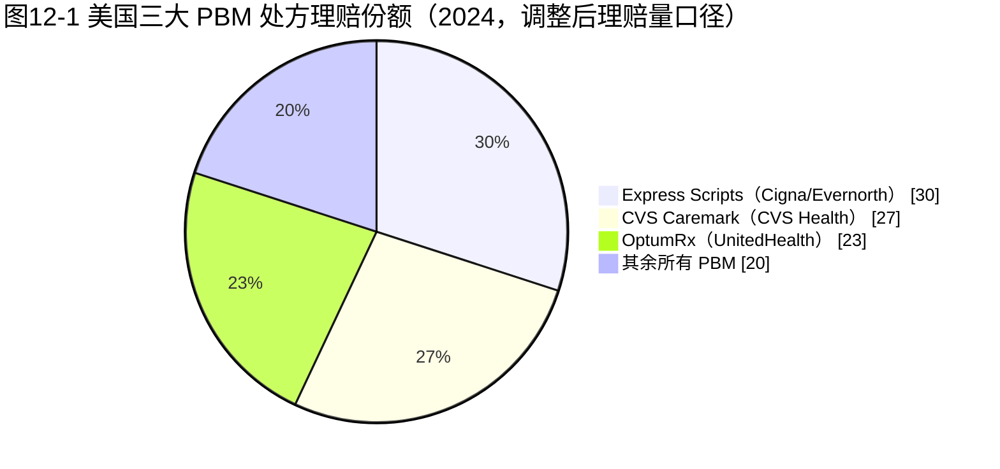
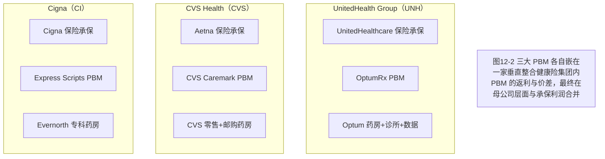
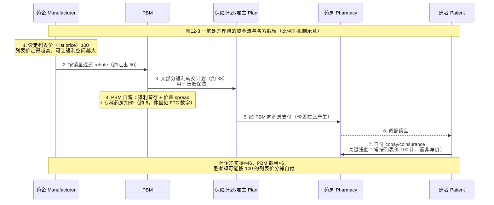

## 本章概览

前一部讲完了药怎么从工厂搬到药房——分销商只赚搬运费，薄利。这一部换一个问题：药到了药房，谁决定它能不能被报销、患者掏多少钱、药企最后实拿多少。这把权力在美国不在药企手里，也不在保险公司手里，而在一个大多数患者从没听说过的中间人——PBM（Pharmacy Benefit Manager，药品福利管理机构，受雇于保险计划和雇主，替它们管理药品报销、谈返利、定处方清单）。

这一章解决一个让所有外行困惑的问题：美国药价为什么标得那么高，真实成交价又没人说得清。总开关在 PBM 手上的三件工具——处方集（formulary，规定哪些药能报销、报销几档的清单）、返利（rebate，药企按销量返还给 PBM/保险计划的钱）、价差（spread pricing，PBM 向保险计划收的钱高于它付给药房的钱，差额自留）。三件工具拼起来，是一台把"列表价虚高、净价不透明"固化下来的机器。

本章拆四件事：PBM 凭什么有生杀权（处方集这把咽喉）；返利—价差—处方集如何构成一套收租机制（钱怎么进来、谁截留）；患者为什么被系统性多收钱；以及 2022 年签署、2026 年首批落地的 IRA（Inflation Reduction Act，通胀削减法案）如何第一次把国家定价插进这台私营机器。看懂美国药价不是看哪家药企黑心，而是看这台机器怎么运转，以及它为什么这么难改。

本章涉及具体公司（CVS、Cigna、UnitedHealth）的板块归属与利润结构判断，含估值相关讨论，不构成投资建议。

## 钩子：一个没造过一粒药的中间人，几周换走数十万患者

2024 年 1 月 3 日，CVS 旗下的 PBM——CVS Caremark（2023 全年处方理赔市占第一、2024 全年退居第二，份额由 34% 降至 27%）发出一份通知：自 4 月 1 日起，把 Humira（阿达木单抗 adalimumab，TNF-α 抑制剂，类风湿关节炎/克罗恩病/银屑病等自身免疫病用药）从它主要的全国商业模板处方集里移出，改把几款生物类似药（biosimilar，生物药的"仿制版"，结构高度相似但非完全相同）放到首选位置【事实，来源：Healio / PSG，2024-01】。

Humira 不是普通的药。它是 AbbVie 的现金牛，2022 年全球净收入约 212 亿美元，约 2013–2022 连续十年居全球单品销冠——名副其实的"全球药王"【事实，来源：AbbVie 8-K】。它的美国生物类似药其实 2023 年 1 月就上市了，但整个 2023 年几乎没放量：那年 Humira 美国处方量只是温和下滑（生物类似药份额长期卡在个位数），但因 AbbVie 大幅让利维持处方集地位，净收入降幅明显更大【事实，来源：AbbVie 8-K / BioSpace】。专利到期没能撼动它的处方量根基。

撼动它的是 CVS Caremark 这一纸通知。处方集一改，结果立刻显形：移出后短短数周，adalimumab 生物类似药的处方份额从约 5% 跳到约 36%，CVS 首选的 Hyrimoz 领跑【事实，处方量口径，来源：Center for Biosimilars / GaBI / BioSpace，2024】。到 2024 年第四季度，Humira 的美国净收入降至 12.46 亿美元、同比陡降 54.5%【事实，来源：AbbVie Q4 2024 Earnings Release，2025-01-31】。一款药王，专利没到期就被一个中间人的一份清单，几周内换走了数十万患者。

同一款药，专利到期（2023 年）几乎没让它掉量，处方集移出（2024 年）却让它崩盘——决定一款生物药生死的不是专利、不是 FDA，而是 PBM 手里的那张清单。一个没造过一粒药、没做过一例临床的中间人，凭什么有这种生杀权？答案是处方集。

## 处方集：卡在咽喉上的那张清单

要理解 PBM 的权力，先理解美国药品报销的结构。一个有商业保险的美国人去药房拿药，付钱的不是他一个人，而是三方：患者出一部分自付（copay 或 coinsurance），保险计划出大头，而"哪款药能报、报销分几档、患者自付多少"由 PBM 替保险计划事先定好——这张清单就是处方集。

处方集通常分层（tier）：首选药自付最低，次选药自付高一档，不在清单上的药则完全不报、患者全价自费。对一款需要长期使用、单价又高的药来说，"在不在首选层"几乎等于"卖不卖得动"——因为没有哪个患者愿意为一款被踢出清单的药全价买单，医生也会顺着报销层级开药。

这就是 PBM 的咽喉位置。它本身不生产药、不承保风险、不直接给患者看病，但它站在药企和患者之间，握着"准入"这道闸门。药企要想让自己的药进首选层、保住销量，就得向 PBM 让利——让利的主要形式，就是返利。

把这一点和上一章对照：分销商也是中间人，也很集中（三大占九成市场），但它只赚 1%–3% 的搬运费，因为它卡的是物流，物流可计价、可比价、可外包，收不上租。PBM 卡的是准入——准入不可比价、不可外包、对药企是生死攸关，所以它能收租。同样是"中间商"，一个搬箱子，一个收过路费，这是看懂美国药品利润分布的关键分野。

## 三大寡头与纵向一体化

美国 PBM 高度集中。按 2024 年调整后处方理赔量口径，三大 PBM 合计处理了约 80% 的处方：Express Scripts（隶属 Cigna 旗下 Evernorth）约 30%、CVS Caremark（隶属 CVS Health）约 27%、OptumRx（隶属 UnitedHealth Group）约 23%【事实，来源：Drug Channels，2025-03】。

这三家的座次刚在 2024 年发生过一次易位。Express Scripts 靠拿下 Centene 约 2000 万会员的五年合同，份额从 2023 年的 23% 跃到 30%，反超原来的老大；CVS Caremark 则因此丢单，理赔量同比下滑 18.2%（从 2023 年的 23 亿单降到 2024 年的 19 亿单），份额从 34% 退到 27%【事实，来源：Drug Channels，2025-03】。两千万人的盘子在两家寡头之间挪一下，就能改写整个行业座次——这本身就说明集中度有多高。

如果把口径放宽到前六家、全部处方，集中度更惊人：FTC（Federal Trade Commission，美国联邦贸易委员会）认定，六大 PBM 管理着全美约 95% 的处方【事实，来源：FTC 第一次中期报告，2024-07】。（注意这是比上面"三大约 80%"更宽的口径，两者不矛盾、不可混用。）

如图 12-1 所示，三大 PBM 的份额结构。

但真正决定 PBM 权力的不是这三个数字，而是它们的归属。这三大 PBM 没有一家是独立公司——它们各自被一家巨型健康险集团拥有，且和保险、药房、诊所捆在同一个母公司里。这种"保险+PBM+药房+诊所"垂直整合的结构，是理解美国医疗利润真正藏在哪里的钥匙，也是后面（第 13 章）要展开的主线。如图 12-2 所示。

把 PBM 单看成"药品中间商"会低估它。它是一个垂直整合集团伸进药品报销环节的那只手，它谈下来的返利和价差，最后和保险承保利润在母公司报表里合流。这一点先记住，本章先把 PBM 这只手本身的机制讲透。

## 返利—价差—处方集：一台收租机器

PBM 怎么赚钱？这是整个美国药价不透明的核心，也是最难说清的地方——因为它故意不透明。把三件工具拆开看。

**第一，返利（rebate）。** 药企为了让自己的药进处方集首选层，按销量给 PBM 返一笔钱。返利谈判是 PBM 的主战场：同一类里有好几款竞品时，谁返得多谁进首选层。这里藏着一个把整个体系扭曲的逻辑——返利通常按列表价的百分比谈。于是药企有动机把列表价定得越高越好：列表价越高，能让出的返利空间越大，越容易换到首选层。**返利机制不是在压低标价，而是在鼓励标价虚高。** 这是美国药价"标价虚高"的制度根源，不是某家药企贪婪，而是机器的运转逻辑使然。

**第二，价差（spread pricing）。** PBM 向它的客户（保险计划、雇主）收的药费，高于它实际付给药房的钱，中间的差额自留。客户付了 100，药房只拿到 80，PBM 揣走 20，而双方都不完全知道对方那一头的数字。

**第三，处方集（formulary）。** 上面两件工具之所以有效，全靠 PBM 握着处方集这道准入闸门——没有准入权，返利谈判和价差都无从谈起。三件工具是一套：处方集是杠杆，返利和价差是变现方式。

这套机制的体量有多大？看一个汇总数字：2023 年，全美所有品牌药的列表价销售额与扣除返利、折扣后的净价销售额之间的鸿沟（业内叫 gross-to-net bubble，"账面价—到手价"泡沫）达到 3340 亿美元，比上一年又涨了约 300 亿（+10%）【事实，来源：Drug Channels / IQVIA（全球最大医药市场数据机构），2024-07】。这 3340 亿，就是"列表价"和"真实成交价"之间被各种返利和折扣填满的空间——美国药价之所以没人说得清，就是因为这个空间既巨大又不透明。

FTC 的调查给了另一个切面。它 2025 年 1 月的报告认定，三大 PBM 在 2017 到 2022 年间仅在 51 种专科仿制药上的加价就带来超过 73 亿美元收入，价差另贡献约 14 亿美元；其中一款治肺动脉高压的 tadalafil，2022 年对商业支付方加价高达 7,736%【事实，来源：FTC 第二次中期报告，2025-01】。这些数字之所以重要，是因为它们是从监管调查里抠出来的——PBM 自己从不披露返利留存比例和价差。

如图 12-3 所示，把一笔处方理赔的资金流走一遍，看每一方截留多少（下图比例为机制示意，实际返利率因药物类别与合同差异极大，真实分账未公开）。

图 12-3 里那个值得划红线的是第 7 步：处于免赔额阶段或按比例自付（coinsurance）的患者，自付额常常是按列表价 100 算的，而不是按返利后的净价算的。返利返给了保险计划，没返给患者；患者反而要为虚高的列表价分摊更多。**返利越高，列表价越高，部分患者的账面自付越高。** 这就是为什么 PBM 机制不只是个产业利润分配问题，它直接落在患者的药费账单上。这也是 FTC 2024 年 9 月起诉三大 PBM 操纵胰岛素返利、抬高列表价、把成本转嫁给脆弱患者的核心指控【事实，来源：FTC，2024-09；三大 PBM 2024-11 反诉】。

## 回到 Humira：为什么是 PBM、不是专利，决定生物药的悬崖

现在可以把钩子讲完整了，它正好是上面机制的一个活案例，也接上了第 9 章生物类似药的那条线。

小分子仿制药的逻辑很简单：专利一到期，仿制药涌入，原研价格几周内崩塌。但生物类似药不一样。Humira 的美国生物类似药 2023 年初就上市了，专利屏障已破，可那一整年它几乎没掉量——为什么？因为生物类似药能不能放量，不取决于专利到没到期，取决于 PBM 把不把它放进首选处方集。2023 年三大 PBM 按兵不动，AbbVie 靠既有的返利合约把 Humira 稳在首选层，生物类似药就进不来。

2024 年 CVS Caremark 一动手，闸门打开，份额几周内从 5% 冲到 36%【事实，处方量口径】。决定崩盘节奏的是处方集那张清单，不是专利那张证书。

这件事的产业含义是：**生物药的专利悬崖比小分子更"软"、更可被运营延缓，因为它的节奏由 PBM 处方集而非专利到期决定。** 这是本书前面（第 9 章）和后面（第 23 章专利悬崖）反复要用到的一条判断——评估一款生物药原研的悬崖风险，不能只看专利到期日，要看 PBM 什么时候、以什么力度动处方集。AbbVie 靠 130 多项专利织网把美国生物类似药拖到 2023 年才进场，又靠返利合约把崩盘再拖了一年，这都是"运营延缓"的实证。对投资判断来说，专利到期日是日历上的硬时点，处方集变动是 PBM 的商业决策——后者才是触发器。

## IRA：国家定价第一次插进私营机器

到这里为止，这台机器一直是私营的：药企、PBM、保险计划之间的博弈，政府基本不定价。2022 年签署的 IRA 改变了这一点——它第一次让联邦政府直接和药企谈一部分药的价格。

先分清两个概念，后面要用。美国老年人医保 Medicare 的药品报销分两块：**Part B** 管在医院/诊所由医生给药的药（physician-administered，多为注射剂、肿瘤药），**Part D** 管患者去药房自己拿的门诊处方药（outpatient pharmacy）——上面讲的 PBM、处方集、返利那套机器，主要运转在 Part D 这一侧。IRA 的药价谈判，首批就从 Part D 切入。

首批 10 款药 2024 年 8 月 15 日公布、2026 年 1 月 1 日生效，相对列表价折扣区间 38%–79%，CMS（Centers for Medicare & Medicaid Services，美国医保与医补服务中心）预计 2026 年为 Medicare 省约 60 亿美元、为患者再省约 15 亿自付【事实，来源：CMS fact sheet，2024-08-15】。两端：折扣最大的是糖尿病药 Januvia，列表价 527 美元（30 天）砍到 113，降 79%；最小的是血液肿瘤药 Imbruvica，降 38%；抗凝药 Eliquis 由 521 砍到 231、Xarelto 由 517 砍到 197【事实，来源：CMS / ASPE / PSG】。第二批 15 款 2025 年 1 月 17 日公布、2027 年 1 月 1 日生效，含 Ozempic/Wegovy/Rybelsus 等 GLP-1，2023 年 11 月至 2024 年 10 月占 Part D 毛支出约 407 亿美元（约 14%），CMS 已于 2025 年 3 月与全部 15 家厂商签约【事实，来源：CMS，2025-01/03】。

这是确凿的、可查的、向好的一面。但这里有一条必须守住的口径红线，否则会把读者带偏。

**那个"折扣 38%–79%"是相对列表价（list price），不是相对净价（扣返利后的真实成交价）。** 被选中的这些药，本来就是 Part D 上返利极高的品种——前面讲过，列表价本就被返利机制推得虚高。所以从一个虚高的列表价往下砍 79%，砍掉的相当一部分只是把账面价拉回到接近本来就存在的净价；按净价口径算，真实的增量降幅要小得多，个别高返利药的谈判价（MFP，Maximum Fair Price）甚至可能接近、乃至高于它原本的净价【分析，口径来源：Drug Channels，2025-12】。换句话说，**IRA 首批省下的钱是真实的、但有限的**，把 38%–79% 直接读成"药价砍掉了八成"是误读。

长期那一面则被产业方系统性夸大了。IRA 设了一个被称为 pill penalty（"小分子惩罚"）的不对称条款：小分子化学药上市后第 9 年就可能被纳入谈判，而生物药要到第 13 年——小分子比生物药少 4 年独占喘息期【事实，IRA 法条】。产业立场机构由此推出一串警告：声称 2021 年 9 月以来小分子研发融资下降约 70%、IRA 后临床试验数下降 38.4%（其中小分子降 47.3%）、78% 的受访者称会砍掉早期小分子项目【分析，来源为产业游说机构 ITIF / NPC / No Patient Left Behind，立场相关】。pill penalty 这个不对称是真的、机制上确实会让药企在立项时偏向生物药；但"融资降 70%"这类数字出自有明确利益诉求的游说机构，把它当客观事实引用是危险的——同一时期 biotech 融资整体受高利率周期重创（见第 23 章），很难干净地归因到 IRA 一条。本书的立场是分层的：**短期省钱真实而有限，长期管线扭曲的机制成立、但量级被产业方夸大**，引用产业方数字必须标明它的立场。

至于 PBM 改革本身——FTC 起诉、各州立法、2026 年 2 月 FTC 与 Express Scripts 达成和解（ESI 承诺提高透明度，FTC 预计 10 年内为患者省最多约 70 亿自付）——方向是真的，多线推进也是真的【事实，来源：FTC，2026-02-04】。但要冷静看进度：联邦层面的 PBM 立法多次卡在预算和政治里；那笔"70 亿"是 FTC 的前瞻性预测、不是已实现的金额；和解只覆盖单一家（ESI），原诉讼虽缘起胰岛素返利操纵，但行为约束条款（停止偏好高列表价药、停止 spread、透明化返利等）适用于 ESI 管理的所有药品品类，CVS Caremark 与 OptumRx 两案仍在审理；三大 PBM 和保险母公司垂直整合的结构根本没被触动。**PBM 是美国药价不透明的结构性枢纽，但改革进度被高估。** 把返利机制讲清楚，比预测哪部立法哪年通过，对理解这个行业更有用。

## 投资视角：真利润不在 PBM 报表的明面上

最后落到投资。PBM 是好生意吗？答案要拐个弯。

PBM 单独看，毛利口径不透明、又正承受透明化和监管压力，直接给它估值很难。它的价值不在"PBM 这块业务赚多少"，而在它是垂直整合集团的咽喉部件——握着处方集准入权，就握着对上游药企的议价杠杆，这个杠杆的收益最终在母公司层面与保险承保利润合流。分析 CVS、Cigna、UnitedHealth 这类标的，只看 PBM 板块的明面利润会低估它，真正的利润池藏在承保端和集团协同里。这正是下一章要拆的。

有两个外生冲击是跟踪 PBM 板块绕不开的变量：一是 IRA 谈判逐年扩围（第三批已纳入首批 Part B 药），它压缩的是返利赖以存在的"列表价—净价"空间；二是 PBM 透明化立法和 FTC 诉讼的实际进展。两者都还没到能改写结构的程度，但都是这台机器头上悬着、需要逐年盯住的不确定性。

## 小结

- **PBM 是美国药价"标价虚高、净价不透明"的总开关。** 它不造药、不承保、不看病，却握着处方集这道准入闸门，凭此向药企收返利、向计划收价差。同是中间商，分销商搬箱子只赚 1%–3% 搬运费，PBM 卡咽喉能收租——判断中间环节肥瘦看的是咽喉位置，不是集中度。
- **返利机制不是在压标价，而是在鼓励标价虚高。** 返利按列表价的百分比谈，药企就有动机把列表价定高、再用更大的返利空间换首选层。2023 年全美品牌药列表价与净价的鸿沟（gross-to-net bubble）达 3340 亿美元。关键扭曲落在患者头上：自付常按虚高的列表价分摊，返利却返给了保险计划。
- **决定生物药悬崖节奏的是 PBM 处方集，不是专利。** Humira 专利 2023 年到期没掉量，2024 年被 CVS Caremark 移出处方集后几周内处方份额由 5% 崩到 36%。评估生物药原研的悬崖风险要盯 PBM 何时动处方集，而非只看专利到期日——这条判断贯穿第 9 章和第 23 章。
- **【独立观察】IRA 要分两层读，别被任何一端的叙事带走。** 短期省钱真实但有限——首批 38%–79% 的折扣是相对虚高列表价、非相对净价，按净价口径真实增量降幅小得多；长期 pill penalty 对小分子的扭曲机制成立、但"融资降 70%"这类数字出自产业游说机构，量级被夸大。承认机制、对数字保持距离，是看这台机器该有的姿态。
- **PBM 的真利润不在它自己的报表明面上**，而在它作为垂直整合集团咽喉部件、与母公司承保利润合流的那部分。下一章把镜头拉到母公司：美国医疗第二大利润池根本不在药厂，而在 UnitedHealth、CVS-Aetna、Cigna 这组把保险、PBM、药房、诊所捆在一起的集团——FTC 为什么拆不动，是第 13 章的主题。

## 配套数据

见 `data/12-pbm/`。本章用到的所有数据源详见 `data/12-pbm/sources.md`。

---

> **免责声明**
>
> 本章涉及具体公司（CVS Health、Cigna、UnitedHealth Group、AbbVie 等）的板块结构、财务与产业判断，仅为作者基于公开信息的研究结果，**不构成任何投资建议**。市场有风险，投资决策应基于读者自身的独立判断和专业咨询。
>
> 本章使用的财务与监管数据截至 2026-05，公司基本面、PBM 监管进程与药价政策可能在阅读时已发生变化。本章中提到的公司股票、市场份额、折扣幅度、谈判价格等信息均为分析素材，作者不对其准确性、完整性或时效性作任何承诺。本章对 IRA 长期影响、PBM 改革进度的判断属分析与预测，绑定 2026-05 时点，后续每一轮谈判清单、FTC 诉讼进展、立法动向都可能使其失效。
>
> **作者持仓披露**：截至本章数据时点（2026-05），作者未持有 CVS Health、Cigna、UnitedHealth Group、AbbVie 及本章提及的其他公司的股票或衍生品。

---

> 本章来自《医疗经济学》开源版 · 作者「递归客」  
> 在线阅读完整书系：[inferloop.dev](https://inferloop.dev) · 反馈与勘误：[GitHub Issues](https://github.com/diguike/book-healthcare-economics/issues)
