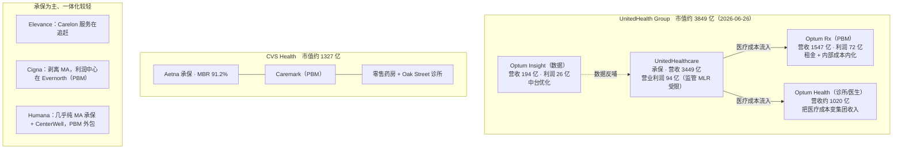
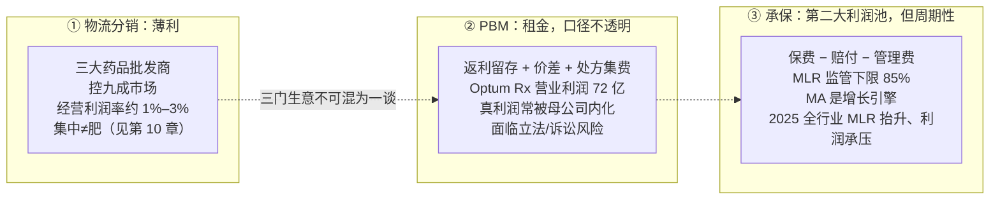

## 把一家公司的市值摊开

2026 年 6 月 26 日，联合健康集团（UnitedHealth Group, UNH——全美最大的健康险集团，旗下既有保险业务 UnitedHealthcare，也有囊括药品福利管理、诊所与数据的 Optum）市值约 3849 亿美元。它 2025 财年营收 4476 亿美元，比辉瑞、默沙东、礼来三家加起来还多。一个不研发分子、不做临床、不卖专利药的公司，凭什么坐到这个体量。

上一章讲的 PBM（药品福利管理，pharmacy benefit manager，夹在药企与保险计划之间、靠返利和处方集控制药品流向的中间商）是美国药价的隐形开关。但如果就此以为「支付端 = 一个笼统的肥水池」，会错得很离谱。把 UNH 的利润摊开看，真正稳定的利润既不在它的 PBM，也不在某条产品线，而在一个更深的结构里——把保险、PBM、药房、诊所、数据捆成一台机器的纵向一体化（vertical integration，把产业链上下游环节并入同一家公司）。这一章就拆这台机器：美国医疗的第二大利润池长什么样、利润藏在哪一环、以及为什么联邦贸易委员会（FTC）几年下来拆不动它。

## 「支付端」是三门完全不同的生意

产业链分析里最常见的误判，是看到「集中度高」就推断「利润肥」。第 10 章已经拆过一次：美国三大药品分销商控着九成以上市场，经营利润率却只有 1%–3%——寡头不等于肥。到了支付端，这个误判换了个面孔回来。要把它彻底按住，得先承认「支付端」根本不是一门生意，而是三门：

- **薄利的物流分销**。药品批发商（McKesson、Cencora、Cardinal Health）把药从药厂搬到药房，赚的是周转量，经营利润率常年个位数低段。集中度极高，但一点不肥。
- **PBM 的租金**。返利留存、价差定价（spread pricing）、处方集准入费——这是第 12 章的主角，看着肥，但毛利口径不透明，且正被立法与诉讼盯上。
- **管理式医疗的承保利润**。managed care（管理式医疗，指由保险方通过网络、处方集、事前授权等手段主动管理医疗使用与成本的体系）赚的是「保费收进来，减去赔出去的医疗费用」之间的差。这门生意才是美国医疗第二大利润池的本体。

把三门生意揉成「支付端肥」，等于把搬运工、收过路费的、和承保的赌注混为一谈。它们的毛利结构、护城河、监管风险完全不同。本章的任务，是把第三门——承保——讲透，再说明它如何与第二门 PBM 在同一批公司里合体。

## 承保利润，和它的关键比率

承保利润（underwriting profit）的算术很朴素：保户交的保费，减去赔付出去的医疗费用，再减去管理费用，剩下的是利润。衡量它的核心指标叫 MLR（医疗赔付率，medical loss ratio，也称 medical care ratio / benefit ratio）——赔付的医疗费用占保费的比例。MLR 越低，留给管理费和利润的空间越大。

这里有一道监管闸：《平价医疗法案》（ACA）规定，大团体保险的 MLR 不得低于 85%、个人与小团体不得低于 80%，达不到就得把多收的保费退还给保户。换句话说，保费里至少八成五必须花在「医疗成本」上，保险公司能动的只有那一成多。表面看，承保利润被监管死死压住了天花板。

承保利润的增长引擎，是 Medicare Advantage（联邦医保优势计划，简称 MA——政府把传统 Medicare 老人医保「外包」给私营保险公司，按参保人头预付一笔固定费用 capitation，保险公司自负盈亏，并按风险调整 risk adjustment 和星级评定 Star Ratings 拿额外补贴）。MA 是承保业务里增长最快、也是这几家公司争夺最凶的主战场：参保人数从 2007 年约 800 万（占合格 Medicare 人群约 19%），一路涨到 2025 年约 3440 万、占比约 55%（来源：MedPAC 据 CMS 数据，2025 年 2 月时点）。十几年里，私营保险公司把超过一半的美国老人医保收进了自家的承保口径。

## 真利润藏在哪：MLR 套利与一体化闭环

监管把 MLR 下限钉在 85%，照理说承保利润被锁死。纵向一体化恰恰是绕开这把闸的结构性答案。

逻辑是这样：如果一家保险公司同时拥有自己的 PBM、自己的药房、自己的诊所和医生集团，那么它付给这些自家子公司的钱，在保险报表上算「医疗成本」（计入 MLR 分子，合规），在集团报表上却又流回了自己口袋。MLR 看着达标甚至偏高，利润只是在集团内部从「承保」这个监管受限的口袋，转移到了「服务」这个不受 MLR 约束的口袋。这就是行业里说的 MLR 套利——PBM 与照护服务的真利润，很多时候并不显示在 PBM 自己的报表上，而是被母公司用来把承保端的成本「内部化」成集团收入。

UNH 的财报把这条闭环摊得很清楚（FY2025，GAAP 口径）：

- **UnitedHealthcare（承保端）**：营收 3449 亿美元，营业利润 94 亿美元——注意，这个数字一年前还是 156 亿美元，被 MA 医疗成本上行缩减约四成。
- **Optum（服务端）**：营收 2706 亿美元，营业利润 95 亿美元。其中：
  - **Optum Rx（PBM）**：营收 1547 亿美元，营业利润 72 亿美元；
  - **Optum Health（诊所与医生集团）**：营收约 1020 亿美元，全美最大的雇佣 / 签约医生网络之一；
  - **Optum Insight（数据与 IT）**：营收 194 亿美元，营业利润 26 亿美元。

把这两端拼起来看：保费从 UnitedHealthcare 进来，相当一部分以「医疗成本」的名义流向 Optum Rx 配药、Optum Health 看诊，再由 Optum Insight 的数据中台优化每一笔支出。集团 2025 全年总营业利润 190 亿美元（含一次性减项，含网络攻击善后、重组及损失合同评估等，共 28 亿美元），净利 121 亿美元。承保这一端在监管闸和成本周期的夹击下利润缩减约四成，但服务端把利润接住了——这正是一体化的意义。

图 13-1 把五大集团的这套结构画在一起。

**图 13-1：五大健康险集团的纵向一体化拓扑（标各环节的利润角色，数据为 FY2025）**

## 五家公司，五种一体化的深浅

同样叫「健康险集团」，五家把这台机器拼到了不同程度，财报因此呈现完全不同的脸（均为 FY2025；市值来源 stockanalysis.com，截至 2026-06-26 收盘，次日起数据已更新）：

- **UnitedHealth（UNH）**：一体化最完整——保险 + PBM + 全美最大医生网络 + 数据四件套齐全。承保端 2025 利润缩减约四成，但 Optum 把利润接住，集团净利仍有 121 亿美元。
- **CVS Health（CVS）**：营收 4021 亿美元，全美营收最高的医疗公司之一。它从零售药房起家，吃下 Caremark（PBM）、Aetna（保险），再补上 Oak Street、Signify 这些诊所与居家照护。Aetna 的 MBR（医疗赔付率）从 2024 年的 92.5% 改善到 2025 年的 91.2%，调整后营业利润从 3 亿美元跳到 29 亿美元——承保端去年探底、今年回血。
- **The Cigna Group（CI）**：一个反向案例。它把高 MLR、强周期的 MA 承保业务卖给了 HCSC（Healthcare Service Corporation，美国蓝十字蓝盾体系下最大的非营利保险公司之一），留下的承保以商业团体为主，MCR 只有 84.4%（基数本就低，与含 MA 的同业不可直接比绝对值）。集团真正的利润中心已经是 Evernorth（PBM + 特药服务）：FY2025 Evernorth 调整后税前营业利润 72.2 亿美元，远高于 Cigna Healthcare 的 41.5 亿美元。Cigna 的选择是「重 PBM 与服务、轻承保风险」。
- **Elevance Health（ELV）**：原 Anthem，蓝十字蓝盾系第二大保险集团，营收 1976 亿美元。它的服务平台 Carelon（含 CarelonRx）还在追赶 Optum。2025 年 benefit expense ratio（同 MLR 口径）升到 90.0%、Health Benefits 营业结果同比掉约三成，全年净利约 57 亿美元。
- **Humana（HUM）**：几乎是纯 MA 承保公司，加上 CenterWell（药房 / 居家 / 诊所），但把 PBM 大头外包给别人。一体化最浅。结果 2025 年承保周期一来，它最脆弱：营收 1297 亿美元，全年净利只剩 12 亿美元（同比微降），第四季度甚至净亏 7.96 亿美元，Insurance 板块全年 benefit ratio 90.4%、四季度飙到 93.1%。

把这五家排在一起，结论很清楚：一体化越深，越扛得住承保端的坏年景；越是裸露在 MA 承保风险里、缺乏服务端对冲的公司，利润越随周期剧烈摆动。

## 承保利润是周期性的，不是永远肥

2025 是承保端整体难看的一年。除了 Aetna 因为是从 2024 年的低谷往回爬（MBR 从 92.5% 改善到 91.2%），其余几家的 MLR 同向抬升（图 13-2）：UNH +340bps（调整后）、Elevance +150bps、Cigna +120bps、Humana 全年 90.4% 且四季度冲到 93.1%。需要提醒的是，Cigna 已剥离 MA 业务、没有 MA 成本趋势敞口，它的 +120bps 方向一致，但幅度不可与含 MA 的另外三家直接比较。原因是叠加的：MA 的医疗成本趋势（trend）持续上行、CMS（美国医保和医助服务中心）削减 MA 资金、IRA（《通胀削减法案》）改变 Part D（联邦医保门诊处方药福利板块，Medicare 覆盖处方药的支付部分）成本分摊结构、Medicaid 复核后留下的参保人病情更重。UnitedHealthcare 营业利润一年掉 62 亿美元，Humana 净利缩到 12 亿、单季转亏——这说明承保利润同样会「瘦」，它服从一条承保周期（underwriting cycle）：定价滞后于成本，成本先涨、保费后调，利润在中间被挤。

这恰好印证了支付端「有肥有瘦」的判断：承保不是一个永远丰沛的水池，它会被周期抽干。纵向一体化的价值，正在于用 PBM、特药、诊所、数据这些不直接承担承保风险的收入，去对冲承保端的周期波动。UNH 的 Optum、Cigna 的 Evernorth、CVS 的 Caremark，本质都是这套对冲。

**图 13-2：承保利润 vs 分销薄利——点破「支付端笼统肥」（FY2025）**

夹在这两端之间，还有一处常被忽略的租金：340B 药品折扣项目（第 10 章）。这些一体化集团的特药药房与合约药房，会分食 340B 折扣价与实际报销价之间的价差。2024 年全美 340B 折扣价采购额达 814 亿美元（HRSA 口径），其中相当一部分价差最终流向了这些一体化付费方的药房臂膀。它不是本章主线，但提醒一点：一体化的触角，能伸到产业链里几乎每一处有价差的缝隙。

## FTC 为什么拆不动

既然这套结构把保险、PBM、药房、诊所、数据捆成一体，监管为什么不拆？

第一是举证难。这些是纵向（上下游）整合，不是横向（同业）合并。横向合并好认——两个竞争对手合并、市场份额相加、价格上涨，反垄断逻辑直接。纵向整合里，集团反过来辩称「一体化降低了协调成本、改善了照护连续性」，监管得证明消费者实际受损，这个举证门槛高得多。

第二是现实里 FTC 的火力只够点，够不着结构。FTC 起诉三大 PBM 操纵胰岛素返利、抬高标价，2026 年 2 月与 Express Scripts 达成和解——和解只覆盖单一家（ESI），要求 ESI 对其管理的所有药品采取结构性行为改变（如停止在标准处方集中偏向同等药品的高价版本），但未触及三大 PBM 与保险、药房同体的纵向一体化结构本身。立法面同样反复：联邦层面禁止价差定价、强制披露返利的法案多次卡在预算与政治里，州层面零敲碎打。

第三是系统性成本。这几家公司是标普 500 成分股、合计雇佣几十万人、深度嵌进 Medicare 与 Medicaid 的日常运营——MA 计划、Medicaid 托管、联邦雇员保险都跑在它们的系统上。真要强拆，等于在运行中的美国医疗支付系统上做心脏手术，成本与风险都让监管望而却步。

这三条叠加，结果就是：纵向一体化既是美国医疗投资里最值得理解的结构，也是最难被外力改变的结构。理解美国医疗的利润流向，绕不开它。

## 什么会让这套判断失效

把「一体化抗周期、FTC 拆不动」当成永久定论是危险的。本书的姿态是给出失效条件，而不是宣布比赛结束。以下几条任一兑现，本章的判断就要重估：

- **承保周期不回血**。本章假设 2025 的 MLR 抬升是周期性、可通过提价与控费修复的。若 MA 医疗成本趋势持续高于保费调整速度、CMS 资金削减常态化，承保端的「瘦」会从一年变成结构性下台阶，服务端的对冲未必接得住。观察指标：2026–2027 各家 MLR 是否回落、MA 参保增长与盈利能力能否兼得。
- **PBM 立法动真格**。目前 FTC 与各州只触及单一品类、只要透明度。若联邦层面真的禁掉价差定价、强制返利穿透、甚至要求 PBM 与保险 / 药房分拆（多次被提出但屡屡搁置），MLR 套利的空间会被直接压缩。观察指标：联邦 PBM 改革立法是否落地、是否触及「同体」结构而非仅披露。
- **MA 风险调整收紧**。MA 的超额利润有一部分来自风险调整下的编码强度（coding intensity）。CMS 若进一步收紧 risk adjustment 模型与审计，MA 的单位利润会被削薄，最依赖 MA 的公司首当其冲。

这三条不是预测哪一条会发生，而是把「该盯什么」摆上桌——一体化的护城河是真的，但它建在监管的默许之上，监管的风向是这套结构最大的变量。

## 小结

- 「支付端肥」是一个危险的笼统说法。它其实是三门生意：薄利的物流分销、租金型的 PBM、以及承保利润。把它们揉成一句话，会同时高估分销、误读 PBM、看不见真正的利润池。
- 美国医疗第二大利润池是 managed care 的承保利润，而它真正的稳定性来自纵向一体化——保险 + PBM + 药房 + 诊所 + 数据捆成一体，通过 MLR 套利把承保端受监管约束的利润，转移到不受 MLR 约束的服务端。UNH 的「UnitedHealthcare 承保 + Optum 服务」是最完整的样本。
- 我倾向认为，一体化的深浅决定了抗周期能力：2025 年承保周期上行，五家 MLR 同步抬升，一体化最深的 UNH 净利仍有 121 亿，最浅的 Humana 缩到 12 亿且单季转亏。这是一个「承保会瘦、但服务端能接住」的活案例，也提醒承保利润是周期性的，不是永远肥。
- FTC 拆不动这套结构，源于纵向整合举证难、诉讼只够点品类、以及强拆的系统性成本。这既是合规上的现实，也是投资上要理解的护城河来源。

下一章换一个支付逻辑。药看处方集与返利，器械却完全是另一套——一台刚获批的手术机器人能不能赚钱，不取决于它多先进，而取决于一串五位数的报销码批没批、值多少钱。我们去看美国器械的「钱怎么进来」。

---

> **免责声明**
>
> 本章涉及具体公司的财务分析、估值测算与产业判断，仅为作者基于公开信息的研究结果，**不构成任何投资建议**。市场有风险，投资决策应基于读者自身的独立判断和专业咨询。
>
> 本章使用的财务数据截至 2026-06，公司基本面与市场环境可能在阅读时已发生变化。本章中提到的公司股票、估值倍数、市值等信息均为分析素材，作者不对其准确性、完整性或时效性作任何承诺。
>
> **作者持仓披露**：截至本章数据时点（2026-06），作者未持有 UnitedHealth、Elevance、CVS Health、Cigna、Humana 及本章提及的其他公司股票或衍生品。

---

> 本章来自《医疗经济学》开源版 · 作者「递归客」  
> 在线阅读完整书系：[inferloop.dev](https://inferloop.dev) · 反馈与勘误：[GitHub Issues](https://github.com/diguike/book-healthcare-economics/issues)
