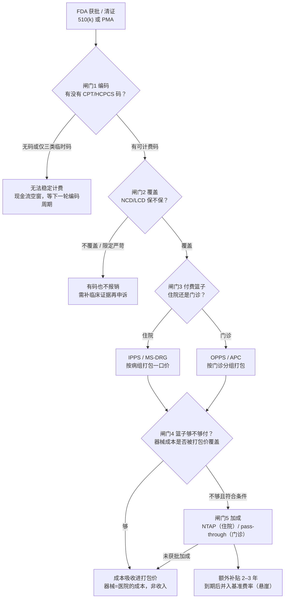
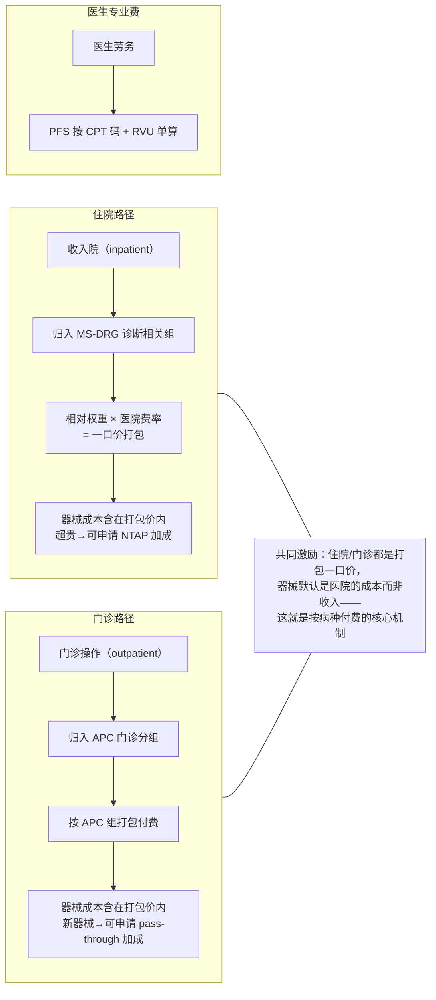

## 本章概览

前面两章把美国药品的支付端拆开了：PBM 卡在处方集这道咽喉上收返利，managed care 集团把承保、PBM、药房、诊所捆在一起赚承保利润。药能不能卖出去、卖什么价，归根结底看处方集收不收、返利谈到几折。

器械换了一套完全不同的逻辑。一台机器、一根导管、一盒试剂，背后没有处方集，也没有 PBM 跟你谈返利。它要赚钱，先得回答一个更基础的问题：医院或医生用了它，能不能向医保申报收款、申报多少钱。这个问题的答案不写在产品说明书里，写在一串五位数的编码、几份覆盖文件和两套预付费率表里。

这一章只讲一件事，但它是器械生意的命根子：**报销码与按病种打包付费**。拆成五块——靠什么编码才能开出"发票"（CPT/HCPCS）；谁决定这项服务保不保（NCD/LCD 覆盖决定）；钱按住院还是门诊两条路径打包付出（IPPS/MS-DRG 与 OPPS/APC）；又新又贵的技术怎么拿额外补贴（NTAP 与 transitional pass-through）；以及这套机制如何决定器械公司的市场天花板与上市节奏。

这套编码体系是全书最容易劝退的一段，术语密集、缩写成堆。先记住一个类比就不慌：**报销码之于医疗服务，就像税号之于一门生意——没有税号，再好的货也开不出发票、收不到款。** 器械再先进，没拿到码、或拿到的码不值钱，在 Medicare 这个全美最大的单一买方面前就等于"无法计费"。

本章讲的是支付制度与机制，不涉及具体公司的估值判断与多空，不含投资建议。

## 钩子：一台机器人获批了，却没有自己的"发票号"

设想一家器械公司刚拿到 FDA 批准，推出一台用于微创手术的手术机器人。技术参数漂亮：操作更精准、出血更少、住院日更短。销售团队信心满满地去敲医院的门。医院的采购和财务问的第一个问题不是"它多先进"，而是"我们用它做一台手术，Medicare 多付我们多少钱？"

答案让人意外：**一分钱都不多付。**

机器人辅助手术在 Medicare 的计费规则里，没有属于自己的、可单独收款的编码。它被并进了对应的腹腔镜手术编码里。以根治性前列腺切除为例，无论医生是徒手做腹腔镜还是用机器人辅助，申报用的都是同一个 CPT 码 55866——这个码的官方描述里明确写着"包括机器人辅助（当使用时）"【事实，来源：AAPC CPT 55866 释义、Intuitive《da Vinci 美国编码与报销指南》】。业界曾设过一个 HCPCS 码 S2900 专门标记"使用了机器人手术技术"，但它是个不可单独付费的附加码：报了也不会多给钱，Medicare 干脆不认这个修饰【事实，来源：AAPC《Coding Robot-assisted Surgery》、商业保险公司 Moda Health / Providence 机器人手术报销政策】。

这意味着什么？医院花一两百万美元买进机器人、每台手术再搭上专用耗材，而 Medicare 付给它的钱和一台普通腹腔镜手术分文不差。多出来的设备折旧和耗材全是医院自己的成本，不构成任何额外收入。机器人手术在美国能铺开，靠的是医院的竞争策略、营销和外科医生偏好，**唯独不靠"它能多收钱"**——因为它在报销码层面根本不能多收。

这就是器械支付逻辑与药最刺眼的区别。一款专利期内的创新药，只要进了处方集，每卖一盒都按净价实打实回款；一台技术领先的器械，可能因为"没有自己的码"或"码值为零"，在最大的买方那里饿着肚子。技术领先不保证赚钱，**拿到值钱的报销码才保证赚钱**。本章接下来把这串码是怎么发、怎么定价、怎么可能卡死的，一道闸门一道闸门讲清楚。

## 第一道闸门：编码——医疗服务的"发票号"

医院和医生向 Medicare 收款，靠的不是写一封信描述"我做了什么"，而是在理赔单上填一串标准编码。没有对应的编码，这项服务在支付系统里就不存在，自然也无从付费。美国这套编码体系叫 **HCPCS（Healthcare Common Procedure Coding System，医保通用程序编码系统）**，分两层。

- **HCPCS Level I，就是 CPT（Current Procedural Terminology，现行程序术语）**，由美国医学会（AMA）维护，主要给医疗服务和操作（一台手术、一次检查、一次治疗）编码。
- **HCPCS Level II**，由 CMS（Centers for Medicare & Medicaid Services，美国联邦医保医助中心，Medicare 的主管机构）维护，给 CPT 没覆盖的东西编码：器械、耗材、药品、轮椅、救护车服务等【事实，来源：CMS《Overview of Coding & Classification Systems》、CMS《HCPCS Level II Coding Procedures》】。

CPT 内部又分三档，这一层最关键，决定一项新技术处在"被认可"的哪个阶段：

- **Category I（一类码）**：已被广泛临床采用、有循证支持的成熟操作，可正常计费，每年 1 月 1 日更新一次。
- **Category II（二类码）**：质量考核用的追踪码，不直接对应付费。
- **Category III（三类码）**：给新兴技术和实验性操作的临时码，用于收集数据，多数情况下不能稳定带来付费。三类码是**临时的、有寿命的**——发布满五年若没能转成一类码，就被归档删除，除非申请人主动申请续期或转正【事实，来源：AMA《CPT Category III Codes》、AMA《CPT® Category III Codes: The First Ten Years》】。

这套分档解释了一个反直觉的现象：**一项技术明明获了 FDA 批准、临床上已经在用，却可能多年拿不到能稳定收款的一类码。** CPT 的编辑委员会（CPT Editorial Panel）一年只开三次会审新码申请，新的一类码绝大多数要等到次年 1 月 1 日才生效【事实，来源：AMA《The CPT code process》】。HCPCS Level II 的非药品申请截止日是每年 1 月和 7 月的第一个工作日，走的也是半年一轮的周期【事实，来源：CMS《HCPCS Level II Coding Procedures》】。从递交申请到拿到一个能正常计费的码，跨越一两个更新周期是常态。这段"有产品、没有码"或"只有临时三类码"的空窗期，对一家靠单一产品起家的器械公司是真实的现金流缺口——产品能用，但收款系统里它还"不存在"。

## 钱怎么进来：五道闸门的决策树

把编码这道闸门放回完整链条里看。一项新器械技术从 FDA 获批到真正收到 Medicare 的钱，要连过五关，任何一关卡住，后面的都白搭（如图 14-1 所示）。

**图 14-1：器械"钱怎么进来"决策树——五道闸门，每道都可能卡死**

这张图是本章的骨架，五道闸门各对应后面一节：闸门 1 编码刚讲过；闸门 2 是覆盖决定；闸门 3、4 是住院与门诊两条打包付费路径；闸门 5 是打包制下的新技术加成阀门。闸门 4 那个箭头是全章的关键——**对住院和门诊的打包付费来说，器械的成本默认是被"一口价"吸收的，它不是医院的额外收入，而是医院要从固定那笔钱里挤出来的成本。** 这个激励方向，是理解后面一切的钥匙。

## 第二道闸门：覆盖决定——保不保，谁说了算

有了码，不等于 Medicare 就会付。下一道闸门是**覆盖决定**：Medicare 判定这项服务在什么临床情形下"医学上必要、纳入报销"。覆盖决定分两级。

- **NCD（National Coverage Determination，全国覆盖决定）**：由 CMS 在全国层面做出，对所有 Medicare 受益人统一适用。NCD 流程通常要走 9 到 12 个月，视技术复杂度和公示期而定【事实，来源：Magnolia Market Access、CMS 覆盖决定流程】。
- **LCD（Local Coverage Determination，地方覆盖决定）**：由 MAC（Medicare Administrative Contractor，医保行政承包商，CMS 外包处理某一地理辖区 Part A/Part B 理赔的私营保险公司）做出，只在该辖区生效。

两级的关系有明确层级：**NCD 高于 LCD，MAC 必须服从 NCD；如果某项服务没有 NCD、或 NCD 没明确排除，则由 MAC 自行裁量、通过 LCD 决定保不保**【事实，来源：CMS《Local Coverage Determinations》、Magnolia Market Access】。这就带来一个对器械公司很现实的局面：很多新技术没有全国统一的 NCD，覆盖与否散落在 12 个 MAC 辖区里（CMS 将全国 Part A/Part B 理赔划为 12 个 A/B MAC 地理分区），可能东海岸的辖区报、中部的辖区不报【事实，来源：CMS《Who are the MACs》】。一家公司要把全国市场打通，得逐个辖区去争取 LCD，市场是一块一块拼出来的，而不是拿到 FDA 批准就全国通吃。

把闸门 1 和闸门 2 合起来看：**编码解决"能不能开发票"，覆盖解决"这张发票认不认"**。两关都过了，才轮到真正的核心——钱按什么标准、走哪条路径付出来。

## 第三、四道闸门：住院与门诊，两条打包路径

美国 Medicare 给医院的钱，绝大多数不是"做了多少项目、按项目逐条报销"，而是**预付费（prospective payment）**：事先按分组定好一口价，干多干少都是这个价。这套制度 1983 年起在住院端推行，本意就是用财务激励逼医院控成本【事实，来源：American Hospital Directory、CMS IPPS 资料】。住院和门诊是两套独立的预付费系统，器械落在哪一套，命运大不相同（如图 14-2 所示）。

**住院走 IPPS / MS-DRG。** IPPS（Inpatient Prospective Payment System，住院预付费系统）把每一次住院按诊断、操作、并发症、年龄等因素归入一个 **MS-DRG（Medicare Severity Diagnosis-Related Group，医保严重程度诊断相关组）**。每个 MS-DRG 有一个相对权重，乘以医院的费率，就是这次住院的打包付费——**不管中间实际用了什么、用了多贵的器械，除极少数高成本"离群值"（outlier）外，医院拿到的就是这个组的一口价**【事实，来源：CMS《MS-DRG Classifications》、American Hospital Directory】。一台贵价植入器械用下去，付费不变，差额是医院自己的成本。

**门诊走 OPPS / APC。** 不需住院的操作（很多介入、影像、日间手术）走 OPPS（Outpatient Prospective Payment System，门诊预付费系统），按 **APC（Ambulatory Payment Classification，门诊支付分类）**分组打包。逻辑和 MS-DRG 同源：把临床和成本相近的服务归到一个 APC，按组付一口价，器械成本通常打包在内。

**第三条路是医生的钱：PFS。** 上面两条都是付给"机构"（医院）的设施费。给医生本人的专业劳务费走另一张表——**PFS（Physician Fee Schedule，医生费用表）**，按 CPT 码和相对价值单位（RVU）单独计算。所以一台手术的钱常常是分开的两笔：设施费进医院（IPPS 或 OPPS），专业费进医生（PFS）。器械公司做市场准入，三张表都得算，因为它们各自决定了医院和医生有没有用这台器械的经济动力。

**图 14-2：住院 vs 门诊两条打包路径对照（医生专业费走第三条 PFS）**

两条路径的共同点，正是器械生意最该记住的一句话：**在按病种打包付费下，器械是医院的成本中心，不是利润中心。** 医院用越贵的器械、打包价不变，赚得越少。这个机制天然给器械的"高价"踩刹车，也逼着医院在效果相近时倾向更便宜的选项。一台新器械想被采用，要么能帮医院省下别处的钱（缩短住院日、减少并发症再入院），要么得在打包价之外另开一个补贴口子。后者，就是闸门 5。

## 第五道闸门：NTAP 与 pass-through——打包制的"新技术豁免阀"

打包付费有个内生矛盾：一项又新又贵的技术，刚上市时根本来不及被纳入 MS-DRG 或 APC 的历史成本数据，打包价里没给它留位置。如果硬按老的打包价付，医院用一次亏一次，新技术会被制度本身扼杀在摇篮里。为此 CMS 在两条路径上各开了一个临时补贴阀门。

**住院端：NTAP（New Technology Add-on Payment，新技术附加支付）。** 符合条件的新技术，可以在 MS-DRG 打包价之外拿一笔额外补贴。补贴额是"二者取低"：**新技术成本的 65%，或案例成本超出 MS-DRG 标准付费部分的 65%**，两者中的较小值【事实，来源：CMS、MMP《IPPS FY2020 Final Rule》】。这个 65% 是 2019 年 10 月起（FY2020）从原来的 50% 提上来的——CMS 当时承认 50% 的封顶"在某些情况下已不足以激励新技术使用"；获批的新抗生素（QIDP，Qualified Infectious Disease Product，美国 FDA 为鼓励新型抗感染药研发设立的资质认定）档位更高，是 75%【事实，来源：CMS FY2020 IPPS 终规、Holland & Knight】。

拿到 NTAP 不是终身的。一项技术只在"新"的窗口期内享受加成——通常是 FDA 批准后约三年，等真实理赔数据攒够、CMS 把成本重新校准进 MS-DRG 为止，**最长不超过三年**【事实，来源：Avalere《How a New Technology Add-on Payment Works》】。三年一到，加成取消，付费并回常规打包价。这是一道真实的"NTAP 悬崖"：补贴退坡那一年，同样一台器械，医院能拿到的钱会跳水，放量节奏可能随之顿挫。

NTAP 的三道资格门槛是：**新颖性**（在理赔数据齐备前算新，约 FDA 批准后三年内）、**成本**（现有 MS-DRG 付费明显不足以覆盖）、**实质性临床改善**（相比现有疗法显著改善临床结局）。第三条最难证。为此 CMS 自 FY2021 起开了一条"替代通道"：凡进入 FDA **突破性器械（Breakthrough Devices）**项目并获得上市授权的器械，自动被认定为"新且与现有技术不实质相似"，**豁免"实质性临床改善"的举证**，只要过了成本关就能拿 NTAP【事实，来源：CMS FY2021 IPPS 终规、Avalere】。

这条替代通道的分量，从 FY2026 的审批结果看得很清楚：传统通道收到 13 份 NTAP 申请，只批了 5 份；替代通道收到 34 份，批了 22 份（其中 20 个是突破性器械、2 个是 QIDP 抗感染产品）【事实，来源：CMS FY2026 IPPS 终规，经 McDermott+ 整理】。**走传统通道的过会率不到四成，走突破性器械替代通道的过会率约六成五**——一张"突破性器械"的标签，实打实地改变了一台机器能不能拿到额外的钱。

加成有多大？以 FY2026 获批 NTAP 的 AeroPace 系统（Lungpacer 公司的一种膈肌起搏装置）为例，CMS 给的 NTAP 是每例最高 23,650.90 美元的额外 Medicare 付费，按上限 65% 计，自 2025 年 10 月 1 日（FY2026）起生效【事实，来源：Lungpacer 公司 2025-08-14 公告】。两万多美元的单例加成，足以让一项原本会被 MS-DRG 打包价压到亏损的新技术，变成医院愿意用的选项——这就是"码值多少钱"的字面意义。

**门诊端对应的阀门是 transitional pass-through payment（过渡性穿透支付）。** 逻辑相同：新器械在被 APC 打包价充分吸收之前，可以拿一笔等于"器械成本超出 APC 付费部分"的额外补贴。穿透支付的期限是**至少两年、最多三年**，到期后同样并入常规 OPPS 费率【事实，来源：CMS《Pass-Through Payment Status and New Technology APC》】。门诊端还有一类"新技术 APC"，给暂时无法归入现有 APC 的全新服务一个过渡分组。两套机制是一回事的两个版本：在打包制里给新技术留三年喘息，三年后必须靠自己的本事活在打包价里。

需要提示一个正在变化的政策变量：CMS 在 2026 年 4 月 14 日发布的 FY2027 IPPS 拟议规则中，提出**取消突破性器械的 NTAP 替代通道**；CMS 与 FDA 随后于 2026 年 4 月 23 日单独联合宣布一条新的覆盖路径作为配套替代方案，命名为 RAPID【进行中/预测，来源：FDA/CMS 2026-04-23 联合公告、Ropes & Gray 2026-05 法律评述、McDermott+】。这还只是拟议规则、未落地，但它直接关系到突破性器械还能不能继续走那条豁免"临床改善"举证的捷径，是器械公司 2026—2027 年要盯紧的一个失效触发器。

## 这套机制对器械公司意味着什么

把五道闸门连起来，能得到几个对产业和投资都成立的判断。

【分析】**一家器械公司真正的市场天花板，是它的"报销码地图"，不是它的技术参数。** 同一台机器，在覆盖广、码值高、且拿到 NTAP 的适应症里能放量，在没有码或码不值钱的适应症里就卖不动。判断一家 medtech 公司的可及市场，要去看它的核心产品落在哪些 MS-DRG/APC 里、这些篮子的打包价够不够、有没有专属 CPT 码、覆盖铺到了多少个 MAC 辖区——这套"报销可及性"比单纯的装机量或获批数量更能预测收入。

【分析】**按病种打包付费给器械的"高价"装了一个天花板。** 因为器械是医院打包价里的成本，医院没有动力为更贵的器械买单，除非它能换来别处的省钱或额外的加成补贴。这解释了为什么很多临床上更优、但更贵的器械，在美国铺开得比预期慢——不是不好用，是医院用了不挣钱。这也是器械支付与药支付最深的结构差异：药价（专利期内）由药厂面对支付方单独定价、单独回款；器械价被锁进医院的打包成本里，由医院的成本算盘决定用不用。

【分析】**NTAP/pass-through 的三年期是一道要事先规划的"悬崖"。** 加成退坡那一年，器械的实际报销会下台阶。把放量曲线建立在加成之上的公司，必须在三年窗口内推动 CMS 把成本校准进常规打包价（抬高退坡后的基准费率），或把规模做到没有加成也能靠打包价盈利。看 medtech 管线，"NTAP 还剩几年"是一个明确的时间变量。

【独立观察】这套美国机制和第 15 章的中国 DRG/DIP 是同一方向的两种实现。美国用 MS-DRG/APC、中国用 DRG/DIP 按病组打包，都让医院从"用贵器械多收钱"变成"用贵器械多花钱"，把医院推成成本中心。差别在配套工具：美国靠 NTAP/pass-through 这类临时加成阀给创新留缝、靠商保市场对冲；中国则在 DRG/DIP 之上叠加集采直接压采购价、叠加零加成断掉医院用贵货的动力。理解了美国"打包付费让器械成本化"，下一章看中国的"三道闸门"会顺很多——它们回答同一个问题：当买方用打包付费把器械变成成本，护城河还守得住吗。

## 小结

- 器械的支付逻辑与药根本不同：药看处方集与返利，器械看**报销码与按病种打包付费**。一台技术领先的器械，可能因为没有自己的、值钱的报销码，在 Medicare 这个最大买方面前等于"无法计费"——技术领先不保证赚钱，拿到值钱的码才保证赚钱。
- 钱从获批到入账要连过五道闸门：编码（CPT/HCPCS，"医疗服务的发票号"）→ 覆盖（NCD 全国 / LCD 地方）→ 落入住院（IPPS/MS-DRG）还是门诊（OPPS/APC）打包篮子 → 篮子够不够付 → 不够时申请新技术加成（住院 NTAP / 门诊 pass-through）。任何一关卡死，后面都白搭。
- 按病种打包付费的核心机制是：**器械是医院的成本中心，不是利润中心**。打包价固定，用越贵的器械医院赚得越少。这给器械高价装了天花板，也是它铺开常比预期慢的制度原因。医生专业费走第三张表 PFS，与设施费分开计算。
- NTAP/pass-through 是打包制里给新技术留的临时阀门：NTAP 付成本或超额部分的 **65%**（QIDP 抗生素 75%），**最长三年**；门诊 pass-through 期限 **2—3 年**。FY2026 传统通道过会率不到四成，突破性器械替代通道约六成——一张"突破性器械"标签实打实改变器械能否拿到额外的钱（AeroPace 案例每例加成上限 23,650.90 美元）。三年加成是一道要提前规划的"悬崖"。
- 【独立观察】这套机制与第 15 章中国的 DRG/DIP 同向：都用打包付费把器械变成医院的成本、把医院推成成本中心。美国靠 NTAP/pass-through 和商保市场给创新留缝，中国则在 DRG/DIP 之上再叠集采压采购价、零加成断动力。当买方用打包付费把器械成本化，护城河还守不守得住——这正是下一章用冠脉支架国采 -94.6% 这把更狠的刀，要回答的问题。

## 配套数据

见 `data/14-device-reimbursement/`。本章用到的所有数据源详见 `data/14-device-reimbursement/sources.md`。

---

> 本章来自《医疗经济学》开源版 · 作者「递归客」  
> 在线阅读完整书系：[inferloop.dev](https://inferloop.dev) · 反馈与勘误：[GitHub Issues](https://github.com/diguike/book-healthcare-economics/issues)
