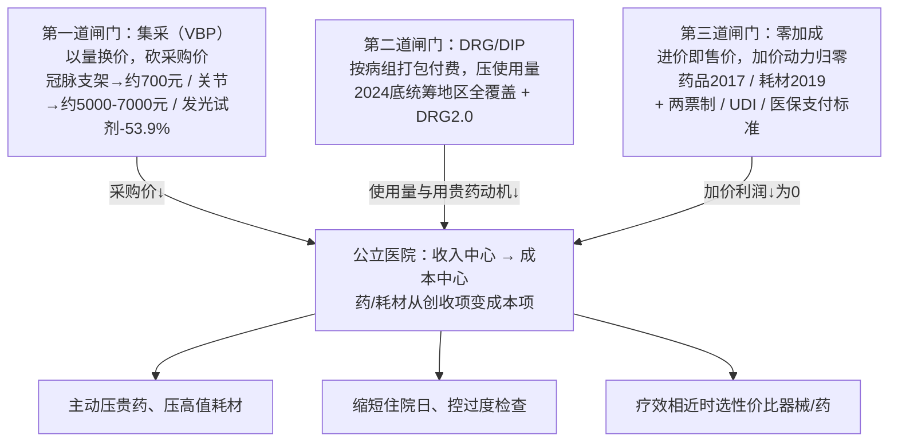
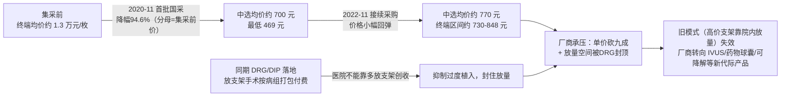

## 本章概览

前一章讲美国器械"钱怎么进来"，靠的是一串五位数报销码。切到中国，决定一台器械、一支耗材、一盒药能不能赚钱的，不是某个编码批没批，而是医院愿不愿意用、用得起多少、用了之后能不能加价。这三件事分别被三道闸门拧住。

这一章拆中国医疗支付端的核心机制。它和美国 PBM 那套返利—价差—处方集完全不是一回事：中国没有 PBM，定价权直接攥在政府手里，且不是一个政策在压，而是三个同向发力的政策在叠加。第一道闸门是**集采**，把采购价直接砍掉一大截；第二道闸门是 **DRG/DIP**，把医院花钱的方式从"按项目收费"改成"按病组打包付费"，逼医院主动省钱；第三道闸门是**零加成**，把医院在药品和耗材上加价的那层利润直接抹平。三道闸门合起来干同一件事：**把公立医院从"收入中心"改造成"成本中心"**——一旦激励反过来，整条产业链上"靠院内放量、靠高价高毛利"的旧模式就被釜底抽薪。

本章逐道闸门讲清机制，用冠脉支架这个被砍得最狠的案例把合力具象化，最后回答一个投资者最容易站队的问题：集采到底毁不毁创新。本章涉及具体公司在集采冲击下的估值变化、含产业判断，但不涉及任何个股多空建议，章末有完整免责声明。

## 钩子：一刀砍掉九成四的价格

2020 年 11 月 5 日，天津，国家组织冠脉支架带量采购开标。

开标前，一枚冠脉支架（心脏介入手术中撑开狭窄血管的金属网管）在中国的终端均价约 1.3 万元，加上流通和回扣层层加码，患者实际负担更高。开标后，10 个拟中选产品价格落在几百元区间，其中山东吉威医疗的雷帕霉素药物涂层支架报出 469 元，是全场最低；中选产品整体均价约 700 元，较此前价格平均下降 **94.6%**【事实，来源：国家医保局；新华网、健康界 2020-11】。

一枚原本卖一万三的支架，砍到七百块。这个降幅和创新药专利到期后被仿制药断崖替代的"专利悬崖"是一个量级，区别在于专利悬崖是市场竞争慢慢磨出来的，集采这一刀是行政开标一次性落下——微创医疗（0853.HK，中国心血管介入器械龙头）、乐普医疗（300003.SZ，国产支架主力厂商之一）这类支架厂商的股价当天就给出了反应。

但这只是第一道闸门。支架进了医院之后，还要过 DRG/DIP 这道"用多少"的闸门，再过零加成这道"能不能加价"的闸门。三道闸门串起来，才解释得了一个反直觉的现象：为什么今天中国的公立医院，会**主动**去压自己采购的贵药和高值耗材。这在十年前是不可想象的。

## 第一道闸门：集采，把采购价砍到地板

**集采**，全称药品/耗材集中带量采购（Volume-Based Procurement，VBP），核心逻辑只有一句话：政府把全国公立医院的采购需求打包成一个确定的量，拿这个量去和厂商谈，谁报价低谁拿走大部分市场份额。过去厂商面对的是分散的医院、靠销售和回扣一家家攻；现在面对的是一个攥着全国订单的买家，要么以低价中标拿到放量，要么出局。"以量换价"是它和普通招标最本质的区别——它承诺采购量，所以厂商敢报低价。

从 2018 年"4+7"试点（11 个城市试点 4 类药品）起步，集采分药品和高值耗材两条线推进。**药品**这条线推进到第 10 批（2024 年底开标、2025 年起落地），单批已覆盖 62 个品种、约 234 家企业的 385 个产品中选，入围规则收紧到"同品种单位可比价不超过最低价 1.8 倍"才能进【事实，来源：国家医保局、ChemLinked 2025】。**高值耗材**这条线砍得更狠，原因在第 14 章讲过的器械逻辑：耗材没有专利悬崖、靠装机—耗材的复利吃饭，一旦被纳入集采，"刀片"端的高毛利就被行政定价直接下杀。

这里有一个必须先讲清的数据口径陷阱，否则后面所有降幅都会被误读。

**集采"降幅"的分母，是"集采前最高有效申报价"，不是真实市场成交均价。** 集采前的挂网价、申报价普遍虚高（含了大量流通加价和回扣空间），用这个虚高价做分母，算出来的降幅天然偏大、带有宣传色彩。所以本书的纪律是：**优先看中选价的绝对值，降幅只作辅助，且每次标清分母口径。** 说"冠脉支架降 94.6%"听着惊人，但真正有信息量的是"中选均价从约 1.3 万元落到约 700 元、最低 469 元"这组绝对数——它告诉你这枚支架现在到底值多少钱，以及厂商还剩多少毛利空间。

把几轮高值耗材集采的绝对值排在一起，降幅的梯度就清楚了：

- **冠脉支架**（2020-11 首批国采）：中选均价约 1.3 万元 → 约 **700 元**（最低 469 元），平均降幅约 94.6%（分母为集采前价）。2022-11 协议期满接续采购，中选均价回升至约 **770 元**，终端价区间约 730–848 元——这条"接续价回升"是高值耗材集采和药品集采的一个关键差异：第一轮砍到见血后，接续往往小幅回弹，给中选厂商留一点喘息【事实，来源：国家医保局、新华网 2022-11】。
- **人工关节**（2021-09 国采）：髋关节均价约 3.5 万元 → 约 **7000 元**，膝关节约 3.2 万元 → 约 **5000 元**，平均降幅约 82%（分母为集采前价），首年意向采购量约 54 万套【事实，来源：国家医保局、新华网 2021-09】。
- **化学发光试剂**（安徽牵头 25 省联盟，2023-12 公布）：这是体外诊断（IVD，in-vitro diagnostics，在人体外用试剂检测血液等样本的诊断方式）试剂的首次大规模省际集采，企业报价平均降幅约 **53.9%**（分母为申报价），覆盖约 1.06 万家医疗机构、年采购需求约 7.1 亿人份、市场规模约 110 亿元，预计年节省采购金额近 60 亿元；其中传染病八项（化学发光法）最高降幅 65.2%【事实，来源：安徽省医保局、医药魔方 2023-12】。

三个案例降幅从 94.6% 到 82% 到 53.9% 递减，恰好对应器械同质化程度的高低：冠脉支架规格高度标准、可纯比价，砍得最狠；人工关节有规格组套差异，居中；IVD 试剂绑定装机系统、替换要重新验证，相对温和。**同质化越高，集采的刀越快。** 这条规律对判断下一个被集采品种的杀价空间，比任何单点降幅都有用【独立观察】。

集采这道闸门拧住的是**采购价**——它直接决定厂商的出厂价和毛利。但只压价不够，如果医院还能靠"多用"把量做大、把利润找回来，集采的效果就被对冲掉了。于是有了第二道闸门。

## 第二道闸门：DRG/DIP，把医院从收入中心改成成本中心

这是中国医疗支付端过去三年最重要、却最容易被外行忽略的变化，重要性不亚于集采本身。

先解释术语。**DRG**（Diagnosis-Related Groups，按疾病诊断相关分组付费）和 **DIP**（Diagnosis-Intervention Packet，按病种分值付费）是两套技术路径不同、目标一致的医保支付方式。核心都是：**医保不再按医院做的每一个项目、开的每一盒药逐项报销，而是按病人得的是什么病、归到哪个"病组"，打包付一个固定的钱。** 一个做心脏支架手术的病人归入某个病组，这个病组医保就付这么多，不管医院实际花了多少。

这一改，把医院的算账逻辑彻底翻了过来。

**旧逻辑（按项目付费）下，医院是收入中心。** 多开一项检查、多用一支贵耗材、多住一天院，医保就多报一笔，医院和科室收入就多一笔。所以过去医院有动机用贵的、用多的，"以药养医""以耗养医"就是这么来的——药品和耗材的加价是医院重要的收入来源。

**新逻辑（按病组付费）下，医院变成成本中心。** 一个病组就付固定的钱，医院花得越少、结余越多；花超了，超出部分医院自己贴。于是医院的激励一夜之间反转：贵药、高值耗材、过度检查、超长住院日，全都从"创收项"变成了"成本项"。医院开始**主动**压采购成本、缩短住院日、在疗效相近时倾向性价比更高的器械和药品。如图 15-1 所示，这正是第二道闸门的作用——它不直接压价，而是压"用量"和"用贵的动机"。

改革的覆盖速度决定了杀伤力。按国家医保局 2021 年底《DRG/DIP 支付方式改革三年行动计划》，目标是到 2024 年底全国所有统筹地区全部开展 DRG/DIP，2025 年底覆盖所有符合条件的住院服务医疗机构、基本实现病种与医保基金全覆盖。到本书数据时点，全国 393 个统筹地区已实现统筹地区全覆盖（DRG 付费 191 个、DIP 付费 200 个，天津、上海两种并行），病种覆盖率约 95%、医保基金覆盖率约 80%【事实，来源：国家医保局；新华网 2021-11、广西财经网 2025-05】。

2024 年 7 月，国家医保局又发布 DRG/DIP **2.0 版**分组方案，要求已开展地区在 2024 年底前完成切换准备工作。2.0 版针对临床反映集中的重症医学、血液免疫、肿瘤、烧伤等 13 个学科优化了分组，DIP 核心病种从 11553 组精简到 9520 组、集中度提升；同时研究创新药械的"DRG 除外支付"政策，给真正的高价值创新留一个不被打包压制的出口【事实，来源：国家医保局 2024-07】。这个"除外支付"的设计很关键——它承认了打包付费会误伤创新药械，是后面讨论"集采毁不毁创新"时的一个重要伏笔。

DRG/DIP 和集采是**叠加**关系，不是替代关系：集采从供给端压采购价，DRG/DIP 从需求端压使用量和用贵药的动机。一个管"进价多少"，一个管"用多少、敢不敢用贵的"。两者咬合，医院两头都被夹住。

## 第三道闸门：零加成，断掉加价的最后动力

前两道闸门压价、压量，但还留了一个口子：如果医院在药品和耗材上能加价销售，那么哪怕进价被集采砍低，医院仍有动力进贵的、然后按比例加价赚差。第三道闸门就是来堵这个口子的。

**零加成**（也叫"零差率"），指公立医院销售药品和医用耗材时，只能按进价卖给患者，不许在进价上加价。这是破除"以药养医、以耗养医"的关键一刀，分两步落地：

- **药品零加成**：2017 年 9 月底前，全国所有公立医院全面取消药品加成（此前普遍允许 15% 的药品加价）。
- **耗材零加成**：2019 年 7 月，国务院办公厅印发《治理高值医用耗材改革方案》，明确 2019 年底前所有公立医疗机构取消医用耗材加成，实现"零差率"销售【事实，来源：国务院办公厅 2019-07；各地医保局执行公告 2019-12】。

零加成把"用贵的"对医院的最后一点好处也抹掉了。加成存在时，进价 1 万元的支架加 15% 就是 1500 元毛利，进价越贵、加价绝对额越大，医院有动机进贵的；零加成之后只能按进价走，一分钱加价赚不到。**药品和耗材从医院的"利润项"变成纯粹的"成本项"**——这和 DRG/DIP 方向完全一致，两道闸门把医院推向同一个行为：能省则省。

围绕这道闸门，还有一组配套的中国器械专属政策，把流通和监管的口子一并收紧：

- **器械两票制**：药品两票制 2017 年发布国家方案、2018 年全国推开（指药品从生产企业到流通企业开一次发票、流通企业到医疗机构再开一次，合计两票，压缩多级代理的加价层级）。参照药品两票制的精神，耗材两票制在多省、多层级推行，把同样的逻辑搬到器械流通、挤掉中间层层过票的灰色空间，但各省执行进度不一，未形成全国统一的单一文件。
- **UDI**（Unique Device Identification，医疗器械唯一标识）：给每一件器械一个全国统一、可追溯的"身份证号"，从生产、流通到使用全程可查。它的产业意义不在合规本身，而在于让监管和医保能精确知道"哪件器械用在了谁身上、花了多少钱"，为带量采购的量统计、为 DRG 的成本核算提供数据底座。
- **医保支付标准**：医保对某类药品/耗材确定一个统一的支付基准价，超出部分原则上患者自付。它和集采中选价咬合，进一步压缩医院选用高价产品的空间。

这三项是让零加成和集采落得更实的螺栓——保证医院没法通过流通加价、信息不透明或选用医保外高价产品，把前面被压掉的利润找补回来。

## 三道闸门合流：医院行为为什么彻底反转

把三道闸门叠在一起，才能看清它们如何汇成同一个结果（如图 15-1 所示）。

**图 15-1：三道闸门如何把公立医院从收入中心改造成成本中心**
（机制依据：国家医保局集采规则、DRG/DIP 三年行动计划与 2.0 版方案、国务院 2019 年高值耗材治理方案；时点见正文与配套数据）

三道闸门各管一段，但指向同一个出口：医院再也没有动机去用贵的、用多的。这是中国医疗支付端和美国最深的结构差异——美国靠 PBM 在处方集上收租、靠返利把医生的用药动机牵着走，中国靠行政三连击直接把医院的算账逻辑重写，让医院自己成为压成本的执行者。

对产业链上游的影响是穿透性的：任何建立在"靠院内放量 + 高价高毛利"上的环节——仿制药、高值耗材、依赖医院走量的器械——都会被三道闸门同时从价、量、加价三个方向挤压。这也是为什么集采落地时，相关公司估值常出现一次性的"集采悬崖"式下调（de-rating，市场给的估值倍数被系统性下移），其逻辑和创新药专利悬崖在估值上同构：一个可预期、不可逆的盈利能力台阶式下降【分析】。

## 双重冲击：冠脉支架不只是被砍了价

回到开篇的冠脉支架，把它放进三道闸门里看，才能理解它受到的不是单一打击，而是叠加冲击（如图 15-2 所示）。

**图 15-2：冠脉支架——集采压价 × DRG/DIP 压量的双重冲击（看绝对值，不只看降幅）**
（数据来源：国家医保局集采与接续采购结果；时点见标注。降幅分母为集采前价，正文以中选价绝对值为准）

第一重冲击是集采压价：单枚支架出厂价被砍掉九成，毛利空间压到极薄。第二重冲击常被忽略：在按项目付费的旧时代，价格被砍了，厂商和医院理论上还能靠"多放几个支架"把总量做大、部分对冲降价；但 DRG/DIP 落地后，冠脉介入手术被纳入病组打包付费，医院多放一个支架不再多得医保的钱、反而要自己承担成本，过度植入的动机被抑制。**单价被砍的同时，靠放量对冲的路也被堵死了。** 这就是三道闸门叠加的杀伤力——不是三选一，而是同时生效。

但要守住一条口径纪律：**单品单价降 94.6%，不等于厂商该业务收入降 94.6%，更不等于利润降 94.6%。** 放量（中标厂商拿到全国份额）、进口退坡腾出的份额流向国产中标厂商、毛利结构变化都会对冲。把"单价降幅"直接当"业绩降幅"是产业分析常见的误读。集采后微创、乐普承受的是单价和估值双杀，但份额向头部集中、叠加转向血管内超声（IVUS）、药物球囊、可降解支架等下一代产品，业务并未归零——器械靠迭代而非单一专利吃饭，在这里成了缓冲【分析】。

## 集采到底毁不毁创新

这是涉及中国医药投资时最容易站队、也最该冷静拆开的问题。市场上有两种极端叙事：一种说集采"毁灭创新"，利润压没了谁还研发；另一种说集采"利好创新"，省下的钱全腾给创新药。两种都过于干脆。本书的判断是：**集采毁的是"靠老仿制药和成熟耗材躺着赚高毛利"的旧商业模式，毁的不是创新本身。** 拆成三层看。

**事实层。** 集采的标的，绝大多数是过专利期、竞争充分、可比价的成熟品种——仿制药和标准化耗材。真正在专利期、有临床数据差异、暂无可替代的创新药并不直接进集采比价池。集采的设计意图是"腾笼换鸟"：把医保在仿制药红海上多付的钱省下来，腾给创新药的准入。

**机制层。** "腾笼换鸟"在制度上有承接。2025 年 12 月 7 日，国家医保局、人社部首次发布《商业健康保险创新药品目录》（业内长期称"丙类目录"，指基本医保目录之外、由商业健康保险承接的创新药清单），首版纳入 19 个品种，涵盖 CAR-T 细胞治疗、戈谢病等罕见病用药、阿尔茨海默病治疗药，2026 年 1 月 1 日起执行【事实，来源：国家医保局 nhsa.gov.cn 2025-12-07】。加上 DRG/DIP "创新药械除外支付"、运行多年的医保谈判（乙类目录"灵魂砍价"）、双通道（谈判药院外特药药房），制度上在搭"基本医保保仿制 + 商保和谈判托创新"的双层结构——集采压制的环节（仿制药/成熟耗材）和承接创新的环节（丙类/谈判/除外支付）是分开的。

**待观察层（预测，不确定性高）。** 制度搭好不等于钱真能到位。丙类目录能不能成为有效的"第二支付方"，取决于商业健康保险的覆盖面和支付能力能不能放量——首版 19 个品种、刚于 2026 年初落地，规模还很小，商保在中国整体渗透率仍低。若商保托不起，"腾笼换鸟"就只腾了笼、没换成鸟，创新药的国内回报兑现会打折扣。所以本书立场是**谨慎正面**：集采不构成对创新的系统性扼杀，它倒逼的是商业模式升级（从仿制躺赚转向真创新）；但"丙类/商保能否有效承接"尚未兑现，截至 2026 年中下结论为时过早【分析+预测】。

对投资判断的含义很清楚：在中国，单纯靠成熟品种、靠院内高毛利放量的生意，估值要长期承受集采悬崖的折价；能持续产出专利期内、有临床差异化、进得了谈判或丙类目录的真创新，才有可能绕开三道闸门、拿到结构性定价空间。这条线索会延续到第 26 章中国创新药出海——当国内三道闸门压住旧模式，把创新资产授权给需要补管线的跨国药企（License-out），就成了另一条变现路径。

## 小结

- 中国医疗支付端靠三道同向发力的闸门拧住产业链：**集采**压采购价（冠脉支架→约 700 元、人工关节→约 5000–7000 元、化学发光试剂降 53.9%）、**DRG/DIP** 按病组打包付费压使用量（2024 年底统筹地区全覆盖 + 2.0 版）、**零加成**抹平加价动力（药品 2017、耗材 2019）。三者叠加，把公立医院从收入中心改造成成本中心。
- 医院的算账逻辑被彻底反转：旧逻辑下多用贵的=多创收，新逻辑下多用贵的=多花自己的钱。于是医院**主动**压贵药、压高值耗材、缩住院日、选性价比器械。这是中国和美国（靠 PBM 返利—处方集收租）最深的结构差异——中国靠行政三连击直接重写医院激励。
- 【口径纪律】集采降幅的分母是"集采前最高有效申报价"（虚高），优先看中选价绝对值、降幅作辅助；且单品单价降幅 ≠ 公司收入降幅 ≠ 利润降幅，放量、份额集中、产品迭代都会部分对冲。把单价降幅当业绩降幅是常见误读。
- 【独立观察】集采杀价的狠度和品种同质化程度正相关：冠脉支架（高度标准）-94.6% > 人工关节（有组套差异）-82% > IVD 试剂（绑定装机）-53.9%。这条规律比任何单点降幅更能用来预判下一个被集采品种的空间。
- 集采毁的是"靠老仿制药/成熟耗材躺赚"的旧模式，不是创新本身：标的是过专利期成熟品种，制度上有丙类目录（2025-12 首版 19 品种）、医保谈判、DRG 除外支付来承接创新。但"商保/丙类能否有效放量承接"尚未兑现，是必须持续观察的变量。谨慎正面，不洗白也不唱衰。
- 下一章把三道闸门的另一面——医保和商保怎么"砍价与托底"——讲透：灵魂砍价怎么谈、丙类目录这第二支付方能不能立起来、中国医保的可持续性边界到底在哪里，是第 16 章的主题。

## 配套数据

见 `data/15-china-vbp-drg/`。本章用到的所有数据源详见 `data/15-china-vbp-drg/sources.md`。

---

> **免责声明**
>
> 本章涉及具体公司在集采冲击下的产业判断与估值变化分析，仅为作者基于公开信息的研究结果，**不构成任何投资建议**。市场有风险，投资决策应基于读者自身的独立判断和专业咨询。
>
> 本章使用的政策与数据截至 2026-05，集采批次、DRG/DIP 覆盖进度、丙类目录品种与公司基本面可能在阅读时已发生变化（医药政策与管线为月度变化的快变量）。本章中提到的公司、降价幅度、中选价格等信息均为分析素材，作者不对其准确性、完整性或时效性作任何承诺。
>
> **作者持仓披露**：截至本章数据时点（2026-05），作者未持有微创医疗（0853.HK）、乐普医疗（300003.SZ）及本章提及的其他相关公司的股票或衍生品。

---

> 本章来自《医疗经济学》开源版 · 作者「递归客」  
> 在线阅读完整书系：[inferloop.dev](https://inferloop.dev) · 反馈与勘误：[GitHub Issues](https://github.com/diguike/book-healthcare-economics/issues)
