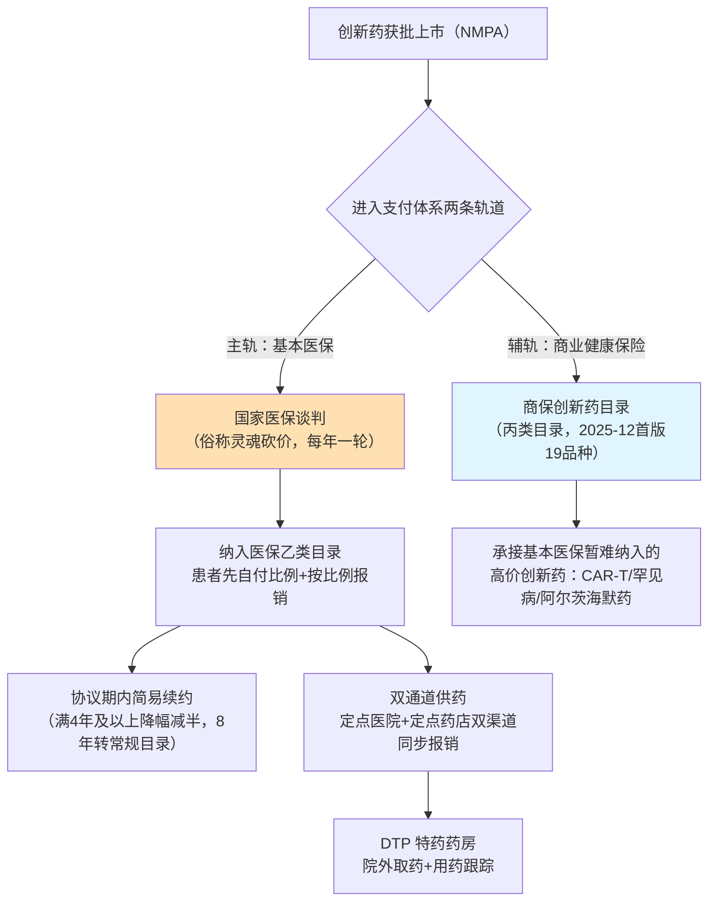
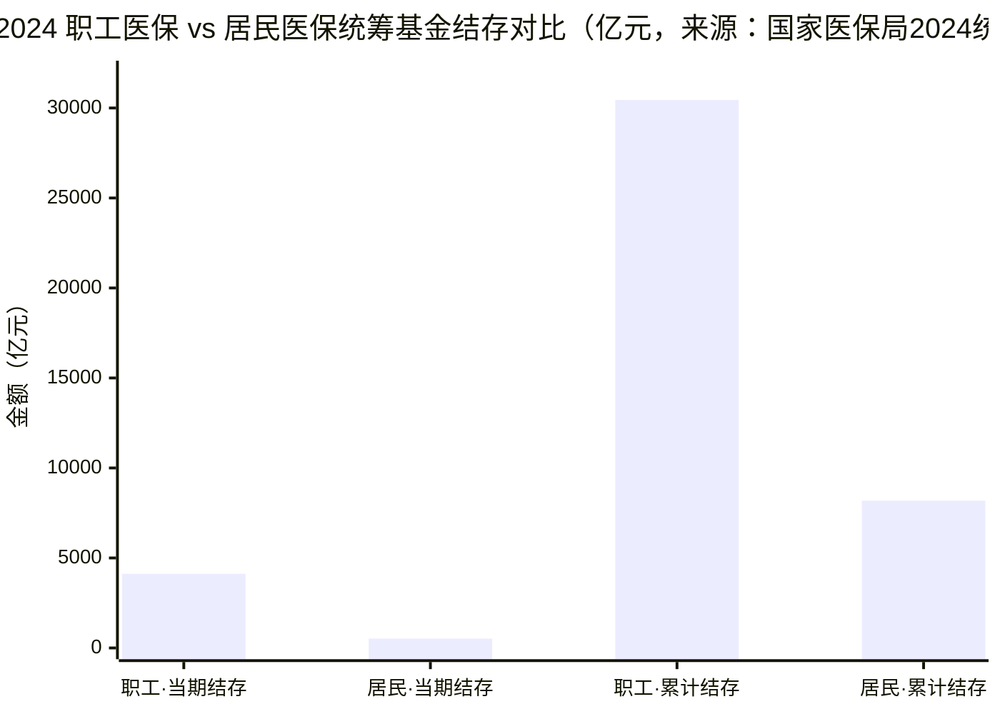

## 本章概览

上一章讲中国医疗支付端的三道闸门——集采压采购价、DRG/DIP 压使用量、零加成抹平加价——把公立医院从收入中心改造成成本中心。三道闸门解释了"旧模式怎么被压住"，但没回答另一半问题：被压住之后，一款真正有临床差异化的创新药，靠什么进到中国市场、卖出什么价、放出多大的量。

这一章拆的就是中国创新药的准入与定价机制，以及托住这套机制的钱袋子能撑多久。这里要先纠正一个流行的误解：很多人以为中国创新药的市场化准入是 2025 年底"丙类目录"才开始的新鲜事。不是。基本医保的**医保谈判**（俗称"灵魂砍价"）从 2016 年首次试水、2019 年起每年一轮，已经运行了近十年；为谈判药配套的**简易续约**、**双通道**、**DTP** 这些机制也跑了好几年。丙类目录是给这套体系补的一块拼图，不是从零起步。

理解中国药价，要抓住一个和美国、日本都不同的特征：**价格不是厂商定的，也不是市场撮合出来的，而是医保局在谈判桌上以"承诺采购量"换"大幅降价"，一对一谈出来的。** 砍价是这套机制的一面，托底是另一面——谈判把价格砍到地板，靠的是医保基金兜住放量后的开支。所以这一章的后半段必须算一笔账：中国医保的钱够不够、分化在哪里、可持续性的边界在哪。这条边界，就是约束所有创新药在中国定价和放量的天花板。

本章涉及国产创新药企在医保准入下的产业判断，不涉及任何个股多空建议，章末有完整免责声明。

## 钩子：灵魂砍价砍出来的国产 PD-1

2019 年的国家医保谈判桌上，四款国产 PD-1（一类免疫检查点抑制剂，抗体阻断 PD-1 通路、解除肿瘤对 T 细胞的免疫压制，是当时最热的抗癌药靶点）同台角逐，最后只有信达生物（Innovent，1801.HK，国产 PD-1/双抗第一梯队 biotech）的信迪利单抗（商品名达伯舒，sintilimab）一家谈成，成为当年唯一进入国家医保目录的 PD-1。

代价是价格。谈判前，达伯舒的挂网价是每瓶（100mg）7838 元；谈成后从 2020 年 1 月 1 日起按 2843 元结算，单瓶降价 **63.73%**【事实，来源：北京大学肿瘤医院全球肿瘤快讯、新浪财经 2019-12；国家医保局谈判材料】。按当时唯一获批的复发难治经典霍奇金淋巴瘤适应症算，赠药前的年治疗费用约 26.6 万元，厂商买赠方案下年治疗费用明显低于此数（据当年买赠方案估算，具体条款未公开），进医保后医保的年采购价降到约 10.23 万元，再经各地报销，患者实际自付又降一截【事实，来源：国家医保局公开的谈判测算材料 2019】。

单价砍掉近三分之二，看起来是厂商吃了大亏。但故事的另一半是"量"。进医保前，达伯舒只能卖给一个很窄的、自费的难治淋巴瘤人群；进医保后，叠加适应症陆续扩展到肺癌等一线大瘤种，可及患者从"几千人级"扩到"几十万人级"，2020 年营收冲到约 22.9 亿元（达伯舒产品收入口径，同年信达生物总收入约 38.4 亿元）【事实，来源：信达生物 2020 年报】。这就是中国创新药定价的底层逻辑——**以量换价**：医保用全国统一的采购量做筹码，把单价压到厂商利润的临界线附近，再用放量把厂商的总盘子重新做大。砍价砍的是单价，托底托的是放量后的总开支。

把这套逻辑讲透，需要先看清中国创新药准入根本不止"丙类"一条路。

## 双轨准入：基本医保乙类谈判与商保丙类目录

中国创新药进入支付体系，走的是两条并行的轨道，主轨是基本医保，辅轨是 2026 年刚落地的商业健康保险目录。如图 16-1 所示。

先对齐几个术语。中国基本医保的药品目录分**甲类**和**乙类**：甲类是临床必需、价格低廉的基础用药，报销不需要患者先自付比例；**乙类**是疗效好但价格较高的药，患者要先自付一定比例（各地 10%–30% 不等），余下部分再按比例报销。**绝大多数创新药、几乎所有谈判药，进的都是乙类**——它们贵，需要患者分担一部分，但通过谈判把价格压到医保和患者都能承受的水平。

图 16-1：中国创新药准入双轨——基本医保乙类谈判为主轨，商保丙类目录为 2026 年新增辅轨（来源：国家医保局《谈判药品续约规则》2023、"双通道"指导意见 2021、《商业健康保险创新药品目录》2025-12；本书整理）

主轨**国家医保谈判**有一段渐进的历史：2016 年由原人社部主导过一次小规模首谈（3 个药）、2017 年首次批量系统性谈判（36 个药纳入目录），2018 年单独谈了 17 个抗癌药，2019 年起进入每年一轮的年度化常态机制。此后每年开展一轮目录调整谈判，把当年值得纳入的高价药拉到桌上一对一砍价。"灵魂砍价"这个民间叫法，来自谈判现场医保方代表反复压价、厂商代表当场计算让步空间的画面。它的本质和上一章的集采是一脉相承的——都是"以量换价"，区别在于：集采打的是过专利期、可比价的成熟仿制药和耗材，靠多家竞价压到地板；谈判针对的是独家的、有专利和临床数据的创新药，没有同品种竞争对手，靠的是医保方对"全国销量"这个筹码的垄断性议价权。

2024 年这一轮，谈判/竞价成功 89 个品种、成功率 76%，平均降价 63%；新增的 91 个药里有 38 个是"全球新"的创新药，创新药的谈判成功率超过 90%，比总体成功率还高 16 个百分点【事实，来源：国家医保局 2024 年目录调整新闻发布会，澎湃新闻转述 2024-11】。"平均降价 63%、创新药成功率九成"这组数告诉你两件事：进医保的门票要用大幅降价来换，但只要愿意降，创新药基本能谈成。

## 既有机制：简易续约、双通道与 DTP

如果谈判只是"砍一次价、进一次目录"，厂商每年都要面对重新谈判、可能被踢出目录的不确定性，没人敢把产能和商业化压上去。中国这套体系运行多年、能稳住厂商预期，靠的是三个常被外界忽略的配套机制。

**简易续约**，是给已在目录内的谈判药一条"不必每年重新血拼"的通道。按 2023 年发布、2024 年沿用的《谈判药品续约规则》：一个独家药如果实际医保基金支出没有超过当初测算预算的 200%、且未来两年预算增长合理，就可以走简易续约，续约有效期 2 年，不必重回谈判桌从头砍；协议期累计达到或超过 4 年的品种，简易续约触发的降幅还要减半；在目录里满 8 年的，直接转入常规目录管理、不再单独谈判【事实，来源：国家医保局《谈判药品续约规则》政策解读 2023-07、续约规则文本 2024-06】。这套规则把"进了医保就年年被砍"的恐惧降下来——2024 年走简易续约的药品平均降幅只有约 1.2%，约八成维持原价、超九成降幅不超过 5%【事实，据国家医保局 2024 年目录调整发布会实录（nhsa.gov.cn）；注：简易续约统计口径以医保局原文为准】。换句话说，砍价主要砍在"首次进目录"那一刀，进去之后价格相对稳定，这给了厂商可预期的回报曲线。

**双通道**，解决的是"谈成了却买不到"的落地难题。谈判药降价进了目录，但很多医院因为药占比考核、DRG/DIP 控费、品种数量限制，不愿意进货这些高价创新药，患者拿着医保资格却在医院开不到药。2021 年 4 月，国家医保局、国家卫健委联合印发"双通道"指导意见，要求通过**定点医疗机构和定点零售药店两个渠道**同时供应谈判药，且两个渠道都纳入医保报销【事实，来源：国家医保局、国家卫健委《关于建立完善国家医保谈判药品"双通道"管理机制的指导意见》医保发〔2021〕28 号，2021-04】。患者在医院开不到，可以到指定的药店买、同样能报销。

承接双通道处方的零售端，主力是 **DTP 药房**（Direct-to-Patient，直接面向患者的药房）。DTP 指患者凭医院处方到药房取药，药房按指定时间地点送药上门，并跟踪患者用药进展、提供用药咨询的特药销售模式，多用于肿瘤、罕见病等需要专业指导的高价药。"双通道"政策出来后，遴选标准高度吻合的 DTP 药房成了谈判药院外放量的主要承接方。这条院外渠道，正是第 11 章讲零售与 DTP 药房时埋下的伏笔在支付端的对应。

简易续约稳预期、双通道保供应、DTP 接院外——这三件运行多年的机制加上每年的谈判，构成了中国创新药准入的主体。把它们看清楚，才不会被"丙类目录"的新闻误导成"中国创新药准入到 2025 年底才开始市场化"。

## 辅轨：丙类目录这第二支付方

那为什么还需要丙类目录？因为主轨有它够不着的地方。

基本医保是"保基本"，对单价极高、受益人群很窄的药——CAR-T（嵌合抗原受体 T 细胞疗法，一次性治疗动辄上百万元）、戈谢病等超罕见病用药、阿尔茨海默病新药——直接纳入基本医保会冲击基金的公平性和可持续性。这些药谈判也很难谈进来：降价幅度再大，绝对价仍超出基本医保的承受口径。

2025 年 12 月 7 日，国家医保局、人社部首次发布**《商业健康保险创新药品目录》**（业内俗称**丙类目录**，指基本医保目录之外、由商业健康保险承接支付的创新药清单），首版纳入 19 个品种，涵盖 CAR-T 细胞治疗、罕见病用药、阿尔茨海默病治疗药，2026 年 1 月 1 日起执行【事实，来源：国家医保局 nhsa.gov.cn 2025-12-07】。它的定位很清楚：**基本医保保仿制和常规创新，商保托住基本医保暂时托不起的高价创新。** 这正是上一章"腾笼换鸟"（把医保在仿制药上省下的钱腾给创新药）逻辑的延伸——集采省下的钱腾给基本医保里的谈判药，而基本医保仍然托不动的那一档，由商保丙类来接。

但要冷静：丙类目录是 2026 年初才落地的辅轨，规模还很小，首版只有 19 个品种，且它依赖中国商业健康保险的覆盖面和支付能力。中国商保的盘子相对基本医保还很薄：2024 年商业健康险保费收入约 9774 亿元，2023 年赔付支出约 3800 亿元、仅占居民医疗费用的 7% 左右【事实，来源：国家金融监督管理总局、中国保险行业协会数据，第一财经/新浪财经转述 2025-04】。这个第二支付方能不能真正"立起来"，截至 2026 年中还没有兑现，是必须持续观察的变量。本书给两个可量化的观察/证伪指标，避免把判断停在"看好/看空"：其一，**丙类目录的品种扩容速度**——2026 年内的下一版若仍停在 20 个品种上下、迟迟不放量，说明承接能力受限；若较首版 19 个明显翻倍，则辅轨在变粗。其二，**商保对丙类品种的实际理赔规模**——商业健康险赔付支出占居民医疗费用的比重若多年卡在 7% 左右不上行、或丙类品种的商保理赔人数始终停留在小几万人级，则"第二支付方"更多是名义而非有效增量【分析+预测】。把丙类目录当成中国创新药准入的"主战场"，是把一块刚铺的辅轨说成了干线。

## 托底的钱：医保可持续性的真实边界

砍价砍得动、放量放得出，前提是医保基金兜得住。这就要回到本章后半段那笔账：托底的钱够不够。

这里先把口径划清楚，因为这是最容易被危言耸听的地方。**统筹基金**指参保人缴费和财政补助汇集起来、由医保统筹层级（多为地市级）统一调剂使用的资金池，区别于职工医保里归个人支配的个人账户。判断医保可持续性，要看的是统筹基金，而且必须区分两个完全不同的盘子：职工医保和居民医保。

按国家医保局《2024 年全国医疗保障事业发展统计公报》，2024 年全国基本医保统筹基金当期结存 4639.17 亿元、累计结存 38628.52 亿元，全国口径是收支平衡、略有结余的【事实，来源：国家医保局 2024 年统计公报，2025-07 发布】。**所以"全国医保要穿底"的叙事，在官方口径下不成立。** 但平均数掩盖了结构分化，把职工和居民拆开看，两个盘子的健康度差得很远，如图 16-2 所示。

图 16-2：职工与居民医保结存分化——同为基本医保，两个资金池健康度差距悬殊；单城出现当期赤字不等于全国穿底（来源：国家医保局《2024 年全国医疗保障事业发展统计公报》，2025-07）

差距是结构性的。**职工医保**由在职职工和单位缴费、缴费基数随工资增长，2024 年统筹基金当期结存 4119.75 亿元、累计结存高达 30445.50 亿元，盘子厚、当期还在大幅净流入。**居民医保**覆盖没有单位缴费的城乡居民（老人、儿童、灵活就业、农村人口），筹资靠个人缴费加财政补助，2024 年基金收入 11180.91 亿元、支出 10661.49 亿元，当期结存只有 519.42 亿元——支出已经吃掉收入的约 95%，结余率不到 5%，累计结存 8183.02 亿元也远薄于职工医保【事实，来源同上】。两个盘子的差异根源在人口结构：职工医保是"年轻人多缴、相对健康"，居民医保是"老人和低收入人群多、缴费能力弱、医疗需求高"，且居民医保高度依赖财政补助托底——这才是可持续性压力的真实落点。

至于"某某城市医保已经穿底"的说法，要格外当心口径。确有个别学术研究和单城测算给出过具体的当期缺口数字（如对天津、北京城乡居民医保的城市级测算，以及某些城市模型推算到 2030 年代出现统筹基金当期赤字）——但这些**都是单城或特定城市的学术模型，不是全国口径，本书不对其原始测算做二次背书，更严禁外推成"全国医保穿底"**。截至本书数据时点，没有检索到 2025 年版全国统一口径的权威医保赤字预测【口径说明；找不到全国权威预测即明确标注，不编】。负责任的判断是：**居民医保的局部、结构性压力真实存在，全国性穿底叙事不成立。** 老龄化、大病保障刚性增长确实让筹资压力从周期性转向结构性，但延迟退休、门诊统筹改革、筹资模式调整、集采腾笼换鸟也都是对冲手段。把医保可持续性当成危言耸听的"末日叙事"，和把它当成"不存在的问题"，都偏离事实。

## 可持续性如何约束创新药定价与放量

把砍价、托底两面合起来，对创新药投资判断的含义就清楚了。

医保可持续性是创新药在中国定价和放量的**天花板**，而不是地板。它从两个方向施加约束。一是**定价方向**：谈判降幅之所以年年这么狠、简易续约还要继续挤，根子在于医保基金（尤其居民医保盘）的结余空间有限，不可能给单一品种留出无节制的开支。把额度量级摆出来就直观了：2024 年居民医保全年当期结存只有 519.42 亿元、结余率不到 5%，这点钱要覆盖全国近十亿城乡居民一年新增的全部用药需求，能分给任何单一创新品种的"腾挪额度"都极其有限。一款药的峰值销售上限，本质上被"医保愿意为它腾出多少基金额度"锁死——这和美国靠 PBM 返利博弈、日本靠政府改定的天花板逻辑不同，但同样是天花板。二是**放量方向**：以量换价能不能换出量，取决于医保和（对高价药而言）商保托不托得住放量后的总开支。基本医保托得动的，靠谈判+双通道放量；托不动的，要等丙类目录这个第二支付方能不能立起来。

落到判断上，本书的立场延续上一章：在中国，**靠成熟品种、靠院内高价高毛利躺赚的旧模式，估值要长期承受集采和控费的折价；能持续产出有临床差异化、进得了谈判或丙类目录的真创新，才有机会拿到结构性定价空间——但这个空间的上沿，被医保可持续性死死压着。** 这也解释了为什么越来越多中国 biotech 把"国内进医保放量"和"把资产授权给海外药企（License-out）拿确定性现金"当成两条并行的变现路径——当国内市场的定价天花板就在那里，海外授权的首付款就成了对冲国内回报上限的另一条腿。这条线索，会在第 26 章中国创新药出海里展开。

## 小结

- 中国创新药准入不止"丙类"一条路。主轨是运行近十年的**基本医保谈判**（灵魂砍价，每年一轮，2024 年谈判/竞价成功率 76%、平均降价 63%、创新药成功率超 90%），配套**简易续约**（稳预期，2024 年简易续约平均降幅约 1.2%）、**双通道**（保供应，2021 年起定点医院+定点药店双渠道报销）、**DTP 药房**（接院外）；辅轨才是 2025-12 首版 19 品种的**丙类目录**（商保托高价创新）。把丙类当成中国创新药准入的起点是误读。
- 中国药价的底层逻辑是**以量换价**：医保用全国采购量做筹码一对一砍价（达伯舒单瓶降 63.73%、从 7838 元到 2843 元），厂商用进医保后的放量把总盘子重新做大（2020 年营收约 22.9 亿元）。砍价砍单价，托底托放量后的总开支。
- 【口径纪律】医保可持续性要看统筹基金、且必须分职工/居民两个盘子。2024 年全国统筹基金当期结存 4639 亿、累计 38628 亿，全国口径收支平衡略有结余——"全国穿底"叙事不成立。但居民医保当期结余仅 519 亿、结余率不到 5%，远薄于职工医保（累计结存 30445 亿），结构分化真实存在，居民盘靠财政补助托底。
- 【口径纪律】个别城市级赤字数字均为单城/学术模型，本书不外推全国，也未检索到 2025 全国权威赤字预测。负责任的判断是"局部结构性压力真、全国穿底假"，既不危言耸听也不当不存在。
- 医保可持续性是创新药在中国定价（峰值被医保腾挪额度锁死）和放量（取决于基本医保/商保托不托得住）的**天花板**。靠成熟品种院内躺赚的旧模式承受折价，有差异化的真创新才有结构性定价空间，但上沿被基金能力压着——这也是中国 biotech 把国内进医保与海外 License-out 当两条腿走的根本原因，承接第 26 章。

## 配套数据

本章配套数据表与完整数据源清单见本章同名配套数据目录。

---

> **免责声明**
>
> 本章涉及国产创新药企在医保准入机制下的产业判断与定价/放量分析，仅为作者基于公开信息的研究结果，**不构成任何投资建议**。市场有风险，投资决策应基于读者自身的独立判断和专业咨询。
>
> 本章使用的政策与数据截至 2026-05，医保谈判轮次、简易续约规则、丙类目录品种、医保基金结余与公司基本面可能在阅读时已发生变化（医药政策与医保数据为快变量，逐年更新）。本章中提到的公司、药品、降价幅度、基金结余等信息均为分析素材，作者不对其准确性、完整性或时效性作任何承诺。
>
> **作者持仓披露**：截至本章数据时点（2026-05），作者未持有信达生物（1801.HK）及本章提及的其他相关公司的股票或衍生品。

---

> 本章来自《医疗经济学》开源版 · 作者「递归客」  
> 在线阅读完整书系：[inferloop.dev](https://inferloop.dev) · 反馈与勘误：[GitHub Issues](https://github.com/diguike/book-healthcare-economics/issues)
