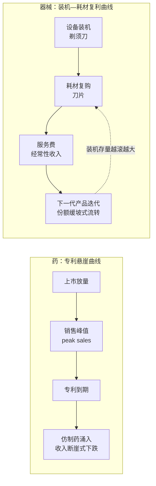
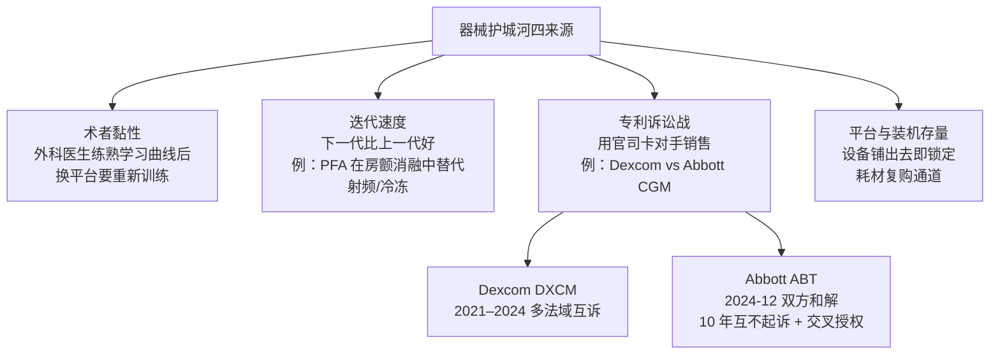

## 本章概览

一台达芬奇手术机器人卖给医院，标价两三百万美元，这是新闻里会写的数字。但对 Intuitive Surgical（直觉外科，ISRG，全球软组织手术机器人龙头）来说，把机器装进手术室那一刻，生意才刚开始。机器装好以后，每做一台手术都要换一批专用器械和耗材，每年还要交一笔服务费。卖机器是一锤子买卖，卖耗材和服务是细水长流，而真正撑起这家公司利润和估值的，是后者。

2025 财年（截至 2025-12-31，下同），Intuitive 总收入约 100.6 亿美元，同比增长 21%；其中"器械与配套耗材"（instruments & accessories，公司财报口径，下文简称 I&A）一项就有约 60.2 亿美元，占总收入约六成（数据来源：Intuitive 2025 年第四季度及全年初步业绩公告，2026-01）。卖机器的收入只是引子，跟着机器走的耗材才是主菜。

这一章讲的就是这套生意逻辑：器械的商业模式、监管路径、估值方法，跟前面十几章讲的"药"是两套完全不同的东西。药的价值押在一个分子和它的专利上，专利一到期，仿制药涌入，销售额断崖式下跌——这是第 25 章会专门拆的"专利悬崖"。器械没有这种一夜归零的悬崖。它的护城河是另一种形态：装机—耗材的现金流复利、外科医生用顺手了不想换的黏性、一代比一代好的迭代速度，以及围绕专利打的诉讼战，衰减起来不是跳水，是温水里慢慢被对手蚕食份额。也正因为底层逻辑不同，给器械估值不能套用创新药那套 rNPV（风险调整净现值，把在研管线按成功概率折现），本章最后会讲清楚它该用哪把尺。

本章涉及具体公司的财务数据与估值方法讨论，不构成投资建议。

## 没有分子悬崖，只有缓坡

把药和器械的收入曲线画在一起，差别一眼就能看出来（图 17-1）。

一款创新药的生命周期是一条"爬坡—登顶—跳水"的曲线：上市后逐年放量，几年内冲到销售峰值（peak sales），专利保护期内独占市场赚回研发投入，专利一到期，仿制药或生物类似药涌入，原研价格和销量在一两年内崩掉大半。Humira（阿达木单抗，全球曾经的"药王"）就是教科书案例，生物类似药上市后销售额腰斩。这条曲线的命门是单一分子专利：价值高度集中，到期点明确，断崖不可避免。

器械的收入曲线是另一种形状。它没有一个"专利到期日"能让收入归零，因为器械的价值不押在一个分子上，而是分散在成百上千项工艺、材料、算法专利和持续迭代里。单项专利到期不致命，竞争对手就算绕过某一项专利，也绕不开你已经装进几千家医院的存量设备、已经被几万名医生练熟的操作习惯。所以器械龙头的收入是一条随装机存量越滚越大的复利曲线，衰减时也是缓坡——被下一代产品慢慢蚕食份额，而不是悬崖跳水。

图 17-1：药的专利悬崖曲线（断崖式衰减）与器械的装机—耗材复利曲线（缓坡式护城河）并置对比。药的价值集中在单一分子专利，到期即崩；器械的价值分散在装机存量与持续迭代上，没有归零点。

这里要先打个补丁，免得把话说绝对。器械"没有悬崖"指的是没有药那种**分子层面的专利悬崖**，不等于器械没有风险。它有两种别的"悬崖"形态：一是专利诉讼战，对手用专利官司直接卡你某款产品的销售（本章后面讲 Dexcom 和 Abbott 的 CGM 之战）；二是中国特色的"集采悬崖"——一次国家集中采购就能把高值耗材单价砍掉八九成（第 18 章会专门拆 IVD 的集采）。后一种在中国市场上，效果其实和专利悬崖一样，是一次性的、行政性的、断崖式的估值重定价。所以严谨的说法是：器械没有分子悬崖，但有诉讼战、有平台迭代式的份额流失、在中国还有集采悬崖。

## 剃须刀-刀片：装机—耗材—服务的三段复利

器械生意里最值钱、也最区别于药的，是"剃须刀-刀片"模型（razor-and-blade，吉列卖剃须刀架不赚钱、靠卖刀片赚钱的经典商业模式）。设备本身是"剃须刀"，可能毛利不高甚至贴钱铺机；真正赚钱的是绑死在设备上的"刀片"——专用耗材、试剂、配套器械，高毛利、高复购、随装机存量复利增长。

Intuitive 是这套模型最干净的样本。把它的收入拆成三段：

第一段是卖设备（剃须刀）。截至 2025-12-31，全球达芬奇手术系统装机量达到 11,106 台，比上一年的 9,902 台增长 12%（来源：Intuitive 2026-01 初步业绩公告）。每多装一台机器，就是在存量上又加了一个未来持续买耗材的客户。

第二段是卖器械和耗材（刀片），这是利润主体。2025 财年 I&A 收入约 60.2 亿美元，同比增长 19%，主要由全球手术量约 19% 的增长驱动。达芬奇的核心机械臂器械有使用次数寿命，用满就得换，每台手术消耗一批，手术量越大、装机越多，耗材收入越高。这部分收入的可预测性远高于药企——药企每年都要赌新药能不能上市，而 Intuitive 只要存量机器还在做手术，耗材收入就稳定地往里流。

第三段是服务费，每台装机每年交服务合约费，又是一笔随装机存量增长的经常性收入。

三段叠起来，结果是：卖设备这一锤子买卖只占小头，跟着装机走的经常性收入（耗材+服务）才是大头。2025 财年约六成收入来自 I&A，加上服务，经常性收入占比更高。这就是为什么器械龙头的现金流比创新药更稳——它不靠"下一个重磅新药"（blockbuster，指年销售额超过 10 亿美元的药）押注，靠的是已经铺出去的存量设备日复一日地消耗刀片。

把这套复利拆成数字，剃须刀-刀片就从一个比喻变成可算的判断。用公司披露的口径自己推一遍：2025 财年 I&A 收入约 60.2 亿美元，全年平均装机量取年初年末的均值约 1.05 万台（9,902 与 11,106 取中），算下来**每台在装达芬奇一年贡献的 I&A 收入约 57 万美元**——这就是每把"剃须刀"每年甩出的"刀片"年金。再看增速结构：I&A 同比增长 19%，可以拆成两块，一块是装机存量本身扩张约 12%，另一块是单台机器手术强度提升带来的约 6%（1.12×1.06≈1.19，与手术量约 19% 的增长互相印证）。这个拆解有个对投资判断很要紧的含义：**即便 Intuitive 明年一台新机器都卖不出去，光靠存量装机手术量自然爬升，I&A 仍能有约 6% 的底部增长**。药企没有这种东西——专利一到期，存量处方不会替你续命，反而加速流失。器械的存量装机是会自己生息的本金，这是 razor-blade 模型最硬的部分。（上述每台 I&A 与增速拆解为作者据公司 2026-01 披露的 I&A、装机量数据自行测算，非公司口径。）

Stryker（史赛克，SYK，全球骨科与手术设备龙头）的 Mako 手术机器人是同样的打法。Mako 把骨科植入物和手术机器人绑在一起：医院用了 Mako 做关节置换，就更倾向于用 Stryker 的植入物。2024 财年（日历年）Stryker 骨科业务收入约 91 亿美元、MedSurg 与神经技术业务约 135 亿美元，公司整体毛利率约 64%（来源：Stryker 2025-01 全年业绩公告）。机器人本身不是利润核心，被机器人锁定的植入物和耗材复购才是。

需要分清的是毛利率口径。器械龙头的公司整体毛利率多在 60%–70% 之间（有实物制造成本，比创新药产品级边际毛利 85%–95% 低——该口径指药品本身的产品级毛利、不含研发摊销，见第 5 章对创新药成本结构的拆解），但单看耗材/试剂这种"刀片"，毛利率可以高得多——这一点在 IVD（体外诊断）里更极端，化学发光试剂毛利率能到 80%–90%，留到第 18 章细讲。本章只需记住：公司整体毛利、设备级毛利和耗材级毛利是三个不同层级，引用时必须标清楚是哪一层。

## 为什么器械研发更短：510(k) 与 PMA

商业模式之外，器械和药在监管路径上也分了岔，这直接决定了两者的研发成本、失败率和估值逻辑。

药要走 I/II/III 期临床，平均十年、十亿美元量级，失败率极高。器械的监管按风险分级，路径短得多。美国 FDA（食品药品监督管理局）对器械主要有两条路：

- **510(k)**：适用于中低风险器械。厂商只要证明新产品与已上市的同类产品"实质等同"（substantially equivalent），多数情况下不需要做大规模临床试验，审批周期常在数月到一年。市面上大量器械走的是这条路。
- **PMA**（premarket approval，上市前批准）：适用于高风险器械，主要是植入式、维持生命类产品（如心脏起搏器、人工心脏瓣膜）。PMA 需要临床数据，流程类似新药审批，但门槛和成本仍低于创新药。

中国 NMPA（国家药品监督管理局）把器械分为一、二、三类。三类是高风险的植入和介入器械，需要临床试验和注册证。国产三类证既是安全门槛，也是国产替代的准入关卡——拿不到三类证，国产器械连进医院投标的资格都没有。欧盟则走 CE 认证，在 MDR（医疗器械法规）新规之后审查明显趋严。

监管路径更短、更分层，意味着器械的研发资本强度和失败率都低于创新药：产品是迭代改良而非从头赌一个新分子，生命周期长，现金流可预测。这正是器械估值看现金流、看 EV/EBITDA，而不看 rNPV 的制度根源——后面会回到这一点。

## 护城河从哪来：术者黏性、迭代、诉讼、平台

器械既然没有分子专利那道"一夫当关"的墙，它的护城河靠什么撑？拆开看是四个来源（图 17-2）。

图 17-2：器械护城河的四个来源。其中专利诉讼战以 Dexcom 与 Abbott 的 CGM（连续血糖监测）专利战为典型案例，最终以 2024-12 的和解收场。

**第一是术者黏性。** 外科医生在某一款手术机器人或电生理导管上走完学习曲线后，转换成本极高：换平台意味着重新训练、重建肌肉记忆，初期还要承担更高的并发症风险。医生换药相对容易，换手术平台却要重学一套手艺。达芬奇、Mako、电生理导管的真正壁垒都在这里——这是药品完全不具备的护城河形态。

**第二是迭代速度。** 器械靠"下一代比上一代好"来防守和进攻，最近几年最典型的案例是心脏电生理里的 PFA（脉冲电场消融，pulsed field ablation，用电脉冲而非热能消融心肌组织）。这里要把范围说准：PFA 的替代发生在**房颤（AF，心房颤动）消融这一个术式内部**，它替代的是房颤消融里原本用的射频和冷冻消融，优势是更安全、更快。它并不是"取代射频"这个大类——射频在其他电生理术式里仍是主力。

在房颤消融这个限定范围内，PFA 的放量速度很快。Boston Scientific（波士顿科学，BSX，心血管介入与电生理龙头）的 Farapulse PFA 平台 2024 年上市不到一年营收就突破 10 亿美元；2025 财年公司电生理业务有机增长约 73%、收入约 33 亿美元，主要由 Farapulse 拉动（来源：Boston Scientific 2025 年第四季度及全年业绩与财报电话会，2026-02-04）。据公司管理层在该次电话会上的口径，2025 年美国约 70%、全球约 50% 的房颤消融手术使用了 PFA。增速在年内逐季回落，电生理同比增长到第四季度已降至约 35%，这正是器械"缓坡"特征的体现——先发者吃下大部分渗透率后，Medtronic（美敦力，MDT，全球器械收入第一）等对手跟进，份额开始进入慢速再分配，而不是谁一夜归零（公司管理层也预期 2026 年随竞品 PFA 上市份额将进一步常态化）。Medtronic 自己的心脏消融业务在其 FY2025（4 月财年，截至 2025-04-25）收入约 10 亿美元，第四财季同比增长近 30%，同样是 PFA 在拉动。

**第三是专利诉讼战。** 没有分子悬崖，不代表没有专利攻防，只是战场从"等专利到期"变成了"用专利官司直接卡对手销售"。最清楚的案例是连续血糖监测（CGM）两强 Dexcom（德康，DXCM）和 Abbott（雅培，ABT，FreeStyle Libre CGM 厂商）的缠斗。两家从 2021 年 6 月起在多个法域互相提起专利侵权诉讼，围绕传感器插入机构、可穿戴密封与贴片等设计专利反复开战，2024 年 3 月还在美国特拉华州地方法院开庭审理（来源：Dexcom 公司 SEC 10-Q 文件诉讼披露）。结局不是某一方被判赔到崩盘，而是 2024-12-20 双方达成全面和解：约定 10 年内互不就专利、商品外观（trade dress）及设计权起诉，并就部分分析物传感相关专利互相授予全球非排他许可，协议不含特许权使用费或其他付款；后续联邦巡回上诉法院的相关上诉也在 2025-07-18 经双方同意撤销（来源：Dexcom 证券披露文件、MedTech Dive 与 FierceBiotech 报道，2024-12 至 2025-07）。CGM 这场仗说明：器械的份额博弈里，专利是用来打官司争市场的武器，而不是药那种到期就失效的独占许可证。

**第四是平台与装机存量。** 设备一旦铺进医院，就成了未来耗材复购的物理通道。装机存量越大，耗材和服务的经常性收入基数越大，这又回到了剃须刀-刀片的复利。平台壁垒和术者黏性互相加固：医生练熟的是这个平台，医院装的是这套设备，换任何一边都要动另一边。

四个来源里，没有一个是"专利到期日"这种有明确归零时点的东西。这就是为什么器械的衰减是缓坡——对手要蚕食你的份额，得同时翻过术者黏性、装机存量、迭代速度和专利官司四道坎，慢且贵。

## 估值：不是 EV/EBITDA 一刀切

器械估值的常见误区，是把它简单二分成"器械看 EV/EBITDA、药看 rNPV"。这个二分太粗。更准确的说法是：器械内部还要按"成熟龙头"和"高成长 medtech"再分一层。

先解释两个倍数。**EV/EBITDA**（企业价值 / 息税折旧摊销前利润）衡量的是一家公司相对其经营现金流赚钱能力的估值，适合已经稳定盈利、增长温和的成熟公司。**EV/Sales**（企业价值 / 营业收入）衡量的是相对收入规模的估值，适合还在高速放量、利润尚未完全释放、估值主要押在未来收入和管线兑现上的成长型公司。

把三家器械公司的估值倍数摆在一起，分层就清楚了：

| 公司 | 类型 | EV/EBITDA | EV/Sales | 远期 P/E | 时点 |
|------|------|-----------|----------|----------|------|
| Medtronic（MDT） | 成熟龙头 | 约 12 | 约 3.4 | 约 13.5 | 2026-06 |
| Stryker（SYK） | 成熟+Mako 成长 | 约 20–23 | — | 约 22 | 2026-03 |
| Intuitive（ISRG） | 高成长 medtech | 约 44（2026-03-26，平台口径） | 约 16 | 约 40 | 2026-03/04 |

（倍数来源：stockanalysis.com、GuruFocus、ValueInvesting.io 等第三方估值数据，时点如表所列；倍数随市价每日变动，仅作框架示意。）

Medtronic 这种增长温和、现金流稳定的成熟龙头，市场用 EV/EBITDA 约 12 倍来定价，看的就是它每年稳定吐出的经营现金流。Intuitive 这种手术量和装机还在双位数增长的高成长 medtech，市场给到约 44 倍 EV/EBITDA、约 16 倍 EV/Sales——倍数用 EBITDA 已经解释不动，更多是在为未来收入和装机复利付溢价，逻辑接近成长股而非现金牛。Stryker 夹在中间，靠 Mako 的成长性拿到比 Medtronic 高、比 Intuitive 低的倍数。所以正确的姿态是：成熟龙头用 EV/EBITDA 看现金流，高成长 medtech 用 EV/Sales 叠加管线兑现来看；rNPV 不适用于器械（没有"单分子按成功概率折现"的对象），但 EV/EBITDA 也不是器械的万能尺。

最后要点破一个内在矛盾，免得把剃须刀-刀片模型讲得太完美。这套模型的利润主体是"刀片"——耗材和试剂。但在中国，被集中采购的行政之手直接下杀的，恰恰是刀片本身。高值耗材国采能把单价砍掉八九成，IVD 化学发光试剂的省际联盟集采平均降幅也超过五成。集采一刀切下去，等于把 razor-blade 模型里最肥的那一段利润行政化地削薄，复利曲线在国内市场被人为压平。这是中国器械投资绕不开的结构性约束，下一章拆 IVD 时会用具体数字展开。

## 国产器械的两条曲线

把镜头转到中国，国产器械龙头近年走出了两条截然不同的曲线，值得对照看。

一条是迈瑞医疗（300760.SZ，国内医疗器械综合龙头）在 IVD（体外诊断）里啃化学发光这块硬骨头。化学发光是 IVD 最大的细分，国内市场规模 2023 年已超 400 亿元，长期被罗氏、雅培、贝克曼、西门子四家进口品牌把持，第一梯队的罗氏、雅培至今仍主导市场，整体国产化率 2023 年前后仅约 30%；2021 年迈瑞在这个赛道的金额份额还只有约 7.3%（来源：弗若斯特沙利文等机构测算、券商医疗器械研报，2021–2024）。靠装机—试剂的封闭系统逐步咬份额，迈瑞化学发光业务自 2023 年超越西门子进入前四后，2024 年进一步超越贝克曼库尔特、升至第三名（来源：迈瑞 2024 年披露与第三方 IVD 行业统计，2024）。落到财务上，2024 年迈瑞总营收 367.26 亿元（+5.14%），其中 IVD 收入 137.65 亿元（+10.82%），已成第一大板块（来源：迈瑞医疗 2024 年报，2025-04）。在国内设备招标整体收缩的背景下，装机—试剂这种封闭系统生意逆势保持双位数增长。

另一条是联影医疗（688271.SS，国产高端影像设备龙头）在 CT、MRI 这种大型设备上的进口替代。这条线的份额其实推得很猛：2024 年中国 CT 市场外资份额已从此前的约 89% 降到约 64%，联影 CT 国内市占约 29% 升到第一（其后为 GE 约 22%、西门子约 16%）；MRI 市场外资份额从约 93% 降到约 69%，联影稳居第一梯队（2024 年西门子约 30.4%、GE 约 25.1%、联影约 21.3%）（来源：行业 CT/MRI 市场洞察报告与券商研报，2024–2025）。份额在涨，营收却在掉：2024 年联影营收约 103 亿元（-9.73%）、归母净利约 12.62 亿元（-36.08%），上市以来首次营收净利双降（来源：联影医疗 2024 年报，2025-03）。要补一句口径——高端段国产渗透仍慢，联影在 MRI 仍落后西门子约 9 个百分点，替代主要发生在中端。营收下滑主因不是丢份额，而是国内设备更新政策落地节奏拖累、行业整体盘子收缩，海外增长一时补不上缺口。

同样是国产替代，两条曲线为什么分叉？影像设备是大额、低频的资本开支，需求受医院招标周期和财政节奏直接牵制，一旦政策落地慢，收入立刻承压；IVD 是装机之后持续消耗试剂的经常性收入，需求黏性更强、波动更小。这又回到了本章的主线：器械生意值不值钱，很大程度上取决于它有没有"刀片"那一段复利。有刀片的，缓坡里照样能往上走；只有"剃须刀"的，遇上招标收缩就只能跟着周期下台阶。

## 小结

器械这门生意，没有药那种一夜归零的悬崖，但也别指望它有创新药登顶时那种爆发力。它的价值是慢慢滚出来的——装机、耗材、迭代、术者黏性，一年年复利。本章要带走三条结论：

- 器械没有分子专利悬崖，护城河靠术者黏性、迭代速度、专利诉讼战和装机存量四条腿撑，衰减是缓坡而非跳水；但 PFA 对房颤消融的快速替代提醒，护城河也会被下一代产品蚕食。
- 剃须刀-刀片模型的利润在"刀片"——Intuitive 约六成收入来自耗材，但在中国，集采的行政之手恰恰下杀刀片本身，复利曲线被人为压平。
- 估值不能一刀切：成熟龙头（Medtronic 约 12 倍 EV/EBITDA）看现金流，高成长 medtech（Intuitive 约 44 倍 EV/EBITDA、约 16 倍 EV/Sales）看收入与管线兑现，rNPV 不适用，EV/EBITDA 也不万能。

下一章把镜头推进 IVD（体外诊断），看封闭系统的试剂为什么能有九成毛利，又如何被一次集采砍掉五成——剃须刀-刀片模型和集采悬崖在那里正面相撞。

---

> **免责声明**
>
> 本章涉及具体公司的财务分析、估值测算与产业判断，仅为作者基于公开信息的研究结果，**不构成任何投资建议**。市场有风险，投资决策应基于读者自身的独立判断和专业咨询。
>
> 本章使用的财务数据截至 2026-05（个别市值与估值倍数标注了更晚的具体时点），公司基本面与市场环境可能在阅读时已发生变化。本章中提到的公司股票、估值倍数等信息均为分析素材，作者不对其准确性、完整性或时效性作任何承诺。
>
> **作者持仓披露**：截至本章数据时点，作者未持有 Intuitive Surgical、Medtronic、Stryker、Boston Scientific、Abbott、Dexcom、迈瑞医疗、联影医疗及本章提及的其他公司股票或衍生品。

---

> 本章来自《医疗经济学》开源版 · 作者「递归客」  
> 在线阅读完整书系：[inferloop.dev](https://inferloop.dev) · 反馈与勘误：[GitHub Issues](https://github.com/diguike/book-healthcare-economics/issues)
