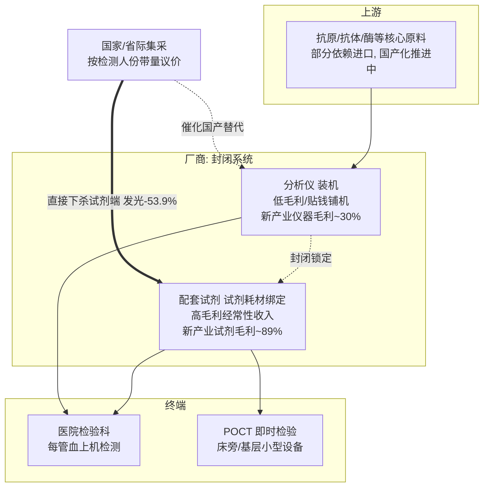

## 本章概览

上一章讲器械靠「剃须刀—刀片」的装机—耗材复利吃饭，没有专利悬崖、只有缓坡式的份额流失。体外诊断（In Vitro Diagnostics，IVD，指在人体之外、对血液尿液等样本做检测的产品与设备）把这套模式做到了极致：一台化学发光分析仪可以低价甚至贴钱铺进医院，绑定的试剂却能维持近九成毛利，是医疗器械里现金流可预测性最高的生意之一。本章拆三件事。第一，封闭系统为什么是好生意，刀片端的毛利到底有多厚。第二，中国集采为什么对 IVD 是一个内在矛盾——它一刀砍向的恰恰是刀片（试剂）本身，把 razor-blade 复利在国内行政化削薄，却又成了国产试剂放量的发令枪。第三，为什么「中国 IVD 市场有多大」这个看似基础的问题，不同机构给出的答案能差两倍以上，投资者引用任何一个数字前都得先问口径。

读完本章，读者能看清一条与药、与高值耗材都不同的现金流曲线，并对产业研究里最常见的「市场规模」陷阱多一层警惕。

## 一管血的旅程：封闭系统为什么是好生意

医院里每一管抽出来的血，要在检验科上机做几十个项目：肝功、肾功、血脂走生化分析仪，肿瘤标志物、甲状腺功能、传染病筛查走化学发光免疫分析仪。化学发光（chemiluminescence）是免疫诊断的主流技术，用发光反应的强度间接测出血里某种蛋白或抗原的浓度，灵敏度高、可自动化，是 IVD 里规模最大、毛利最厚的细分。

这门生意的核心是「封闭系统」（closed system）。厂商的分析仪只认自家的配套试剂，别家试剂插不进来，反之自家试剂也上不了别家的机器——这叫试剂耗材绑定（reagent lock-in）。一旦一台仪器「装机」（installed base，即设备进了医院检验科、跑通了验证、医生护士用顺了手），它在未来五到八年里就会持续吃自家试剂。设备是一次性的低毛利甚至负毛利投入，试剂是按检测人份计费、年复一年的高毛利经常性收入。

这套结构在财报上看得一清二楚。新产业（深圳新产业生物，300832.SZ，国产化学发光头部厂商）2024 年营收 45.35 亿元（同比 +15.41%），其中试剂收入 32.68 亿元，试剂毛利率高达 88.61%；而仪器类产品毛利率只有 29.82%，海外仪器毛利率也不过 40.79%（来源：新产业 2024 年报，2025-04 披露）。刀片（试剂）近九成毛利、剃须刀（仪器）三成毛利，razor-blade 模型在这里几乎是教科书级的呈现。安图生物（603658.SH，国产免疫诊断与流水线厂商）同样如此：2024 年试剂收入 37.97 亿元，占全年营收的八成以上，仪器收入仅 5.25 亿元（来源：安图 2024 年报，2025-04 披露）。

迈瑞医疗（300760.SZ，国产医疗器械综合龙头）则展示了装机如何转化为持续放量。其 2024 年 IVD 营收 137.65 亿元（同比 +10.82%），已是公司第一大业务板块；当年化学发光仪器装机约 1800 台，MT-8000 全实验室智能化流水线装机近 190 套（来源：迈瑞 2024 年报）。「流水线」（lab automation track）是把样本前处理、生化、发光等多台仪器用轨道串成一条自动化产线，一旦整条线进了大医院检验科，更换成本极高，是比单台装机更深的护城河。装机存量越大，未来锁定的试剂流水越长——这正是封闭系统现金流可预测性的来源。

IVD 价值链与现金流的传导关系，以及集采从哪一端切入，见图 18-1。

图 18-1　IVD 封闭系统价值链与集采切入点。razor-blade 复利来自「装机→试剂绑定」的右向传导；集采（双线箭头）不打设备端、直接砍向高毛利的试剂（刀片）端，同时把进口退坡让出的份额导向国产装机。POCT（Point-of-Care Testing，即时检验）是不进检验科、在床旁或基层即时出结果的小型 IVD 形态，逻辑相同但单机检测量小。

## 退潮：先把新冠红利从基数里减掉

读 2024 年的 IVD 财报，要先做一道减法。新冠三年，核酸与抗原检测给诊断巨头灌进了一大笔一次性收入，2024 年这部分高基数回落，让几家头部公司账面上出现负增长，容易被误读成结构性衰退。

罗氏诊断（Roche Diagnostics，全球 IVD 营收第一）2024 年销售额约 143 亿瑞郎（按公司口径，恒定汇率同比 +4%），其中新冠相关产品销售从 2023 年的约 8 亿瑞郎降到约 2 亿瑞郎；但剔除新冠后的基础业务（base business）恒定汇率增长 8%，由免疫诊断需求拉动（来源：罗氏 2024 全年业绩公告，2025-01-30）。换句话说，账面的「平」是高基数回落，底层的「增」才是常规诊断的真实状态。雅培诊断、Illumina 当年同比也受新冠高基数拖累而走平或微降，逻辑一致。区分「一次性退潮」与「结构性衰退」，是读 IVD 这两年财报的第一道纪律。

## 集采砍向刀片：razor-blade 模型的内在矛盾

第 15 章讲过中国集采的三道闸门（集采压采购价、DRG/DIP 压使用量、零加成去掉医院加价动力），并把冠脉支架（中选均价约 700 元、降幅约 94.6%）作为「集采悬崖」最陡的样本。IVD 集采来得更晚、降幅更温和，但它对器械投资逻辑的冲击有一处独特之处，值得单独点破。

razor-blade 模型的全部利润藏在刀片（试剂）里。而中国的 IVD 集采，恰恰是直接对试剂端按检测人份带量议价。以安徽牵头的 25 省化学发光试剂省际联盟集采为例：2023 年 12 月底公布结果，企业报价平均降幅 53.9%（降幅分母为集采前申报价，本身偏高，绝对值更说明问题——部分项目从约 16—17 元/人份降到约 6.6—7.2 元/人份，如性激素六项约 16.10→7.15 元、传染病项约 17.14→6.59 元），预计年节省采购金额近 60 亿元，传染病八项最高降幅达 65.2%（来源：安徽省医保局 2023-12-29 公告；南方财经 2024-09 落地调研）。2024 年集采继续扩围到 28 省的肿瘤标志物十六项、甲状腺功能九项。

把这两件事放在一起，矛盾就清楚了：器械投资人津津乐道的「装机—试剂复利、刀片高毛利锁定数年现金流」，在中国遇到集采时，被行政化下杀的正是刀片本身。设备端集采几乎不碰，试剂端却被一次砍掉一半。这等于把 razor-blade 模型里最值钱的那块利润直接削薄——刀片仍然年复一年地卖，但每片的利润被按下了。所以「IVD 是好生意因为试剂毛利九成」这个判断，在中国市场必须打一个折扣：毛利率的纸面数字（如新产业 88.61%）是集采尚未全面铺到的存量结构，随着发光集采逐省扩围，试剂端的实际加价空间会被持续压缩。这是 razor-blade 复利与集采悬崖之间真实存在的内在打架，不点破就会把美股 IVD 的估值逻辑直接误套到 A 股。

需要同时守住的口径：单品单价降 53.9%，不等于公司该业务收入降 53.9%，更不等于利润降 53.9%。放量（中标后医院采购量上升）可以部分对冲单价下跌，毛利结构变化也使收入与利润的弹性不同。安图生物 2024 年净利润同比 -1.89%、国内发光业务承压，而新产业靠海外高增（试剂收入 +14.32%、海外仪器毛利 40.79%）对冲了国内压力——同样的集采，落到不同公司业绩上的结果并不一样。把「单价降幅」直接当成「公司业绩降幅」，是 IVD 集采分析里最常见的误读。

## 发令枪：国产替代用份额数据说话，不靠口号

集采压价的另一面，是它改写了进口与国产的份额。这里必须用份额数据说话，而不是空喊「国产替代」。

化学发光长期是进口主导的高地。按约 2021—2023 年口径，罗氏约 27%、雅培约 15%、贝克曼约 7%、西门子约 6%，外资合计占据中国化学发光市场半数以上；国产厂商整体份额约 28.8%，其中迈瑞、安图、新产业各自只有个位数百分点（来源：健康界研究院《中国化学发光免疫诊断行业研究报告》；证券市场周刊 2024 行业梳理）。进口品牌长期靠装机存量和封闭系统锁住院内检验科，国产想撬动单家医院的存量装机，要逐台过验证、重建医生信任，很慢。

肿标的市场价值来自它是治疗决策的门禁（见第 6 章伴随诊断），这也解释了为什么进口品牌能在国产份额整体提升的背景下仍守住高端发光份额。集采改变了这个节奏。当试剂被纳入带量采购、价格成为硬约束，进口厂商要么大幅降价保份额、要么主动退坡守利润，给国产装机让出了缺口。在 2024 年落地的肿瘤标志物集采这一细分里，集采前外资（MNC）约占 60%、国产约 40%；集采后外资份额降到约 53%、国产升到约 47%，接近平分（来源：医药魔方 ByDrug 集采落地分析，2024）。这是集采作为「国产放量发令枪」的直接证据——不是因为国产试剂突然变好，而是支付方用行政力量把价格拉平后，进口的品牌溢价不再能转化为份额优势。各家国产厂商 2024 年的 IVD 数据（迈瑞 IVD +10.82%、化学发光国内排名升至第三；新产业试剂 +14.32%；安图免疫诊断试剂销量 +18%）与这条份额迁移曲线相互印证。

需要克制的是：份额迁移是分细分、分项目的，肿标这一项的「47% vs 53%」不能外推成「国产已拿下化学发光半壁江山」。发光大类里国产整体仍不到三成，生化等成熟项目国产替代更靠前，高端发光与特殊项目仍是进口优势区。国产替代是一条分项目推进、节奏不一的长曲线，用单一细分的乐观数字代表全局，与用「单价降幅=业绩降幅」误读集采，是同一类口径错误。

## 口径迷雾：中国 IVD 市场到底多大

做完护城河和集采，回到一个最基础却最容易被糊弄的问题：中国 IVD 市场有多大。这个问题没有标准答案，不同机构给出的数字能差两倍以上，而差异几乎全部来自口径，不是测错。

把几家公开来源摆在一起，分歧一目了然（见图 18-2）。国内产业研究机构（前瞻、中金企信等）多落在 1200 亿—1356 亿元区间，统计的是「体外诊断用医疗器械」的较宽口径；而部分英文市场研究机构按更窄的 IVD 定义，给出的同期规模只有约 55—58 亿美元（约合 400—420 亿元，按 7.2 汇率折算）。同一个市场、同一年，从约 400 亿元到 1356 亿元，差距超过三倍。

| 来源（机构/委托方） | 口径 | 年份 | 规模 |
|------|------|------|------|
| 前瞻产业研究院 | IVD 整体（含设备+试剂，较宽） | 2023 | 约 1185 亿元（2024 按 CAGR 推算约 1200—1285 亿） |
| 中金企信（新浪财经转引） | 体外诊断用医疗器械 | 2024 | 约 1356 亿元（免疫诊断占 42%） |
| CAIVD《中国体外诊断行业年度报告(2024)》 | IVD 整体 | 2024 | <1200 亿元，与 2023 基本持平 |
| Grand View Research | China IVD（较窄口径） | 2023 | 约 55 亿美元（≈396 亿元） |
| Spherical Insights | China IVD（较窄口径） | 2024 | 约 58 亿美元（≈420 亿元） |

图 18-2　中国 IVD 市场规模口径分歧表。同一市场不同来源差逾三倍，差异来自统计范围（整体设备 vs 仅试剂终端）、价格层级（出厂价 vs 终端价）、是否含 POCT 与分子诊断、汇率口径。引用时必须连同来源与口径一起标，单引一个数字没有意义。

这里有一条对投资者更要紧的提醒。IVD 公司上市时，招股书里的市场规模测算通常来自第三方咨询机构（典型是弗若斯特沙利文 Frost & Sullivan、灼识咨询 CIC），而这类报告是发行人付费委托的，对所在赛道的规模与增速测算存在系统性偏乐观的倾向——把所属细分讲大、把增速画陡，有利于发行估值。这不是说数字是假的，而是说它的口径是为「讲一个大故事」服务的。读这类规模数字时，要追到委托方是谁、口径是设备还是试剂、增速假设建立在什么基础上，而不是把招股书里的规模数字当客观事实直接引用。市场规模是产业研究里最容易被夸大、也最容易被读者轻信的一个数。

## 小结

IVD 把器械的 razor-blade 模型做到了极致：封闭系统装机绑定试剂，刀片端近九成毛利、年复一年锁定，是医疗里现金流最可预测的生意之一（新产业试剂毛利 88.61% vs 仪器 29.82%，是最干净的一组对照）。

但这套模型在中国遇到一个内在矛盾：集采直接下杀的就是刀片（试剂）本身，发光试剂集采企业报价平均降幅 53.9%，把 razor-blade 复利在国内行政化削薄。同一场集采又是国产放量的发令枪——肿标细分集采后国产份额从约 40% 升到约 47%。把美股 IVD 的高毛利估值逻辑直接套到 A 股，会同时高估刀片利润的持久性、低估国产份额迁移的速度。

两条口径纪律贯穿全章：单价降幅不等于业绩降幅（放量与毛利结构会对冲）；市场规模数字必须连来源与口径一起读（同一市场各家差逾三倍，招股书测算系统性偏乐观）。下一章转向疫苗——又一门把「一次接种」做成公共卫生与现金流双重生意的赛道，定价与采购逻辑与诊断截然不同。

## 配套数据

见 `data/18-ivd-diagnostics/`。本章用到的所有数据源与口径详见 `data/18-ivd-diagnostics/sources.md`。

---

> **免责声明**
>
> 本章涉及具体公司的财务分析与产业判断，仅为作者基于公开信息的研究结果，**不构成任何投资建议**。市场有风险，投资决策应基于读者自身的独立判断和专业咨询。
>
> 本章使用的财务数据截至 2026-05，公司基本面与市场环境可能在阅读时已发生变化。本章中提到的公司股票、市场份额、市场规模等信息均为分析素材，作者不对其准确性、完整性或时效性作任何承诺。IVD 集采逐省扩围、份额迁移与市场规模口径均为快变量，引用时请以最新公开披露为准。
>
> **作者持仓披露**：截至本章数据时点，作者未持有迈瑞医疗、新产业、安图生物、罗氏及本章提及的其他公司股票或衍生品。

---

> 本章来自《医疗经济学》开源版 · 作者「递归客」  
> 在线阅读完整书系：[inferloop.dev](https://inferloop.dev) · 反馈与勘误：[GitHub Issues](https://github.com/diguike/book-healthcare-economics/issues)
