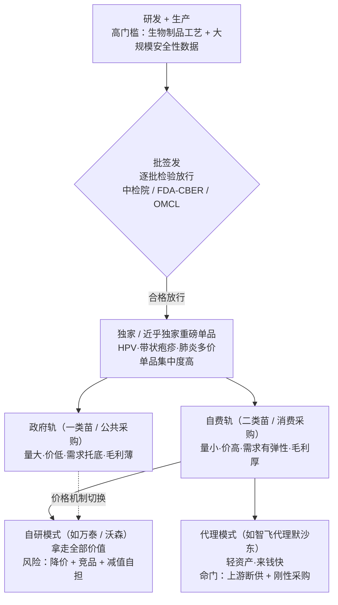
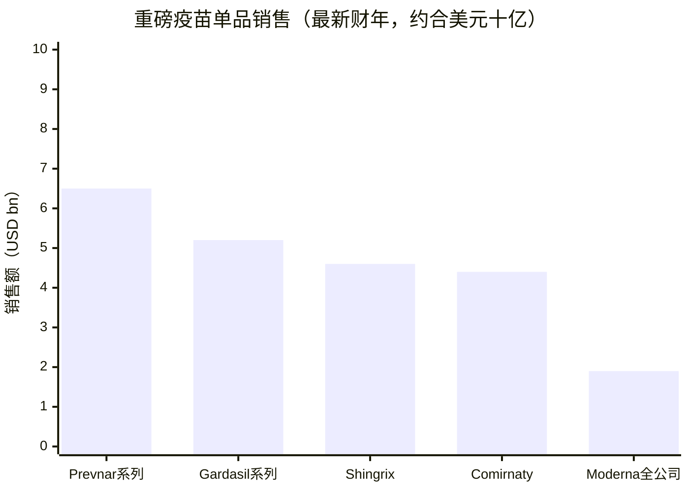

## 本章概览

本章属「第六部　另两门生意：疫苗与消费医疗」。前面几部讲的药、器械、诊断，卖的都是"治病"——病已经发生，产品去解决它。疫苗是医药里少见的反向生意：卖的是"没病"，让一个健康人现在花钱，换一个未来不发病的概率。这门生意有一套和普通药完全不同的经济学——一道叫"批签发"的额外质量关卡、几个能独占市场十几年的重磅单品、政府免费采购与个人自费消费并存的双轨需求，以及流感这类靠季节吃饭的特殊品种。

读完本章，你能回答四个问题：为什么一针九价 HPV 疫苗能卖到上千元、还长期一苗难求；为什么带状疱疹疫苗 Shingrix 一个单品一年能卖出几十亿美元；为什么同样做 HPV 疫苗，中国的"超级代理"智飞生物会在 2025 年巨亏上百亿，而自研的万泰生物也吞下上市以来第一次亏损；以及新冠之后，mRNA 平台的故事该怎么重新估值。最后一个问题是第 18 章 IVD 退潮的延续——同一场新冠基数消退，先砸在检测上，再砸到疫苗上。

## 一支针上千元，还买不到

先看两个具体的价签。

在中国，九价 HPV 疫苗——Gardasil 9（佳达修 9，默沙东产品，预防人乳头瘤病毒相关的宫颈癌、肛门癌等）——进口版本一针的接种价长期在 1300 元上下，三针打完接近 4000 元。它不进医保、不进政府免费名单，全靠个人自费，而且在 2018 至 2022 年间长期供不应求，很多城市要摇号、排队、跨省接种。一个预防性产品能做到"加价排队还抢不到"，在医药里非常罕见。

在美国，带状疱疹疫苗 Shingrix（欣安立适，GSK 产品，预防由水痘-带状疱疹病毒再激活引起的带状疱疹，是一款加了佐剂的重组蛋白疫苗）2025 财年卖出 36 亿英镑（约合 46 亿美元，同比增长 8%；来源：GSK FY2025 业绩公告，2026-02）。一个只打两针、面向 50 岁以上人群的预防针，单品年销做到几十亿美元的量级，相当于一家中型药企的全部营收。

先把两个术语说清楚。**预防性疫苗**（prophylactic vaccine）面向健康人，在感染或发病之前接种，靠激发免疫记忆来降低未来的发病概率，上面三个例子都属此类；**治疗性疫苗**（therapeutic vaccine）面向已经患病的人，比如在研的肿瘤疫苗，目标是调动免疫系统去攻击已有的病灶，到 2026 年仍以临床阶段为主、商业化产品寥寥。本章讲的"爆款"，几乎全部是预防性疫苗。它们能成为爆款，恰恰因为面向的是庞大的健康人群，而不是相对有限的患者池。

"花钱买没病"听上去不像生意——健康的人为什么愿意现在掏钱？答案是需求被两股力量撑住：政府出于公共卫生考虑，用财政把一部分疫苗变成全民免费、近乎强制接种；个人出于对特定疾病（宫颈癌、带状疱疹、肺炎）的恐惧，愿意自掏腰包买一份"概率上的安心"。这两股力量对应着疫苗生意的两条采购轨道，下文会拆开讲。

## 比普通药多一道关：批签发

疫苗和普通药第一个不同，在于它多一道上市前的质量关卡——**批签发**。

普通的化学药、生物药拿到上市批准后，企业可以按 GMP（药品生产质量管理规范）自行生产、自行放行，监管靠事后抽检。疫苗不行。在中国，每一批疫苗在出厂销售前，必须由国家指定的机构（主要是中国食品药品检定研究院，简称中检院）逐批审核资料、做检验，合格才发"批签发证明"，没有这张证明的疫苗一支都不能卖（来源：中检院 / 中国食品药品网批签发说明）。美国由 FDA 下属的 CBER（生物制品评价与研究中心）执行类似的 lot release 制度，欧盟由各国官方药品控制实验室（OMCL）执行。

批签发是一道双向的信息。对监管，它是疫苗作为"健康人大规模使用、安全性零容忍"产品的最后兜底；对投资者，它是一个少见的高频公开数据——疫苗企业实际放行的量、品种、季节分布，中检院按月公示，比等季报更早看到拐点。时滞很具体：批签发记录次月初就能看到，而对应季度的财报要等到季末后约 4–8 周才披露，月度批签发拐点往往领先业绩确认一个季度左右。智飞代理的默沙东四价 HPV 在 2025 上半年批签发归零、九价腰斩，这个信号在月度数据里出现的时间，明显早于半年报里 75% 的营收下滑。本章后面分析中国 HPV 疫苗退潮，用的就是批签发量这把尺子。

批签发也抬高了门槛。它意味着疫苗的产能、质量一致性要经得起逐批检验，叠加疫苗本身的生物制品工艺（很多要在细胞或鸡胚里培养、对冷链和无菌要求极高），新进入者从建厂到稳定放行往往要数年。门槛高的另一面是格局集中——能把一个疫苗品种做出来并稳定供货的企业常常只有一两家。九价 HPV 是最极端的例子：截至 2025 年 6 月，全球商业化供货的九价 HPV 疫苗长期只有默沙东 Gardasil 9 一家，国产九价（万泰）同年 6 月才首获批、当年仍在铺渠道（来源：万泰生物 2025 年报）。这种"一家独供十几年"的格局，正是疫苗容易出"独家重磅单品"的结构性原因。

## 独家重磅单品：少数几个品种撑起整门生意

医药行业把年销售额超过 10 亿美元的单一产品叫 **blockbuster**（重磅炸弹，纯行业术语，指销售体量，不含褒贬）。普通药里 blockbuster 不算稀奇，但药有专利悬崖、有同类竞品扎堆，一个重磅药风光几年就要面对仿制药围攻。疫苗不一样：高研发门槛、批签发壁垒、大规模安全性数据的先发优势，让头部疫苗能独占或近乎独占一个适应症十年以上。

看几个数字（图 19-2）。默沙东（Merck & Co.，美股 MRK，美国制药巨头，肿瘤药 Keytruda 与 HPV 疫苗 Gardasil 是两大支柱）的 Gardasil 系列，从 2020 年的 39 亿美元一路涨到 2023 年的 89 亿美元峰值（来源：默沙东各年度财报，经 BioSpace、Yahoo Finance 整理）。辉瑞（Pfizer，美股 PFE，美国制药巨头）的 Prevnar 系列（沛儿，预防肺炎球菌感染的多价结合疫苗，"**多价**"指一支疫苗里包含多种血清型抗原，价数越高覆盖的菌株越广）2025 财年卖出 65 亿美元，占辉瑞总营收的 10%（来源：辉瑞 FY2025 业绩公告，2026-02-03）。GSK 的 Shingrix 上面已经提过，46 亿美元量级。

这些产品的共同点：单品体量大、对手少、生命周期长。Prevnar 从 7 价做到 13 价再到 20 价，靠"加价数"不断把竞品挡在身后；Shingrix 凭佐剂技术做到很高的保护效力，在带状疱疹这个适应症里几乎没有同级对手（**佐剂**指疫苗里用来增强免疫反应、提高保护效力的辅助成分）。这种"一个品种 = 一门生意"的集中度，是疫苗投资和普通药投资最不一样的地方——你不是在投一个产品组合，很多时候是在投一两个独家大单品的兴衰。

集中度高的代价，是单点风险也高。Gardasil 给默沙东上了一课：当一个市场（中国）出问题，整个单品的曲线会陡然下折，下一节就是这个故事。

## 双轨采购：政府的免费苗 vs 个人的自费苗

疫苗的需求来自两条独立的轨道，这是理解疫苗生意盈利结构的钥匙。

在中国，疫苗按付费方分成两类。**第一类疫苗**（一类苗）由政府免费提供、居民按规定接种，纳入**国家免疫规划**（政府有计划地为特定人群免费接种、以防控特定传染病的制度），乙肝、卡介苗、麻腮风、脊灰等都在其中。**第二类疫苗**（二类苗）由居民自费、自愿接种，HPV、肺炎球菌、水痘、轮状病毒、带状疱疹等大多在这一类（来源：中国疾控 / NMPA 科普；分类口径以《疫苗管理法》及各省免疫规划为准）。美国、日本、欧洲也有类似的二分——纳入国家或公共采购计划的疫苗（如美国 CDC 的 VFC 儿童免费接种项目）对应"政府轨"，其余对应"自费 / 商保轨"。

两条轨道的经济学截然相反：

- **政府轨（一类苗 / 公共采购）**：量大、价低、稳定。政府集中采购、批量谈判，单价被压得很低，但需求由公共卫生政策托底，不受经济周期和个人意愿影响。它是基本盘，但毛利薄。
- **自费轨（二类苗 / 消费采购）**：量小、价高、弹性大。单价能维持在政府采购的几倍甚至十几倍，毛利厚，但需求是"可选消费"——经济下行、消费意愿走弱、出现更便宜的替代品时，会像非必需消费品一样收缩。

九价 HPV 一针上千元、Shingrix 一年几十亿，靠的都是自费轨；而真正决定一个国家疫苗覆盖率的，往往是政府轨。一个疫苗品种的盈利质量，很大程度上取决于它卡在哪条轨道、以及能不能从自费轨"升级"或"跌落"。这个升降，正是中国 HPV 疫苗这几年最戏剧性的故事。

## 流感疫苗：靠季节吃饭的单独逻辑

前面讲的 HPV、带状疱疹、肺炎，都符合"独家重磅单品 + 长生命周期"的模型。流感疫苗是个明显的例外，它的经济学单独成一类，值得拆出来讲。

第一个不同是产品要年年重做。流感病毒变异快，每年实际流行的毒株都不一样，世界卫生组织（WHO）每年开两次会、分别为北半球和南半球推荐下一季的疫苗组成毒株（来源：WHO 流感疫苗成分推荐；CDC 毒株选择说明）。企业拿到推荐株后，要在几个月里完成生产、检验、批签发，赶在流感季前铺货。这意味着流感疫苗没有"一次研发、卖十几年"的红利，更像每年重新生产一批快消品——去年的疫苗今年基本作废，库存卖不掉就是损失。

第二个不同是有效性年际波动。流感疫苗的保护效力取决于"推荐株和实际流行株匹配得好不好"：匹配好的年份，灭活流感疫苗的有效性（VE）大约在 40%–60%；匹配差的年份会明显更低（来源：WHO / CDC 及流感疫苗有效性综述）。对一个自费消费者来说，"打了还可能中招"会直接削弱付费意愿——这是 HPV、带状疱疹这类"高保护效力、一次见效"的疫苗不会遇到的问题。需求因此更不稳定：流行季严重、媒体报道多的年份接种踊跃，温和的年份就冷清。

第三个不同是格局分散、更像商品。因为门槛相对低、产品同质化，流感疫苗的供应商多、品牌区分弱，比拼的是产能、铺货速度和成本，而不是独家技术。赛诺菲（Sanofi，法国药企，纽交所 SNY，全球流感疫苗主要供应商之一）的流感疫苗 2024 全年销售约 25.6 亿欧元、同比略降约 1%（来源：赛诺菲 FY2024 财报），是这个品类里体量靠前的玩家，但即便如此也远没有 Gardasil、Shingrix 那种独占地位；GSK、CSL Seqirus 以及中国的华兰、科兴等都在分这块市场。

把流感疫苗放进本章的框架，它提供了一个有用的反例：同样是预防性疫苗，"独家重磅单品"的护城河不是疫苗的普遍属性，而是少数靠技术壁垒和先发安全性数据筑起来的特例。流感这种年年重配、有效性看天、供应商众多的品种，盈利结构更接近季节性快消品——稳定、但增长上限和毛利都受限。投资疫苗企业时，分清手里的是"独占型单品"还是"季节型商品"，比看总营收更重要。

## 中国样本：代理 vs 自研，谁拿走价值

疫苗的价值分配里有一个容易被忽略的维度：把疫苗卖出去的，不一定是把它造出来的。这就引出**代理**与**自研**两种模式的根本差别。**自研**指企业自己研发、生产、销售疫苗，拿走从分子到终端的全部价值，但承担研发失败和产能风险；**代理**指企业不自己造，而是买断某款进口疫苗在某个市场的独家经销权，靠渠道、冷链、推广赚取进销差价，不承担研发风险，但把命门交给了上游和市场。

中国 HPV 疫苗市场把这两种模式的优劣，在 2024–2025 这两年集中演了一遍。

**代理模式的样本是智飞生物**（300122.SZ，A 股疫苗龙头，以独家代理默沙东 HPV、肺炎疫苗在华销售起家，自有结核等自研管线）。它是默沙东 Gardasil 在中国的独家代理，过去多年里，进口九价 HPV 的暴涨直接把智飞推成中国市值最高的疫苗企业之一。但代理模式有两道枷锁：一是上游的刚性采购协议，二是终端需求的不可控。2023 年智飞与默沙东续签协议，约定 2023–2026 年 HPV 疫苗基础采购额合计约 980 亿元，其中 2024、2025、2026 年分别为 326.26 亿、260.33 亿、178.92 亿元（来源：智飞生物公告，经新浪财经、东方财富整理）。需求旺时这是锁定业绩的保障，需求一旦逆转，它就变成甩不掉的刚性成本。

转折来得又快又猛。2025 年上半年，智飞代理板块营收 43.7 亿元，同比骤降约 75%；默沙东四价 HPV 的批签发量在 2025 上半年直接归零（中检院批签发数据），九价 HPV 批签发量同比减少 76.8%，从 1827.2 万支降到 423.9 万支（来源：批签发数据，新浪财经、澎湃整理）。默沙东本身也在 2025 年初宣布暂停向中国发货 Gardasil，全年没有恢复，并撤回了此前 110 亿美元的销售目标（2030 年长期目标；来源：FiercePharma 2025-02、默沙东 Q1 2025 业绩）。结果是智飞生物 2025 年预亏 106.98 亿至 137.26 亿元，归母净利润同比下滑 630%–780%（来源：智飞生物 2025 年度业绩预告，2026-01）。一个把命门押在单一上游、单一自费品种上的"超级代理"，在需求退潮里几乎没有缓冲。

**自研模式的样本是万泰生物**（603392.SS，体外诊断 + 疫苗双主业，自研二价、九价 HPV 疫苗）和沃森生物（300142.SZ，自研多价疫苗，13 价肺炎结合疫苗是主力品种）。自研本应更抗风险——价值链全在自己手里。但 2025 年它们同样难看。万泰 2025 年营收 18.19 亿元、同比下降约 19%，归母净利润亏损 3.98 亿元，是公司上市以来第一次年度亏损（来源：万泰生物 2025 年报，2026-04）。打击来自三个方向叠加：默沙东九价把适用年龄扩展到 9–45 岁、抢走自费市场；国产九价 HPV 上市（万泰自己的九价 2025 年 6 月获批，是国内首款、全球第二款九价，但当年还在铺渠道、没形成利润）；以及二价 HPV 被纳入部分地区免疫规划后的"政府轨降价"——中标价低到 27.5 元/支，相比上市初期的 329 元跌幅超过九成（来源：万泰生物 2025 年报；公开中标信息）。万泰疫苗板块营收 4.57 亿元、同比下降约 25%，毛利率从过去的高位暴跌约 43 个百分点到 27.25%。沃森则对 HPV 相关无形资产计提了 7629.51 万元减值（来源：沃森生物 2025 年报）。

把代理和自研放在一起看，能得出一个比"谁更好"更有用的判断（这是分析，不是事实）：需求上行期，代理来钱更快、更轻资产，但它把研发、定价、供货三项主动权都交给上游，一旦上游断供或市场逆转，代理方只剩刚性成本和清不掉的库存；自研拿走全部价值，可一旦"自费市场萎缩、政府轨大幅降价、国产竞品涌入"三件事同时发生，减值、价格战、产能闲置的损失也全得自己扛。两条路在 2025 年这轮 HPV 退潮里都没幸免，区别只是亏损形态。这呼应第 15 章的集采逻辑：当一个高毛利自费品种被拉进政府轨，价格机制会从"消费定价"切换成"采购定价"，盈利结构被重写。

## 新冠退潮：mRNA 平台的下半场

疫苗这门生意在 2020–2022 年经历了一次历史上没有过的需求脉冲——新冠疫苗。**mRNA 疫苗**（用信使 RNA 递送抗原指令、让人体细胞自己合成抗原蛋白来激发免疫的新型技术路线，区别于传统的灭活、重组蛋白疫苗）在这场脉冲里第一次大规模商业化，把辉瑞-BioNTech 和 Moderna 推到了此前未有过的销售规模（Comirnaty 2022 峰值约 378 亿美元，Moderna 2022 全公司营收约 193 亿美元、主力 Spikevax 约 184 亿美元）。

然后是退潮，而且和第 18 章讲的 IVD 退潮是同一场。辉瑞-BioNTech 的 Comirnaty（复必泰，mRNA 新冠疫苗；BioNTech 为德国 mRNA 公司，纳斯达克 BNTX）2021 年为辉瑞带来 368 亿美元、2022 年 378 亿美元（峰值），到 2025 财年只剩 44 亿美元，仅占辉瑞总营收的 7%（来源：辉瑞各年度财报；FY2025 业绩公告，2026-02-03）。Moderna（美股 MRNA，专注 mRNA 的美国疫苗公司）更典型：它几乎是一家"单品种公司"，主力 Spikevax（mRNA 新冠疫苗）2024 年还有 31 亿美元，2025 年全年总营收掉到约 19 亿美元（来源：Moderna FY2025 业绩，SEC 8-K）。

要客观看待这个退潮：它和第 18 章的 IVD 退潮一样，主体是一次性高基数的回落，而不是技术失败。新冠从大流行变成季节性疾病，疫苗需求自然从"全民多轮接种"收缩到"高风险人群年度加强"，这是公共卫生意义上的正常化，不是产品出了问题。真正的问题在估值层面：市场曾经按"新冠常态化大单品"给 mRNA 平台定价，退潮证明这个假设过高。

退潮之后，mRNA 平台的故事要靠两件事重新撑起来，但这两件事都还没兑现，属于预测而非事实。一是非新冠的呼吸道疫苗，如辉瑞的 Abrysvo、Moderna 的 mRESVIA（mRNA RSV 疫苗）——RSV（呼吸道合胞病毒）是个真实的大市场，Abrysvo 2025 年增长很快，但 mRESVIA 至今销量微薄。二是把 mRNA 平台延伸到流感、流感/新冠联合苗、诺如病毒乃至个体化肿瘤疫苗，Moderna 的流感（mRNA-1010）、流感/新冠联合（mRNA-1083）、诺如（mRNA-1403）都在申报或三期阶段。平台多适应症扩展的逻辑与第 7 章 GLP-1 升级链类似，但疫苗需求端由流行病动态主导，衰退斜率因此更陡、更难预测。这些管线决定了 mRNA 是"一个被新冠催熟、之后还能复用的平台"，还是"一次性事件驱动的单品种公司"。在它们读出之前，给 mRNA 平台的任何估值都带着这道未决变量。

## 把模式画出来

前面拆的几个维度——批签发壁垒、单品集中、双轨采购、代理与自研的价值分配——可以合成一张疫苗生意的结构图（图 19-1）。它解释了为什么疫苗能出"预防性爆款"，也解释了爆款为什么脆弱。

图 19-1：疫苗商业模式结构（研发与批签发壁垒 / 采购双轨 / 单品集中度 / 价值分配）

图 19-2：主要重磅疫苗单品最新财年销售（约数，USD 十亿，口径见下）

> 图 19-2 口径：Prevnar 系列、Comirnaty 为辉瑞 FY2025 财报数（$6.5B / $4.4B）；Gardasil 系列为默沙东 FY2025（$5.2B，较 2023 峰值 $8.9B 大幅回落）；Shingrix 为 GSK FY2025 的 £3.6B 按约 1.27 汇率折算（≈$4.6B）；Moderna 用全公司 FY2025 总营收约 $1.9B（主要为 Spikevax，公司未单列）。跨公司、跨币种、跨口径不可精确并排，此图仅示意量级。

## 小结

- 疫苗是医药里少见的"预防性爆款"：卖的是"没病"，需求由政府公共卫生（政府轨）和个人自费消费（自费轨）两股力量撑住。它有一套和普通药不同的经济学，核心是批签发壁垒、单品集中和采购双轨。
- 批签发是疫苗多出来的一道逐批放行关卡，既抬高门槛、催生独家重磅单品，也给了投资者一个高频公开的领先指标——放行量比季报更早看到拐点。
- 双轨采购决定盈利质量：政府轨量大价低托底，自费轨价高毛利厚但有消费弹性。一个品种被从自费轨拉进政府轨（如二价 HPV 进免疫规划、中标价较上市初跌九成），盈利结构会被价格机制重写，逻辑与第 15 章的集采一致。
- 代理与自研的价值分配是中国疫苗最具样本意义的对照：2025 年这轮 HPV 退潮里，代理的智飞预亏上百亿（上游断供 + 刚性采购），自研的万泰吞下上市首亏（降价 + 国产竞品 + 减值），两条路都没幸免，区别只是亏损形态。把命门押在单一上游、单一自费品种上，是代理模式最脆弱的地方。
- 新冠退潮是第 18 章 IVD 退潮的延续：Comirnaty 从峰值 378 亿美元退到 44 亿美元，Moderna 全年营收掉到约 19 亿美元。主体是一次性高基数回落而非技术失败，但它证伪了"新冠常态化大单品"的估值假设。mRNA 平台的下半场要靠 RSV、流感、联合苗等非新冠管线重估，这些尚未兑现，属于未决变量。
- 下一章转向医疗里最像消费品的一门生意——医美：同样几乎不碰医保、同样靠自费和品牌，但它把"消费医疗"的逻辑推到了极致，价值分配的故事也更赤裸。

## 配套数据

本章原始数据与来源（疫苗企业与单品销售的财报口径与时点、Gardasil 与 Comirnaty 的历年销售曲线、中国 HPV 疫苗批签发量、智飞采购协议与亏损预告、万泰/沃森自研口径、mRNA 非新冠管线清单，以及代理 vs 自研价值分配对照）见本书配套数据仓库，所有进入正文的数字均标注了来源、时点与口径。

---

> **免责声明**
>
> 本章涉及具体公司的财务分析、商业模式判断与产业推论，仅为作者基于公开信息的研究结果，**不构成任何投资建议**。市场有风险，投资决策应基于读者自身的独立判断和专业咨询。
>
> 本章使用的财务数据截至 2026-05（部分财报披露时点延至 2026-04），公司基本面、批签发数据、管线进度与市场环境可能在阅读时已发生变化。本章中提到的公司股票、销售额、批签发量、采购协议、减值等信息均为分析素材，作者不对其准确性、完整性或时效性作任何承诺；对代理与自研模式优劣的比较、对 mRNA 平台前景的讨论均为有条件的分析与预测，不是对未来股价的判断。
>
> **作者持仓披露**：截至本章定稿，作者本人不持有默沙东（MRK）、GSK、辉瑞（PFE）、BioNTech（BNTX）、Moderna（MRNA）、智飞生物（300122.SZ）、万泰生物（603392.SS）、沃森生物（300142.SZ）及本章提及的其他个股的多空仓位，与上述公司无任何经济利益关系。

---

> 本章来自《医疗经济学》开源版 · 作者「递归客」  
> 在线阅读完整书系：[inferloop.dev](https://inferloop.dev) · 反馈与勘误：[GitHub Issues](https://github.com/diguike/book-healthcare-economics/issues)
