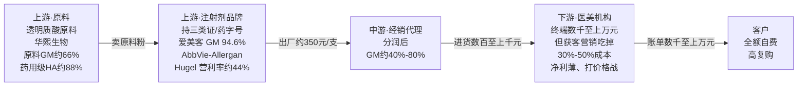
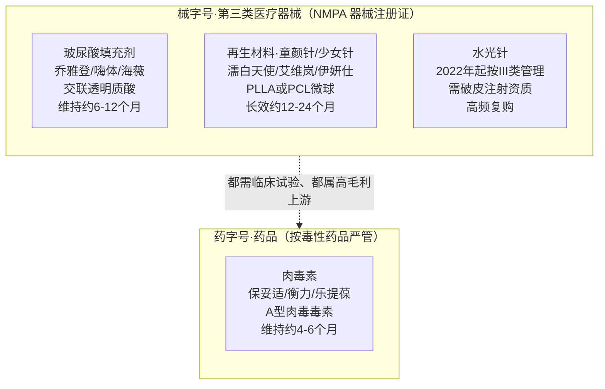

## 本章概览

本章属「第六部　另两门生意：疫苗与消费医疗」。前面十几章讲的都是「有人生病、有支付方买单」的医疗——药品要进医保、器械要拿报销码、IVD 要算 DRG 打包付费。本章转向一门长相完全不同的生意：医美。它挂着「医疗」两个字（注射、手术、三类医疗器械注册证一样不少），赚钱的逻辑却几乎是消费品——客户自掏腰包、为「想要」而非「需要」付费、看重品牌甚于临床数据、买完还反复回来买。

读完本章，你能回答三个问题：医美的钱为什么不经过医保、却仍是医疗监管的对象；从一支几十元成本的玻尿酸到脸上几千元的账单，中间的利润被谁拿走、又是谁在打价格战；以及「自费、不碰医保」到底是医美最大的安全垫，还是最容易被忽略的风险敞口。

## 一支玻尿酸，从几十元到几千元

先看一条价格链条。一支用于面部填充的玻尿酸（学名透明质酸，hyaluronic acid，一种人体自身就有、能锁水填充的多糖材料），原料成本大约二三十元人民币。把它做成预灌封注射器、贴上第三类医疗器械注册证出厂，售价约 350 元一支（来源：CBNData、21世纪经济报道行业测算，2021–2022）。这支针经过经销商、代理商，进到医美机构时已经数百到上千元；最后打进客户脸上，连同医生、麻醉、面诊、品牌溢价一起打包，账单常在数千元，高端产品过万元也不少见（来源：同上）。

成本几十元，终端几千元，中间隔着上百倍的加价。这种价差，在需要医保或政府支付方买单的药品和器械里不可能长期存在——集采会把它砍掉九成，DRG 会逼医院少用，PBM 会把返利谈走。但医美没有这些。它是医疗产业链里少有的、几乎不碰医保的环节：客户全额自费，没有第三方支付方坐在谈判桌对面压价。这就是医美毛利能长得像奢侈品、又能一直保持的根本原因。

这一章要拆的，正是这条加价链上的钱是怎么分的。先说结论：**钱主要被上游的材料和品牌商拿走，下游直接面对客户的机构反而在打价格战。** 这和外行的直觉常常相反——离客户最近的不一定最赚钱。

## 为什么说医美最像消费品

医疗和消费的分界，不在于「用不用针、动不动刀」，而在于四件事：谁付钱、为什么买、靠什么建立信任、买一次还是买很多次。医美在这四件事上全部偏向消费品。

**第一，自费。** 医美属于「消费医疗」——指那些不以治病为目的、由消费者自主决策并全额自费的医疗服务（与之相对的是疾病诊疗那种由医保或商保分担的「刚需医疗」）。隆鼻、除皱、打玻尿酸不在任何国家的基本医保目录里，没有支付方替你报销，也就没有支付方替你砍价。这把医美从「医保控费」这条贯穿全书的主线里摘了出去：集采、DRG、医保谈判这些压在药企和器械商头上的力量，对医美上游基本不起作用。

**第二，为「想要」付费。** 刚需医疗的需求曲线很硬——病了就得治，价格再高也得买。消费医疗的需求曲线是软的，跟着可支配收入和消费信心走。经济好的时候，轻医美是「悦己消费」；经济转弱、消费降级时，它是最先被砍掉的开支之一。这是消费属性带来的红利，也是它的周期性风险，本章后面会回到这一点。

**第三，靠品牌和渠道建信任，而不是靠临床数据。** 药品的护城河是临床终点（PFS、OS 那些数据）和专利，客户和医生信的是证据。医美更像化妆品和奢侈品：客户记住的是「乔雅登」「保妥适」这样的品牌名，认的是机构口碑和医生手法。临床试验在医美里仍然要做（拿三类医疗器械注册证绕不开），但它是入场券，不是卖点——上市后真正驱动复购的是品牌认知和到店体验。

**第四，高复购。** 复购率（一个客户在一段时间内重复购买的比例）是消费品生意的命脉，也是医美最像消费品的地方。玻尿酸会被人体逐渐代谢，填充效果维持约 6–12 个月；肉毒素（botulinum toxin，一种能让肌肉松弛、抚平动态皱纹的生物制剂）效果只维持约 4–6 个月；水光针更是要一个月打一次。想保持效果，就得反复回来打。这意味着一个被验证过、用得满意的客户，是一条持续多年的现金流——和奢侈品复购、订阅制软件的逻辑没有本质区别。

把这四点合起来，医美就是一门「穿着医疗外衣的消费生意」：自费、软需求、品牌渠道护城河、高复购。它的财务长相也因此更像消费品而不是药企——下面看数字。

## 价值链：上游吃肉，下游打仗

医美的利润分配，可以画成一条从原料到客户的链条（如图 20-1 所示）。

图 20-1：医美注射剂价值链与毛利分配（毛利率/营业利润率为各公司 FY2024 财报口径，单支成本/出厂价/终端价为行业测算，分属不同环节、差一个数量级，不可并排比较。来源见本章数据来源）

这条链上有一个反直觉的事实：**离客户越远的环节，毛利越高；离客户越近的机构，反而越苦。**

上游材料和品牌商坐拥极高毛利。爱美客（Imeik，300896.SZ，中国医美注射剂龙头，以玻尿酸和再生材料为主）FY2024 营业收入 30.26 亿元、归母净利润 19.58 亿元，整体毛利率高达 94.64%，净利率 64.66%（来源：爱美客 2024 年报，2025-03）。94% 的毛利率、64% 的净利率，这是连茅台都要侧目的盈利结构——一家「医疗」公司，赚钱的样子却像顶级消费品。它的两条产品线，溶液类（以「嗨体」为主，主打颈纹和水光）FY2024 收入约 17.44 亿元，凝胶类（以再生材料产品「濡白天使」为主）约 12.16 亿元（来源：爱美客 2024 年报）。

华熙生物（Bloomage Biotech，688363.SH，全球透明质酸原料龙头）站在更上游卖原料。FY2024 总营收 53.71 亿元、公司整体毛利率 74.07%，其中原料业务收入约 12.36 亿元、原料业务毛利率 65.57%，而药用级透明质酸原料的毛利率高达 87.56%（来源：华熙生物 2024 业绩披露，2025-03）。卖一克原料粉的单价远不如卖一支成品针，但毛利率同样厚——上游材料的护城河，是发酵工艺、纯度和医药级资质，不是品牌。

昊海生科（Haohai，688366.SH / 6826.HK，眼科与医美双主业、玻尿酸「三巨头」之一）FY2024 营收 26.98 亿元、整体毛利率 69.89%，其玻尿酸产品（海薇、姣兰、海魅三代）合计收入 7.42 亿元、同比增长 23.23%，是昊海医美板块的核心产品（来源：昊海生科 2024 年报，2025-03）。

跨国巨头的体量则是另一个量级。AbbVie（艾伯维，ABBV）旗下的 Allergan Aesthetics 是全球医美龙头，手握两张王牌：Botox（保妥适，A 型肉毒毒素，除皱用）和 Juvederm（乔雅登，交联玻尿酸填充剂）。FY2024，AbbVie 全球医美组合净收入 51.76 亿美元（同比 -2.2%），其中 Botox Cosmetic（美容用，区别于治疗用）27.20 亿美元、Juvederm 11.77 亿美元（来源：AbbVie FY2024 财报，2025-01-31）。仅这一个医美组合（约合人民币 370 亿元，按 7.2 汇率约数）就超过爱美客、华熙、昊海三家中国上市公司营收之和——这是本章一个值得记住的对比：在医美这门生意里，最大的利润池仍在跨国品牌手里。

肉毒素这一端，韩国的 Hugel（145020.KQ，韩国肉毒素与玻尿酸龙头）FY2024 净销售 3730 亿韩元（约 2.7 亿美元，按 1,380 汇率约数）、同比增长 16.7%，营业利润 1663 亿韩元、营业利润率约 44.5%；其肉毒素产品（韩国名 Botulax、海外名 Letybo）净销售约 2032 亿韩元、增长 20.2%。Hugel 是唯一在美、中、欧三大肉毒素市场都拿到批准的韩国企业（来源：Hugel FY2024 业绩，2025）。

把上游的数字摆在一起，结论很清楚：玻尿酸原料商六七成毛利、注射剂品牌商九成毛利、肉毒素厂商四成以上营业利润率——上游是这门生意里真正吃肉的环节。

那下游的机构呢？打价格战。终端机构面对客户，定价权看似最大（账单是它开的），但它的成本结构被一项开支主导：获客。获客成本（acquisition cost，获得一个付费客户所需的营销投入）是医美机构最重的负担。行业测算，传统医美机构的成本里，获客营销占 30%–50%、药品器械耗材占 20%–30%、人力（主要是医生）占 15%–25%、咨询服务占 3%–7%（来源：澎湃新闻、中国新闻网行业测算，2017–2022）。一个新客的获客成本动辄数千元。当一条街上开着十几家机构、客户又能在比价平台上轻松比价时，机构只能靠打折、靠投流抢客，把上游让出来的那点利润又交还给流量平台和营销渠道。

**同样是「自费、高毛利」的产业链，上游靠注册证和品牌建立的壁垒能守住毛利，下游靠服务和位置却守不住——因为获客这件事没有壁垒，谁出价高谁就能买到流量。** 这是理解医美投资的第一条线索：往上游看材料和品牌，比往下游看连锁机构，通常是更稳的生意。

## 监管边界：械字号、药字号，泾渭分明

医美产品虽然都「往脸上打」，但在监管上分属两套完全不同的体系，这条边界直接决定了产品的合规成本、竞争格局和上市节奏（如图 20-2 所示）。

图 20-2：主要注射剂产品的监管属性与合规边界（中国 NMPA 口径。玻尿酸、再生材料、水光针属第三类医疗器械「械字号」；肉毒素属药品「药字号」且按毒性药品管理。来源见本章数据来源）

「械字号」和「药字号」是中国医美监管里最该分清的两个概念。**械字号** 指医疗器械注册（凭证为医疗器械注册证），按风险从低到高分一、二、三类，第三类监管最严、需提交临床试验数据并经国家药监局（NMPA）批准。玻尿酸填充剂、胶原蛋白、再生材料这类「植入皮下的填充材料」走的都是第三类医疗器械路径；2022 年起，水光针也被明确纳入第三类器械管理，要破皮注射就必须拿到械三证；但截至 2024 年初，市面在售的水光产品里尚无以三类注册证合规上市者（首款仍在注册阶段），「在售」并不等于「已合规」（来源：NMPA 医疗器械分类，2022；西南证券行业研究，2023-12）。

**药字号** 指药品注册（药品批准文号）。肉毒素不是器械，它是一种生物制剂、是药品，而且在中国按毒性药品严格管理——这意味着它的流通、储存、注射资质都比玻尿酸更严。这条边界很关键：玻尿酸和再生材料的玩家比的是器械注册证的数量和速度（爱美客拥有多款已获批三类注射产品、数量居国内前列），而肉毒素的玩家比的是药品批文这张更稀缺的入场券。截至 2024 年，中国正规获批的肉毒素只有 6 款——保妥适（Botox，AbbVie）、衡力（兰州生物）、吉适（Dysport，益普生 / 高德美代理）、乐提葆（Letybo，Hugel / 四环医药代理），以及 2024 年新增的思奥美（Merz）和达希斐（复星 / 复锐）（来源：21世纪经济报道、医美部落，2024–2025）。批文稀缺，正是肉毒素上游能维持高毛利的护城河。

再生材料（regenerative material，指注入后能刺激人体自身胶原蛋白增生的填充物，效果比玻尿酸更持久，俗称「童颜针」「少女针」）是近几年医美升级的方向，材质多为聚左旋乳酸（PLLA）或聚己内酯（PCL）微球。它仍走械三路径，但因为长效（维持 12–24 个月）、单价更高，成了爱美客凝胶类增长的主力——濡白天使就是这一类。

护城河的本质要说清楚：医美上游的壁垒，是注册证 + 品牌 + 渠道，而不是临床数据本身。临床试验是拿证的必要条件，但拿到证之后，决定一款玻尿酸卖得好不好的，是品牌认知度、医生愿不愿意推、机构进货价给不给力——这套逻辑和药品「靠数据说服支付方」截然不同，更靠近消费品。

## 自费这件事，是安全垫也是风险敞口

医美最容易被写成赛道吹捧：高毛利、高复购、不受集采医保影响、消费升级长坡厚雪。这些话单独看都没错，但把它们当成「稳赚」的理由就危险了。冷静地看，「自费、不碰医保」是一把双刃剑。

安全垫的一面前面讲过了：没有支付方压价，毛利能长期维持在消费品乃至奢侈品的水平；集采、DRG、医保谈判这些砍向药品和器械的政策，砍不到医美上游。

但风险敞口的一面同样真实，而且常被忽略：

**第一，需求随经济周期波动。** 自费意味着没有刚需托底。可支配收入收缩、消费信心转弱时，医美是最先被砍的开支之一。爱美客 FY2024 营收增速从 2023 年的约 48% 骤降到 5.45%、归母净利增速从约 47% 降到 5.33%，是它自 2016 年以来首次年度增速跌到个位数（来源：爱美客 2024 年报、新浪财经，2025-03）。华熙生物 2024 年净利更是大跌约七成（来源：华熙生物 2024 业绩）。上游高毛利不等于上游高成长——当下游机构的客流跟着消费周期回落，传导到上游就是出货放缓。把医美的高毛利误读成「永远高增长」，是这门生意最常见的估值陷阱。

**第二，获客成本是结构性的利润漏斗。** 机构层的薄利不是暂时的：只要获客要靠买流量、客户能轻松比价，机构就很难积累定价权，赚的辛苦钱很大一块流向流量平台。这也是投医美更稳的路径在上游而非下游的原因。

**第三，合规与灰色市场风险。** 自费、高毛利、强需求，吸引来的不只是正规玩家，还有大量假货水货。据中国整形美容协会口径，国内市场上销售的玻尿酸和肉毒素类产品约 70% 为假货和「水货」（未经批准的走私品），非法肉毒素的实际年消耗量是合规产品的 3–4 倍；艾瑞咨询《2020 中国医美行业白皮书》称 48.4% 的用户注射过非法肉毒素（来源：新华网调查、艾瑞咨询，2020–2024；以上为行业协会与调研机构口径，非监管统计，应谨慎引用）。对正规上游玩家，严打水货长期是利好；但短期里，行业每出一次安全事故，整个板块的信任和估值都会受冲击。

把三点合起来：医美「不受集采医保影响」是真的，但它换来的不是没有风险，而是把风险从「政策压价」换成了「周期波动 + 获客内卷 + 合规整顿」。这是一组不同的风险，不是更小的风险。

## 区分事实、分析与预测

按本书的纪律，把本章的判断分层说清楚。

**事实层**（已发生、可核）：爱美客 FY2024 营收 30.26 亿元、毛利率 94.64%；华熙原料业务毛利率约 66%、药用级 HA 约 88%；AbbVie 全球医美组合 51.76 亿美元、Botox Cosmetic 27.20 亿美元；Hugel 营业利润率约 44.5%；中国正规获批肉毒素 2024 年增至 6 款；玻尿酸属第三类医疗器械、肉毒素属药品。这些不依赖任何观点。

**分析层**（本书推论）：医美的利润集中在上游材料与品牌，下游机构受获客成本所困、议价权弱；上游的护城河是注册证、品牌和渠道，而非临床数据，这让它的财务长相更像消费品而非药企；「自费、不碰医保」既是毛利的安全垫，也把风险换成了周期与合规。这些是基于财务结构与产业逻辑的判断，不是事实。

**预测层**（不确定、需持续跟踪）：再生材料和长效产品可能继续替代普通玻尿酸、抬高客单价；肉毒素批文稀缺的格局可能随获批厂商增多而松动；消费周期与监管整顿的节奏决定上游增速能否回到双位数。这些会随数据更新而修正，不构成对任何个股的判断。

## 小结

- 医美是医疗产业链里少有的、几乎不碰医保的环节：客户全额自费，没有支付方压价。这让它的毛利能长期维持在消费品乃至奢侈品的水平——一支成本几十元的玻尿酸，终端要价数千元，中间隔着上百倍加价。
- 它在四件事上偏向消费品而非医疗：自费、为「想要」付费、靠品牌和渠道建护城河、高复购（玻尿酸维持 6–12 个月、肉毒素 4–6 个月、水光针每月一次）。临床数据是拿证的入场券，不是卖点。
- 价值链上游吃肉、下游打仗：原料商（华熙，毛利约 66%、药用级约 88%）、注射剂品牌商（爱美客，毛利 94.64%）、肉毒素厂商（Hugel，营业利润率约 44.5%）坐拥高毛利；下游机构被获客成本（占成本 30%–50%）吞掉利润、打价格战。AbbVie 一个医美组合（51.76 亿美元）就超过中国三巨头营收之和。
- 监管边界要分清：玻尿酸、再生材料、水光针属「械字号」第三类医疗器械；肉毒素属「药字号」药品并按毒性药品严管，批文稀缺（中国正规获批仅 6 款）。这条边界决定了各自的合规成本和竞争格局。
- 「自费、不碰医保」是安全垫也是风险敞口：它躲开了集采和医保压价，却换来需求随消费周期波动（爱美客 2024 增速首次跌到个位数、华熙净利大跌约七成）、获客成本结构性内卷、以及约 70% 假货水货的灰色市场与合规风险。医美不是没有风险，是换了一组风险。
- 下一部转向「同药不同价」的全球格局：同一款药、同一支针，在中、美、日、欧、印的价格可以差出数倍——价格究竟由谁来定，下一章从五国定价权的横切开始。

## 配套数据

本章原始数据与来源（各公司 FY2024 财报数据、玻尿酸/肉毒素/再生材料的监管属性与价格分层、价值链各环节毛利分配、灰色市场口径与立场标注）见本书配套数据仓库。

---

> **免责声明**
>
> 本章涉及具体公司的财务分析、估值判断与产业推论，仅为作者基于公开信息的研究结果，**不构成任何投资建议**。市场有风险，投资决策应基于读者自身的独立判断和专业咨询。
>
> 本章使用的财务数据截至 2026-05（公司 FY2024 财报口径），公司基本面与市场环境可能在阅读时已发生变化。本章中提到的公司股票、收入、毛利率等信息均为分析素材，作者不对其准确性、完整性或时效性作任何承诺；「上游吃肉、下游打仗」「自费是安全垫也是风险敞口」是基于产业结构的当下推论，不是对未来股价的判断。
>
> **作者持仓披露**：截至本章定稿，作者本人不持有爱美客（300896.SZ）、华熙生物（688363.SH）、昊海生科（688366.SH / 6826.HK）、AbbVie（ABBV）、Hugel（145020.KQ）及本章提及的其他个股的多空仓位，与上述公司无任何经济利益关系。

---

> 本章来自《医疗经济学》开源版 · 作者「递归客」  
> 在线阅读完整书系：[inferloop.dev](https://inferloop.dev) · 反馈与勘误：[GitHub Issues](https://github.com/diguike/book-healthcare-economics/issues)
