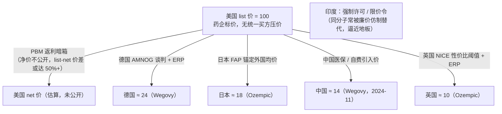

## 本章概览

本书开篇用一支减重针的五张价签当过钩子。前面六部从分子讲到支付方，已经把中、美两套体系拆得很细——美国的 PBM 返利机器、IRA 谈判、商业保险（第 12–14 章），中国的集采、DRG/DIP、医保谈判（第 15–16 章）。到这一部，镜头要拉到全球：同一款药，为什么在五个国家是五个价、五套权力结构？

这一章不深挖任何单一国家，它做两件事。第一，把"价格由谁定"抽象成一根坐标轴，给五国各找一个位置——这根轴是后面三章（日本、欧洲、印度）deep-dive 的地图。第二，把散落在前六部的中美内容收口成一张对照表，让读者一眼看清五种定价权归属的差异。学完这一章，再读到"NICE 按性价比阈值拒掉一款药""日本因为药卖太好反被砍价""印度强制仿制抗癌药"这些故事，就知道它们各自落在坐标轴的哪一格，而不是一堆互不相干的制度名词。

一句话先摆出来：决定一款药在某国卖多少钱的，从来不是它的研发成本，而是这个国家把定价权交给了谁。五国把这把权力交给了五种完全不同的角色。

## 钩子：一支减重针，五个国家五张价签

拿本书的招牌药——司美格鲁肽（semaglutide，GLP-1 受体激动剂，糖尿病/减重）来比。用于减重的版本叫 Wegovy，维持剂量的月费列表价（list price，即药企对外公示的标价，不是扣完返利和折扣后的真实成交价）在美国约 1,349 美元；同一支药在德国约 328 美元、荷兰约 296 美元；2024 年 11 月诺和诺德把它带进中国，月费约合 194 美元，比美国列表价低了八成五以上【事实，来源：Peterson-KFF Health System Tracker，list price，2023-06 汇率口径；中国价来源 CSRxP 引诺和诺德 2024-11，二手待复核】。糖尿病版的 Ozempic 落差更直白：美国约 936 美元/月，日本约 169 美元（美国是日本的 5.5 倍），英国、法国、瑞典都在 94 美元上下（美国约是它们的 10 倍）【事实，来源：Peterson-KFF，2023-06】。

同一个分子、同一家药厂、同一条产线，五国五价，最高和最低差出一个数量级。这不是孤例。RAND 公司用 2022 年 IQVIA 数据比对美国与 33 个 OECD 国家，结论是美国所有药品价格平均是它们的 2.78 倍，单看品牌药则高达 4.22 倍——哪怕把美国那套返利折扣调下去，品牌药仍是别国的 3 倍以上；区间从墨西哥的 1.72 倍一直拉到土耳其的 10.28 倍【事实，来源：RAND《International Prescription Drug Price Comparisons: Estimates Using 2022 Data》，2024-02】。

价格差这么大，成本却几乎一样，差异只能出在"谁有权定价、用什么工具压价"上。这一章就把这套权力结构拆开。

先用一个数字定个盘子：美国卫生总支出占 GDP 约 17.6%（2023，CMS 口径），OECD 经常性卫生支出占 GDP 均值约 9.2%（2022），中国卫生总费用占 GDP 约 7.2%（2023）【事实，来源：CMS NHE；OECD Health at a Glance 2023；中国卫健委/世行口径】。这三个数不能直接并排比——美国口径含资本性支出、中国是卫生总费用口径、OECD 是经常性支出口径，三套统计边界不同（这是本书反复提醒的口径红线）。但量级足够说明：美国为同样的医疗付出了远超别国比例的钱，而药价是其中最刺眼的一块。为什么？答案在定价权的归属。

## 一根坐标轴：定价权落在谁手里

把五国摊开，定价权的归属可以归到四种角色：

- **卖方定价**：药企自己定标价，没有一个统一的买方能在准入前把价格摁下来。美国是唯一的这一类。
- **单一买方定价**：一个掌握全国采购量的买家用"量"换"价"，卖方要么接受要么出局。中国的国家医保局、日本的政府都是这种角色，只是工具不同。
- **价值守门人定价**：不直接砍价，而是给"一款药值不值这个价"立一道性价比门槛，过不了就不报销。欧洲的 HTA 体系是典型。
- **国家强制定价**：政府用价格管制令直接给上限，必要时动用专利强制许可绕开原研。印度是这一类。

这根轴的一端是"卖方说了算"（美国），另一端是"国家说了算"（印度），中间是各式各样的买方与守门人。一个国家的药价高低，本质上就是它把定价权放在了轴的哪一段。如图 21-1 所示，这是本部的招牌图，后面三章都从这张表里取一行展开。

**图 21-1　五国定价机制对比（定价主体 / 压价工具 / 上市排序 / 外溢方向）**

| 国别 | 定价主体（谁定价） | 主要压价工具 | 上市排序 | 价格外溢方向 | 一句话：定价权归属 |
|------|------------------|------------|---------|------------|------------------|
| **美国** | 无单一主体：药企标价 + PBM 返利谈判（私营）+ Medicare IRA 谈判（2026 起，仅部分药） | PBM 处方集 / 返利 / 价差；IRA 谈判；商业保险博弈 | 全球最早（多数新药首发地） | 自身高价几乎不参照他国，反被他国向下参照；MFN 提案拟反向引入外价 | 卖方与 PBM——全球唯一的 price maker |
| **中国** | 国家医保局（NHSA）单一超级买方 | 带量采购（VBP 集采）；医保谈判（乙类灵魂砍价）；丙类 / 双通道 | 较晚（多在欧美日之后数年） | 基本游离于全球价格篮子之外；集采价极低但少被外引 | 唯一的政府买方——用采购量换降价 |
| **日本** | 厚生劳动省（MHLW）/ 中医协统一官方定价 | 年度药价改定（全面 + 中間年）；新薬創出加算；外国平均価格調整（FAP）；市場拡大再算定 | 滞后（price taker，常晚于欧美） | FAP 把美英德法均价引入境内（向内参照）；自身低价又喂入他国篮子 | 政府——药企是 price taker，价格锚定外国均价 |
| **欧洲** | 各国 HTA 机构 + 跨国参考定价网络 + 平行进口 | HTA（英 NICE 的 QALY 阈值 / 德 AMNOG / 法 HAS）；外部参考定价（ERP）；平行进口；EU 联合 HTA（2025） | 中等（德国最快，南欧 / 东欧最慢） | 内部 ERP 互相参照成价格篮子，整体向下拉低 ex-US 全球价 | HTA 性价比门槛与 ERP 网络——全球的价格篮子 |
| **印度** | 政府价格管制（NPPA）+ 专利制度 | 药价管制令（DPCO / NPPA 上限价）；专利强制许可；Section 3(d) 反 evergreening；Jan Aushadhi | 最晚或缺位（高价专利药常被本土仿制替代） | 全球最低；强制许可与廉价仿制经出口向下外溢 | 国家——以专利强制许可与限价令压价 |

读这张表有个诀窍：不要被一列列制度名词淹没，每一国只抓最后一列那句话。美国是卖方说了算，中国是一个巨买家说了算，日本是政府按外国均价说了算，欧洲是性价比门槛说了算，印度是国家用专利武器说了算。五句话，五种权力。

## 五国逐一：一句话抓住定价权

**美国——全球唯一的 price maker。** price taker（价格接受者）是指一个市场只能接受外部给定价格、自己无力影响定价的角色；price maker（价格制定者）反之，是有能力主动设定价格的一方。美国药企是全世界唯一稳定的 price maker：它先在美国按自己想要的标价上市，再向全球铺开。美国没有一个统一的政府买方在准入前压价，砍价的活外包给了私营的 PBM——但 PBM 砍的是返利（钱在药企、PBM、保险计划之间私下分），砍完的真实净价对外不公开，标价照样虚高（机制见第 12 章）。直到 2022 年的 IRA，联邦政府才第一次对极少数 Medicare 药品直接谈判定价，这是美国定价权结构上第一道裂缝，但覆盖面还很小。结果就是上面那串数字：美国为同样的药付全球最高的价。

**中国——唯一的政府买方用量换价。** 中国把定价权集中到一个手里：国家医保局。它的武器是"量"——带量采购把全国公立医院的采购量打包出去招标，谁报价低谁拿量，仿制药集采降幅常以"中选价相对集采前最高申报价"计（这个分母本身偏高，看降幅要小心，宜直接看中选价绝对值，详见第 15 章）。创新药则走医保谈判，以进入全国医保目录的放量为筹码换价格让步。这是一种买方垄断（monopsony，市场上只有一个买家）的力量：药企面对的不是无数分散的医院，而是一个掌握十几亿人参保盘子的单一谈判对手。

**日本——政府按外国均价定价，药企是 price taker。** 日本由厚生劳动省统一定官方药价，全国一个价，没有美国那种返利暗箱。它有两件别国少见的工具。一是外国平均価格調整（Foreign Average Price adjustment，FAP）：新药定价要拿美、英、德、法四国价格的均值做锚，如果日本拟定价高过这个均值的 1.25 倍就往下砍、低于 0.75 倍则往上调【事实，来源：PMDA《Japan's NHI Drug Price System》】。这等于把日本药价直接拴在外国价格上——它是结构性的 price taker。二是上市后逐年改定、放量即砍价的机制（第 22 章的主角是 Opdivo 因为卖太好被单独砍价 50% 的案例）。

**欧洲——给"一年健康生命"标价的守门人，加一张互相参照的价格篮子。** 欧洲不靠 PBM，也不靠单一国家买方，它的命门是两层。第一层是 HTA（Health Technology Assessment，卫生技术评估，即由专门机构评估一款药相对现有治疗到底多带来多少健康收益、值不值这个价）。英国 NICE 用 QALY（quality-adjusted life year，质量调整生命年，把"多活一年且生活质量良好"折算成 1 个单位）算性价比，每多获得一个 QALY 的花费若超过约 2 万到 3 万英镑的阈值，就可能被拒绝报销（第 23 章展开）。德国 AMNOG、法国 HAS 各有一套评估。第二层是外部参考定价（External Reference Pricing，ERP，即一国把若干"参照国"的价格作为本国定价的上下限依据）。

ERP 把欧洲织成一张互相牵制的网：除英国和瑞典等少数例外，几乎所有被研究的欧洲国家（约 23 至 26 个 EU 成员国）都采用 ERP，参照篮子的规模从 1 国（卢森堡）到 31 国（匈牙利、波兰）不等，英国、德国这类大市场被相当多国家拿去参照，多数国家取篮子里的均价或最低价做依据【事实，来源：PMC《Overview of external reference pricing systems in Europe》】。这就是"价格篮子"（price basket）的含义——一国的药价不是孤立定的，而是被一篮子参照国的价格框住。再加上欧盟内部允许平行进口（药品从低价国合法流向高价国套利），整个欧洲被压成一个互相向下看齐的低价区。这一点对全球价格的外溢极重要，下一节专门讲。

**印度——国家用专利武器和限价令压到全球最低。** 印度的结构差异不在"它是仿制药大国"这种供给侧事实上，而在它那套独特的 IP 加价格管制制度。专利法 Section 3(d) 限制对老药做微小改动后重新申请专利（反 evergreening，即反"常青化"地延长专利），诺华的格列卫当年就栽在这一条上。更锋利的是强制许可：2012 年印度专利局允许本土 Natco 无视拜耳的专利、强制仿制抗癌药 Nexavar（索拉非尼），把月费砍掉九成以上（第 24 章详述）。叠加 DPCO/NPPA 的价格管制令直接给上限价，印度成为全球药价的地板。

## list 价到 net 价：同一支药如何一路跌下来

跨国比价有个绕不开的陷阱：拿来比的多半是 list price（列表价），而真实成交的是 net price（净价，扣掉返利、折扣、强制降价后的价格）。两者的差额——list-net 价差——在不同国家由完全不同的机制造成，看不清这一层就会高估或低估真实落差。

把司美格鲁肽的列表价做成指数（以美国 = 100），沿着定价权由弱到强排一遍，就是一条向下的瀑布。如图 21-2 所示。

**图 21-2　同一支司美格鲁肽，list 价的国别瀑布（美国 list = 100）**

> 口径提示：上图为列表价指数，不同条目分属 Ozempic（糖尿病）与 Wegovy（减重）两个剂型、来源时点不一（Peterson-KFF 为 2023-06 汇率口径，中国为 2024-11，二手待复核），仅用于看权力结构造成的量级落差，不可当作精确的同口径净价比价。美国一端的 net 价因 PBM 返利不公开而无法精确给出，但本书第 12 章已说明其 list-net 价差可达 50% 以上——这意味着美国"真实"落差比图上看着要小一些，却仍是别国的数倍。

这张瀑布要读出两件事。第一，落差的大头不是成本差，而是定价权差：从美国的"卖方标价"一路走到印度的"国家强制"，每一格都是把定价权多交给买方或政府一点，价格就掉一截。第二，美国那一端的 list-net 价差是私营、不透明的（返利进了 PBM 和保险计划，没进患者口袋）；欧洲、日本那一端的价差是公开、制度化的（HTA 评估、FAP 公式、政府改定都摆在明面上）。同样是把价格往下压，美国压在暗处、别国压在明处——这是理解全球药价最该记住的分野。

## 上市排序：为什么美国总是第一个

定价权还决定了一件容易被忽略的事——一款新药先在哪国上市、后在哪国上市。这背后是简单的商业逻辑：药企会先去能卖出最高价、且定价不被外部参照拖累的市场首发。

美国正好两条都满足：价格最高，而且它不参照别国定价。所以全球绝大多数创新药把美国当首发地。欧洲次之，但内部差异巨大：按 EFPIA 的 W.A.I.T. 指标，2021 到 2024 年间获批的 168 个新药，在欧洲各国从拿到批准到患者可及的中位时间是 532 天，最快的德国 56 天，最慢的罗马尼亚要 1,201 天【事实，来源：EFPIA Patients W.A.I.T. Indicator 2024】。日本和中国通常更靠后，因为药企担心过早在低价市场上市，会通过 FAP（日本）或参考定价（影响他国篮子）把全球价格拉下来。

这里藏着 price taker 国家的一个隐性代价：定价权越弱、价格越被外部压低的国家，新药往往来得越晚。日本的"上市滞后"（drug lag）和它作为 price taker 的身份是一枚硬币的两面——药企不愿意让日本的低价过早进入别国的参照篮子，于是宁可晚一点上。压低了价格，代价是患者等得更久。这条规律在第 22、23、24 章会反复出现。

## 外溢方向：谁补贴谁

最后一根线，也是这一部最重要的一根：五国的价格不是各自孤立的，它们通过参照定价互相牵动，而牵动是有方向的。

美国是这张网的"源头高地"。它定价最高、又几乎不参照任何人，于是它的高价单向地补贴了全球的药品研发——药企在美国赚回大头利润，才有底气在欧洲、日本接受被砍到三分之一甚至十分之一的价格。这也是 MFN（Most Favored Nation，最惠国定价，指美国提出把本国药价拉到对标若干发达国家的最低价水平）这类政策提案争议的核心：它想反过来把别国的低价"引进"美国，等于动摇这块全球研发的利润底座。

欧洲是这张网的"向下拉力"。前面说的 ERP 价格篮子，让欧洲国家互相参照、互相向下看齐，再通过平行进口让低价国的药流向高价国。结果是欧洲整体成了一个把 ex-US（美国以外）全球价格往下拽的"价格篮子"——一国压低价格，会经由参照网络外溢到其他参照它的国家。日本的 FAP 则是"向内参照"：它把美英德法的均价引进来给自己定价，是价格的接收端；但它定出的低价又会进入其他国家的参照篮子，间接向外传导。

中国和印度大体游离在这张发达国家参照网之外。中国的集采价极低，但因为口径特殊、且中国市场对全球药企的利润权重还在上升期，这些低价目前很少被发达国家直接拿去参照——这层"隔离"既保护了全球价格体系，也意味着中国的降价红利主要留在国内。印度则站在另一个极端：它的强制许可与廉价仿制不只是国内低价，更通过仿制药出口把价格地板外溢到其他发展中国家，是全球药价体系里最强的向下力量。

把外溢方向连起来看，全球药价是一个"美国高地补贴研发、欧洲价格篮子向下拉、日本向内参照、中印游离在外"的不对称结构。理解了方向，就能看懂很多新闻背后的博弈：美国为什么总在喊"别国搭便车"，欧洲为什么能把价格压住却又抱怨新药来得慢，药企为什么在定价排序上斤斤计较。

## 把这张地图用起来

这一章是后面三章的坐标系，也是对前六部中美内容的收口。给读者三条用法。

第一，遇到任何一国的药价新闻，先问"定价权在谁手里"，对照图 21-1 落到四种角色之一，叙事立刻清晰：NICE 拒药是"价值守门人"在发力，日本砍 Opdivo 是"单一政府买方"在动手，印度强仿是"国家强制"在出手，美国药价高是"卖方说了算"的必然。

第二，跨国比价务必同口径。list 价的五国落差（10 倍量级）远大于 net 价的真实落差——美国 list-net 价差可达 50% 以上，把"美国是别国 10 倍"直接当成真实差距是误读。看任何跨国价格，先确认是 list 还是 net、是哪个剂型、什么时点的汇率。

第三，别把美国那套 PBM/IRA 框架平移到别国。这是本部反复强调的戒律：欧洲没有 PBM（靠 HTA 加单一支付方）、日本是政府统一定价（无返利博弈）、印度靠强制许可而非谈判压价。五国是五套独立机制，硬套美国经验只会看错。

接下来三章，分别把日本（政府定价下的 price taker）、欧洲（为一年健康生命标价）、印度（强制许可与价格管制）这三行展开成完整故事。地图已经铺好，先从日本那个"卖得越好、降得越狠"的反直觉案例开始。

## 小结

- **五国五价的根子不在成本，在定价权交给了谁。** 美国是卖方说了算（全球唯一 price maker），中国是单一政府买方用量换价，日本是政府按外国均价定价、药企是 price taker，欧洲是 HTA 性价比门槛加 ERP 价格篮子，印度是国家用专利强制许可与限价令压到地板。一根从"卖方"到"国家"的坐标轴，能给任何一国药价新闻定位。
- **跨国落差看着有 10 倍，真实落差要打折。** RAND 口径下美国品牌药是别国 4 倍以上；司美格鲁肽列表价美国是英国约 10 倍。但这些多是 list 价；美国 list-net 价差可达 50% 以上，net 口径的真实落差小得多。比价先认口径，否则必然误读。
- **【独立观察】定价权弱的国家，往往新药也来得更晚。** 上市排序不是行政效率问题，而是定价权的副产品：药企先去价格最高、又不被外部参照拖累的美国首发，再向被参照网络压价的欧洲、日本、中国铺开。日本的"上市滞后"和它 price taker 的身份是一枚硬币两面——压低价格的代价是患者等得更久。
- **全球药价是一个不对称的外溢结构。** 美国高价单向补贴全球研发（MFN 之争的本质就是要不要拆这块底座）；欧洲 ERP 价格篮子加平行进口，整体把 ex-US 全球价向下拉；日本 FAP 向内参照外国均价；中印大体游离在发达国家参照网之外，印度还通过仿制出口向下外溢。看懂外溢方向，就看懂了"谁补贴谁"。
- **戒律：别把美国框架平移别国。** PBM、返利、IRA 是美国独有的解法，欧洲（HTA + 单一支付方）、日本（政府统一定价）、印度（强制许可）各有自己的机制。这是接下来三章逐一展开的前提——下一章先看日本那个"药卖太好反被政府单独砍价 50%"的反直觉故事。

## 配套数据

见 `data/21-global-pricing/`。本章用到的所有数据源详见 `data/21-global-pricing/sources.md`。

---

> 本章来自《医疗经济学》开源版 · 作者「递归客」  
> 在线阅读完整书系：[inferloop.dev](https://inferloop.dev) · 反馈与勘误：[GitHub Issues](https://github.com/diguike/book-healthcare-economics/issues)
