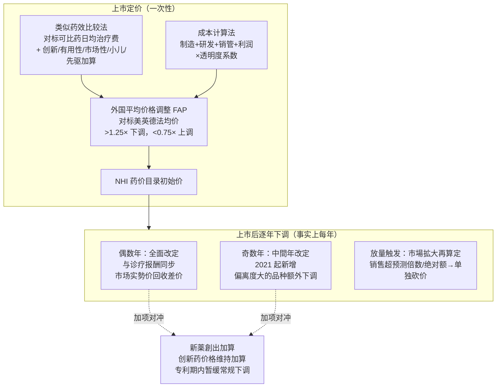
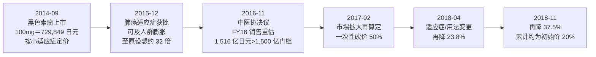

## 卖得越好，砍得越狠

2014 年 9 月，小野药品工业（Ono Pharmaceutical, 4528.T；与百时美施贵宝 BMS 共同开发的 PD-1 抑制剂 Opdivo 在日本的持有方）把 Opdivo（纳武利尤单抗 nivolumab，PD-1 抑制剂）以晚期黑色素瘤适应症推上日本国民健康保险（NHI）药价目录。100mg 一支的官方报销价定在 729,849 日元。黑色素瘤在日本是小适应症，定价时官方按很小的患者群算账，没人觉得这个单价会捅出篓子。

问题出在适应症扩张。2015 年 12 月，Opdivo 拿下非小细胞肺癌适应症——肺癌在日本的患者规模是黑色素瘤的几十倍。按照黑色素瘤时期定下的单价，再乘以肺癌的潜在用药人群，厚生劳动省（MHLW）算出一个让支付方睡不着觉的数字：如果按 5 万名肺癌患者用药测算，单是这一款药一年就要花掉约 1.75 万亿日元。按官方口径，可及人群一度膨胀到「最初列入医保目录时设想的 32 倍」。

日本支付方的反应不是谈判，也不是设置返利，而是直接动用一项叫「市場拡大再算定」（市场扩大重算，下文详述）的机制，对 Opdivo 单独重新定价。2016 年 11 月 16 日，中央社会保险医疗协议会（中医协，Chuikyo，日本药价决策的核心审议机构）通过决议，2017 年 2 月正式执行：Opdivo 价格一次性砍掉 50%。重算依据是 MHLW 把它 FY2016 的年销售额重新估到 1,516 亿日元，越过了触发「巨额销售」重算的 1,500 亿日元门槛。

砍价没有停在 50%。随着适应症和用法用量继续变化，2018 年 4 月再降 23.8%，2018 年 11 月又降 37.5%。几轮下来，Opdivo 的单价被压到上市初期标价的约 20%。一款救命的创新药，在日本市场卖得越好、适应症铺得越宽，价格被砍得越狠——这就是这一章要拆解的市场。在日本，药企对自己产品的价格几乎没有发言权，它是一个彻头彻尾的 price taker（价格接受者）：价格由政府体系单方面设定、单方面下调，企业能做的只有接受，或者不进这个市场。

## price taker：定价权在谁手里

回到本书第 21 章建立的「价格由谁定」坐标系。美国是一套围绕 PBM（药品福利管理）展开的私人博弈，list price（标价）和 net price（净价）之间隔着层层返利，谈判桌上买卖双方各有筹码。日本是另一个极端：没有 PBM，没有返利博弈，没有多个支付方互相比价。几乎所有处方药都走同一个国民健康保险体系报销，价格由 MHLW 在中医协审议后统一设定，全国一个价，写进 NHI 药价目录。

这意味着对一家药企来说，日本市场的价格是一个外生变量。你能影响它的，只有在上市谈判时提交的临床证据和成本数据；一旦价格定下来，后续的走向——每年改定、放量重算、专利到期后的进一步下调——基本由制度按既定规则推动，企业没有反向议价的空间。第 12、13 章讲美国时反复强调的「list 到 net 的价差」「返利返点的暗箱」，在日本不适用，硬套过来只会得出错误结论。日本的命门不在返利，而在两件事：一是政府怎么给新药定初始价，二是定完之后怎么逐年往下压。

## 怎么定价：比较法、成本法、外国平均价格调整

日本给新药定初始价，主要用两种方法（如图 22-1 上半部）。

第一种是「类似薬効比較方式」（类似药效比较法）。如果市场上已有疗效机制相近的可比药（comparator），新药的日均治疗费用就对标这个可比药来定，再根据创新程度加上不同档位的加算（premium）：画期性加算（开创性）、有用性加算（有用性）、市場性加算（市场性）、小儿加算、先駆加算（先驱，对应日本本土首发的突破性药物）。可比药选得好不好、加算能拿到几档，直接决定新药的起步价。

第二种是「原価計算方式」（成本计算法），用于找不到合适可比药的全新机制药物。它从制造成本、研发费用、销管费用、营业利润一路加总，再乘一个反映创新性与披露透明度的系数。这种方法对企业的成本披露要求很高，定出的价往往偏保守。

两种方法定出价格后，还要过一道「外国平均価格調整」（Foreign Average Price Adjustment, FAP，外国平均价格调整）。日本会把拟定价格和美、英、德、法四国的平均价格比对：如果日本价高于四国均价的 1.25 倍，按公式向下调；如果低于均价的 0.75 倍，向上调。FAP 的设计意图是不让日本价格和主要发达市场拉开太大差距。但它有个被反复诟病的副作用——美国药价是全球最高的，把美国纳入参照篮子，理论上能把日本价往上托一点；可日本支付方近年更在意的是控费，FAP 在实操中更多扮演「别比海外贵太多」的封顶角色，而不是「向海外看齐」的提价工具。

图 22-1：日本药价从上市定价到逐年下调的机制全景。上半部是一次性的初始定价（两种方法 + FAP 封顶），下半部是上市后逐年向下的三条压价通道，新薬創出加算是专利期内对冲常规下调的唯一加项。

## 改定节奏：已经是事实上每年下调

定完初始价，接下来是日本压价的主战场——「薬価改定」（药价改定，即官方对全部在售药品的价格修订）。

传统上，日本药价改定每两年一次，和「诊疗报酬」（医疗服务收费标准）同步调整，在偶数年（2018、2020、2022……）进行，叫「全面改定」。机制是回收「市场实勢价」：MHLW 每年做一次全国药价调查（薬価調査），统计医院、药店实际从批发商进货的成交价。由于批发商之间存在折扣竞争，实际成交价通常低于官方报销价，这个差额（乖離率，偏离度）就是改定时要往下砍的部分。日本药价因此呈现一个稳定的特征：上市后基本只跌不涨，每一轮改定都在回收偏离度。

这里有一条必须守住的事实，也是市面上很多旧资料的错处：日本药价**不再是「每两年下调一次」**。2021 年起，日本在偶数年全面改定的基础上，新增了奇数年（2021、2023、2025……）的「中間年改定」（中间年改定，又称 off-year revision）。中间年改定针对偏离度较大的品种额外下调一次。2021 年首次执行时，覆盖范围比预想的宽，相当多的品种被纳入。两者叠加，意味着 2021 财年以后，日本药价**事实上每年都在下调**——偶数年全面改定 + 奇数年中间年改定，没有哪一年是空档。对做日本市场销售预测的人来说，这是个口径上的硬变化：原来两年砍一刀，现在一年砍一刀，创新药价格的衰减曲线明显更陡。

唯一的对冲项是「新薬創出加算」（新药创出加算，正式名称是「新薬創出・適応外薬解消等促進加算」，可以理解为创新药价格维持加算）。2010 年引入，逻辑是：对符合条件的创新药（孤儿药、政府指定开发品种、有可比临床证据的首创药等），在专利期内暂缓常规改定带来的价格下调，把降价推迟到专利到期、仿制药上市之后。它是日本药价体系里少有的「保护创新」装置，相当于给真正有创新性的药一段价格维持期。但能不能进这个名单、维持力度多大，每轮改定都在收紧，企业并不能把它当成稳定的护城河。

把这两层放在一起看：日本对创新药的态度是「上市时给你一个还算体面的价，但从你上市那天起就开始一年一刀地往下压，只有少数真正创新的品种能在专利期内缓一缓」。价格的天花板从一开始就被钉死，且只会越来越低。

## 放量即砍价：市場拡大再算定与 Opdivo 时间轴

逐年改定是常规节奏，「市場拡大再算定」则是悬在畅销药头上的那把刀。它的规则简单粗暴：当一款药的实际销售额大幅超过上市时的预测，或越过某个绝对额门槛，就在常规改定之外对它单独重算价格、单独下调。

按公开整理的口径（PharmExec/MHLW），触发档位分两档：年销售额落在约 1,000 亿至 1,500 亿日元、且达到上市预测值 1.5 倍以上的，最高下调 25%；只有年销售额超过 1,500 亿日元、且达到预测值 1.3 倍以上的，才进入最高下调 50% 的档位。更狠的是「共连れ」（spillover，连带）规则——当一款药因放量被重算，同类机制的竞品也可能被连带一起砍价。Opdivo 被砍时，同为 PD-1 抑制剂的 Keytruda（帕博利珠单抗 pembrolizumab，PD-1 抑制剂，多癌种）在日本尚未积累足够销售，但连带规则的存在意味着，一个赛道里只要有一款药卖爆，整条赛道的价格都可能被往下带。

Opdivo 是这套机制最典型的案例（图 22-2）。它的价格轨迹完整演示了「放量—超预测—被重算」的因果链：

图 22-2：Opdivo 在日本的价格—放量—再算定时间轴。一款按小适应症定价的药，因适应症扩张放量、销售远超预测，被市場拡大再算定连续重算，三年内单价压到上市初期的约两成。注意因果方向：是「卖得太好、可及人群暴涨」触发了砍价，而不是常规改定。

Opdivo 事件的影响超出了一款药。它直接推动了日本药价制度的调整：一是把市場拡大再算定从原来主要随两年一次的改定执行，扩展到对超大品种可以年度内更频繁地触发（不必等下一次全面改定），二是为后来 2021 年中间年改定的落地铺了路。支付方从 Opdivo 身上得到的教训是：在创新药越来越贵、可及人群越来越宽的时代，两年一次的改定节奏太慢了，必须有能随时出手、单独点名的工具。

## price taker 的另一面：上市排序滞后

价格被钉死之外，日本市场对全球药企还有第二重影响——上市排序滞后，业内叫「ドラッグ・ラグ」（drug lag，药物滞后）甚至「ドラッグ・ロス」（drug loss，药物缺失，指干脆不在日本上市）。

成因是多重的。日本药品医疗器械综合机构（PMDA，日本药监审评机构，相当于美国 FDA 的审评部门）有自己的审评要求，历史上常要求纳入日本人种的临床数据，跨国药企往往要在全球关键试验之外再补一组日本桥接试验，时间和成本都摊上去。叠加上面讲的价格前景——一个上市即被锁死天花板、之后一年一刀下调、放量还要被单独砍的市场——很多创新药企，尤其是没有日本商业化能力的中小 biotech，会把日本排在美国、欧洲之后，甚至直接放弃。结果是日本患者拿到全球新药的时间普遍晚于欧美，部分药物根本不进来。

这正是 price taker 身份的延伸：当一个市场既不让你定价、又持续压价，理性的全球药企会用「先上别处、后上日本，或者不上」来回应。日本支付方控住了药价，代价是本国患者在创新药可及性上的滞后。近年 MHLW 也意识到 drug loss 的问题，在加算政策上对「日本本土首发」「填补未满足需求」的品种给了一些倾斜（先驱加算就是例子），试图把企业拉回来，但价格体系的基本盘——统一定价 + 逐年下调 + 放量重算——没有变。

## 日企的应对：把增长押在海外

理解了这个市场，就能理解日本本土大药企这些年的战略选择：核心增长不在日本，在海外，尤其是美国。本国市场是一个价格只跌不涨的存量盘，要做大就必须把重磅产品打进定价更高、放量不被惩罚的美国市场。看三家头部日企 FY2025（日本药企多为 3 月财年，FY2025 指 2025 年 4 月至 2026 年 3 月，与美欧的日历年财报错开整一年；以下日元折美元按 FY25 期间约 1 美元兑 155–160 日元的量级口径）的表现，这条主线很清楚。

第一三共（Daiichi Sankyo, 4568.T；以 ADC 平台为核心引擎的日本创新药企）FY2025 营收约 2.12 万亿日元（约 134 亿美元），同比增长 12.6%，核心营业利润约 3,600 亿日元、增长 15.1%。增长几乎全靠一款药——Enhertu（德曲妥珠单抗 trastuzumab deruxtecan，HER2 导向 ADC，与阿斯利康共同开发，多癌种）当年销售约 8,195 亿日元、增长 25.8%。Enhertu 的主战场是美国和欧洲，第一三共的 Dato-DXd（datopotamab deruxtecan）等后续 ADC 管线同样瞄准全球。一家日本公司，靠的是把 ADC 平台打到日本之外。

安斯泰来（Astellas, 4503.T；以前列腺癌药 Xtandi 为支柱、向 ADC 与基因治疗转型的日本药企）FY2025 营收约 2.14 万亿日元（约 135 亿美元）、增长 11.9%，核心营业利润约 5,557 亿日元、大增 41.6%。支柱产品 Xtandi（恩扎卢胺 enzalutamide，雄激素受体抑制剂，前列腺癌）和 Padcev（ADC）的核心市场同样在海外。

武田（Takeda, 4502.T/TAK；日本最大、最国际化的药企，总部在大阪但收入主要来自海外）则演示了硬币的另一面。FY2025 核心营收约 4.51 万亿日元（约 283 亿美元），核心营收按实际汇率口径（AER）同比下滑 1.6%、按固定汇率口径（CER）下滑 2.6%（口径相近的 IFRS 报告营收 AER 约为 -1.7%），核心营业利润约 1.17 万亿日元。拖累来自专利悬崖——多动症药 Vyvanse（赖右苯丙胺 lisdexamfetamine）在美国失去独占、遭仿制药冲击，营收承压。武田的体量和收入结构早已是一家全球公司，本国市场在它的盘子里只占很小一块；它面对的核心矛盾不是日本药价，而是和所有跨国药企一样的专利悬崖与管线接续（本书第 25 章详谈）。

把三家放在一起：日本药价体系把本国市场变成一个不能指望增长的价格洼地，倒逼有创新能力的日企必须出海。第一三共和安斯泰来用 ADC、前列腺癌等全球品种证明了这条路走得通，武田则提醒，出海之后面对的是和全球巨头同样的悬崖。日本市场对这些公司的意义，更多是一个稳定但萎缩的基本盘，而不是增长引擎。

## 小结

日本是本书五国坐标里「政府统一定价」的纯粹样本：没有 PBM、没有返利博弈，价格由 MHLW 在中医协审议后单方面设定，药企是彻底的 price taker。这套体系用三条通道把创新药的价格天花板钉死并持续下压——FAP 在上市时封住初始价的上限，逐年改定（2021 起已是偶数年全面 + 奇数年中间年的事实上每年下调）回收市场偏离度，市場拡大再算定则对放量畅销药单独点名砍价。Opdivo 三年内被压到初始价两成，是「卖得越好、砍得越狠」最锋利的注脚。

我的判断是：日本案例的价值不在机制细节，而在于它示范了一个成熟老龄化社会在控费压力下能把药价制度做到多极致，以及代价是什么。代价是 drug lag/drug loss，是本国患者在全球创新药可及性上的系统性滞后，是有创新能力的本土企业被迫把增长全部押到海外。对投资者而言，看日本药企不能只看它的本国基本盘，要看它在海外（尤其美国）的产品能不能放量、定价能不能守住——本国那条逐年下行的价格曲线，是确定的逆风。下一章转向欧洲，那里压价不靠政府年度改定，而靠给「一年健康生命」明码标价的 HTA 性价比门槛，是又一套完全不同的定价权结构。

---

> **免责声明**
>
> 本章涉及具体公司的财务分析、估值测算与产业判断，仅为作者基于公开信息的研究结果，**不构成任何投资建议**。市场有风险，投资决策应基于读者自身的独立判断和专业咨询。
>
> 本章使用的财务数据截至 2026-05，公司基本面与市场环境可能在阅读时已发生变化。本章中提到的公司股票、估值倍数、目标价等信息均为分析素材，作者不对其准确性、完整性或时效性作任何承诺。日本药企多为 3 月财年，引用 FY2025 时已注明对应日历区间（2025-04 至 2026-03），请勿与美股同名财年混淆。
>
> **作者持仓披露**：截至本章数据时点（2026-05），作者未持有武田（4502.T/TAK）、第一三共（4568.T）、安斯泰来（4503.T）、小野药品（4528.T）及本章提到的其他公司股票或衍生品。

## 配套数据

见 `data/22-japan/`。本章用到的所有数据源详见 `data/22-japan/sources.md`。

---

> 本章来自《医疗经济学》开源版 · 作者「递归客」  
> 在线阅读完整书系：[inferloop.dev](https://inferloop.dev) · 反馈与勘误：[GitHub Issues](https://github.com/diguike/book-healthcare-economics/issues)
