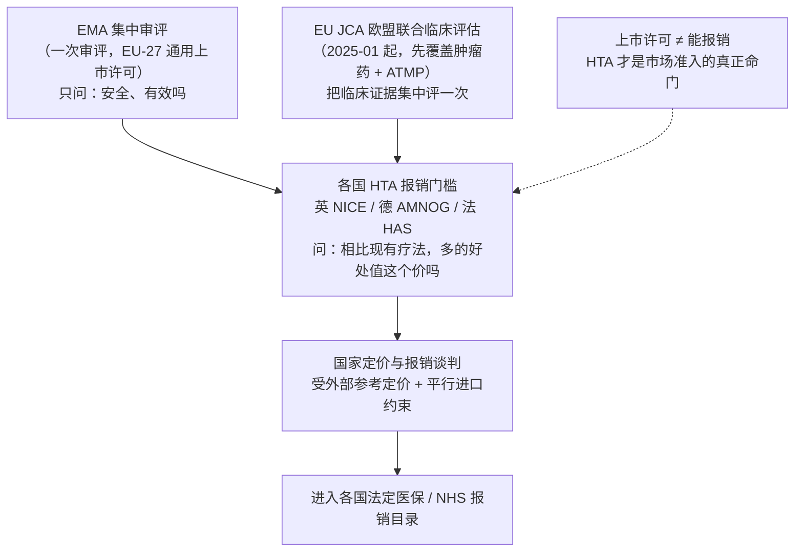
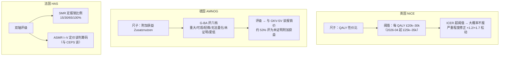
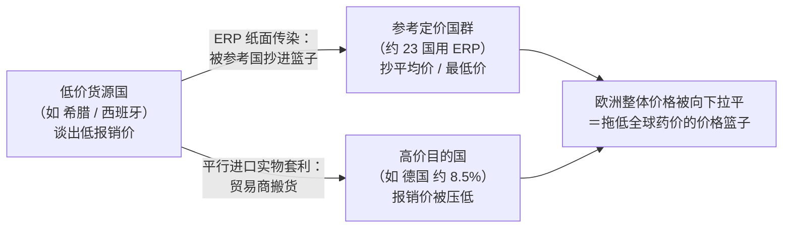

## 本章概览

前两章把美国和日本的定价权拆开了：美国靠 PBM 和商业市场博弈出一个谁也说不清的净价，日本靠政府每年统一改定把药企钉成 price taker。欧洲是第三种，也是五国里最容易被国内读者忽略、却对全球药价影响最深的一种。

欧洲的命门不在"谁付钱"，而在"值不值得付"。一款药能不能在欧洲卖，由 EMA（European Medicines Agency，欧洲药品管理局）的集中审评说了算；但能不能被各国法定医保报销、报多少钱，由另一套机构决定——HTA（Health Technology Assessment，卫生技术评估）。HTA 的核心动作，是给"多活一年健康生命"算一笔性价比账，算不过就把药挡在门外。叠在 HTA 上面的，还有外部参考定价和平行进口两台机器，把各国价格连成一张网。这张网让欧洲成了拖低全球药价的"价格篮子"。

本章拆四件事：上市许可和报销准入为什么是两道门；NICE、德国 AMNOG、法国 HAS 三套 HTA 各按什么逻辑卡门；外部参考定价和平行进口怎么把欧洲价格连成一体、向下传染；以及 2025 年 1 月生效的欧盟联合 HTA 想改什么、又改不动什么。看懂欧洲，关键是放下美国那套 PBM 返利的框架——欧洲没有 PBM，是 HTA 加单一公共支付方，靠给健康生命明码标价来压价。

## 钩子：一款药，监管批了，NICE 不报

2024 年 8 月，英国药监局 MHRA（Medicines and Healthcare products Regulatory Agency）批准了 Leqembi（lecanemab，仑卡奈单抗，抗 β-淀粉样蛋白单抗，早期阿尔茨海默病）上市【事实，来源：MHRA，2024-08-22】。这是几十年来第一款被证明能延缓阿尔茨海默病进展的药，在美国按列表价约每年 2.65 万美元销售【事实，来源：Eisai 美国定价公告，2023】。监管这一关过了，药是合法的，美国患者花钱就能用。

但在英国，能合法上市不等于 NHS（National Health Service，英国国民医疗服务体系）会买单。2025 年 6 月，NICE（National Institute for Health and Care Excellence，英国国家卫生与临床优化研究所，负责评估新疗法值不值得纳入英格兰 NHS 报销）发布最终草案指南，第三次拒绝把 lecanemab 和同类的 donanemab（多奈单抗）纳入 NHS——理由不是药没用，而是获益太小，不足以匹配它高昂的成本【事实，来源：NICE 最终草案指南，2025-06-19】。这两款药被证明能把阿尔茨海默病从轻度推向中度的进程推迟 4 到 6 个月【事实，来源：NICE，2025-06-19】，但按已发表的欧洲卫生经济学测算，lecanemab 每多换来一个质量调整生命年要花约 29.6 万欧元、donanemab 约 37.1 万欧元，远超 4.5 万欧元的支付意愿线【分析，来源：HIQA 支付方视角成本效果分析，2025】。

同一款药，在美国是天价但卖得动，在英国被一句"每多活一年健康寿命的花费太高"直接挡在 NHS 门外。欧洲压药价不靠 PBM 砍返利，靠的是给"一年健康生命"明码标价，然后把超价的药拒之门外。这套标价机制，就是 HTA。

## 两道门：上市许可不等于能报销

理解欧洲，先把两件在美国容易混为一谈的事分开。

第一道门是上市许可。在欧盟，创新药、生物药、肿瘤药、罕见病药等绝大多数新药走 EMA 的集中审评程序（centralised procedure）：一次申请、一次审评，通过后拿到一张在全部 27 个成员国都有效的上市许可。这一步只回答一个问题——药安全、有效吗。

第二道门是报销准入。拿到上市许可，药企只是获得了可以卖的资格，但欧洲的药费大头由各国法定公共医保支付，患者自费占比低。一款药要真正卖得动，必须进入各国的报销目录。而进不进、报多少，EMA 不管，由各成员国自己的 HTA 机构决定。HTA 回答的是另一个问题——这药相比现有疗法多带来的那点好处，值这个价吗。

这就是欧洲和美国最根本的结构差异。美国药价的博弈在 PBM、保险计划、药企之间的私营市场里展开，政府基本不直接定价；欧洲的博弈在药企和一个个国家公共支付方之间展开，HTA 是支付方手里的那把尺子。美国那套处方集、返利、价差的机器，在欧洲根本不存在——欧洲没有 PBM。把美国经验平移过来，会完全看错欧洲的定价逻辑。

需要说明，英国 2020 年已退出欧盟，新药在英国由 MHRA 单独审批，不再走 EMA。但报销准入这道门、以及 NICE 这把尺子的逻辑，正是整个欧洲 HTA 体系的原型，所以本章的钩子仍从 NICE 讲起。欧洲市场准入的全流程，如图 23-1 所示。

## QALY 与 NICE：把"一年健康生命"明码标价

HTA 要回答值不值，就得先有一把能比较的尺子。英国 NICE 用的尺子是 QALY（Quality-Adjusted Life Year，质量调整生命年）。

QALY 的逻辑很朴素：一年完全健康的生命算 1 个 QALY；带病活一年，按生活质量打折，比如重度病痛中活一年可能只算 0.5 个。一款新药的价值，就折算成它相比现有疗法多带来多少个 QALY。再把多花的钱除以多换来的 QALY，得到一个比值——ICER（Incremental Cost-Effectiveness Ratio，增量成本效果比），意思是每多买到一个健康生命年要花多少钱。

NICE 给这个比值划了一条线。自 21 世纪初起，它的常规阈值是每 QALY 2 万到 3 万英镑：ICER 低于 2 万基本会报，2 万到 3 万之间要看证据强弱，超过 3 万则大概率不报【事实，来源：NICE 方法学指南 / OHE，2025】。回到钩子——lecanemab 的每 QALY 成本被测算到二十几万英镑量级，是这条线的近十倍，被拒几乎是算术上的必然。

这条线不是铁板一块，有两处松动值得记住。其一，2022 年 NICE 引入严重程度修正（severity modifier），替代了原来的临终用药特例：病越重，给它的 QALY 乘以 1.2 或 1.7 的权重，相当于把有效阈值抬高，让重病的贵药更容易过关【事实，来源：NICE 评估手册，2022/2023】。其二，对极罕见病的高度专业化技术（HST），NICE 单设一条高得多的阈值通道，承认罕见病药天然摊不薄成本。此外，2025 年 12 月英国政府宣布，从 2026 年 4 月起把常规阈值上调到每 QALY 2.5 万到 3.5 万英镑——二十多年来第一次上调【事实，来源：英国政府公告 / pharmaphorum，2025-12】。阈值能被政府一句话调动，本身说明它是政策工具，不是科学常数。

NICE 这套做法的要害，是把一个所有支付方都回避的问题摆到台面上明算：一个健康生命年到底值多少钱。美国从不公开回答这个问题——它把价格博弈藏进返利和处方集；NICE 把它写成一个可以被起诉、被游说、被政府调整的数字。这是欧洲式定价和美国式定价在哲学上的分野。

## 德国 AMNOG：不按 QALY，按"附加获益"

但欧洲并非铁板一块，连怎么标价都不统一。德国是欧洲最大的药品市场，它偏偏不用 QALY。

德国走的是 AMNOG（Arzneimittelmarktneuordnungsgesetz，《药品市场重整法》，2011 年生效）框架。新药上市后，头一段时间药企可以自由定价、自由销售——这个自由定价窗口原本是 12 个月，2022 年的控费改革（GKV-FinStG）把它压到了 6 个月【事实，来源：GKV-FinStG / Simon-Kucher，2024】。窗口期内，IQWiG（医疗质量与效率研究所）对这款药做早期获益评估，核心问题不是每 QALY 多少钱，而是相比现有标准疗法，它有没有附加获益（Zusatznutzen）、有多大。

评估结果由 G-BA（联邦联合委员会，德国法定医保的最高决策机构）拍板，分成六档：重大、可观、轻微、无法量化、未证明附加获益、获益更低【事实，来源：G-BA / Value & Dossier，2025】。这一档评级直接决定药企的议价地位。拿到重大或可观，药企就有底气向 GKV-SV（法定医保基金联合会）要溢价；评成未证明附加获益，价格往往被压到现有参考价组的水平，等于没溢价空间。评级公布（G-BA 的 Beschluss）后，药企和 GKV-SV（法定医保基金联合会）进入最长六个月的报销价（Erstattungsbetrag）谈判阶段，通常经历四次谈判会议，谈不拢就交仲裁委员会裁定。

一个常被忽略的数字：在德国对非罕见病药的获益评估中，多数结论是未证明附加获益。一项统计显示约 53% 的评估落在这一档，只有约 41% 拿到了某种程度的附加获益认定【事实，来源：Cambridge Core / Cencora，2024】；谈判后的报销价平均比上市定价低约 24.5%【分析，来源：Cencora，2024】。德国不喊砍价，但用一套证据门槛把多数新药的溢价主张挡了回去。

AMNOG 和 NICE 殊途同归——都在问多带来的好处值不值这个价——但路径不同。NICE 用 QALY 把价值压成一个可比的数字，再卡阈值；德国回避 QALY，改用有没有附加获益的定性分级，再让评级去约束谈判。对药企而言，这意味着同一款药要在英、德两地准备两套完全不同的证据包。

## 法国 HAS：两根轴，一根定报不报，一根定价

法国又是另一套。HTA 的活由 HAS（Haute Autorité de Santé，法国国家卫生管理局）下属的透明委员会（Commission de la Transparence）来做，用两个相互独立的评级。

第一根轴是 SMR（Service Médical Rendu，实际医疗效用），衡量这药本身有没有治疗价值，决定它能不能报、报销比例是多少——15%、30%、65% 或 100%【事实，来源：HAS / Global Legal Insights，2025】。第二根轴是 ASMR（Amélioration du Service Médical Rendu，医疗效用改善），衡量它相比已有疗法多带来多少改善，分 I 到 V 五级：I 级是重大突破，V 级是毫无改善。ASMR 不决定报不报，决定的是定价谈判的筹码——评级越高，药企在和 CEPS（Comité économique des produits de santé，卫生产品经济委员会）的谈判里越能要价。

这套双轴的巧妙在于把两个问题拆开了：值不值得报（SMR），和能开多高的价（ASMR）。一款药可以 SMR 够格、必须报销，但 ASMR 评成 V 级、毫无创新，于是只能拿到和老药差不多的价格。

三国的逻辑对照，如图 23-2 所示。

三套尺子，一个共同点：都站在公共支付方一侧，把创新到底值多少钱翻译成一个能被谈判、能被拒绝的判断。这是欧洲压价的第一层机器。第二层机器，把各国连成了一张网。

## 外部参考定价：欧洲是一个价格篮子

假设一家药企在英、德、法各谈出了一个价。问题来了：欧洲还有二十几个国家，它们怎么定价？答案是抄。

欧洲多数国家用一套叫 ERP（External Reference Pricing，外部参考定价，又称国际参考定价）的机制：本国不独立评估一款药值多少钱，而是去看一篮子参考国的价格，取它们的平均值或最低值来给本国定价。一项覆盖欧洲的研究显示，约 23 个国家把 ERP 作为系统性定价的主要依据，几乎所有受调查国家都在用——只有英国和瑞典是例外【事实，来源：Overview of external reference pricing systems in Europe，2015】。参考篮子的大小从 1 个国家（卢森堡）到 31 个国家（匈牙利、波兰）不等；希腊、挪威、斯洛伐克、捷克等国取篮子里最低几个价的平均【事实，来源：同上】。

把这套机制放到一起看，结果是：欧洲不是 27 个独立定价的市场，而是一个相互引用、彼此传染的价格网。一家药企在某个小国为了换取准入让出一个低价，这个低价会被参考它的国家抄过去，再被参考那些国家的国家抄过去，像多米诺一样向外扩散。对药企而言，这意味着任何一个市场的低价都不是孤立的，可能拖累一长串其他市场的报销价。这就是欧洲被称为全球价格篮子的由来——它不只是自己价格低，还通过这张引用网，把低价信号向全球扩散。许多跨国药企在欧洲采取高价国先上、低价国拖后的上市排序，正是为了不让低价过早进入别国的参考篮子。

药企当然在反制。2024 年德国的控费改革引入了保密报销价的设计，让谈判后的实际价格不对外公开，目的正是阻断它被其他国家的 ERP 引用【事实，来源：Inside EU Life Sciences，2024】。账面价和真实成交价的鸿沟，在欧洲以另一种形式重新出现。

## 平行进口：单一市场里的合法套利

ERP 是价格在纸面上的传染，平行进口（parallel import，指利用各国价差，把药品从低价国合法转销到高价国的贸易）则是药品实物的跨境套利，两者一起把欧洲价格越拉越平。

欧盟是单一市场，商品自由流动，加上知识产权权利用尽原则——药企在任一成员国把药合法卖出第一次后，就不能再阻止它在欧盟内被转售。于是一门生意成立了：独立贸易商盯着各国价差，从价格最低的国家买入，拿到目的国的进口许可，再卖到价格高的国家，赚中间的差价。传统上的低价货源是希腊、西班牙，目的地是德国、瑞典、丹麦这些高价国【事实，来源：cepInput / Pharmafootpath，2021/2024】。在德国，约 8.5% 的药品销售来自平行进口【事实，来源：Bart et al., Value in Health，2008】。

平行进口的产业含义是：药企在欧洲很难维持地区价差。它本想在富国卖高价、在穷国卖低价做市场细分，但平行贸易商会把穷国的低价货搬到富国，套走这块差价，还顺带压低富国的报销价。药企损失了利润，套利落进了中间商口袋，患者那头价格未必更便宜。这进一步强化了欧洲是一个连通的价格篮子这个判断——ERP 拉平纸面价格，平行进口拉平实物价格，两台机器叠加，单一市场内部的定价自由被压得很薄。

ERP 和平行进口如何把一个国家的低价向外传染，如图 23-3 所示。

## EU JCA：2025 年的一次集中化尝试

欧洲的碎片化对药企是实打实的负担：同一款药要在 27 国准备 27 套（逻辑还各不相同的）HTA 证据。2025 年 1 月，欧盟试图在临床这一层做一次统一。

依据《欧盟卫生技术评估条例》（Regulation 2021/2282，2021 年 12 月通过），欧盟从 2025 年 1 月 12 日起启动 EU JCA（Joint Clinical Assessment，欧盟联合临床评估）【事实，来源：欧盟委员会 / Regulation 2021/2282】。它的做法是：对在 EMA 申请上市的新药，由一个成员国协调组在 EMA 审评的同时，集中做一次临床有效性评估，产出一份各国通用的临床证据报告，供各国 HTA 直接采用，不必再各自重做临床部分。首批纳入的是新的肿瘤药和 ATMP（Advanced Therapy Medicinal Products，先进治疗药品，即细胞和基因治疗等）——两类临床证据最复杂、最值得统一评的品类【事实，来源：欧盟委员会，2025】。

但要看清 JCA 改了什么、没改什么。它统一的只是临床评估这一层——一款药有没有效、相比对照效果多大，集中评一次。它没有统一、也无意统一定价和报销决策：每个国家拿到这份临床报告后，仍按自己的规则去算性价比、定阈值、谈价格。换句话说，NICE 的 QALY 阈值、德国的 AMNOG 谈判、法国的双轴评级照旧，ERP 和平行进口那张价格网照旧。JCA 降低的是药企重复提交临床证据的成本，触动的不是各国对值不值的最终裁量权。把它读成欧洲药价从此统一是误读——欧洲在临床证据上走向集中，在定价主权上仍然分散。

## 投资视角：欧洲是利润的折价区，不是增长极

把欧洲放进全球药企的损益表来看，几个判断是相对稳的。

欧洲是结构性的价格折价区。HTA 卡门、ERP 传染、平行进口套利三台机器叠加，使欧洲很难成为创新药的高价市场。同一款药，欧洲的净价系统性低于美国，且这个低价还会通过 ERP 向全球扩散。这就是为什么全球制药业的利润越来越依赖美国市场——美国一个市场常常贡献一款重磅药的大部分利润，欧洲更像一个必须进入、但利润被压薄的规模市场。评估任何一家跨国药企的盈利质量，要看它的收入有多依赖美国定价，欧洲收入占比高未必是好事。

上市排序是可观察的战术信号。因为 ERP 的传染效应，药企倾向于先在德国这类有自由定价窗口、又不轻易被参考的市场上市，把低价国往后排。一款新药如果异常地先在低价市场上市，往往说明药企对它的定价信心不足。

HTA 决定是一类被低估的事件风险。NICE、IQWiG/G-BA、HAS 的一纸评级，能在不改一个专利、不动一项监管批准的情况下，直接抹掉一款药在某国的销售预期——lecanemab 在英国就是活例子。对依赖单一重磅药的公司，欧洲各国的 HTA 结论是建模峰值销售时必须单独压力测试的变量，而不是一句全球获批就能带过的。

本章是制度章，不涉及对具体个股的买卖判断；以上讨论是产业框架，不构成投资建议。

## 小结

- **欧洲的命门是两道门：EMA 集中审评决定能不能上市，各国 HTA 决定能不能报销、报多少。** 上市许可不等于市场准入，HTA 才是真正的闸门。把美国的 PBM 返利框架套到欧洲是根本性的错——欧洲没有 PBM，是 HTA 加单一公共支付方。
- **三国用三把不同的尺子给健康生命标价。** 英国 NICE 用 QALY 卡每年 2 万到 3 万英镑的阈值（2026 年 4 月起抬到 2.5 万到 3.5 万）；德国 AMNOG 不用 QALY，用附加获益六档评级约束谈判，多数新药被评为未证明附加获益；法国 HAS 用 SMR 定报不报、ASMR 定价。同一款药要准备三套逻辑不同的证据。
- **【独立观察】欧洲是一个相互引用的价格篮子，不是 27 个独立市场。** 外部参考定价让约 23 国互抄价格，平行进口让低价药实物跨境套利——纸面和实物两台机器叠加，任一市场的低价都会向外传染。欧洲拖低的不只是自己的药价，而是通过这张引用网拖低全球药价。这是国内读者最容易漏看的一层。
- **EU JCA（2025-01 生效）统一的是临床证据，不是定价权。** 它让肿瘤药和 ATMP 的临床评估集中做一次，降低药企重复提交成本；但各国按自己规则算性价比、定阈值、谈价格的主权没动。读成欧洲药价统一是误读。
- **对投资而言，欧洲是利润折价区而非增长极。** 全球药企利润越来越靠美国市场撑，欧洲收入占比高未必是优点；上市排序透露药企的定价信心；HTA 一纸评级是建模峰值销售时必须单独做压力测试的事件风险。下一章转到印度——那里压药价既不靠 HTA 也不靠返利，靠的是专利本身可以被强制许可的另一套制度逻辑。

## 配套数据

见 `data/23-europe/`。本章用到的所有数据源详见 `data/23-europe/sources.md`。

---

> 本章来自《医疗经济学》开源版 · 作者「递归客」  
> 在线阅读完整书系：[inferloop.dev](https://inferloop.dev) · 反馈与勘误：[GitHub Issues](https://github.com/diguike/book-healthcare-economics/issues)
