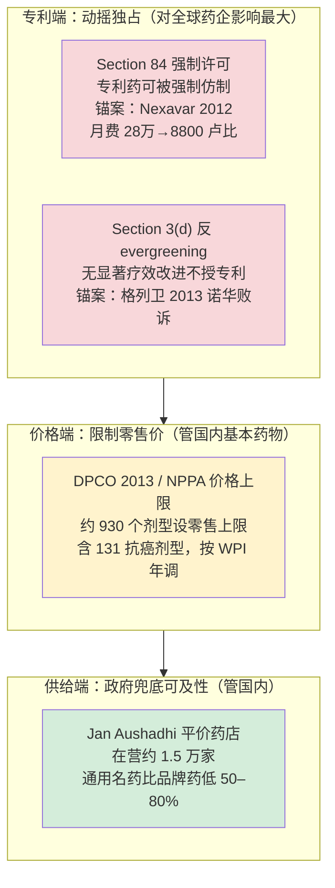
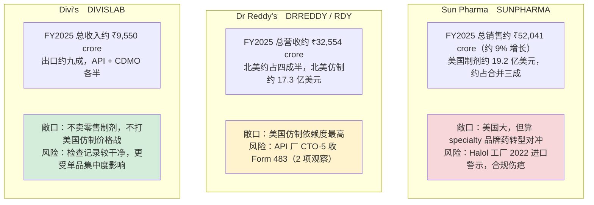

## 一个月二十八万卢比，砍到八千八

2012 年 3 月 9 日，印度专利局做了一件别国监管者几乎不敢做的事：在拜耳（Bayer）的专利仍然有效、还没到期的情况下，准许本土药企 Natco Pharma（纳科制药，印度老牌仿制药与肿瘤药企，NSE: NATCOPHARM）合法仿制拜耳的抗癌药 Nexavar（多吉美，索拉非尼 sorafenib，一种口服多靶点激酶抑制剂，用于晚期肝癌和肾癌）。

价格落差是这件事的全部分量所在。拜耳当时把 Nexavar 卖到每月约 28 万卢比（按裁定时点汇率约 5500 美元）一个疗程；Natco 承诺把同样的药做到每月约 8800 卢比（约 174 美元），是原研价的约 3%（来源：印度专利局 2012-03-09 强制许可裁定；KEI、MSF Access、iPleaders 案例分析转述）。一个月的药费从二十八万砍到八千八。

更要紧的是它砍价的方式。前面四章里，中国靠集采用「以量换价」逼药企报底价，美国靠 PBM 用处方集准入做返利博弈，日本靠政府每年统一改定药价，欧洲靠 HTA 给「一年健康生命」标价然后谈判。这四套机制再不一样，前提都是承认专利、在专利保护期内跟专利持有人讨价还价。印度这一刀砍在了更前面的地方——它没有跟拜耳谈价，而是直接判定：你的专利可以被强制许可给别人仿制。压药价的起点，从「在专利墙内谈判」挪到了「专利墙本身可以被推倒」。

这就是理解印度的钥匙。第 9 章已经讲过印度供给侧的事实——供全球约 20% 的仿制药用量，却只拿到全球原料药价值的约 8%。但那是产业分工问题，不是印度作为一个药品市场最独特的地方。印度真正的结构差异，藏在一套别国没有的知识产权（IP）+ 价格管制制度里：专利可以被强制许可、专利更难拿到手、在手的专利药价格还要受上限管制、政府再开一万多家平价仿制药店兜底。本章先拆这套制度，再回到投资视角，看在这套规则下长出来的印度仿制龙头——Sun Pharma、Dr Reddy's、Divi's——到底怎么赚钱、风险在哪。

## 专利可以被强制收走：Section 84

强制许可（compulsory license），指政府在专利权人不同意的情况下，强制授权第三方使用某项专利，专利权人只能收取一笔法定的使用费（royalty）作为补偿，无权拒绝。这是世界贸易组织 TRIPS 协议本就允许的例外条款，多数国家把它写进法律却几乎从不动用。印度不一样，它把这条例外做成了一件随时可以出鞘的工具。

印度《专利法》第 84 条（Section 84）规定，一项药品专利授权满三年后，任何人都可以申请强制许可，只要能证明以下三个条件之一成立：专利药未能合理满足公众的需求；公众无法以「合理可负担的价格」获得该药；或者该专利在印度境内没有被「实施」（即没有本地生产，只靠进口）。Natco 在 2011 年 7 月对 Nexavar 提出申请，专利局认定拜耳三条全占——肝肾癌患者用不起、可及量极低、拜耳在印度本地不生产只靠进口（来源：印度专利局 2012-03-09 裁定；SSRana、iPleaders 法律分析）。

裁定给了一个很有信息量的对价结构：Natco 拿到强制许可，但要按净销售额的 6% 向拜耳支付专利使用费，并承诺向 600 名贫困患者免费供药；拜耳的专利没有被宣告无效，它仍然是专利权人，只是失去了独占。拜耳上诉，2013 年 3 月 4 日印度知识产权上诉委员会（IPAB）维持强制许可、仅把使用费从 6% 上调到 7%；拜耳再上诉，2014 年底印度最高法院拒绝受理，强制许可最终定案（来源：IPAB 2013-03-04 裁决；Lexology、infojustice 转述）。

这件事真正的威力，不在于它被用过，而在于它可以被用。Nexavar 至今仍是印度唯一一例针对药品授出的强制许可——十几年里没有第二例。这看似是「雷声大雨点小」，恰恰相反：它证明了这把刀是真的，于是它不需要反复出鞘。跨国药企（MNC，multinational corporation，指辉瑞、诺华这类跨国制药巨头）在给印度市场定价、设计专利策略、决定是否本地生产时，都得把「定价太高可能触发强制许可」这个变量算进去。一把出过一次鞘、且经最高法院背书的刀，对定价行为的约束力，远超它实际砍下的次数。这是印度压药价机制里最容易被外部读者低估的一层——它是一种制度性威慑，不是一项常规审批。

## 让专利更难拿：Section 3(d) 与格列卫案

强制许可处理的是「已经授出的专利怎么被强制分享」，印度还有另一道更靠前的闸门，处理的是「这个专利该不该授出」。

这道闸门叫《专利法》第三条 d 款（Section 3(d)）。它针对的是一种叫「专利常青」（evergreening）的做法：原研药企在核心化合物专利快到期时，对已知分子做一些微小改动——换个晶型、做成盐、改个剂型——再拿这些「新形式」去申请新专利，把独占期再续上一二十年。Section 3(d) 直接堵死这条路：已知物质的新形式不可授予专利，除非这种新形式带来了「显著提高的疗效」（enhanced efficacy）。门槛卡在「疗效」二字，而不是「性质改善」。

把这条款钉成判例的，是诺华（Novartis，瑞士制药巨头）的抗癌药 Glivec（格列卫，伊马替尼 imatinib，治疗慢性粒细胞白血病的酪氨酸激酶抑制剂）。诺华为伊马替尼甲磺酸盐的 β 晶型申请印度专利，被专利局以 Section 3(d) 驳回。诺华一路打到最高法院，2013 年 4 月 1 日，印度最高法院在历时约七年的诉讼后判诺华败诉：法院承认 β 晶型的生物利用度比已知形式高约 30%，但认定「生物利用度提高」不等于「疗效提高」，不满足 Section 3(d) 的门槛，专利不予授予（来源：印度最高法院 Novartis AG v. Union of India 判决，2013-04-01；Asian Scientist、ip-watch 转述）。

这个判决的产业含义比一款药大得多。它意味着在印度，原研药企那套靠晶型、盐型、剂型续命的标准打法基本失效——核心化合物专利一旦到期，仿制药厂就能合法进场，不必再绕过一圈外围专利。第 9 章讲生物类似药时提到的「专利丛林」（patent thicket，原研用几十上百项外围专利织网拖延仿制入场），在印度被 Section 3(d) 提前剪掉了一大截。对印度本土仿制药工业而言，这是一道结构性的成本红利：它们能比在美欧更早、更确定地拿到首仿机会。

把 Section 84 和 Section 3(d) 放在一起看，印度在专利端做了两件别国不做的事：让难以负担的专利药可以被强制仿制（事后），让缺乏真实疗效改进的「伪创新」拿不到专利（事前）。前者是威慑，后者是闸门。两者共同把印度变成一个对专利持有人远不如美欧友好、对仿制药厂远比别处宽松的市场。

## 价格上限与平价药店：DPCO 与 Jan Aushadhi

专利端之外，印度还在价格和供给两端各加了一道管制。

价格端是 DPCO/NPPA。DPCO（Drugs Prices Control Order，药品价格管制令，现行版本为 2013 年版）授权 NPPA（National Pharmaceutical Pricing Authority，国家药品定价局）对列入「国家基本药物目录」（Schedule-I）的药品设定零售价格上限（ceiling price）。截至 2025 年初，NPPA 已对约 930 个剂型规格设定上限价，其中含约 131 个抗癌、11 个抗糖尿病、66 个心血管剂型；上限价每年按批发物价指数（WPI）小幅调整，所有厂家——无论是原研、品牌仿制还是普通仿制——销售这些药都不得超过上限价（外加适用的商品服务税）（来源：印度药品部、NPPA 公告，PIB 2025-02 转述）。这套机制管的是「在卖的药卖多贵」，覆盖的是基本药物清单，逻辑上更接近一种行政限价，而非中国集采那种以量换价的招标。

供给端是 Jan Aushadhi。「Pradhan Mantri Bhartiya Janaushadhi Pariyojana」（印度总理平价药计划，下称 Jan Aushadhi）由政府开设平价仿制药专卖店「Jan Aushadhi Kendra」，只卖通用名仿制药，价格通常比同成分品牌药低 50% 到 80%。截至 2025 年年中，全国已开设的此类药店累计超过 1.6 万家、在营约 1.5 万家（来源：印度药品部，PIB 与 Springer 文献转述，2025）。它解决的是印度国内药品可及性问题——让买不起品牌药的人有平价替代。

这两道管制和前面两条专利规则的落点不同，投资上要分清。DPCO 限价和 Jan Aushadhi 主要作用在印度国内市场，压的是本土零售价、利好的是患者可及性；而印度仿制龙头的利润大头不在国内零售，在出口（尤其美国）。所以读印度仿制药企的财报，DPCO 和 Jan Aushadhi 更多是「国内业务的天花板」，真正决定这些公司盈利波动的，是出口市场的价格和合规。把这四层制度叠起来，就是印度独有的药价管控制度栈（如图 24-1 所示）。

图 24-1：印度药价管控制度栈（来源：印度专利局 2012、印度最高法院 2013、NPPA/DPCO 2013、印度药品部 2025）。读法：四层从上到下，专利端两条（红）动摇的是全球药企的独占权、影响最大；价格端 DPCO（黄）和供给端 Jan Aushadhi（绿）主要作用在印度国内零售与可及性。理解印度，重点在红色这两层——它不靠谈判压价，而是从制度上让专利没那么稳、让创新没那么容易被认定。

## 从制度到标的：印度仿制龙头怎么赚钱、风险在哪

这套对仿制药厂宽松的制度，养出了一批全球级的印度仿制龙头。但「制度友好」不等于「生意好做」——印度龙头的利润和风险，主要不在印度，而在它们最大的出口市场美国。这里有三件事决定成败：美国仿制药价格通缩、USFDA 检查风险、以及本土品牌仿制药护城河。

第一件，美国仿制药价格通缩。第 9 章那条 FDA 曲线在这里继续起作用：一个仿制药品种有 6 家以上竞争者时，价格相对原研的降幅会超过 95%。印度龙头大量产品扎在美国这种红海里，常年面对个位数甚至两位数的年化价格下滑。在美国卖普通仿制药，是一门量增、价跌、靠不断推新品种和复杂仿制药来对冲老品种价格塌陷的生意。

第二件，也是印度龙头最特有的风险——USFDA 检查。要把药卖进美国，工厂必须通过美国食品药品监督管理局（USFDA）的现场检查（cGMP 现场核查）。检查结束时，若发现问题，检查员会开出 Form 483（FDA 483，现场检查发现项清单）；问题严重的，FDA 后续会升级为警告信（Warning Letter）；再严重则下达进口禁令（Import Alert），直接禁止该工厂的产品输美。对一家收入高度依赖美国的印度药企，一封警告信或一道进口禁令可能瞬间冻结一条产品线的现金流。

Sun Pharma（太阳制药，Sun Pharmaceutical Industries，NSE: SUNPHARMA，印度市值最大的制药公司、全球前列的仿制药企）的 Halol 工厂就是活样本。FDA 在 2022 年 4 月底至 5 月初对 Halol 工厂检查后开出 483，认定其无菌操作和厂房环境监控等多项 cGMP 缺陷，2022 年 12 月 7 日将该厂列入进口警示（Import Alert 66-40），禁止其相关产品输美（来源：FDA 检查与进口警示记录，FiercePharma、PharmExec 转述，2022–2023）。Sun Pharma 旗下多个工厂都曾受 USFDA 检查关注。对一家美国制剂业务全财年约 19 亿美元的公司，工厂级的合规事故直接砸在最赚钱的板块上。

第三件，本土品牌仿制药护城河。品牌仿制药（branded generics）指仿制药也打自己的品牌、靠医生和患者对品牌的信任卖出溢价——这在监管和处方习惯特殊的新兴市场（印度本土、部分亚非拉国家）尤其有效。在这些市场，同一个成分的药，挂上 Sun 或 Dr Reddy's 的牌子就能比无品牌仿制卖得贵、卖得稳。这块业务不打美国那种零售价格战，毛利和黏性都更高，是印度龙头对冲美国通缩的压舱石。

把三家龙头摊开看，差异恰恰在「美国敞口」和「检查风险」这两个维度上（如图 24-2 所示）。

图 24-2：印度三家龙头的美国营收敞口与 USFDA 检查风险（数据时点 FY2025，印度药企财年截至 2025-03-31；来源：Sun Pharma FY25 业绩公告 2025-05、Dr Reddy's FY25 业绩 SEC 6-K、Divi's FY25 业绩与券商整理）。crore 为印度计数单位，1 crore = 1000 万。读法：从上到下美国零售敞口递减、合规暴露面递减——Sun 美国大且有 Halol 伤疤，Dr Reddy's 美国仿制依赖最深，Divi's 走 API/CDMO 路线绕开了零售价格战。

逐个看。Sun Pharma 是三家里转型走得最远的：除了仿制药，它砸钱做 specialty（特色专科品牌药，如皮肤科、眼科的自有品牌产品），FY2025（截至 2025 年 3 月财年）总销售约 ₹52,041 crore、同比增约 9%（来源：Sun Pharma FY25 业绩公告，2025-05）。它的故事是用品牌药的高毛利稀释美国仿制通缩，但 Halol 进口警示提醒投资者，合规是这类公司估值里随时可能引爆的尾部风险。

Dr Reddy's（瑞迪博士，Dr. Reddy's Laboratories，NSE: DRREDDY / NYSE: RDY，印度老牌仿制药与原料药企业）是三家里对美国仿制药依赖最深的，FY2025 总营收约 ₹32,554 crore（来源：Dr Reddy's FY25 业绩，SEC 6-K，2025）。高美国敞口让它对那条价格通缩曲线和 USFDA 检查最敏感——美国仿制是它的增长引擎，也是它波动的来源。

Divi's（迪维斯实验室，Divi's Laboratories，NSE: DIVISLAB，全球领先的原料药与定制合成企业）走的是另一条路，刚好印证了第 9 章「价值在更上游」的逻辑。它几乎不做零售制剂，主业是给全球原研和仿制药企供应原料药（API）和定制合成（CDMO/custom synthesis，按客户工艺代为合成中间体与原料药），FY2025 总收入约 ₹9,550 crore（来源：Divi's FY25 业绩与券商整理，2025）。它不直接面对美国仿制药的零售价格战，赚的是上游的工艺和产能钱、客户黏性更强，USFDA 检查记录也相对干净；风险不在价格通缩，而在单一大品种的集中度和客户订单周期性。三家同处「印度仿制龙头」标签下，可投资性的底层逻辑却完全不同：Sun 是品牌化转型 + 合规尾部风险，Dr Reddy's 是高美国敞口的弹性与脆性并存，Divi's 是绕开零售战的上游卖铲人。

## 小结

- 印度压药价的逻辑和前四国根本不同。中美日欧都在「承认专利、在墙内谈判」，印度则从制度上动摇专利本身：Section 84 强制许可让难以负担的专利药可被强制仿制（锚案 Nexavar，月费从 28 万卢比砍到 8800 卢比），Section 3(d) 让缺乏真实疗效改进的「伪创新」拿不到专利（锚案格列卫，2013 年诺华最高法院败诉）。理解印度的钥匙在这两层，不在「原料药占 8% 价值」。
- 强制许可的威力在「可以用」而非「常用」。Nexavar 至今是印度唯一一例药品强制许可，但正因为它真被用过且经最高法院背书，它成了悬在跨国药企定价头上的制度性威慑，约束力远超实际动用次数。DPCO/NPPA 限价和 Jan Aushadhi 平价药店是另两道管制，但落点在国内零售与可及性，对以出口为利润大头的印度龙头影响有限。
- 印度仿制龙头的可投资性由三件事决定：美国仿制药价格通缩（接第 9 章「6 家竞争降价超 95%」的曲线）、USFDA 检查风险（483 / 警告信 / 进口禁令，Sun 的 Halol 进口警示是活样本）、本土品牌仿制药护城河。Sun 走品牌化转型但背着合规伤疤，Dr Reddy's 美国敞口最深、弹性与脆性并存，Divi's 用 API/CDMO 路线绕开零售价格战——同一个标签下，三种完全不同的生意。
- 全球格局这一部到此收口：中美日欧印五套定价权讲完，下一章回到时间维度，去看贯穿全产业链的周期变量——专利悬崖。当一大批重磅炸弹专利在 2026–2030 集中到期、上千亿美元销售面临蒸发，仿制药厂（包括本章这些印度龙头）正是站在悬崖另一头接盘的人，而原研药企要么提前并购续命、要么眼看现金流跌落。

---

> **免责声明**
>
> 本章涉及具体公司的财务分析、业务结构与产业判断，仅为作者基于公开信息的研究结果，**不构成任何投资建议**。市场有风险，投资决策应基于读者自身的独立判断和专业咨询。
>
> 本章使用的财务数据截至 2026-05，公司基本面、合规状态与监管环境可能在阅读时已发生变化（印度药企的 USFDA 检查状态尤其变动频繁）。本章中提到的公司股票、销售数据、检查结论等信息均为分析素材，作者不对其准确性、完整性或时效性作任何承诺。
>
> **作者持仓披露**：截至本章数据时点（2026-05），作者未持有 Sun Pharma（SUNPHARMA）、Dr Reddy's（DRREDDY / RDY）、Divi's Laboratories（DIVISLAB）、Natco Pharma（NATCOPHARM）及本章提及的任何印度药企、跨国药企的股票或衍生品。

## 配套数据

见 `data/24-india/`。本章用到的所有数据源、采集时点与口径详见 `data/24-india/sources.md`；印度 IP 判例（Nexavar 强制许可、格列卫 Section 3(d) 等）见 `india_ip_cases.csv`，三家仿制龙头的美国敞口与 USFDA 检查风险对照见 `indian_pharma_investability.csv`。

---

> 本章来自《医疗经济学》开源版 · 作者「递归客」  
> 在线阅读完整书系：[inferloop.dev](https://inferloop.dev) · 反馈与勘误：[GitHub Issues](https://github.com/diguike/book-healthcare-economics/issues)
