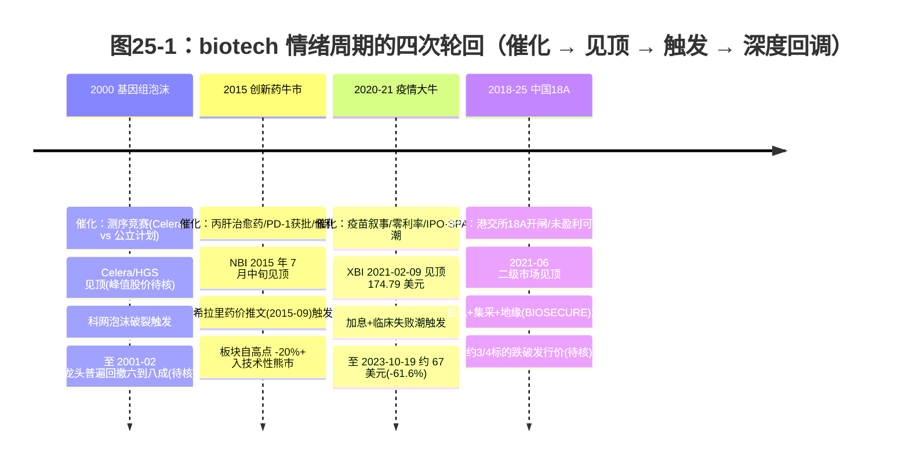
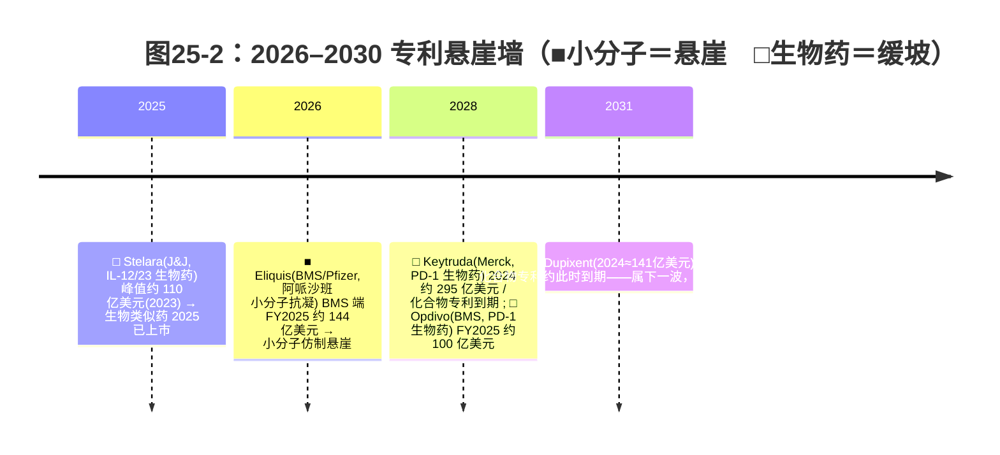

## 两条曲线，一只股票

2021 年 2 月 9 日，SPDR S&P Biotech ETF（代码 XBI，一只等权重的小盘 biotech 指数基金）收在 174.79 美元的历史最高位。这是它 2006 年成立以来从未触及的点位。两年八个月后，2023 年 10 月，它跌到约 67 美元附近（2023-10-19 收盘 67.09 美元、盘中低 66.91 美元）——从峰值算起回撤超过六成（174.79→67.09，约 -61.6%；XBI 峰值收盘价 174.79 美元已由 Yahoo Finance 历史日线核到 2021-02-09，周期低点取自 BioCentury 当时报道）。这段曲线既不是某家公司出了事故，也不是某条管线临床失败，它是一整个资产类别集体被重新定价。

理解 biotech 的估值，先得接受一件反直觉的事：同一只生物科技股票，同时被两种性质完全不同的力支配。

一种是潮汐。它来自利率和市场情绪，涨落快、振幅大、和基本面常常脱节。XBI 从 174.79 到约 67 的那段，主要是这股力。另一种是重力。它来自专利日历——每一款重磅药的独占权都有一个写在监管文件里的到期年份，到点失效，雷打不动。重力不性感，不上头条，但它从不缺席，把 MNC（跨国大药企）的远期营收一寸一寸往下拽。

这一章讲清楚这两条曲线各自怎么运动、为什么 biotech 对利率如此敏感，以及 2026–2030 那堵正在逼近的专利悬崖墙长什么样。看懂它们，才能看懂后面几章——为什么大药企要花重金从外面买管线、为什么中国创新药的对外授权偏偏在 2024–2025 集中爆发。

## 潮汐：为什么 biotech 是利率的高 beta 资产

先认指数。市场上跟踪 biotech 的三个常用标尺口径并不一样：

- **NBI**（Nasdaq Biotechnology Index，纳斯达克生物科技指数）：成分按市值加权，大盘股权重高，走势相对稳。
- **IBB**（iShares Biotechnology ETF）：跟踪 NBI，因此也是市值加权、由 Amgen、Gilead 这类成熟大公司主导。
- **XBI**（SPDR S&P Biotech ETF）：等权重，把一家百亿市值的成熟药企和一家市值刚过十亿的临床期 biotech 放在同样的权重上。这让 XBI 对小盘、无收入 biotech 的情绪最敏感，也最能反映「融资环境」本身。本章用 XBI 当温度计，正是这个原因。

为什么这个资产类别对利率这么敏感？答案藏在估值公式里。一家临床期 biotech 没有当期利润，它的价值几乎全部来自未来——某条管线若干年后上市、放量、产生现金流，再按某个折现率贴回今天。后面第 27 章会展开这套 rNPV（risk-adjusted net present value，风险调整净现值）方法，这里只需要抓住一点：现金流越是集中在遥远的未来，对折现率的变化就越敏感。利率从接近零抬到 5%，对一家明年就能赚钱的公用事业公司只是擦伤，对一家现金流要等到八年后的 biotech 却是估值的腰斩。零利率催生的估值，加息时连本带利还回去。

还有第二层放大器：**现金跑道（cash runway）**。无收入 biotech 靠融资续命，账上的钱按「还能烧几个季度」来计。利率高、风险偏好低的时候，一级市场枯水、IPO 窗口冰封、增发被打折，跑道一旦见底，公司要么贱卖资产、要么裁管线、要么直接清算。于是利率不只是改了折现率这个分母，它还直接掐住了 biotech 活下去的现金供给。两层叠加，就是 biotech 作为「利率高 beta 资产」的全部数学根源。

第三件要接受的事是**幂律（power law）**。biotech 的回报极度不对称：一个投资组合里绝大多数标的最终归零或接近归零，少数几个 10 倍、50 倍的赢家扛起全部收益。这是风险投资的底层规律，套到 biotech 尤其极端，因为单次临床读出就能让一家公司从「一文不值」跳到「数十亿」，或者反过来。幂律解释了为什么等权重的 XBI 波动这么大：它把大量终将归零的小公司和极少数未来赢家平摊在一起，情绪一冷，市场先杀的就是这批还没有产品、全靠叙事支撑的尾部。

## 四轮潮汐：同一个剧本演了四遍

过去 25 年，这股潮汐至少完整涨落了四轮。每一轮的脚本惊人地相似：一个技术叙事点火 → 估值线性外推、热钱涌入 → 一个利率或政策信号触发 → 深度回调，幅度都在五成以上、持续一到三年（如图 25-1）。

**2000 年的基因组泡沫**是第一次大规模的「技术叙事 vs 兑现周期」错配。1990 年代末，私营的 Celera 和公立的人类基因组计划赛跑测序，市场把「读懂基因组」直接外推成「批量造药」。Celera、Human Genome Sciences 这些几乎没有产品收入的公司，估值纯靠数据库加未来药物的故事。2000 年随科网泡沫见顶，到 2001 年 2 月，龙头自峰值普遍回撤六到八成（幅度来自 2001 年《华盛顿邮报》回顾的单一来源，待核）。教训很硬：测序到上市药物之间隔着十几年和无数次临床失败，能读基因不等于能造药。这对今天的 AI 制药叙事是直接的镜鉴。

**2015 年是基本面驱动的牛市，被一条推文终结。** 丙肝治愈药、PD-1 获批、生物药放量、并购活跃、低利率——多重利好把 NBI 推到 2015 年 7 月中旬见顶，当年到高点涨幅一度远超同期标普。然后在 9 月，一条关于天价药提价的政治表态（市场归因于希拉里·克林顿就药价管控发声）单日抹去数百亿美元生物科技市值，板块自 7 月高点回落超过两成、进入技术性熊市。这一轮的教训是：药价是悬在美国创新药头上的政治剑，哪怕基本面再硬，一条监管信号就能掀桌。这把剑此后反复出鞘——2022 年的 IRA（《通胀削减法案》）药价谈判，本质就是 2015 年那条推文的制度化版本。

**2020–2021 是连续两年的强劲牛市（XBI 2019 年总回报约 +32.56%、2020 年再约 +48.33%），紧接着是 biotech 历史上最深最长的回调。** 疫情疫苗与检测叙事撞上零利率，IPO 与 SPAC（特殊目的收购公司，让 biotech 通过合并已上市空壳快速上市募资）狂潮把一级二级市场同时点燃。XBI 于 2021 年 2 月 9 日见顶 174.79 美元。随后加息周期开启、估值消化、临床失败潮叠加，XBI 一路跌到 2023 年 10 月的周期低点约 67 美元（2023-10-19 收盘 67.09 美元），回撤约六成。回调的标志性特征是大量 biotech 跌破账上现金——市值低于公司现金储备，意味着市场给它的管线估值为负。而手握现金、又正盯着自己专利悬崖的 MNC，恰恰在这时开始折价大规模收购 biotech 资产。这一点很重要，下一节会回到它。

**第四轮发生在中国。** 港交所 2018 年 4 月 30 日生效的主板《上市规则》第 18A 章，允许未盈利 biotech 上市；科创板第五套标准随后跟进。信达、君实、百济、再鼎等一批公司集中登陆，二级市场约在 2021 年 6 月见顶。随后是 2022–2024 的深度回调——加息、集采压价、地缘（《生物安全法案》，BIOSECURE Act，美国提案立法，限制联邦机构向部分中国生命科学企业采购，主要针对 CXO）三重压力叠加，据麦肯锡口径，截至 2023 年 9 月约四分之三的中国 biotech 跌破发行价（该比例为转引口径，待核）。它的特殊之处在于复苏路径：2018–2021 那波是中国 biotech 自己的二级市场泡沫，像极了 2000 年的美国；而 2024–2025 的反弹，靠的不是本土估值修复，而是把管线卖给海外 MNC 换首付款——驱动力换了一整套。这条线是第 26 章的主题。

四轮看下来，剧本没变：技术叙事、热门靶点扎堆、卖方峰值预测乐观、估值对利率敏感。变的只是叙事的主角——基因组、PD-1、GLP-1。

## 重力：专利悬崖怎么形成

潮汐之外，是一条慢得多、也确定得多的曲线。

一款创新药的利润，建立在**独占权**之上。专利和监管独占期内，原研厂可以维持高价、独享市场；一旦失去独占（LOE，loss of exclusivity，失去独占），仿制或类似药涌入，价格和份额断崖式下跌。LOE 不是某一个专利到期那么简单——原研厂会围着核心分子堆起一片**专利丛林（patent thicket）**：除了最根本的**化合物专利（composition-of-matter，保护分子结构本身、最难绕开的那层）**，还有剂型专利、用法专利、剂量方案专利，层层叠叠，把真正的独占往后拖。

判断一款药的悬崖什么时候来、有多陡，得查对地方，而且小分子和生物药要查的是两本不同的册子：

- **小分子药查 FDA 的橙皮书（Orange Book）**，对应的竞争者是**仿制药（generic）**。化学合成的小分子结构清晰、仿制门槛低，专利一到期，多家仿制药几乎同时上市，首仿还能拿 180 天独占当跳板。结果是真正的悬崖：首年价格和销量常跌八到九成。
- **生物药查 FDA 的紫皮书（Purple Book）**，对应的竞争者是**生物类似药（biosimilar）**。大分子靠活细胞表达，结构没法做到完全一致，监管走的是「相似性」路径而非「等同」。生产工艺壁垒高、PBM（药品福利管理方）的处方集与返利合约绑定、医生处方惯性，三者合力让侵蚀慢得多、浅得多。

这就引出本章必须讲清的一组对照：**对小分子，专利悬崖是悬崖；对生物药，更像缓坡——但金额往往更大。**

两个教科书级的案例把这条对照钉死了。

**立普妥（Lipitor，阿托伐他汀 atorvastatin，HMG-CoA 还原酶抑制剂，降胆固醇小分子）** 是史上最畅销的处方药，辉瑞 2006 年峰值销售约 129 亿美元，一度占公司收入的四分之一。美国主专利 2011 年 11 月 30 日到期，仿制药迅速深度替代，全球销售到 2012 年底就跌到约 62 亿美元——一年多腰斩。这是小分子悬崖的标准形态。

**修美乐（Humira，阿达木单抗 adalimumab，TNF-α 抑制剂，自免生物药）** 是另一个极端。它峰值销售约 212 亿美元（2022），比立普妥更高，美国从 2023 年 1 月起面临生物类似药竞争。但艾伯维靠专利丛林加合约把侵蚀拖得很慢——生物类似药上市头一年「没怎么掀起波澜」。同样是失去独占，小分子是跳水，生物药是滑坡。

## 2026–2030：一堵生物药为主的悬崖墙

现在把重力的指针拨到当下。2025–2030 这个窗口，是一堵被业内称作「构造级」的专利悬崖墙。据 Evaluate Pharma 的测算，到 2030 年有**超过 2000 亿美元**的品牌药年营收面临失去独占的直接风险（这是各家口径里的下沿；部分咨询机构给到 3000 亿乃至 4000 亿美元，区间宽达两倍，取决于统计区间、地域和是否计入已被侵蚀的部分。本章只用下沿、标明出处口径，不取上沿做标题）。

与 2011 年那轮（立普妥、波立维等以小分子为主）不同，这一轮的主力是**生物药**——这意味着侵蚀更慢、单药金额更大、生物类似药的降价节奏更难预测。墙的轮廓如图 25-2。

逐个看墙上的砖：

**Stelara（乌司奴单抗 ustekinumab，IL-12/23 抑制剂，J&J 的自免生物药）** 已经在墙上。它 2023 年销售接近 110 亿美元，美国 2025 年失去独占，多家生物类似药同年上市。J&J 2026 年第一季度免疫板块销售同比下滑约 9%（reported 口径；剔除汇率影响的操作口径约 -12%），主因就是 Stelara 失去独占——缓坡也是坡，金额够大时一样让母公司难受。

**Eliquis（阿哌沙班 apixaban，Xa 因子抑制剂，BMS 与辉瑞共有的小分子抗凝药）** 是墙上少有的小分子悬崖。它 2026 年在美国失去独占，BMS 一端 FY2025 销售约 144 亿美元。作为小分子，它面对的是橙皮书路径的仿制药竞争，原则上是陡峭的跳水（实际节奏还受专利和解与 IRA 谈判价格的叠加影响）。对 BMS 而言更棘手的是叠加效应：Eliquis（2026）和 Opdivo（约 2028）两道悬崖前后脚到，营收风险被压缩在一个很窄的窗口里。

**Keytruda（帕博利珠单抗 pembrolizumab，PD-1 抑制剂，Merck 的肿瘤生物药）** 是这堵墙上最大的一块砖，也是最容易被误读的一块。它 2024 年销售约 295 亿美元，约占 Merck 全公司营收的一半（FY2025 约 317 亿美元），化合物专利 2028 年在美国到期。媒体常说 Keytruda 有「超过 250 亿美元的敞口」——这句话对，但要拆开看：**这是 gross exposure（毛敞口），不是 net loss（净损失）。** 两者差着一大截。

差距来自防守。Keytruda 是生物药，走的是缓坡而非悬崖；更关键的是 Merck 把核心防守压在**皮下注射版本（pembrolizumab + berahyaluronidase 共同配制）**上——通过把患者转换到带独立专利保护的新剂型，在化合物专利到期前就筑起一道生物类似药不易替代的实务壁垒。再叠加四十多项适应症的用法专利、后继分子和合约绑定，2028 年之后真实的净侵蚀会显著低于那个 250 亿美元的毛敞口数字。把毛敞口当成净损失来吓人，是这块砖最常见的误读。本章的纪律是：敞口归敞口，净损失归净损失，分开说。

最后要纠正一个流行的错位。**Dupixent（度普利尤单抗 dupilumab，IL-4/13 抑制剂，赛诺菲与再生元的自免生物药）不在这堵墙上。** 它 2024 年全球净销售约 141 亿美元（$14.15B，FY2024，Regeneron/Sanofi 口径），是赛诺菲增长的发动机，常被顺手塞进 2025–2030 的悬崖清单。但查紫皮书加公司专利披露，它的化合物专利在美国大约 2031 年 3 月才到期，属于下一波，不进本窗口。把 Dupixent 算进 2026–2030，时间轴就错了一档。

## 潮汐遇上重力

历史上，情绪周期和专利周期很少这么强地叠在一起。2026–2030 的特殊之处，正是两条曲线在同一时刻交汇。

重力这一侧制造的是一种确定的、可预期的需求。MNC 们盯着自己 2026–2030 的营收缺口——Keytruda、Eliquis、Stelara、Opdivo 这些柱子一根根要倒，靠内部管线补不上，只能向外买。这就是大药企「补管线刚需」的来源，也是后面第 26 章那条因果链的需求侧底座：MNC 的悬崖墙，为下游的对外授权（license-out）和并购托出了一张需求底盘。

潮汐这一侧则决定了供给的价格。2022–2024 的寒冬把大量 biotech 逼到现金跑道见底，手握资产却融不到钱，只能折价变现。需求侧（MNC 的刚需）和供给侧（biotech 的现金荒）在同一个窗口里碰头——这是理解 2024–2025 那波交易潮的钥匙。但要提前打个预防针：需求托底不等于卖方说了算。判断议价权要看首付款占总额的比例，而不是看媒体爱报的里程碑总额。这条留到第 26 章拆。

回到本章开头那两条曲线。潮汐（XBI 174.79 → 约 67）告诉你 biotech 估值什么时候会因为利率和情绪而集体错杀，那往往是重力侧的买方入场低价并购的窗口；重力（2026–2030 悬崖墙）告诉你这种买方需求为什么是结构性的、不会因为情绪回暖就消失。一个看的是利率位置，一个看的是专利日历——两个完全不同的时钟，偶尔会走到同一个整点。

需要给本章的判断划清失效边界。**潮汐是 point-in-time 的判断，会过时。** XBI 的具体点位、回撤幅度、四轮周期的相位，都随利率路径和资金面变化；本章写于 2026 年中、降息预期渐起、XBI 已从 2023 年低点显著修复的位置上，若利率重新走高或又一次政策剑出鞘，相位会重排——证伪信号就是 XBI 再次跌破前低、IPO 窗口二度冰封。**重力则相对硬，但也有失效条件。** 专利到期年份写在监管文件里，不会因情绪改变；但「净侵蚀有多深」是预测不是事实——它取决于生物类似药的实际上市节奏、PBM 处方集的取舍、皮下版转换的成功率。这些任一项变化，悬崖墙对具体公司的真实冲击就要重估。区分这一点很重要：到期年份是日历，净损失幅度是判断。

## 小结

biotech 同时被两种力支配。潮汐来自利率与情绪，是高 beta、顺周期、和基本面常脱节的快变量；XBI 从 2021 年 2 月的 174.79 美元跌到 2023 年 10 月约 67 美元、回撤超六成，就是这股力的一次完整摆动。重力来自专利日历，慢、确定、靠日历推进；2026–2030 这堵以生物药为主、规模超过 2000 亿美元（下沿口径）的悬崖墙，是 MNC 估值的长期向下拉力。

三个本章独立观察，留给后面的章节去兑现：其一，等权重的 XBI 之所以比 IBB/NBI 波动剧烈，根子在 biotech 回报的幂律结构和无收入公司对折现率的高敏感，这不是噪音、是这个资产类别的本性。其二，专利悬崖对小分子是悬崖、对生物药是缓坡，2026–2030 这轮主力是生物药，所以「超过 250 亿美元敞口」这类毛数字普遍高估了净侵蚀——Keytruda 是最典型的例子，gross exposure 不等于 net loss。其三，悬崖墙托出的是结构性的买方需求，而非卖方市场——这条因果链怎么走、议价权到底在谁手里，正是下一章《出海的真相》要拆的。

下一章把镜头从全球 MNC 转向中国 biotech：当 MNC 的悬崖墙制造出确定的买方需求，一家还在亏损、产品尚未上市的中国公司，凭什么能把一条管线卖出几千万美元首付款、几十亿美元里程碑总额？而决定它到底是赢家还是廉价供给方的，又是哪一个数字？

---

> **免责声明**
>
> 本章涉及具体公司的财务分析、估值测算与产业判断，仅为作者基于公开信息的研究结果，**不构成任何投资建议**。市场有风险，投资决策应基于读者自身的独立判断和专业咨询。
>
> 本章使用的财务数据截至 2026-05，公司基本面与市场环境可能在阅读时已发生变化。本章中提到的公司股票、估值倍数、专利到期年份、销售额等信息均为分析素材，作者不对其准确性、完整性或时效性作任何承诺；XBI 点位、专利悬崖金额等数据均标注了时点与口径，部分仍待核，请以最新公开信息为准。
>
> **作者持仓披露**：截至本章数据时点（2026-05），作者未持有 Merck（MRK）、Bristol Myers Squibb（BMY）、Pfizer（PFE）、Johnson & Johnson（JNJ）、AbbVie（ABBV）、赛诺菲（SNY）及本章提及的其他公司股票或衍生品，亦未持有 XBI/IBB 等相关 ETF。

## 配套数据

见 `data/25-cycles-cliff/`。本章用到的所有数据源详见 `data/25-cycles-cliff/sources.md`。

---

> 本章来自《医疗经济学》开源版 · 作者「递归客」  
> 在线阅读完整书系：[inferloop.dev](https://inferloop.dev) · 反馈与勘误：[GitHub Issues](https://github.com/diguike/book-healthcare-economics/issues)
