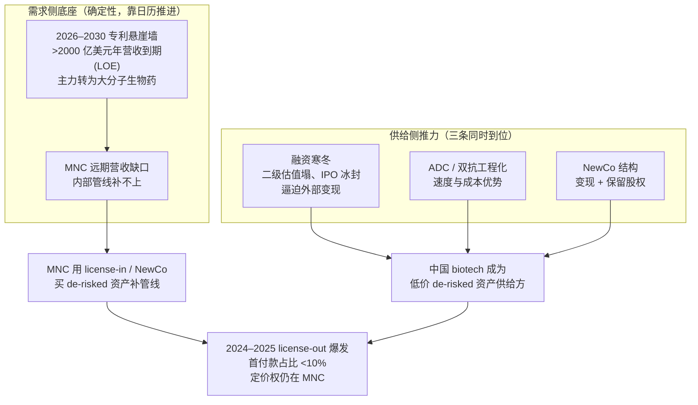

## 一笔八十四亿美元的交易，先看那八亿

2023 年 12 月，一家叫百利天恒（688506.SH，成都的小分子加抗体双平台药企，当时尚未盈利）的公司，通过美国子公司 SystImmune 把一条还在 I 期临床的早期管线，授权给了百时美施贵宝（Bristol Myers Squibb，BMS，全球肿瘤与免疫龙头之一）。这条管线是 BL-B01D1，一款 EGFR×HER3 双特异性抗体偶联药物（ADC，把抗体当导航、把毒素当弹头的"生物导弹"）。

国内媒体的标题几乎一致：八十四亿美元，中国创新药出海最大单。这个数字没错——交易的潜在总额上限确实是 84 亿美元。但拆开看，BMS 当场要付的现金（首付款）是 8 亿美元，外加一笔不超过 5 亿美元的近期或有付款；剩下高达 71 亿美元，全部挂在后续的研发、注册、销售里程碑上，要等药真的推进、获批、放量才逐笔解锁（来源：百利天恒公告 / SystImmune 与 BMS 协议，2023-12-11）。

这就是这一章要讲的核心读法。媒体报道的是那 84 亿，决定谁是买方、谁是卖方的，是前面那 8 亿占整个 84 亿的比例——不到一成。百利天恒当年还在亏损、产品一支都没上市，却能拿到 8 亿美元现金。这看起来像卖方占了上风。但只要那 8 亿在 84 亿里只占 9.5%，真正握着议价权的，仍是付钱的那一方。

## 三栏读法：首付款、里程碑总额、upfront 占比

看任何一笔 license-out（对外授权，把某条管线在某些地区的开发销售权利卖给别人），先把金额拆成三栏：

- **首付款（upfront）**：签约即付的确定性现金。这是卖方真正落袋、不依赖任何后续条件的钱。
- **里程碑总额（biodollar，行业惯称 total deal value）**：把首付款和未来所有可能触发的里程碑款加在一起的"潜在最高金额"。biodollar 是一个半玩笑的词——它把按概率折现后大幅缩水的或有付款，按面值堆成一个吓人的总数。
- **upfront 占比**：首付款 ÷ 里程碑总额。这一栏最有信息量。

为什么占比最关键？因为它直接量化了买卖双方的议价力。一笔交易里程碑越多、首付款占比越低，意味着买方把大部分风险留给了卖方——只有药真的成了，卖方才拿得到大头；药要是死在半路（创新药的常态），卖方拿到的就只有那笔首付。**首付款占比低，是典型的买方杠杆：用一笔小的确定现金，买下一个大的、已经被前期临床数据初步去风险（de-risked）的期权。** de-risked 资产指的就是这种已经做完早期临床、暴露过安全性和初步疗效、风险被压下来一截的管线——它比纸面分子值钱，但远没到上市那一步。

把 2023–2025 几笔标志性交易摆进这张三栏表，规律一目了然（图 26-1）。表里几位中国卖方分别是：康方生物（Akeso，9926.HK，珠海，以双特异性抗体平台见长的 18A 港股 biotech）；恒瑞医药（600276.SS，国内创新药与肿瘤药龙头之一，近两年把对外授权做成常态）；百利天恒前面已介绍。买方一侧除 BMS 外，还有 Summit Therapeutics（美国小型生物制药公司，账上现金主要押注依沃西一款资产）和 GSK（葛兰素史克，英国 MNC）。

### 图 26-1　中国 license-out 交易的三栏拆解（首付款 / 里程碑总额 / upfront 占比）

| 卖方（中国） | 资产 / 模态 | 公告时点 | 首付款 upfront | 里程碑总额 biodollar | upfront 占比 | 买方 |
|---|---|---|---|---|---|---|
| 百利天恒 / SystImmune | BL-B01D1，EGFR×HER3 双抗 ADC | 2023-12 | 8 亿美元（另+近期或有 ≤5 亿） | ≤84 亿美元 | 约 9.5% | BMS |
| 康方生物（9926.HK） | ivonescimab 依沃西，PD-1×VEGF 双抗 | 2022-12 | 5 亿美元 | ≤50 亿美元（+低双位数销售分成） | 约 10% | Summit Therapeutics |
| 恒瑞医药（600276.SS） | GLP-1 三资产组合 | 2024-05 | 1.1 亿美元现金+技术转让费（另+约 19.9% 股权） | ≤61 亿美元 | 约 1.8%（现金口径） | Hercules / Kailera（NewCo） |
| 恒瑞医药 | HRS-9821（PDE3/4，磷酸二酯酶 3/4 抑制剂，慢阻肺）+至多 11 个选择权项目 | 2025-07 | 5 亿美元（全部协议合计） | ≤125 亿美元 | 约 4.0% | GSK |
| 2024 全年合计 | 94 笔（医药魔方口径） | 2024 | 约 41 亿美元 | 约 519 亿美元（含里程碑） | 约 8% | — |

数据来源与口径见本章 sources 清单；biodollar 一栏统一为"首付款 + 里程碑"的交易总额（total deal value），各行口径一致。恒瑞 / Kailera 的 1.1 亿美元含技术转让与近期里程碑、非纯首付款，占比按现金对价计、未计 19.9% 股权；恒瑞 / GSK 总额 ≤125 亿美元 = 首付款 5 亿 + 里程碑约 120 亿。

五行里没有一行的 upfront 占比超过 10%。2024 年全年 94 笔交易加总，41 亿美元首付款对 519 亿美元里程碑总额，整体占比约 8%（来源：医药魔方 / PharmaCube，2024 年度统计）。这不是个别交易的偶然结构，是一个系统性的市场特征：在 2024 年这个时点，付钱的跨国大药企（MNC）整体上是买方杠杆的那一方。

需要立刻说清楚的一点：低首付占比本身不等于"贱卖"或"成色差"。它首先反映的是资产的成熟度——越早期的管线，不确定性越高，买方越不愿意一次性付大钱，更愿意把对价摊到里程碑上对赌。所以同一张表里，越靠 I 期、越早，占比往往越低（恒瑞 GLP-1 组合给 NewCo 时现金占比仅约 1.8%，但换来了 19.9% 股权，是另一种结构）；越接近关键读出、数据越硬的资产，首付款绝对值和占比才抬得起来。占比是议价力的指标，不是质量的判决。

## 519、415、1377：先把口径吵清楚

谈中国 license-out 总量，最容易踩的坑是口径。同一个 2024 年，你会同时读到"519 亿美元"和"415 亿美元"两个总额；到 2025 年，又冒出"1377 亿美元"的纪录。这三个数字不能直接比，差异全在统计口径：

- **519 亿美元**：医药魔方口径，2024 年中国创新药 license-out 共 94 笔的里程碑总额合计（含里程碑，非落袋），同口径首付款合计约 41 亿美元（来源：医药魔方 / PharmaCube）。
- **415 亿美元**：另一统计口径下的 2024 年总额（具体发布机构待回溯，本章作存疑注），差异来自统计范围（是否含选择权交易、币种换算、交易计入时点）。两个数都指"含里程碑的潜在总额"，不是现金。
- **1377 亿美元（≈137.7 billion）**：2025 年大中华区跨境对外授权的里程碑总额纪录，对应 186 笔交易，较 2021 年的约 139 亿美元增长近十倍（来源：pharmasource.global，2025 年度；统计范围为大中华区，含港澳台）。

口径差异不止在总额。按 PharmaVoice 援引 Evaluate 的另一套统计，2024 年是 64 笔、2025 年是 92 笔，而 92 笔里只有 40 笔（约 43%）披露了首付款条款——这意味着多数交易的真实落袋根本不透明（来源：PharmaVoice / Evaluate，2026-02）。不同机构的笔数差（94 对 64、186 对 92）来自"中国侧全部 vs 仅卖给西方药企""含选择权 vs 不含"等范围差异。

把这些口径吵清楚，是因为只有一个数字能稳定衡量出海成色：**首付款，以及它在总额里的占比**。总额（biodollar）会被里程碑撑得很大，但里程碑要按成功概率折现——创新药从 I 期到上市的整体成功率只有个位数到一成多，挂在 III 期获批、商业化峰值上的那几十亿，期望值远低于面值（PoS 指一条管线从当前阶段最终获批上市的统计概率，是 rNPV 折现的核心输入，详见第 27 章）。一个更冷静的趋势指标是平均首付款：从 2024 年的约 1.02 亿美元升到 2025 年的约 1.41 亿美元，一年涨约 38%（来源：PharmaVoice / Evaluate）。首付款在涨，是真金白银在抬价；但它仍远低于里程碑总额的涨幅，说明买方依旧在用里程碑结构控制自己的前置风险敞口。

## 为什么是 2024–2025：需求侧底座，加上供给侧的推力

爆发不是偶然，是两股力同时到位。

需求侧是底座。2026–2030 年，全球品牌药正撞上一堵专利悬崖墙——估计有 2000 亿美元以上的年营收在这几年里失去独占（口径见第 25 章），主力从过去的小分子转成了大分子生物药：Keytruda（帕博利珠单抗，PD-1）2028 年到期，单药年收入约 295 亿美元，约占默沙东总营收的 46%（FY2024，默沙东财报：294.82 亿 / 641.68 亿美元）；Stelara、Opdivo、Eliquis 也都在这个窗口。MNC 远期营收有一个写在监管文件里、靠日历推进的大窟窿要填，而内部管线补不上这么大的缺口。**这就是需求侧底座——不是某一年的景气，而是一堵确定性的、必须用外部资产去补的营收墙。** 中国手里恰好有一批做完早期临床、风险被压下一截的 de-risked 资产，正好对得上这个缺口。

供给侧是推力，三条同等重要：

- **融资寒冬逼迫外部变现**。2021 到 2023 年的 biotech 大熊市里，XBI 回撤超六成（见第 25 章），中国 18A biotech（指按港交所第 18A 章规则、允许未盈利上市的生物科技公司）的二级市场估值同样塌掉，一级融资枯水、IPO 窗口冰封。把资产卖给海外 MNC 换首付款，成了风投枯水期最现实的替代融资渠道——这和 2018–2021 那轮靠本土二级市场估值撑起来的逻辑完全不同。
- **ADC 与双抗的工程化速度和成本优势**。在 ADC、双特异性抗体这类"可工程化"模态上，业界普遍观察到中国把分子做出来、推进到能拿出早期数据的速度和成本压过不少西方同行（这是市场共识判断，缺乏统一口径的量化对比，需当作定性观察看待）。一个可观察的旁证是同靶点的竞争密度：TROP2、HER3、PD-1×VEGF 这些热门靶点，中国往往同时有好几家在推进临床。这也是 BMS 愿意为 BL-B01D1 付 8 亿、Summit 愿意为依沃西付 5 亿的实打实理由：它们买的不是概念，是一个已经有人体数据、且短期内自己造不出来的分子。
- **NewCo 结构**。NewCo 指的是把中国资产装进一家新设的海外公司，由海外风投注资、海外团队运营，中国母公司换取首付款加股权。恒瑞 2024 年把三款 GLP-1 资产装进 Hercules（后更名 Kailera），拿 1.1 亿美元现金加约 19.9% 股权；Kailera 随后完成 4 亿美元 A 轮，并在 2026 年 4 月登陆纳斯达克募资 6.25 亿美元（来源：公司公告 / BioPharma Dive / Bamboo Works）。NewCo 让中国药企既变现、又保留对资产海外增值的一部分参与权，是 license-out 之外的第二条出海路径。

把这两股力画成一条因果链，就是图 26-2。（图中 LOE 即 Loss of Exclusivity，品牌药专利到期后失去市场独占。）

### 图 26-2　从专利悬崖到中国 de-risked 供给的因果链

注意因果链的落点：需求和供给同时到位，造成了交易井喷，但**首付款占比小于 10% 这件事，说明撮合出来的价格是由买方（MNC）主导的**。需求侧底座解释了"为什么有这么多交易"，但它不等于卖方占了上风。

## 定价权在谁手里：被动的低价供给方

把前面的事实串起来，可以得到一个与多数媒体叙事相反的判断：在 2024 年这个时点，中国创新药在出海交易里更像一个被动的、低价的 de-risked 资产供给方，而不是一个掌握定价权的卖方。

判断的依据不是情绪，是那一栏 upfront 占比。整体约 8% 的首付款占比，意味着 MNC 普遍在用小笔确定现金，锁定一批便宜的、风险已被前期临床压下来的期权。买方有大把可选标的（同一个靶点、同一类 ADC，中国往往有好几家在做），有定价的主动权；卖方多数在融资寒冬里需要现金续命，议价空间有限。

这个判断要避免两种误读。一种是把它读成唱衰——它不是。中国在 ADC、双抗上的工程能力是结构性的、真实的，MNC 真金白银下注就是证明；首付款绝对值和平均首付款都在抬升，说明议价力在边际改善。Evaluate 的分析师在 2025 年已经直言"收购一个中国资产，不再那么便宜了"，并预期中国资产估值最终可能向西方靠拢（来源：PharmaVoice / Evaluate，2026-02）。趋势是往卖方有利的方向走。另一种误读是把这个趋势提前兑现成定论——截至 2024–2025 年的占比数据，还不支持"议价权已易手"的结论。结构性看好供给能力，和对单笔总额炒作泼冷水，这两件事并不矛盾。

## 成色怎么量：首付款，加已兑现的 FDA 节点

衡量出海成色，最不该用的指标就是 biodollar 总额——它最大、最上头条，也最不确定。两个更硬的指标是：首付款（已落袋的确定现金）和已兑现的 FDA 节点（资产真的闯过了最难的监管关）。

截至本章数据时点，源自中国的资产里，已经拿到 FDA 批准的有这么几个（见下表）。

### 图 26-3　已兑现的 FDA 节点（源自中国的资产）

| 药物（通用名，靶点） | 中国企业 | 海外路径 | FDA 批准 | 首发适应症 | 备注 |
|---|---|---|---|---|---|
| Brukinsa（zanubrutinib 泽布替尼，BTK） | 百济神州（已更名 BeOne） | 自主商业化 | 2019-11-14（加速批准，2023-01 转完全批准） | 套细胞淋巴瘤 | 首个中国发现、获 FDA 批准的抗癌药 |
| Carvykti（cilta-cel 西达基奥仑赛，BCMA CAR-T） | 传奇生物 | 强生 / 杨森合作 | 2022-02-28 | 复发难治多发性骨髓瘤 | 强生首款细胞疗法 |
| Loqtorzi（toripalimab 特瑞普利单抗，PD-1） | 君实生物 | Coherus 合作 | 2023-10-27 | 鼻咽癌 | 首个中国产 PD-1 获 FDA 批准 |
| Fruzaqla（fruquintinib 呋喹替尼，VEGFR） | 和黄医药（HUTCHMED） | 武田合作 | 2023-11-08 | 转移性结直肠癌 | 武田全球商业化 |

（来源：FDA D.I.S.C.O. / 各公司公告，详见本章 sources 清单。）数量不多，但每一个都是穿过了 FDA 这道关的真实兑现——这是 biodollar 数字给不了的信息。

反过来，兑现度的风险也要写在同一页上。2022 年 2 月，信达生物（1801.HK，PD-1 与减重管线见长的 18A biotech）与礼来合作申报的 sintilimab（信迪利单抗，PD-1），在 FDA 肿瘤药物咨询委员会（ODAC）以 14 比 1 被否，随后收到完整回复函（CRL）。否决的核心理由是：支持上市的 ORIENT-11 三期试验只在中国做，FDA 认为单一国别的数据不适用于美国人群，要求补做多区域临床（来源：FDA ODAC / 礼来声明 / Fierce Pharma，2022-02）。这是第一个靠中国单一数据闯 FDA 的 me-too PD-1，结果是被拦下。它给整个出海叙事划了一条线：license-out 拿到首付款，和资产真的在海外获批、放量、兑现里程碑，是两件事；中间隔着一道以多区域临床和差异化数据为门槛的监管关。

所以本章给读者的衡量框架是两栏，不是一栏：左边看首付款（确定性现金，已落袋多少），右边看 FDA 节点兑现（资产真的过关了没有）。biodollar 总额放在第三栏当背景，永远不当主角。

把它写成一个可被证伪的判断：**"中国是被动的低价 de-risked 供给方、定价权仍在 MNC"——这个判断在两种情况下会失效：其一，整体 upfront 占比从约 8% 系统性抬到 20% 以上（说明卖方议价力实质反转）；其二，源自中国的资产在不依赖 MNC 主导的前提下，靠自主或对等合作连续兑现多个 FDA 大适应症获批（说明供给方不再被动）。** 在这两个信号出现之前，把出海读成已经掌握定价权，是在用总额的面值替代首付款的现实。观察时点：建议盯 2026–2028 年的年度首付款占比与 FDA 获批清单，这正好覆盖专利悬崖墙最密集的窗口。

---

> **免责声明**
>
> 本章涉及具体公司的财务分析、估值测算与产业判断，仅为作者基于公开信息的研究结果，**不构成任何投资建议**。市场有风险，投资决策应基于读者自身的独立判断和专业咨询。
>
> 本章使用的财务与交易数据截至 2026-05，公司基本面、交易条款与市场环境可能在阅读时已发生变化；license-out 交易的里程碑兑现具有高度不确定性，总额（biodollar）不代表实际落袋金额。本章中提到的公司股票、交易金额、估值倍数等信息均为分析素材，作者不对其准确性、完整性或时效性作任何承诺。
>
> **作者持仓披露**：截至本章数据时点（2026-05），作者未持有百利天恒、康方生物、恒瑞医药、信达生物、百济神州、君实生物、和黄医药及本章提及的 BMS、GSK、Summit、礼来、强生、武田等公司的股票或衍生品。

---

> 本章来自《医疗经济学》开源版 · 作者「递归客」  
> 在线阅读完整书系：[inferloop.dev](https://inferloop.dev) · 反馈与勘误：[GitHub Issues](https://github.com/diguike/book-healthcare-economics/issues)
