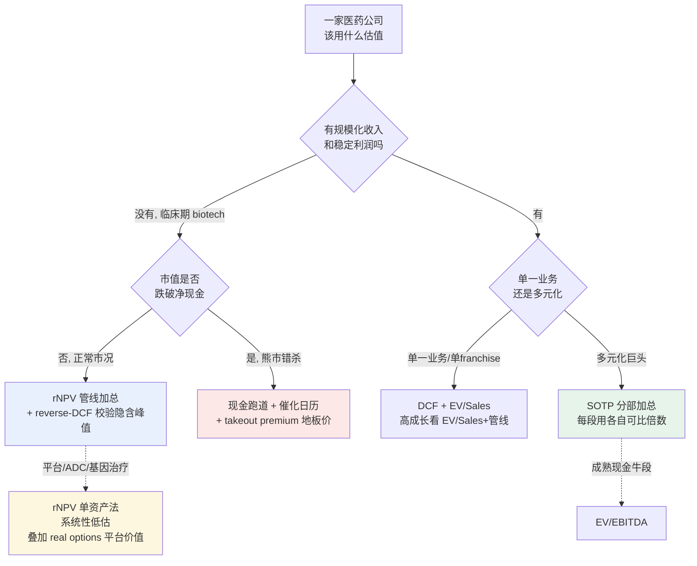

## 当市值跌破账上的现金

2023 年末，美国生命科学板块出现一个反常的景象：一批上市公司的总市值，低于它们银行账户里趴着的净现金。换句话说，市场给这些公司的「业务」标了一个负数——你买下整家公司、拿走账上的钱，还能倒找一笔。Kybora、Medicine to Market 等机构的统计口径下，2023 年下半年负企业价值（企业价值 EV = 市值 + 净负债，此处为负，说明市值低于净现金）的生命科学公司数量升到约 232 家的高位，到 2024 年 6 月回落到约 139 家（来源：Kybora / Medicine to Market 行业统计，口径与样本范围待核一手）。同期安永（EY）的口径是，2024 年约 39% 的 biotech 账上现金撑不过 12 个月，为至少六年来最高（来源：EY，BioSpace 转述，2024）。

对一家临床期 biotech 来说，市值跌破净现金意味着传统估值模型集体失灵。折现现金流（DCF，discounted cash flow，把未来自由现金流按折现率贴回今天求和）算不动，因为它当期没有正现金流、未来现金流要等好几年；市盈率、市销率都没有分母（没有利润、没有收入）；连最常用的在研管线估值法 rNPV，算出来的正数也没人信——市场明明白白告诉你，它给这条管线的定价是零甚至负。

这时候市场用什么给它定价？答案不是某一个公式，而是几把不同的尺子轮流上场：账上还剩多少现金、能烧几个季度（现金跑道）、下一个临床数据什么时候读出（催化日历）、最坏情况下被人按「净现金 + 一点管线残值」收购能值多少（并购地板价）。哪把尺子当家，取决于公司处在什么状态、市场处在牛市还是熊市。

这一章把这几把尺子一次性摆上台面：rNPV 怎么算、为什么它的成功率假设必须分层、它在哪些资产上会系统性失真；多元化大药企怎么用 SOTP 拆开估；怎么用 reverse-DCF 把市值倒推成市场隐含的销售假设；熊市里并购地板价怎么托底；以及 EV/EBITDA、EV/Sales 这些倍数法各自的适用边界。每一把尺子都配一个真实公司的算例，所有假设显式列出。本章也是全书「证伪条件 + 失效时点」那个框的方法论根据——因为每一种估值方法，本质上都是一组会过期的假设。

需要先讲清楚本章的姿态：下面所有模型都是演示框架，目的是让读者自己会算、知道每个数字从哪来、改一个假设结果会怎么动，而不是替读者得出某只股票该买该卖的结论。模型里的输入（成功率、峰值销售、折现率）每一个都可以、也应该被读者换成自己的判断。

## 先选工具：估值方法的适用场景矩阵

医药资产的估值难点在于异质性极高：一家还没有产品的临床期 biotech、一家单产品放量的商业化公司、一家横跨制药与器械的多元化巨头，用的根本不是同一套方法。选错工具，再精确的计算也是错的。

第一个分岔是「有没有收入」。没有收入、价值全在未来管线的公司，倍数法（市盈率、EV/EBITDA、EV/Sales）失效，主力是 rNPV——把每条管线未来的现金流按上市概率加权再折现。有了规模化收入、利润稳定的成熟药企，rNPV 反而笨重，倍数法（EV/EBITDA）更直接。第二个分岔是「单资产还是多元化」。价值集中在一两条管线的 biotech，整体估值≈管线 rNPV 加总；横跨多个业务段的巨头（典型如强生横跨创新药与器械），必须用 SOTP（sum-of-the-parts，分部加总：把每个业务段按各自可比公司的口径单独估值，再相加）。第三个分岔是「牛市还是熊市」。牛市看上行（rNPV、reverse-DCF 推隐含峰值）；熊市看地板（现金跑道、takeout premium 并购地板价）。

图 27-1 把这三个分岔画成一棵决策树。

图 27-1：估值方法适用场景矩阵。三个分岔（有无收入 / 单资产 vs 多元化 / 牛市 vs 熊市）决定主力方法；虚线标出两个常见的修正路径——平台型资产要在 rNPV 之外叠加期权价值，多元化巨头里的成熟现金牛段用 EV/EBITDA。

这张图不是要读者死记某条路径，而是先建立一个判断：**任何一个估值数字，先问它用的是哪把尺子、这把尺子配不配这家公司的状态。** 把成熟药企的 EV/EBITDA 套到无收入 biotech 上，或者用单资产 rNPV 去估一个平台公司，错的不是算术，是工具选择。

## rNPV：核心方法，以及它最容易被滥用的那个输入

rNPV（risk-adjusted net present value，风险调整净现值）是在研管线估值的主力。逻辑分三步：第一步，假设这条管线最终上市，估出它上市后逐年的自由现金流，按折现率贴回今天，得到一个「成功情形下的现值」；第二步，乘以这条管线最终能上市的概率（PoS，probability of success；等价的另一个说法是 LOA，likelihood of approval，从当前阶段走到获批的累计概率）；第三步，减去还没花、但要花下去的研发开支（这部分也按推进概率加权）。三步合起来：

> rNPV ≈ PoS × 成功情形下上市后现金流的现值 − 剩余研发开支的期望现值

公式不难。难的是 PoS 这个输入——它既是 rNPV 里分量最重的乘数，也是最容易被随手套一个行业平均数糊弄过去的地方。

PoS 的行业基准来自 BIO 与 Informa（现 Citeline）合作、覆盖 2011–2020 年、基于 12,728 次临床阶段转化的研究《Clinical Development Success Rates and Contributing Factors 2011–2020》。该研究给出的分阶段转化率是：Phase 1→Phase 2 约 52%、Phase 2→Phase 3 约 28.9%、Phase 3→申报（NDA/BLA）约 57.8%、申报→获批约 90.6%；四段连乘，一个刚进入 Phase 1 的新药走到获批的整体概率约 7.9%（来源：BIO/Informa，2011–2020；该研究另有 Citeline 2014–2023 的更新口径，整体 Phase 1 LOA 进一步降到约 6.7%，说明成功率仍在下行）。

但 7.9% 是**全行业、全适应症、全模态混在一起的平均值**，直接拿它套任何一条具体管线，几乎一定是错的。同一份研究里，肿瘤是 14 个疾病领域中 Phase 1 LOA 最低的，约 5.1%；生物药整体 LOA 约 9.1%，明显高于传统小分子新分子实体的约 5.7%；疫苗约 9.7%。研究还有一个对估值影响极大的发现：用生物标志物筛选人群的项目，成功率显著高于不做筛选的（Phase 1 整体 LOA 约 25.9%，对比不做筛选的约 8.4%，约为后者的 3 倍；来源：BIO/Informa 2011–2020）。

这意味着 PoS 必须**按适应症 + 模态 + 是否有生物标志物筛选分层取值**，而不能套一个整体数。这不是吹毛求疵，下面这个算例会显示，光是 PoS 取值不同，同一条管线的 rNPV 能从「不值得投」翻到「值得投」。

### rNPV 算例：一条进入 Phase 2 的肿瘤 ADC

设一条肿瘤 ADC（antibody-drug conjugate，抗体偶联药物，把化疗毒素用抗体精准送到癌细胞的一类生物药）管线，当前刚进入 Phase 2。所有假设显式列在下面，读者可以逐个替换：

- 上市后峰值销售 $1.5B（第 10 年达峰），成熟期自由现金流率 45%
- 折现率（WACC，weighted average cost of capital，加权平均资本成本）11%，反映这类风险资产的资金成本
- 研发时间线：Phase 2 两年、Phase 3 三年、第 6 年上市；专利独占在第 13 年起被侵蚀
- 剩余研发开支：Phase 2 共 $80M、Phase 3 + 申报共 $250M

第一步，先不考虑成功率，把「假设成功上市」情形下第 6–15 年的自由现金流按 11% 折回今天。图 27-2 是这个现金流瀑布。

图 27-2：成功情形下的 rNPV 现金流瀑布（单位 $M，折现率 11%，折现到第 0 年）

| 年 | 阶段 | 名义现金流 | 折现因子(11%) | 现值 |
|----|------|-----------|--------------|------|
| 1 | Phase 2 | −40 | 0.901 | −36.0 |
| 2 | Phase 2 | −40 | 0.812 | −32.5 |
| 3 | Phase 3 | −90 | 0.731 | −65.8 |
| 4 | Phase 3 | −90 | 0.659 | −59.3 |
| 5 | Phase 3 + 申报 | −70 | 0.593 | −41.5 |
| 6 | 上市爬坡 | +80 | 0.535 | +42.8 |
| 7 | 放量 | +250 | 0.482 | +120.4 |
| 8 | 放量 | +450 | 0.434 | +195.3 |
| 9 | 放量 | +600 | 0.391 | +234.5 |
| 10 | 峰值 | +675 | 0.352 | +237.7 |
| 11 | 峰值平台 | +675 | 0.317 | +214.2 |
| 12 | 平台 | +620 | 0.286 | +177.2 |
| 13 | 专利侵蚀 | +350 | 0.257 | +90.1 |
| 14 | 侵蚀 | +180 | 0.232 | +41.8 |
| 15 | 侵蚀 | +90 | 0.209 | +18.8 |

把上市后（第 6–15 年）的现值加总，成功情形下上市后现金流的现值约 **$1,373M**。研发开支单独处理：Phase 2 两年是已经承诺要花的，按概率 1.0 计，现值约 $69M；Phase 3 及之后只有 Phase 2 成功才会花，按肿瘤 Phase 2→3 的概率（约 0.25，由全行业 Phase 2→3 的 28.9% 按肿瘤 LOA 低于均值的比例下调估得，为简化假设）加权，期望现值约 $42M。剩余研发开支的期望现值合计约 **$110M**。

第二步，关键来了——乘上 PoS。这条管线已经进入 Phase 2，所以正确的 PoS 应该是「从 Phase 2 走到获批」的累计概率，而不是 Phase 1 的整体数。表 27-1 把四种取值放在一起：

表 27-1：rNPV 对 PoS 取值的敏感性（同一条管线，上市后现值 $1,373M，剩余研发开支现值 $110M）

| PoS 取值 | 取值依据 | 算式 | rNPV |
|---------|---------|------|------|
| 7.9% | 套全行业 **Phase 1** 整体 LOA（连阶段都用错） | 0.079 × 1373 − 110 | **−$1.5M** |
| 15.1% | 全行业 **Phase 2→上市** LOA（对了阶段，没对适应症）= 0.289×0.578×0.906 | 0.151 × 1373 − 110 | **+$97M** |
| 10% | 在 15% 基础上按肿瘤适应症下调 | 0.10 × 1373 − 110 | **+$27M** |
| 20% | 肿瘤 + 生物标志物筛选 ADC 上调 | 0.20 × 1373 − 110 | **+$165M** |

同一条管线、同一套现金流，只换 PoS 一个输入，rNPV 从 −$1.5M（不值得投）一路摆到 +$165M（明显值得投）。两个层面的分层都在起作用：用错阶段（拿 Phase 1 的 7.9% 套一个已进 Phase 2 的资产）会系统性低估；不按适应症和模态调整，又可能高估或低估。

这正是本书一再坚持的那条分析纪律的来源：**rNPV 的 PoS 绝不能套整体 7%**。否则你会系统性低估那些真实成功率更高的资产——遗传学验证的罕见病靶点、生物标志物筛选的肿瘤药、平台衍生的 ADC 与基因治疗——因为它们的真实 PoS 远高于全行业混合值。这不是分析上的小数点游戏，而是会决定一笔投资该不该做的量级差异。

事实与判断要分清：分阶段转化率（52%/28.9%/57.8%/90.6%）是 BIO 基于历史样本统计的**事实**；把它下调到肿瘤的 10%、或上调到筛选人群的 20%，是基于这条具体管线特征的**分析判断**；而峰值销售 $1.5B 是对未来的**预测**，是整个模型里最不确定、最该做敏感性的那个数——峰值销售上下浮动 30%，上市后现值就跟着线性变动约 ±$412M，在 PoS=15.1% 下对应 rNPV 约 ±$62M，量级上和 PoS 取值带来的摆动同一个数量级，所以它和 PoS 一样必须做情景测算，不能只填一个基准值。

## rNPV 的盲区：平台价值与 real options

rNPV 按单资产逐条算、再加总，这套方法对单管线公司够用，但对一类公司会系统性低估：平台型公司。

一个 ADC 平台、一个 mRNA 平台、一个基因编辑平台、一套 AI 药物发现引擎，它的价值不只是当前在管的那几条管线。平台还能持续衍生出新管线——但这些尚未立项的未来资产，单资产 rNPV 根本不会计入，因为还没有现金流可折。这部分价值在金融上是一个 **real option（实物期权）**：平台给了公司「未来可以、但不必须」去开发新资产的权利，这种权利本身有价值，且波动性越大、价值越高。

这就是为什么纯按 rNPV 加总，会系统性低估 ADC、基因治疗、平台型 biotech——它们的很大一块价值是期权，不在现金流折现的射程里。处理办法有两种：要么在 rNPV 加总之外，单独给平台叠加一个期权价值（用期权定价框架估，或用「平台已验证 × 单管线平均价值 × 预期未来管线数」粗估）；要么承认 rNPV 是这类公司的**估值下沿**，市场愿意付的溢价部分，正是它对平台持续产出的定价。

实务里更常见的提醒是反过来的：当一家平台公司的市值远高于其在管管线的 rNPV 加总，差额未必是「高估」，可能就是市场给平台期权的定价。判断是泡沫还是合理期权，要看平台到底验证到什么程度——出过几个获批资产、衍生效率多高。这是分析判断，不是事实，下一节的 reverse-DCF 能帮着把这个隐含假设量化出来。

## SOTP：把多元化巨头拆开估

单资产 rNPV 加总对纯 biotech 够用，但对横跨多个业务段的巨头会失真——因为不同业务段的增速、利润率、风险、可比公司都不一样，混在一起用一个倍数估，等于把苹果和橘子按一个价卖。这时候要用 SOTP（sum-of-the-parts，分部加总）：把每个业务段当成一家独立公司，用各自的可比口径单独估值，再相加，最后调整母公司层面的净负债和总部成本。

强生（Johnson & Johnson, JNJ：全球最大的多元化医疗公司，横跨创新药与医疗器械）是 SOTP 的典型对象。它 FY2025 总收入约 $941.9 亿，拆成两段：创新药（Innovative Medicine）约 $604.0 亿、医疗器械（MedTech）约 $337.9 亿，全年净利润约 $268.0 亿（来源：强生 FY2025 业绩公告，2026-01；SEC 8-K）。这两段的生意性质差很远——创新药有专利悬崖、毛利高、看管线；器械没有分子悬崖、靠装机-耗材复利和术者黏性、增速更稳。用一个公司层面的倍数估，必然牺牲其中一段的准确性。

SOTP 的做法是给每段套各自的可比倍数。下面用 EV/Sales 做一个**示意**算例（倍数是说明性区间，非精确取数，读者应代入当下真实可比公司倍数）：

表 27-2：强生 SOTP 示意拆分（FY2025 收入，倍数为说明性假设）

| 业务段 | FY2025 收入($B) | 示意 EV/Sales | 分部 EV($B) | 可比对象 |
|--------|----------------|--------------|------------|---------|
| Innovative Medicine（创新药） | 60.4 | 4.5× | ≈272 | 大型创新药企（看管线 + 悬崖敞口）；倍数基于同类 MNC 的 EV/Sales 历史区间设定，具体假设见配套估值模型 |
| MedTech（器械） | 33.8 | 5.0× | ≈169 | 成长型 medtech 龙头 |
| **分部 EV 加总** | | | **≈441** | |

把两段加总得到分部 EV 约 $4,410 亿，再减去母公司净负债、加回或扣除总部未分摊成本，得到归属股东的 SOTP 价值，最后和公司当前整体市值对比。差额就是市场给「多元化结构」打的折价或溢价——如果 SOTP 加总明显高于整体市值，说明存在 conglomerate discount（多元化折价），市场认为把两段绑在一起反而不如分开值钱；这也是为什么资本市场反复出现「拆分论」（强生 2023 年已把消费健康业务 Kenvue 分拆上市，正是 SOTP 逻辑的现实演绎）。

SOTP 的价值不在于算出一个精确总价，而在于**它强迫你分别为每段找可比、分别给假设**，从而暴露出「整体一个倍数」掩盖掉的结构信息。哪段被低估、哪段拖累整体、拆分能不能释放价值，都要先把它拆开才看得见。同样，表里的倍数是说明性假设，换成读者自己认可的可比倍数，结论会变——这正是 SOTP 该有的用法。

## reverse-DCF：把市值倒推成隐含的销售假设

正向 DCF/rNPV 是「给定假设，算出价值」；reverse-DCF（反向折现现金流）反过来——「给定市场已经标好的价格，倒推市场隐含了什么假设」。它特别适合回答一个问题：现在这个价位，市场到底假设这家公司未来能卖多少药（implied peak sales，隐含峰值销售）？算出来的隐含值如果离谱地高，说明市场已经很乐观；如果低于一个保守估计，说明市场在打折。

最干净的真实算例，是用一笔已经成交的并购价来反推。2023 年 3 月，辉瑞（Pfizer, PFE）宣布以每股 $229、企业价值约 $430 亿收购专注 ADC 的 Seagen，当年 12 月完成交割（来源：辉瑞/Seagen 8-K 公告，2023；交割 2023-12）。Seagen 2022 年总收入约 $20 亿、净产品销售约 $17 亿（Padcev $451M、Tukysa $353M 等，来源：Seagen 2022 年报，2023-02）。

用 reverse-DCF 倒推：辉瑞花 $430 亿买一个 2022 年净产品销售才 $17 亿的资产，意味着它在赌这套 ADC 组合的销售要涨好几倍。成熟专科肿瘤资产的并购 EV，经验上常落在其峰值销售的 4–5 倍区间（这是基于近年大型肿瘤并购的粗略经验值、非精确取数，读者可换成自己认可的可比并购倍数），那么 $430 亿 ÷ 约 4.3 倍 ≈ **隐含峰值销售约 $100 亿**。也就是说，辉瑞的出价里隐含了「Seagen 资产组合峰值要做到约 $100 亿」这个假设。

这个倒推出来的隐含值，可以拿辉瑞自己公开说的话来交叉验证：辉瑞在交易说明里给的指引是，Seagen 预计在 2030 年贡献超过 $100 亿的风险调整后收入（其中约 $80 亿来自四款已上市产品、$20 亿以上来自管线，来源：辉瑞投资者材料 / FiercePharma 转述，2023）。reverse-DCF 倒推出的隐含峰值（约 $100 亿）与辉瑞公开承认的承保假设（>$100 亿）几乎对齐——这说明这套方法不是玄学，它能把一个总价拆解成可检验的销售假设，再去问「这个假设合不合理」。

对二级市场投资者，reverse-DCF 的用法是：拿一家公司当前的企业价值，套上一个保守的折现率和成功率，倒推出市场隐含的峰值销售，再去和卖方共识、和这条药的适应症天花板对比。隐含峰值远超适应症的合理上限，是过热信号；隐含峰值低于保守估计，是市场在打折。它不给买卖结论，它把「市场到底在假设什么」摆到桌面上，让读者自己判断这个假设站不站得住。

## takeout premium：熊市里的估值地板

回到开头那批跌破现金的公司。当 rNPV、DCF、倍数全部失灵，市场会切换到另一把尺子：这家公司最坏情况下，被人收购能值多少？这就是 **takeout premium（收购溢价）** 和 merger-arb（并购套利）视角——它给熊市估值定了一块地板。

逻辑很直接：一家手握有价值资产、却因为现金跑道见底、二级市场融不到钱的 biotech，最可能的结局之一是被大药企收购。而大药企收购，历史上都要在「未受影响股价」之上付一个可观溢价。两个 2022–2023 年的真实样本：

- 安进（Amgen, AMGN）收购罕见病公司 Horizon Therapeutics：每股 $116.50、股权价值约 $278 亿、企业价值约 $283 亿，相对消息前最后一个未受影响交易日（2022-11-29）收盘价 $78.76 溢价约 **48%**，2023 年 10 月完成（来源：安进/Horizon 8-K，2022-12；交割 2023-10）。
- 辉瑞收购 Seagen：每股 $229，相对 2023-03-10 收盘溢价约 33%、相对更早的未受影响价（2023-02-24）溢价约 **42%**（来源：辉瑞/Seagen 公告，2023）。

这两笔交易给出的是一个量级感：大药企并购的溢价通常在数十个百分点。对一家熊市里被错杀、市值贴着净现金的 biotech，市场会反过来用并购视角给它定一个地板——如果它的资产对某个 MNC 有战略价值，那么「净现金 + 资产被收购溢价」就是它跌不太下去的底，因为再跌，买家的收益率就高到无法拒绝。

这条逻辑和上一章的「专利悬崖墙」是咬合的：2026–2030 的悬崖墙制造出 MNC 结构性的补管线需求，这种需求正是熊市里 biotech 并购地板价的来源。需要立刻补一句口径上的诚实：**并购地板价是个概率性、条件性的判断，不是保证。** 资产没有战略买家、或正处在并购冰封期，地板就不存在。把 takeout premium 当成零风险的安全垫，是这套方法最常见的误用。

## 倍数法：适用边界，以及那条容易过度二分的红线

EV/EBITDA（企业价值 / 息税折旧摊销前利润）和 EV/Sales（企业价值 / 销售额）是成熟公司的快尺。EV/EBITDA 适合有稳定利润的成熟药企和成熟器械龙头，直接和同业比一个倍数；EV/Sales 适合高成长、尚未充分释放利润的公司（典型如高成长 medtech：手术机器人、结构性心脏病器械），看的是收入规模和增速，而非当期利润。

但有一条红线要避免过度二分。市面上常说「器械没有专利悬崖、所以看 EV/EBITDA 不看 rNPV」，这话只对了一半。EV/EBITDA 只适用于成熟器械龙头；高成长 medtech 看的是 EV/Sales 叠加管线价值，逻辑离 biotech 的成长股估值更近，而非简单套一个利润倍数。更重要的是，中国市场的器械有自己的「集采悬崖」——冠脉支架国采降价约 94.6%、IVD 化学发光降价约 53.9% 这类一次性、行政性的重定价（来源：国家医保局集采结果，详见器械章），在估值上的效果就是一次 cliff 式的 de-rating，和专利悬崖异曲同工。所以「器械无 cliff」是个会误导的简化，倍数法在中国器械上同样要给政策性重定价留出折价。

倍数法对无收入 biotech 直接失效（没有 EBITDA、没有 Sales 做分母），这又把我们带回 rNPV 和现金跑道。没有一把尺子通吃，这正是图 27-1 那棵决策树存在的理由。

## 用 ROI 给整个工具箱做一次压力测试

把镜头从单家公司拉远，看整个行业的回报，能给上面所有方法做一次压力测试——因为如果行业层面的研发回报本就脆弱，那么单条管线 rNPV 里那些乐观的峰值销售假设，集体来看就站不住。

德勤（Deloitte）连续 15 年跟踪全球前 20 大药企的研发内部回报率（IRR，internal rate of return）。最新一期的数字：这个 cohort 的预测平均 IRR 从 2022 年的 12 年低点 1.2% 回升到 2024 年的 5.9%，是连续第二年回升（2023 年 4.1%、2024 年 5.9%；2019 年曾触及局部低点 1.5%，2022 年在此之下创出更低）（来源：德勤《Measuring the return from pharmaceutical innovation》2024，第 15 期）。表面看是好消息。

但德勤同一份报告里给了一个让这份乐观打折的拆解：如果把 GLP-1 类资产从模型里剔除，2024 年的 IRR 会从 5.9% 掉到 **3.8%**，每个资产的平均峰值销售预测也从 $510M 降到 $370M（来源：德勤 2024；drugdiscoverytrends 转述）。同期把一个资产从发现推到上市的平均成本约 $22.29 亿（来源：德勤 2024）。

这个「剔除 GLP-1 只剩 3.8%」是个有分量的反共识切入点，但必须诚实标注它的脆弱性。第一，口径：这是德勤**单一咨询机构**对**特定 top-20 样本**的**预测 IRR**，不是已实现回报，逐年、逐 cohort 都会变。第二，反方论证：把 GLP-1 当成可以剥离的统计异常值，本身是一个判断而非事实——反过来完全可以说，GLP-1 正是几十年 incretin（肠促胰素）机制研发应得的回报，凭什么把成功的那个剥掉只看剩下的？用「剔除最大赢家后回报很低」来论证行业不赚钱，逻辑上和「剔除涨得最好的股票后我的组合很差」一样，是一种选择性叙事。

把这两面都摆出来，恰恰是本章方法论的落点：**3.8% 这个数不是用来下「创新药不值得投」的结论，而是用来给 rNPV 里的峰值销售假设做一次现实性校验。** 如果一个行业剔除唯一的超级赢家后，研发回报勉强覆盖资金成本，那么任何单条管线模型里「我这条药能做到几十亿峰值」的假设，都该被默认怀疑、强制做敏感性，而不是当成基准照单全收。这就是为什么本章反复强调显式假设和敏感性——估值的诚实，不在于算得多精，而在于把每个乐观假设都暴露出来挨检验。

## 小结：每个估值数字，都是一组会过期的假设

这一章给的不是一个公式，是一套按场景切换的工具箱，外加一个贯穿全书的纪律。

几条本章的独立判断，留给读者去检验：其一，rNPV 里分量最重、也最常被糊弄的输入是 PoS，它必须按阶段 + 适应症 + 模态 + 生物标志物分层取值——同一条肿瘤 ADC，PoS 从套错的 7.9% 到分层后的 20%，rNPV 能从 −$1.5M 摆到 +$165M，这不是精度问题，是方向问题。其二，单资产 rNPV 会系统性低估平台型资产（ADC、基因治疗、AI 引擎），因为平台的未来产出是 real options，不在现金流折现的射程里，要么单独叠加期权价值、要么把 rNPV 当下沿。其三，熊市里传统模型失灵时，市场切换到现金跑道、催化日历和 takeout premium 这三把尺子，而并购地板价的需求侧底座，正是上一章那堵专利悬崖墙——但地板是条件性的，没有战略买家就没有地板。其四，reverse-DCF 是检验市场情绪的利器，它把一个总价拆成隐含峰值销售，让你直接判断市场假设的合理性，辉瑞 $430 亿买 Seagen 倒推出的约 $100 亿隐含峰值，和辉瑞自己承认的 >$100 亿承保假设几乎对齐。

最后回到全书那个「证伪条件 + 失效时点」的框。本章解释了它的方法论根据：每一种估值方法，本质上都是一组假设——PoS、峰值销售、折现率、可比倍数、有没有战略买家——而这些假设全都会随时间、利率、临床读出、政策而过期。rNPV 的 PoS 会因为一条新的临床数据被推翻；reverse-DCF 的隐含峰值会因为竞品上市而显得过高；takeout 地板会因为并购窗口冰封而消失；倍数会因为利率重定价而集体收缩。所以本书每给一个涉及估值的判断，都附一个「在什么条件下这个判断失效、大概在什么时点要重估」的框。这不是免责的客套，是估值这件事的本性：你给的从来不是一个真值，而是一组标好保质期的假设。

下一章把工具箱合到一起，回答一个更具体的问题：把这些方法用到底，一家医药公司到底「可不可投」——哪些信号是真的护城河，哪些是会过期的叙事。

---

> **免责声明**
>
> 本章涉及具体公司的财务分析、估值测算与产业判断，仅为作者基于公开信息的研究结果，**不构成任何投资建议**。市场有风险，投资决策应基于读者自身的独立判断和专业咨询。
>
> 本章中所有 rNPV、SOTP、reverse-DCF、takeout premium 的算例均为**演示估值框架的教学示例**，用于说明方法和假设的敏感性，**不是对任何证券的估值结论或买卖建议**；算例中的成功率、峰值销售、折现率、可比倍数等输入均为显式假设，读者应代入自己的判断。本章使用的财务与交易数据截至 2026-05（部分公司市值、交易溢价另标具体时点），公司基本面与市场环境可能在阅读时已发生变化；BIO/Informa 成功率、德勤 IRR 等为特定机构、特定样本、特定时段的统计或预测值，已在正文标注口径，作者不对其准确性、完整性或时效性作任何承诺，请以最新公开信息为准。本章严禁被理解为任何「必涨/低估/值得买入/零风险」的暗示——估值是一组会过期的假设，不是结论。
>
> **作者持仓披露**：截至本章数据时点（2026-05），作者未持有 Pfizer（PFE）、Seagen（已被并购）、Amgen（AMGN）、Horizon Therapeutics（已被并购）、Johnson & Johnson（JNJ）及本章提及的其他公司股票或衍生品，亦未持有 XBI/IBB 等相关 ETF。

## 配套数据

见 `data/27-valuation/`。本章用到的所有数据源详见 `data/27-valuation/sources.md`，rNPV / SOTP / reverse-DCF 的可复现模型与假设见 `data/27-valuation/models/`。
</content>
</invoke>

---

> 本章来自《医疗经济学》开源版 · 作者「递归客」  
> 在线阅读完整书系：[inferloop.dev](https://inferloop.dev) · 反馈与勘误：[GitHub Issues](https://github.com/diguike/book-healthcare-economics/issues)
