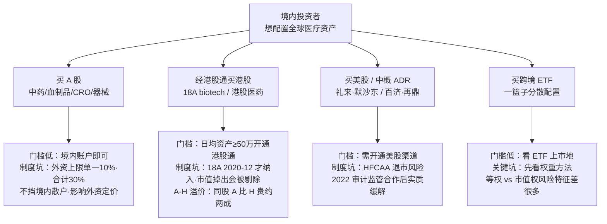
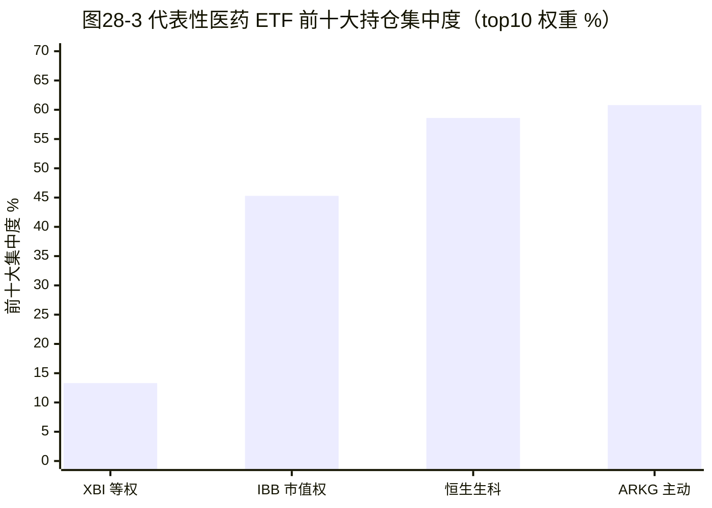
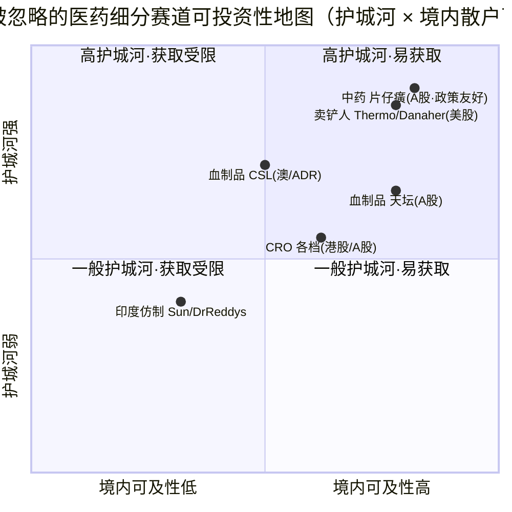

## 本章概览

前面二十七章把这门生意拆开了：分子怎么造、临床怎么赌、CXO 和原料药怎么靠周转吃薄利、PBM 和集采怎么定价、专利悬崖怎么逼着 MNC 买管线、rNPV 和 SOTP 怎么给创新定价。读到这里，一个核心读者最关心的问题才真正浮出来——这些认知，怎么变成可以买、买得到、敢长期持有的标的？

这一章是全书的落点。它不讲哪只票好，讲三件比"看好哪家"更前置、却最容易被忽略的事。第一，"好生意"和"好股票"是两回事，中间还隔着一道"可投资性"——你看懂一家公司的护城河，不等于你能买到它、买的价不被套利掉、持有时不踩退市与流动性的坑。第二，跨市场买医药股有一套门槛和制度风险：港股通的资格线、A-H 股的溢价、中概股 ADR 的退市阴影、外资持股的天花板。第三，主流叙事盯着创新药和 GLP-1，把几条又闷又稳的细分赛道漏在视野外——血制品、中药、生命科学工具（"卖铲人"）、CRO 各档，以及印度仿制药龙头。

本章不荐股、不给配置比例、不预测涨跌。它给的是一张地图和一套工具箱：先讲"可投资性"为什么是独立于"基本面"的维度，再把跨市场工具和 ETF 的权重机制讲透，最后逐一拆这几条被忽略的赛道各自靠什么赚钱、各自的命门在哪、散户从哪个口子能进得去。

本章涉及具体公司（CSL、天坛生物、片仔癀、Thermo Fisher、Danaher、Sun Pharma 等）的财务与可投资性判断，含估值相关讨论，不构成投资建议。

## 钩子：你看懂了它，却可能买不到它

设想一个很常见的处境。读完前面几章，你看懂了中国创新药 License-out 的逻辑，也看好某家在港股以"18A"规则上市的未盈利 biotech（港交所主板《上市规则》第 18A 章，专为未盈利生物科技公司开的上市通道，股票代码带"-B"后缀）。基本面这一关你过了——但接下来全是可投资性的坎。

你是境内个人投资者，想用港股通（沪深交易所与港交所的互联互通机制，南向通让内地投资者买港股）买它。第一道门槛：开通港股通交易权限，要求申请前 20 个交易日日均证券账户资产不低于人民币 50 万元【事实，来源：上海证券交易所港股通投资者适当性规则】。第二道：不是所有港股都在港股通名单里，18A 的"-B"公司直到 2020 年 12 月 28 日才正式纳入港股通（三家交易所 2020 年 11 月 27 日联合公告），首批如亚盛医药-B【事实，来源：HKEX 联合公告，2020-11-27】；而且要持续满足市值门槛，市值掉出会被剔除。你看好的那家，未必在当期名单上。

换条路，买它的美股 ADR（American Depositary Receipt，美国存托凭证，由美国存托银行持有境外公司股份、发行美元计价凭证在美上市），又撞上另一堵墙：HFCAA（Holding Foreign Companies Accountable Act，外国公司问责法，2020 年 12 月 18 日签署生效）。这部法律规定，若 PCAOB（美国上市公司会计监督委员会）连续三年（后修订为两年）无法完整检查一家公司的审计底稿，SEC 必须禁止其证券在美交易【事实，来源：Mayer Brown / PCAOB】。2021 年前后，一批中概股 ADR 头顶都悬着这把退市之剑。

再换，买它在 A 股的对应股票——如果它两地上市的话——你会发现同一家公司的 A 股比 H 股贵了一截，这就是 A-H 股溢价（同一家公司的 A 股与 H 股同股同权，但因两地市场分割，价格长期不一致）。截至 2026 年 6 月，恒生沪深港通 AH 股溢价指数约 122，意味着 A 股相对 H 股整体溢价约两成，过去一年区间在 14% 到 32% 之间波动【事实，来源：恒生沪深港通 AH 股溢价指数 HSCAHPI，2026-06-26】。同样一份股权，你从哪个市场进、用什么工具进，买到的价格和承担的制度风险完全不同。

这就是这一章要解决的问题：基本面看对，只是第一步；能不能买到、用什么买、买了会不会踩制度的坑，是被很多人跳过、却真正决定收益的第二步。

## "好生意"和"好股票"之间隔着一道可投资性

先把概念分清。"好生意"说的是基本面——护城河、毛利、现金流、成长性；"好股票"说的是你以某个价格买入后能不能赚钱。两者之间隔着三层：估值（上一章讲过，再好的生意买贵了也是差投资）、可投资性（你够不够得着、买卖顺不顺、持有期会不会被制度性风险打断）、组合层面的可获取性（有没有合适的工具让你低成本分散配置，而不必赌单一个股）。

可投资性这一层对医疗行业尤其要紧，因为好资产高度分散在不同市场和上市规则下：创新药龙头多在美股，最锋利的 License-out 卖方在港股 18A，独一份的中药消费品牌只在 A 股，最大的血制品公司在澳交所和西班牙，"卖铲人"清一色在美股，仿制药成本王者在印度。想配置全球医疗，就绕不开跨市场工具的门槛和制度风险。

把可投资性当成独立维度打分，看四件事：散户从哪个口子能买到、买入门槛多高、流动性好不好、持有期有没有退市/溢价/外资上限这类制度性折损。下面先把跨市场工具这套"口子"讲清楚，再回到细分赛道。

## 跨市场工具与门槛：四条路各有各的坎

境内投资者配置医药股，主要有四条路：直接买 A 股、经港股通买港股、买美股（含中概 ADR）、买跨境 ETF。每条路的门槛和制度风险不同，如图 28-2 所示。

**图 28-2　四条跨市场配置路径的门槛与制度风险**（可投资性 = 能不能买到 + 买入门槛 + 流动性 + 制度性折损）

**港股通这条路，门槛在资金线和名单。** 50 万资产线把相当一部分散户挡在港股直投之外；就算开通了，能买的也只是名单内的标的，18A 公司随市值波动进出，你看好的早期 biotech 可能根本不在可买范围。

**美股 ADR 这条路，主要风险是 HFCAA，但它已从"悬剑"变成"警示"。** 2022 年 8 月 PCAOB 与中国证监会、财政部签署审计监管合作协议，检查员首次得以赴中国大陆和香港查阅审计底稿；2022 年 12 月 15 日 PCAOB 撤销此前"无法完整检查"的认定，中概股退市风险实质性缓解【事实，来源：PCAOB / DLA Piper，2022-12】。但"缓解"不等于"消除"——它是一份可被地缘政治重新点燃的合作安排。医药样本：百济神州（BeiGene，BGNE，中国创新药出海代表，2021 年 12 月成为首家在纳斯达克、港交所、科创板三地上市的 biotech）、再鼎医药（ZLAB）、传奇生物（LEGN）都曾出现在潜在退市风险名单里【事实，来源：BioSpace，2021–2022】——三地上市本身就是对冲单一市场退市风险的动作。

**A 股这条路，外资持股上限不挡境内散户，但影响定价。** 单一境外投资者持有单家 A 股不得超过总股本 10%、全部境外投资者合计不得超过 30%（2012 年从 20% 上调），合计达 24% 触发公告披露（26% 预警、28% 暂停买入）【事实，来源：上交所 / 监管规定】。当外资买到上限被"锁住"，边际定价权回到境内资金手里——这是理解 A 股医药估值为何常与海外脱钩的一个变量。

**A-H 溢价是套利者的难题、配置者的选择。** 同股 A 贵 H 便宜，理论上该套利，但两地市场分割、结算不互通，套利通道不畅，溢价能长期存在。对配置者的含义很直接：同一家两地上市的医药公司，够得着 H 股就能用更低价格买到同样的股权和分红权——A-H 溢价持续为正，是港股渠道相对 A 股的结构性折价，而非短期错杀。（这是基于制度结构的分析判断，溢价可扩可缩，非必然兑现的套利。）

## ETF：先看权重方法，再看持仓

对不想赌单一个股的核心读者，ETF 是最重要的工具。但买医药 ETF 之前要先弄懂一件被很多人忽略的事：同样叫"生物科技 ETF"，权重方法不同，风险特征可以差出一个量级。权重方法分两大类——**等权（equal-weight，每只成分股权重大致相等，定期再平衡）和市值加权（market-cap-weighted，按公司市值大小分配权重，大公司占大头）**。这一个机制差异，决定了你买到的到底是一篮子中小盘高 beta，还是几只大盘蓝筹。

美股两只旗舰生物科技 ETF 正好是这组对照。

**XBI（SPDR S&P Biotech ETF）跟踪标普生物科技精选行业指数，用的是修正等权。** 截至 2026 年 6 月 25 日，规模约 102 亿美元，持有约 157 只成分股，前十大持仓合计只占约 13.3%、单只最高也就 1.55%【事实，来源：SSGA 官网，2026-06-25】。等权机制让每只小 biotech 的分量和大公司接近，于是 XBI 天然偏向中小盘、对临床读出和融资周期高度敏感、beta 高——它表达的是"整个 biotech 板块情绪"，涨起来猛、跌起来也狠（第 25 章那条从 174 美元跌到 64 美元的曲线，就是 XBI）。

**IBB（iShares Biotechnology ETF）跟踪 NYSE 生物科技指数，用的是修正市值加权。** 截至 2026 年 6 月 26 日，规模约 78 亿美元，持有约 253 只成分股，但前十大持仓合计占到约 45.3%，前三名 Vertex（8.13%）、Amgen（8.01%）、Gilead（7.23%）就吃掉近四分之一【事实，来源：stockanalysis.com，2026-06-26】。市值加权让它由几家盈利的大盘生物药龙头主导，波动远小于 XBI——它表达的是"大盘生物药"，而非"整个 biotech 赛道"。（一个常见的过时说法是 IBB 跟踪"纳斯达克生物科技指数 NBI"；实际上 IBB 已于 2021 年 6 月改跟 ICE 生物科技指数，2023 年 11 月该指数更名为 NYSE 生物科技指数，加权方法未实质改变，但指数名称需更正。）

同样想买"美国生物科技"，选 XBI 还是 IBB，本质是选"中小盘高弹性"还是"大盘低波动"。如图 28-3，把几只代表性医药 ETF 的前十大集中度放在一起，机制差异一目了然。

另外几只工具的定位要点：

- **ARKG（ARK Genomic Revolution ETF）是主动管理、押注基因组学主题的高集中度产品。** 截至 2026 年 6 月，规模约 12.6 亿美元，仅持 33 只，前十大合计约 60.8%【事实，来源：stockanalysis.com，2026-06】。它 2021 年峰值规模曾近 90 亿美元，之后随主题降温和 biotech 寒冬大幅萎缩——这本身就是"主题主动 ETF"高波动、高回撤的活样本，不能用宽基 ETF 的稳健预期去套它。
- **港股侧，恒生生物科技指数相关 ETF** 约 30 只成分、流通市值加权、单股上限 10%、前十大集中度约 58.6%（约 2025 年初口径，2025 年指数大涨约 64.5%）【事实，来源：恒生指数公司 / 每日经济新闻，2026-02】，是境内资金借道港股配置中国创新药的主要工具，但高集中度也意味着它对头部几家 18A 公司的消息高度敏感。
- **A 股侧的宽基工具**有中证全指医药卫生指数（广发跟踪产品 2025 年四季度规模约 61 亿元，前两大权重恒瑞医药约 11.07%、药明康德约 9.34%，本质是市值加权押注 A 股医药龙头）【事实，来源：证券时报，2026 初】，以及中证创新药产业指数（931152，相关 ETF 规模较碎、产品差异大，配置前要逐只看最新季报，本章未能核到统一口径）。

ETF 这一节的方法论就一句话：**买医药 ETF，第一眼看权重方法、第二眼看前十大集中度，再看规模和上市地**——这四个参数决定了你到底买到了什么，比 ETF 名字里那个赛道词重要得多。

## 被主流叙事漏掉的细分赛道

创新药和 GLP-1 占据了医药投资的全部聚光灯，但有几条赛道又闷又稳，护城河来自完全不同的地方。把它们按护城河强度和境内散户可及性摆开，就是图 28-1 这张可投资性地图——横轴是境内投资者买入的便利度（A 股账户即可买为最高，须经港股通或美股渠道次之，境内散户基本买不到的印度本土股最低）。

**图 28-1　被忽略的医药细分赛道可投资性地图**（坐标为编者基于流通门槛 / 监管风险 / 历史流动性的定性综合评估，非量化指数，仅供方向性比较）

### 血制品：护城河是采浆牌照，抗周期是产品刚需

血制品的护城河不在专利、不在品牌，而在**采浆**（采集人血浆，单采血浆站是采集人血浆的特许机构，新建受严格行政管制）——采浆量直接卡住产能上限。产品端（人血白蛋白、静脉注射免疫球蛋白、凝血因子）都是无法化学合成的大分子刚需：白蛋白用于危重症和手术，静丙用于免疫缺陷，凝血因子是血友病患者的终身用药。需求不随经济周期波动，这就是血制品"抗周期"的来源——它的命门是供给（采浆），不是需求。

全球看，这是一门高度集中的生意。**CSL（CSL.AX，澳大利亚，全球血制品与疫苗龙头，旗下 CSL Behring）** FY2025（财年截至 6 月 30 日）总营收约 155.6 亿美元（+5%），其中 Behring 血制品分部约 111.6 亿美元，报告净利润约 30.0 亿美元（固定汇率 +17%），全球采浆中心约 330 家【事实，来源：CSL FY2025 公告，2025-08-18】。**Grifols（GRF / GRFS，西班牙，血制品三巨头之一）** 2024 年营收约 72.1 亿欧元（固定汇率 +10.3%），但净利润仅约 1.57 亿欧元、从 2023 年近亏损边缘改善，年末净债务/调整后 EBITDA 杠杆率高达 4.6 倍【事实，来源：Grifols FY2024 公告，2025-02】——Grifols 是"好生意≠好股票"的反面教材：采浆网络一流，但高杠杆把股东回报压得很重，赛道好不代表这家公司的资产负债表能买。

中国侧，采浆牌照的稀缺被政策放大。新设浆站门槛很高（须先取得多个血制品注册品种、具备相应生产能力，行业口径不少于六个品种）【行业口径，待一手确认】，浆站资源因此向头部集中。**天坛生物（600161.SS，中国生物旗下血制品龙头）** 2024 年营收 60.32 亿元（+16.44%）、归母净利润 15.49 亿元（+39.58%），全年采浆 2,781 吨（+15.15%），获批浆站 107 家、在营 85 家，采浆量约占全国五分之一（约 2,781 吨 / 全国约 13,400 吨 ≈ 21%，天坛年报 + 行业估算 2024）【事实，来源：天坛生物 2024 年报，2025-03】；派林生物（000403.SZ）等第二梯队规模显著更小。一个长期结构性事实是：中国人血白蛋白市场对进口依赖度高，2023 年进口占比约六成多，主要来自基立福、百特、奥克特珐玛【事实，来源：证券时报 / 财联社，2023–2024】——国内血制品供给缺口确实存在，但能不能填上取决于采浆牌照扩张节奏，而非需求侧。（"采浆扩容催化国内供给提升"是赛道逻辑，具体哪家、何时兑现，要逐年看浆站审批和采浆增速，不可外推。）

### 中药：A 股独有的可投资类别，护城河是消费品牌

中药是 A 股相对其他市场独有的可投资类别。它的护城河和创新药完全不同——不靠管线，靠消费品牌和保密配方；它的政策环境也和化学药不同——中成药未被卷进化学药集采的主战场。

**片仔癀（600436.SS）** 是这一类的标本。2024 年营收 107.88 亿元（+7.25%）、归母净利润 29.77 亿元（+6.42%）、净利率约 27.6%【事实，来源：片仔癀 2024 年报，2025-04】。它的护城河是双重的：国家保密配方（配方不公开、受法律保护）叠加中药一级保护品种，竞争者无法仿制，因而拥有罕见的自主提价权——锭剂零售价从早年三百多元一路提到 2023 年 5 月的 760 元/粒【事实，来源：21 世纪经济报道 / 南方都市报】。但 2024 年它也暴露了命门：综合毛利率从 2023 年约 46.8% 降到 2024 年 42.74%、年度降约 4 个百分点（医药制造分部降幅更大、约 11 个百分点），主因天然牛黄等原料成本大幅上涨【事实，来源：片仔癀 2024 年报 / 新浪财经，2025-04】。**品牌和保密配方保住的是定价权，保不住成本端的稀缺原料波动**——这是中药龙头容易被"高护城河"叙事掩盖的真实风险。

**云南白药（000538.SZ）** 走的是另一条路：把中药老字号延展成大健康消费平台。2024 年营收 400.33 亿元（+2.36%）、归母净利润 47.49 亿元（+16.02%），但结构要看清——约六成多营收来自低毛利的药品商业流通，真正赚钱的是工业板块（工业毛利率约 65.93%），其中牙膏单品营收约 61 亿元、2024 年增速已近停滞【事实，来源：云南白药 2024 年报 / 腾讯财经，2025-04】。它的可投资性叙事本质是"消费品牌成长"而非"中药"，要用快消公司的框架去分析。

中药"政策友好"要讲准确，不能喊成口号。事实层面：中成药集采规则与化学药不同，独家品种平均降幅（约三成多）显著低于化学药非独家品种，价格不是唯一评分维度；像片仔癀这类保密配方独家品种基本不进集采、保有自主定价权；《中医药法》2017 年生效后政策总体趋于支持【事实，来源：西南证券研报 / 医药魔方】。但"友好"不等于"无降价压力"——中成药集采正在扩面，独家中成药进医保谈判同样要降价。**中药是 A 股独有、政策相对友好的可投类别，但它的两条命门——稀缺原料成本、集采扩面——必须和品牌护城河一起看。**

### 卖铲人：不赌单一管线，赚整个行业的研发开支

"卖铲人"（picks-and-shovels，淘金热里不挖金、卖铲子的生意）在医药里指生命科学工具商：它们不赌任何一条药物管线的成败，而是给所有药企、CXO、学术实验室、政府机构卖仪器、耗材、试剂和服务。哪条管线成功了要买它的设备，失败了换个项目还得买——它赚的是整个行业的研发开支，下游高度分散。

**Thermo Fisher Scientific（TMO，全球最大生命科学工具与实验室服务商）** 是样板：FY2024 营收约 428.8 亿美元（基本持平）、营业利润率 17.1%、净利润约 63.4 亿美元，最赚钱的 Life Sciences Solutions 分部营业利润率高达 36.4%【事实，来源：Thermo Fisher FY2024 业绩，2025-02】。**Danaher（DHR，旗下 Cytiva、Pall 是生物工艺耗材龙头）** FY2024 营收约 238.8 亿美元（核心营收 -1.5%）、营业利润率 20.4%、净利润约 39.0 亿美元【事实，来源：Danaher FY2024 业绩，2025-01-29】。两家共同点是经常性收入（耗材+服务）占比约八成【分析，二手测算口径，一手年报未单列，引用以 10-K 为准】——客户实验室只要在运转，试剂耗材和维保合同就持续续购，这是"卖铲人"现金流稳定的财务基础。

但卖铲人不是没有周期。2021–2022 年新冠疫苗大规模量产把 Cytiva、Pall 的耗材需求推到高点；疫苗需求骤降后，生物制药客户消化前期积压库存、新订单收缩，这轮"去库存"压住了工具商 2023–2024 的增长——Danaher FY2024 核心营收 -1.5%、Thermo Fisher 营收两年几乎持平，都是印证【事实，来源：两家 FY2024 业绩】。**卖铲人不赌单一管线，但它赌整个行业的资本开支节奏**——biotech 融资寒冬（第 25 章）传导到工具商，有时滞、但躲不掉。同类标的还有德国 Sartorius、美国 Agilent。这条赛道护城河强、可及性高（清一色美股/欧股，散户用美股渠道就能买），是图 28-1 右上角"高护城河·易获取"那一格。

### 印度仿制药与原料药：成本王者，命门在 USFDA 检查

印度药企是另一条容易被中文读者忽略的可投资赛道，它的逻辑是"成本"和"合规"两条线绞在一起。

**Sun Pharma（SUNPHARMA.NS，印度最大药企）** FY2025（截至 2025 年 3 月）总销售额约 5,204 亿卢比（约 62 亿美元）、调整后净利润约 1,198 亿卢比（+19%），美国制剂销售约 19.21 亿美元（+3.6%），美国市场约占总营收三成【数据为官方营收，三成占比系按美元口径推算，来源：Sun Pharma FY2025 业绩，2025-05】。**Dr Reddy's（DRREDDY.NS / RDY）** FY2025 营收约 3,255 亿卢比（约 39 亿美元）、净利润约 566 亿卢比（+22%），仿制药占营收近九成、北美约占总营收四成多【数据为官方营收，占比系推算，来源：Dr Reddy's FY2025 业绩，2025-05】；另一家 Divi's Laboratories（DIVISLAB.NS）则是全球最大原料药/CDMO 之一、营业利润率约 32%。

这门生意的护城河是规模化低成本制造，命门则是 **USFDA 检查风险**。美国 FDA 对药厂的现场检查走一套递进式执法：检查结束发 Form 483（观察项清单）→ 升级为 Warning Letter（警告信，要求限期整改）→ 最严重时列入 Import Alert（进口警告，该厂产品被自动拒绝入境美国，相当于对其美国业务"停牌"）。对高度依赖美国市场的印度药企，这条链是悬在估值上的随机冲击。Sun Pharma 的 Halol 工厂是教科书案例：2015 年 12 月收到警告信，股价单日跌约 7%（该厂当时占其营收的具体比例未公开）；2022 年 12 月又被列入 Import Alert，到 2026 年中仍未解除，前后超过三年半【事实，来源：BioPharma Dive / Business Standard，2015 / 2022】。Dr Reddy's 也在 2015 年 11 月因数据完整性问题被 FDA 对三家工厂同时发警告信【事实，来源：多源报道】。

雪上加霜的是美国仿制药价格通缩：简单口服仿制药每年价格侵蚀约 10%（2023 年口径），FDA 加速审批和 PBM/采购方的集中议价把价格往下压【事实，来源：Antique / BusinessToday，2023-11】。印度约占美国仿制药采购量的四成，价格通缩直接压利润，龙头的应对是往复杂仿制药、生物类似药和特种药迁移。**印度仿制药龙头是低成本制造的赢家，但它的可投资性折损来自一个不可预测的外部变量——FDA 哪天来检查、检出什么。** 这是图 28-1 里护城河中等、且带尾部风险的一格。

### CRO 各档的可投资性差异

CRO（Contract Research Organization，合同研究组织，受药企委托执行研发外包）的商业模式第 8 章已讲，这里只补一句可投资性的分层：CRO 不是铁板一块，临床 CRO（重人力、绑订单周期）、临床前 CRO（药理毒理）、实验室服务（分析检测）三档的周期性、毛利和估值逻辑各不相同，对 biotech 融资周期和对美 CXO 立法风险（第 8 章）的暴露度也不一样。买"CRO"前先问买的是哪一档。中国 CRO 龙头分布在 A 股和港股，散户可及，但同样要过港股通名单与制度风险这一关。

## 小结

- **"好生意"和"好股票"之间隔着一道可投资性，它独立于基本面和估值。** 看四件事：散户从哪个口子能买到、买入门槛多高、流动性好不好、有没有退市/溢价/外资上限这类制度性折损。医疗行业的好资产分散在不同市场和上市规则下，跨市场工具的门槛绕不开——港股通卡在 50 万资产线和名单进出，中概 ADR 的 HFCAA 退市风险 2022 年实质缓解但未消除，A-H 溢价（2026 年 6 月约两成）是港股渠道相对 A 股的结构性折价。
- **买医药 ETF 第一眼看权重方法。** XBI 修正等权、前十大仅约 13%，是中小盘高 beta 的板块情绪工具；IBB 市值加权、前十大约 45%，由几家大盘生物药龙头主导、波动小得多；ARKG 主动管理、集中度约 60%、规模从近 90 亿美元萎缩到约 12.6 亿。买什么，权重方法比赛道名字更决定风险敞口。
- **【独立观察】被聚光灯漏掉的几条赛道，护城河来自和创新药完全不同的地方，命门也各不相同。** 血制品靠采浆牌照（命门在供给与杠杆，Grifols 是"赛道好≠公司可买"的反例）；中药靠消费品牌和保密配方（命门在稀缺原料成本与集采扩面，是 A 股独有可投类别）；卖铲人靠不赌单一管线的耗材现金流（命门在行业资本开支周期）；印度仿制药靠低成本制造（命门在不可预测的 FDA 检查）。每一条都不存在无风险的确定收益，都有自己的证伪条件，把护城河和命门一起看，才是可投资性该有的姿态。
- **全书到这里闭环。** 从一盒药的五个价签出发，走过研发、临床、CXO、流通、支付、器械、诊断、全球定价、周期与估值，最后落到"看懂了能不能买到、买了敢不敢拿"。看清产业链是为了不被叙事带偏，看清可投资性是为了不被工具和制度坑住。下一章收尾，把全书没说死的未决变量和这套框架的失效条件摊开讲——任何分析都有时效，承认它，比假装确定更可靠。

## 配套数据

见 `data/28-investability/`。本章用到的所有数据源、细分赛道定位、跨市场工具门槛与主要医药 ETF 权重方法清单详见该目录。

---

> **免责声明**
>
> 本章涉及具体公司（CSL、Grifols、天坛生物、派林生物、片仔癀、云南白药、Thermo Fisher、Danaher、Sun Pharma、Dr Reddy's、Divi's 等）的财务分析、可投资性判断与产业观察，以及具体投资工具（港股通、A-H、ADR、XBI/IBB/ARKG 等 ETF）的机制说明，仅为作者基于公开信息的研究结果，**不构成任何投资建议**。市场有风险，投资决策应基于读者自身的独立判断和专业咨询。
>
> 本章使用的财务、规则与 ETF 数据截至 2026-05（部分工具数据点标注至 2026-06 具体时点），公司基本面、跨市场监管规则、ETF 权重与持仓、A-H 溢价、采浆与集采政策可能在阅读时已发生变化。本章中提到的公司股票、财务数据、ETF 集中度、溢价水平等信息均为分析素材，作者不对其准确性、完整性或时效性作任何承诺。本章对各细分赛道可投资性、A-H 溢价折价、HFCAA 风险缓解程度的判断属分析与预测，绑定上述时点，后续的浆站审批、集采扩面、FDA 检查、审计监管合作进展、ETF 申赎与指数调整都可能使其失效。每一条赛道判断都附有其证伪条件，请勿读作确定性结论，更勿读作选股建议。
>
> **作者持仓披露**：截至本章数据时点（2026-05），作者未持有本章提及的任何公司（CSL、Grifols、天坛生物、派林生物、片仔癀、云南白药、Thermo Fisher、Danaher、Sun Pharma、Dr Reddy's、Divi's、百济神州、再鼎医药、传奇生物等）的股票或衍生品，亦未持有本章提及的任何 ETF（XBI、IBB、ARKG 及恒生、中证相关产品）。

---

> 本章来自《医疗经济学》开源版 · 作者「递归客」  
> 在线阅读完整书系：[inferloop.dev](https://inferloop.dev) · 反馈与勘误：[GitHub Issues](https://github.com/diguike/book-healthcare-economics/issues)
